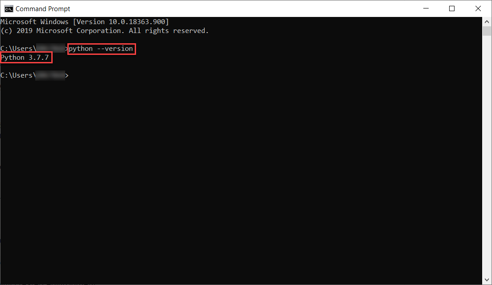
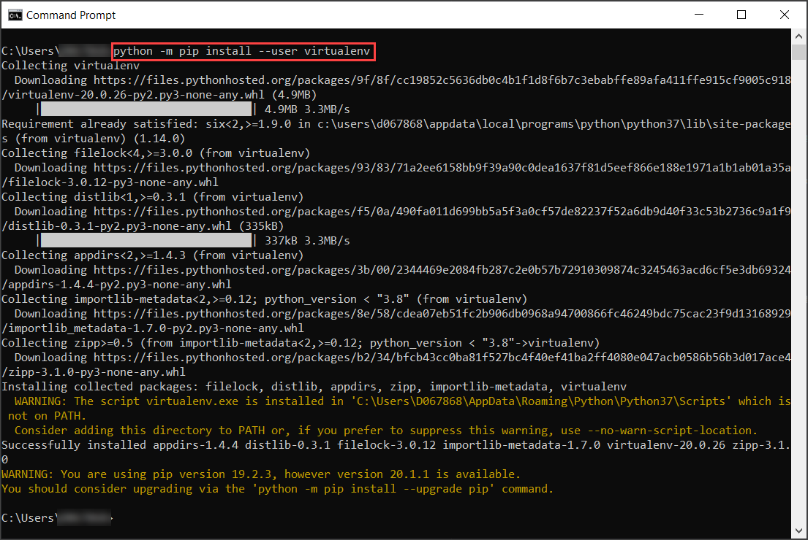
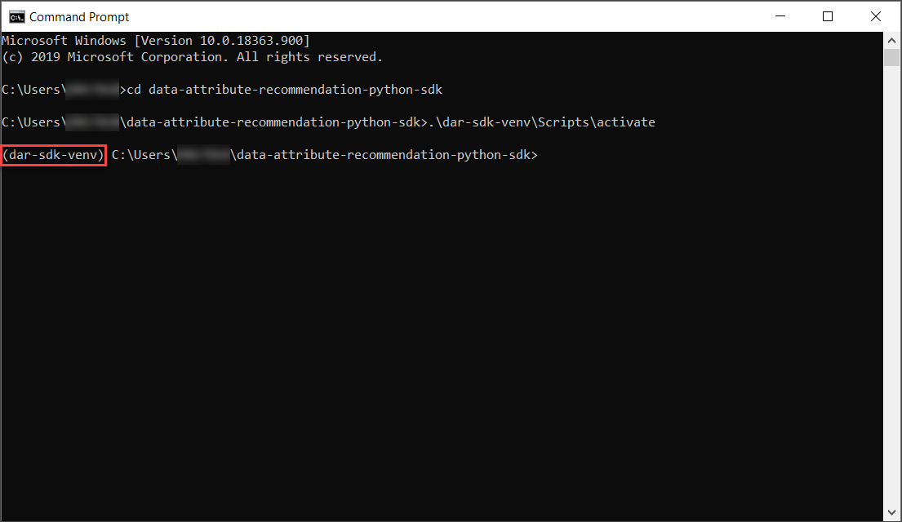
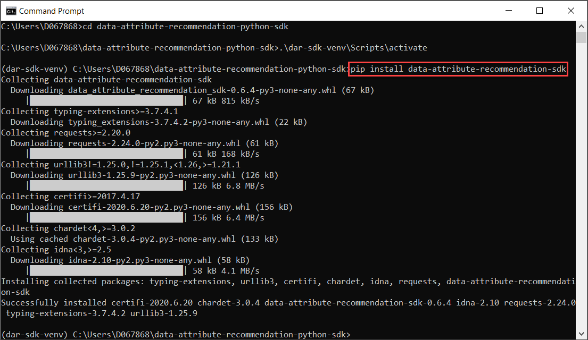
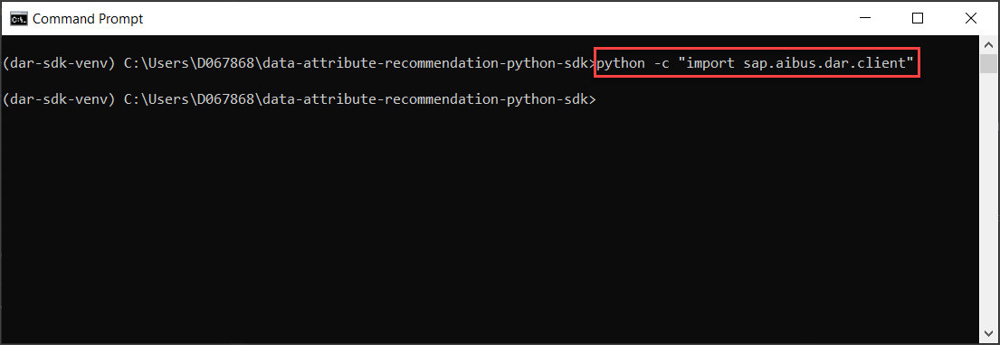

## Details
### You will learn
  - How to set up a virtual environment
  - How to install the SDK for Data Attribute Recommendation

Use Data Attribute Recommendation (one of the [SAP AI Business Services](https://help.sap.com/aibus) in SAP Business Technology Platform) to classify entities such as products, stores and users into multiple classes, using free text, numbers and categories. For more information, see [Data Attribute Recommendation help portal documentation](https://help.sap.com/dar). For the definition of specific terms, see [Concepts](https://help.sap.com/viewer/105bcfd88921418e8c29b24a7a402ec3/SHIP/en-US/fe501df6d9f94361bfea066f9a6f6712.html).

The Data Attribute Recommendation service provides a REST API to communicate and interact with your service instance. The Python SDK for Data Attribute Recommendation provides an implementation that allows you to easily consume the APIs of the service without having to write your own code. It also serves as a reference implementation and can be easily transferred into other programming environments and languages.

The SDK is available in [GitHub](https://github.com/SAP/data-attribute-recommendation-python-sdk).

---

[ACCORDION-BEGIN [Step 1: ](Install Python)]

First, you need to make sure that you have Python installed. Ideally, you have a Python version from 3.5 up to 3.8 as those are actively supported by the SDK. 

[OPTION BEGIN [Windows]]

Open up a command prompt and enter `python --version` to check the version that you have installed.

[OPTION END]

[OPTION BEGIN [Mac and Linux]]

Open up a terminal and enter `python3 --version` to check the version that you have installed.

[OPTION END]

In case you have a Python installation, it will output the version. If you have a version lower than 3.5 head over [here](https://www.python.org/downloads/) and install an up-to-date version that is supported by the SDK.

In case `command not found` is printed, you do not have Python installed. Head over [here](https://www.python.org/downloads/) and install an up-to-date version that is supported by the SDK. Then, close down and open up a new command prompt or terminal and run the command `python --version` again to check if the installation was successful.

[DONE]
[ACCORDION-END]

[ACCORDION-BEGIN [Step 2: ](Set up virtual environment)]

Next, you will set up a virtual environment using the Python package `virtualenv`. With this package you avoid installing Python packages globally which could break system tools or other projects.

[OPTION BEGIN [Windows]]

In a command prompt, enter `python -m pip install --user virtualenv` to install the package.

Once the package is installed, you receive a similar output as above.

Next, you will create a new directory in which you work throughout the tutorial.

In a command prompt or terminal, enter `mkdir data-attribute-recommendation-python-sdk` to create this new directory. Next, navigate into it by using the command `cd data-attribute-recommendation-python-sdk`.

Within this directory, you will create a new virtual environment.

In a command prompt, enter `python -m virtualenv dar-sdk-venv` to create a new virtual environment and run `.\dar-sdk-venv\Scripts\activate` right afterwards to activate the environment.

[OPTION END]

[OPTION BEGIN [Mac and Linux]]

In a terminal, enter `python3 -m pip install --user virtualenv` to install the package.

Once the package is installed, you receive a similar output as above.

Next, you will create a new directory in which you work throughout the tutorial.

In a command prompt or terminal, enter `mkdir data-attribute-recommendation-python-sdk` to create this new directory. Next, navigate into it by using the command `cd data-attribute-recommendation-python-sdk`.

Within this directory, you will create a new virtual environment.

In a terminal, enter `python3 -m virtualenv dar-sdk-venv` to create a new virtual environment and run `source dar-sdk-venv/bin/activate` right afterwards to activate the environment.

[OPTION END]

You can tell that the environment is activated as it is added to your current path.

[DONE]
[ACCORDION-END]

[ACCORDION-BEGIN [Step 3: ](Install SDK)]

Finally, you can install the SDK of Data Attribute Recommendation.

Within your virtual environment, run the command `pip install data-attribute-recommendation-sdk` to install the SDK.

You will then receive a similar output as above.

As a first test, enter the command `python -c "import sap.aibus.dar.client"` to import the SDK. If there is no error the installation was successful and you can move onto the next tutorial.

[DONE]
[ACCORDION-END]

[ACCORDION-BEGIN [Step 4: ](Test yourself)]

[VALIDATE_1]
[ACCORDION-END]
