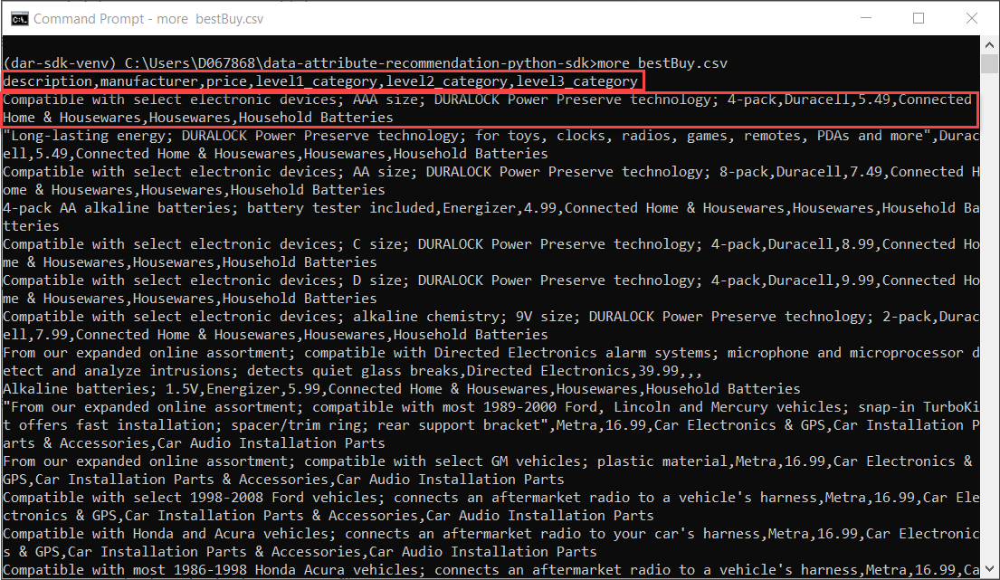
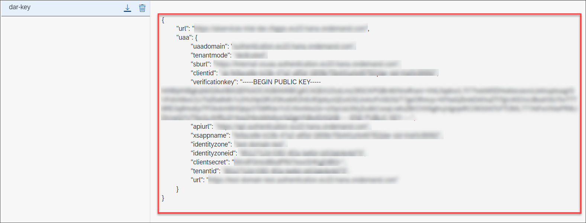
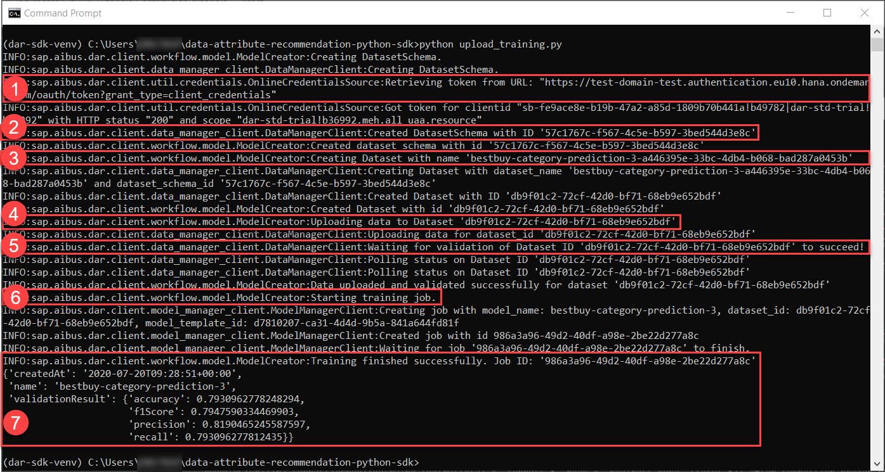
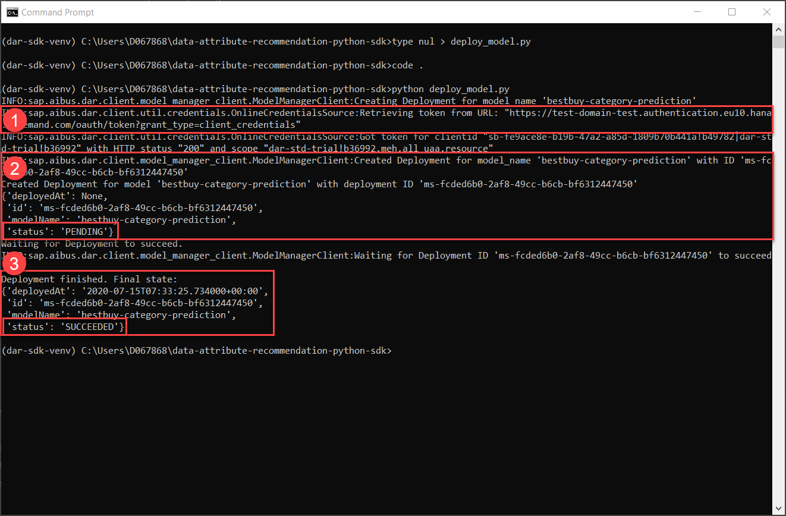
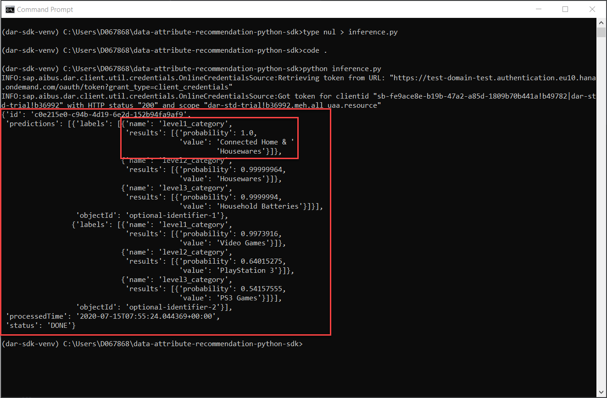
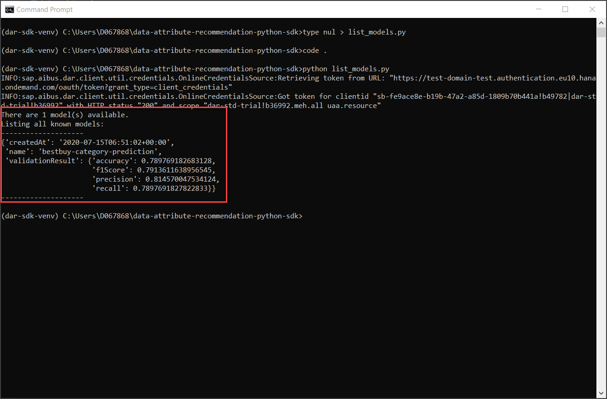
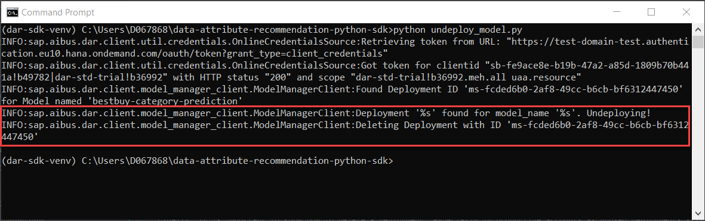

## Details
### You will learn
  - How to authenticate with your service instance of Data Attribute Recommendation
  - How to upload data and train a machine learning model
  - How to make inference requests

The repository and initial setup documentation of the SDK can be found [here](https://github.com/SAP/data-attribute-recommendation-python-sdk). A complete documentation, including API reference, can be found [here](https://data-attribute-recommendation-python-sdk.readthedocs.io/en/latest/index.html). You can use this tutorial as the first point of contact with the SDK. Make sure to check the documentation since you can use the SDK to do much more than what is covered here.

---

[ACCORDION-BEGIN [Step 1: ](Obtain the dataset)]

First, you need to download the dataset used in this tutorial. The dataset can be found in this [repository](https://github.com/SAP-samples/data-attribute-recommendation-postman-tutorial-sample) and includes data from the retail company Best Buy.

Make sure that you are in your virtual environment as explained in [Setup SDK for Data Attribute Recommendation](cp-aibus-dar-sdk-setup). Now enter the following command to download the dataset from the repository:
```shell
curl -o bestBuy.csv "https://raw.githubusercontent.com/SAP-samples/data-attribute-recommendation-postman-tutorial/main/Tutorial_Example_Dataset.csv"
```

The dataset is then saved as `bestBuy.csv`.

[OPTION BEGIN [Windows]]

Enter `more bestBuy.csv` to take a look at the first few lines of the dataset. Exit the command with CTRL + C.

[OPTION END]

[OPTION BEGIN [Mac and Linux]]

Enter `head -n2 bestBuy.csv` to take a look at the first two lines of the dataset.

[OPTION END]



The first line of the output represents the head of the dataset, for example, the column names. The dataset contains product information, including a description, a price and three levels of categories the product belongs to. The other lines are actual rows in the dataset, representing a product.

[DONE]
[ACCORDION-END]

[ACCORDION-BEGIN [Step 2: ](Provide service key)]

Next up, you need to make the service key of your service instance available to the SDK so that it can authorize when communicating with your service instance. The service key will be saved in a file named `dar_service_key.json`.

[OPTION BEGIN [Windows]]

Enter `type nul > dar_service_key.json` to create an empty JSON file.

[OPTION END]

[OPTION BEGIN [Mac and Linux]]

Enter `touch dar_service_key.json` to create an empty JSON file.

[OPTION END]

Go ahead and open the newly created file in a simple text editor. Then, paste the complete service key that you created in [Set Up Account for Data Attribute Recommendation and Get Service Key](cp-aibus-dar-booster-key) into the file and save it.



Now you are all set to start using the service.

[DONE]
[ACCORDION-END]


[ACCORDION-BEGIN [Step 3: ](Upload data and train model)]

The first step is to upload data and to train a machine learning model based on that data afterwards. Using the SDK, you can combine both steps.

[OPTION BEGIN [Windows]]

Use the command `type nul > upload_training.py` to create a new Python file.

[OPTION END]

[OPTION BEGIN [Mac and Linux]]

Use the command `touch upload_training.py` to create a new Python file.

[OPTION END]

Now open the newly created file in your preferred IDE or code editor, such as Visual Studio Code or Atom.

>When using Visual Studio Code, you can use the command `code .` to enter the directory in Visual Studio Code right from the command line.

Copy the below code into the file and save it:
```Python
from sap.aibus.dar.client.workflow.model import ModelCreator
import json
import pprint

# Show some output while the script is working
import logging
logging.basicConfig(level=logging.INFO)

MODEL_NAME = "bestbuy-category-prediction"

# Read file with service key
with open('dar_service_key.json', 'r') as sk_file:
    sk_data = sk_file.read()

# Load from file
json_data = json.loads(sk_data)

# Create a ModelCreator instance by passing the credentials
# to the ModelCreator.construct_from_credentials class method
creator = ModelCreator.construct_from_credentials(
    dar_url=json_data['url'],
    clientid=json_data['uaa']['clientid'],
    clientsecret=json_data['uaa']['clientsecret'],
    uaa_url=json_data['uaa']['url'],
)

# Define the DatasetSchema which describes the CSV layout.
new_schema = {
    "features": [
        {"label": "manufacturer", "type": "CATEGORY"},
        {"label": "description", "type": "TEXT"},
        {"label": "price", "type": "NUMBER"},
    ],
    "labels": [
        {"label": "level1_category", "type": "CATEGORY"},
        {"label": "level2_category", "type": "CATEGORY"},
        {"label": "level3_category", "type": "CATEGORY"},

    ],
    "name": "bestbuy-category-prediction",
}

# Load training data
training_data_stream = open("bestBuy.csv", mode="rb")

# Upload data and train model
final_api_response = creator.create(
    model_template_id="d7810207-ca31-4d4d-9b5a-841a644fd81f",
    dataset_schema=new_schema,
    model_name=MODEL_NAME,
    data_stream=training_data_stream,
)

pprint.pprint(final_api_response)
```

The above code first opens the file containing your service key and reads its values. It then creates an instance of the `ModelCreator` using your service key.

Afterwards a dataset schema is defined which fits to the dataset that is used here. A schema defines the structure of a dataset and determines which columns of the dataset are used as inputs (features) for the machine learning model and which columns should be predicted by the model (labels). In this case, general product information are provided and product categories should be predicted by the model.

Finally, the dataset is loaded and together with the schema and a model name a new model is created and trained immediately afterwards. Please note that the model name must be unique. In case you are not running this sample for the first time you need to change the variable `MODEL_NAME`.

Now go back into the command prompt and run `python upload_training.py` to run the code.

The execution of the code might take a while but you can easily follow the process by reading the outputs:



  1.  The SDK retrieves an authentication token using your service key. It will automatically retrieve a new one once the current one is expired.

  2.  The dataset schema gets created.

  3.  A dataset gets created which has the structure of the dataset schema. This dataset serves as a container for our training data.

  4.  The data from the Best Buy dataset gets uploaded into the dataset container.

  5.  Once the training data is uploaded, it is validated by the service whether the data is in the right format and fulfills the requirements. See [here](https://help.sap.com/viewer/105bcfd88921418e8c29b24a7a402ec3/SHIP/en-US/dbfbd4a0bd2a4a7a8ed9aa25bace7d91.html) for all requirements.

  6.  If the validation is successful, a training job is triggered. During this, a machine learning model is trained based on the uploaded data. As explained above, which parts of the data serve as input and output for the training is determined by the dataset schema. The training may take about 10 minutes so a little patience is needed here.

  7.  Once the training succeeded, the training results are printed. This include a few figures, including the accuracy which represents the fraction of correct predictions made by the model.

Now you have successfully uploaded the training data and trained a machine learning model.

[DONE]
[ACCORDION-END]

[ACCORDION-BEGIN [Step 4: ](Deploy model)]

Next, the machine learning model must be deployed. That means, the model becomes available for productive usage and can serve inference requests, for example, to make predictions.

Please note that deploying models can occur costs if you are not using the trial account. See [here](https://help.sap.com/viewer/105bcfd88921418e8c29b24a7a402ec3/SHIP/en-US/c03b561eea1744c9b9892b416037b99a.html) for the limits in trial and [here](https://help.sap.com/viewer/105bcfd88921418e8c29b24a7a402ec3/SHIP/en-US/1e093326a2764c298759fcb92c5b0500.html) for the pricing in productive accounts.

[OPTION BEGIN [Windows]]

Use the command `type nul > deploy_model.py` to create a new Python file.

[OPTION END]

[OPTION BEGIN [Mac and Linux]]

Use the command `touch deploy_model.py` to create a new Python file.

[OPTION END]

Now open the newly created file in your preferred IDE or code editor, such as Visual Studio Code or Atom.

Copy the below code into the file and save it:
```Python
import json
# Show some output while the script is working
import logging
import pprint

from sap.aibus.dar.client.model_manager_client import ModelManagerClient

logging.basicConfig(level=logging.INFO)

MODEL_NAME = "bestbuy-category-prediction"

# Read file with service key
with open('dar_service_key.json', 'r') as sk_file:
    sk_data = sk_file.read()

# Load from file
json_data = json.loads(sk_data)

mm_client = ModelManagerClient.construct_from_credentials(
    dar_url=json_data['url'],
    clientid=json_data['uaa']['clientid'],
    clientsecret=json_data['uaa']['clientsecret'],
    uaa_url=json_data['uaa']['url'],
)

deployment_resource = mm_client.create_deployment(MODEL_NAME)
deployment_id = deployment_resource["id"]
print("Created Deployment for model '%s' with deployment ID '%s'" % (
    MODEL_NAME, deployment_id))

pprint.pprint(deployment_resource)

print("Waiting for Deployment to succeed.")
updated_deployment_resource = mm_client.wait_for_deployment(deployment_resource['id'])
print("Deployment finished. Final state:")
pprint.pprint(updated_deployment_resource)
```

As in the previous code snippet, the above code first opens the file containing your service key and reads its values. Then, it creates an instance of the `ModelManagerClient` using your service key.

Afterwards, the deployment of your machine learning model gets triggered and the code waits for the deployment to succeed.

Again, if you do not run this sample for the first time you might have to adapt the variable `MODEL_NAME`.

Now go back into the command prompt and run `python deploy_model.py` to run the code.

You can observe the current status of the deployment in the outputs:



  1.  The SDK retrieves a new authentication token using your service key.

  2.  The deployment gets created and you can note that the status of the deployment is now `PENDING`.

  3. The code is now waiting for the deployment to finish and once it is done the status of the deployment changes to `SUCCEEDED`.

Your machine learning model is now deployed and ready to make predictions.

[DONE]
[ACCORDION-END]

[ACCORDION-BEGIN [Step 5: ](Make inference requests)]

Now, the model can be used to make predictions. To do so, you need to provide the inputs (features) which include the `manufacturer`, `description` and `price` of the product. The model will then predict three levels of categories.

[OPTION BEGIN [Windows]]

Use the command `type nul > inference.py` to create a new Python file.

[OPTION END]

[OPTION BEGIN [Mac and Linux]]

Use the command `touch inference.py` to create a new Python file.

[OPTION END]

Now open the newly created file in your preferred IDE or code editor, such as Visual Studio Code or Atom.

Copy the below code into the file and save it:
```Python
import json
import logging
import pprint

from sap.aibus.dar.client.inference_client import InferenceClient

# Show some output while the script is working
logging.basicConfig(level=logging.INFO)

MODEL_NAME = "bestbuy-category-prediction"

# Read file with service key
with open('dar_service_key.json', 'r') as sk_file:
    sk_data = sk_file.read()

# Load from file
json_data = json.loads(sk_data)

inference_client = InferenceClient.construct_from_credentials(
    dar_url=json_data['url'],
    clientid=json_data['uaa']['clientid'],
    clientsecret=json_data['uaa']['clientsecret'],
    uaa_url=json_data['uaa']['url'],
)

# The code passes two objects to be classified. Each object
# must have all features described in the DatasetSchema used
# during training.
objects_to_be_classified = [
    {
        "objectId": "optional-identifier-1",
        "features": [
            {"name": "manufacturer", "value": "Energizer"},
            {"name": "description", "value": "Alkaline batteries; 1.5V"},
            {"name": "price", "value":  "5.99"},
        ],
    },
    {
        "objectId": "optional-identifier-2",
        "features": [
            {"name": "manufacturer", "value": "Eidos"},
            {"name": "description", "value": "Unravel a grim conspiracy at the brink of Revolution"},
            {"name": "price", "value":  "19.99"},
        ],
    },
]

inference_response = inference_client.create_inference_request(
    model_name=MODEL_NAME,
    objects=objects_to_be_classified
)

pprint.pprint(inference_response)
```

The above code first reads your service key and then creates a new instance of the `InferenceClient`. Next, two objects are created which will be classified by the model. Feel free to modify the values or to add more objects. Please keep in mind that an object must include all inputs (features) that were defined in the dataset schema. Last but not least, the objects are sent to the model to be classified.

Now go back into the command prompt and run `python inference.py` to run the code.

The results of the classification are printed in to the console:



For each object a prediction is made for all the outputs (labels) which are defined in the dataset schema. Each prediction includes the label `name` and the prediction result which is comprised of the `probability` and the predicted `value`. The probability represents how certain the model is about its prediction whereas 1 represents 100%.

For the first object, the model is very certain about its predictions as it even predicts the third level of category with a probability of 0.99.

For the second object, the model is very certain that the first level is `Video Games` but it is not so sure whether it is actually about `PlayStation 3`.

Please note that a high probability does not necessarily mean that the predicted value is correct. Whether the predicted values are correct or not largely depends on the quality of the training data.

Now you have successfully run through the whole process of uploading data, training a machine learning model and using the model to make predictions.

[DONE]
[ACCORDION-END]


[ACCORDION-BEGIN [Step 6: ](List all models)]

It is worth to know how to list all the models you currently have, especially if you want to work with multiple models.

[OPTION BEGIN [Windows]]

Use the command `type nul > list_models.py` to create a new Python file.

[OPTION END]

[OPTION BEGIN [Mac and Linux]]

Use the command `touch list_models.py` to create a new Python file.

[OPTION END]

Now open the newly created file in your preferred IDE or code editor, such as Visual Studio Code or Atom.

Copy the below code into the file and save it:
```Python
import json
import logging
import pprint

from sap.aibus.dar.client.model_manager_client import ModelManagerClient

# Show some output while the script is working
logging.basicConfig(level=logging.INFO)

MODEL_NAME = "bestbuy-category-prediction"

# Read file with service key
with open('dar_service_key.json', 'r') as sk_file:
    sk_data = sk_file.read()

# Load from file
json_data = json.loads(sk_data)

mm_client = ModelManagerClient.construct_from_credentials(
    dar_url=json_data['url'],
    clientid=json_data['uaa']['clientid'],
    clientsecret=json_data['uaa']['clientsecret'],
    uaa_url=json_data['uaa']['url'],
)

# Read all models
model_collection = mm_client.read_model_collection()

print("There are %s model(s) available." % model_collection['count'])
print("Listing all known models:")
print("-" * 20)
for model_resource in model_collection['models']:
    pprint.pprint(model_resource)
    print("-" * 20)
```

The above code will retrieve the collection of models you currently have.

Now go back into the command prompt and run `python list_models.py` to run the code.

This outputs the details of all the available models:



You can use the output to further manage your models, for example deleting a deployment as described in the next step.

[DONE]
[ACCORDION-END]


[ACCORDION-BEGIN [Step 7: ](Delete deployment)]

Finally, it is important to know how to delete a deployment, especially in productive accounts as unused deployments still incur costs.

[OPTION BEGIN [Windows]]

Use the command `type nul > undeploy_model.py` to create a new Python file.

[OPTION END]

[OPTION BEGIN [Mac and Linux]]

Use the command `touch undeploy_model.py` to create a new Python file.

[OPTION END]

Now open the newly created file in your preferred IDE or code editor, such as Visual Studio Code or Atom.

Copy the below code into the file and save it:
```Python
import json
import logging
import pprint

from sap.aibus.dar.client.model_manager_client import ModelManagerClient

# Show some output while the script is working
logging.basicConfig(level=logging.INFO)

MODEL_NAME = "bestbuy-category-prediction"

# Read file with service key
with open('dar_service_key.json', 'r') as sk_file:
    sk_data = sk_file.read()

# Load from file
json_data = json.loads(sk_data)

mm_client = ModelManagerClient.construct_from_credentials(
    dar_url=json_data['url'],
    clientid=json_data['uaa']['clientid'],
    clientsecret=json_data['uaa']['clientsecret'],
    uaa_url=json_data['uaa']['url'],
)

mm_client.ensure_model_is_undeployed(MODEL_NAME)
```

The above code will make sure that the specified model is undeployed. More specifically, the method `ensure_model_is_undeployed` first checks whether a deployment exists for the model and if so, it triggers the deletion of the deployment.

Now go back into the command prompt and run `python undeploy_model.py` to run the code.

From the output you can tell which actions have been taken. In case a deployment has been found it gets deleted. Otherwise, if no deployment has been found you are notified accordingly.



You are now familiar with the basics of the SDK and how to use the Data Attribute Recommendation service. Please have a look at the [documentation](https://data-attribute-recommendation-python-sdk.readthedocs.io/en/latest/index.html) if you want to dive deeper into the possibilities of the SDK.

[DONE]
[ACCORDION-END]


[ACCORDION-BEGIN [Step 8: ](Test yourself)]

[VALIDATE_1]
[ACCORDION-END]

---
