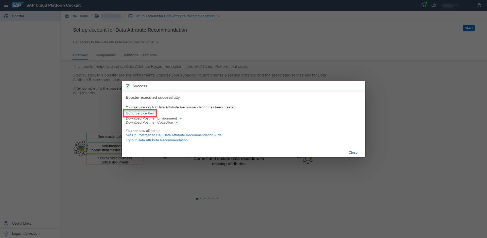
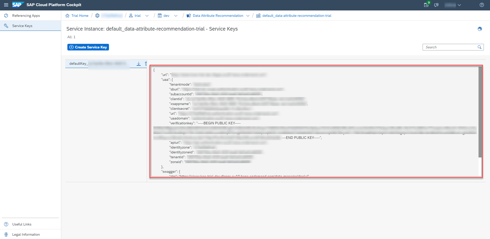
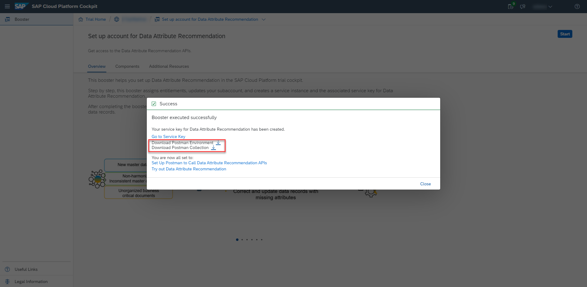

## Prerequisites
- You have created a trial account on SAP Cloud Platform: [Get a Free Trial Account on SAP Cloud Platform](hcp-create-trial-account)
- You have a subaccount and dev space with **Europe (Frankfurt)** as region: [Manage Entitlements on SAP Cloud Platform Trial](cp-trial-entitlements). See also [Create a Subaccount](https://help.sap.com/viewer/65de2977205c403bbc107264b8eccf4b/Cloud/en-US/261ba9ca868f469baf64c22257324a75.html).

## Details
### You will learn
  - How to access your trial account
  - What are interactive guided boosters
  - How to use the **Set up account for Data Attribute Recommendation** booster to assign entitlements, update your subaccount, create a service instance and the associated service key for Data Attribute Recommendation, and also to download Postman environment and collection templates.
---

[ACCORDION-BEGIN [Step 1: ](Enter your trial account)]

1. In your web browser, open the [SAP Cloud Platform trial cockpit](https://cockpit.hanatrial.ondemand.com/).

2. Navigate to the trial global account by clicking **Enter Your Trial Account**.

    !

    >If this is your first time accessing your trial account, you'll have to configure your account by choosing a region. **Please select Europe (Frankfurt)**. Your user profile will be set up for you automatically.

    >Wait till your account is set up and ready to go. Your global account, your subaccount, your organization, and your space are launched. This may take a couple of minutes.

    >Choose **Continue**.

    >!

    >For more details on how to configure entitlements, quotas, subaccounts and service plans on SAP Cloud Platform Trial, see [Manage Entitlements on SAP Cloud Platform Trial](cp-trial-entitlements).

[DONE]
[ACCORDION-END]

[ACCORDION-BEGIN [Step 2: ](Get service key)]

SAP Cloud Platform creates interactive guided boosters to automate trial cockpit steps, so users can save time when trying out the services.

Now, you will use the **Set up account for Data Attribute Recommendation** booster to automatically assign entitlements, update your subaccount, create a service instance and the associated service key for Data Attribute Recommendation.

1. On the navigation side bar, click **Boosters**.

    !

2. Search for **Set up account for Data Attribute Recommendation** and click the tile to access the booster.

    !

3. Click **Start**.

    !

    >If you have more than one subaccount, the booster will choose automatically the correct subaccount and space, but this will require that you click **Next** twice and **Finish** once, before being able to see the **Success** pop-up box.

4. Click **Go to Service Key**.

    !

    You have successfully used the booster **Set up account for Data Attribute Recommendation** to create the service key for Data Attribute Recommendation. Make a local copy of the service key if you are following the tutorial group [Classify Data Records with the SDK for Data Attribute Recommendation](group.cp-aibus-data-attribute-sdk).

    !

    >If you face any issue with the booster **Set up account for Data Attribute Recommendation**, you can alternatively follow the steps in [Create Service Instance for Data Attribute Recommendation](cp-aibus-dar-service-instance) to create the service key for Data Attribute Recommendation manually.

[VALIDATE_1]
[ACCORDION-END]

[ACCORDION-BEGIN [Step 3: ](Download Postman environment and collection templates)]

Back to the **Success** pop-up box, download Postman environment and collection templates. Make a local copy of the files if you are following the tutorial mission [Use Machine Learning to Classify Data Records](mission.cp-aibus-data-attribute).

!

Congratulations, you have completed this tutorial.

[DONE]
[ACCORDION-END]
