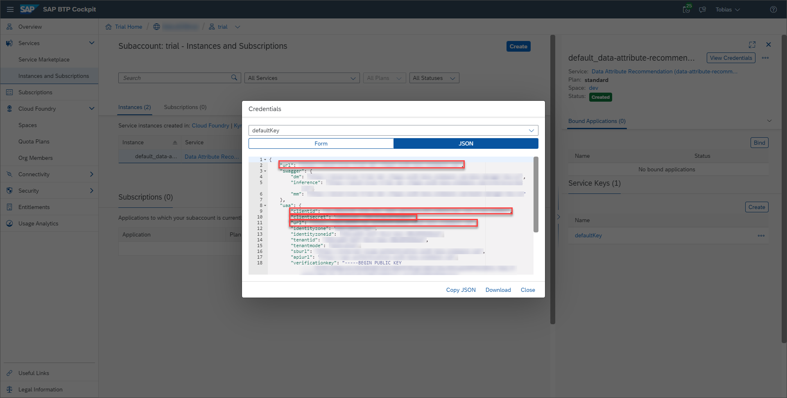

## Details
### You will learn
  - What Postman environments and collections are and how to use them
  - How to adjust the Postman environment for your service instance
  - How to import Postman environments and collections

In the following tutorials Postman is used to communicate and interact with your Data Attribute Recommendation service instance. Postman is an API client you use to call APIs. For more information, see [Postman](https://learning.getpostman.com/).

---

[ACCORDION-BEGIN [Step 1: ](Add service key credentials to Postman environment)]

Postman offers the option to add environments. Environments represent key-value pairs which can be reused in requests, so you don't have to remember them. For more information, see [Postman Environments](https://learning.getpostman.com/docs/postman/environments-and-globals/intro-to-environments-and-globals/).

If you have downloaded the Postman environment and collection sample files from the **Set up account for Data Attribute Recommendation** booster, as detailed in [Set Up Account for Data Attribute Recommendation and Download Postman Sample Files](cp-aibus-dar-booster-postman), you can set this step to **Done** and proceed with Step 2.

Follow the steps below if you want to manually add, to the environment sample file, your service key details created in [Set Up Account for Data Attribute Recommendation and Get Service Key](cp-aibus-dar-booster-key).

Use the [environment sample file](https://github.com/SAP-samples/data-attribute-recommendation-postman-tutorial/blob/main/Data_Attribute_Recommendation_Tutorial_Postman_Collection_Environment.json) for Data Attribute Recommendation available on GitHub and make a local copy.

Insert the following values from your service key into the corresponding spaces of the environment sample file:

|  Service key property                                         | Property in sample file
|  :----------------------------------------------------------- | :--------------------
|  `url` (inside the `uaa` section of the service key)          | `authentication_endpoint`
|  `clientid` (inside the `uaa` section of the service key)     | `clientid`
|  `clientsecret` (inside the `uaa` section of the service key) | `clientsecret`
|  `url` (outside the `uaa` section of the service key)         | `hostname`

Now the Postman environment is ready to be used.

[DONE]
[ACCORDION-END]

[ACCORDION-BEGIN [Step 2: ](Import the Postman environment)]

**Open** Postman and click **Import** to open the import dialog.

In the dialog, select the tab **Import File** and then click **Choose Files** to upload your environment file.

>Alternatively, you can select the tab **Paste Raw Text** and paste the text from your environment file directly in the available text area.

After you have imported the environment, a message appears to inform you about the successful import.

Your new environment now shows up in the dropdown menu and can be selected.

You have successfully imported the Postman environment for Data Attribute Recommendation.

[DONE]
[ACCORDION-END]

[ACCORDION-BEGIN [Step 3: ](Import the Postman collection)]

Collections let you group requests together in folders. This helps with the organization of multiple requests. For more information, see [Postman Collections](https://learning.getpostman.com/docs/postman/collections/intro-to-collections/).

To get started, use the [collection sample file](https://github.com/SAP-samples/data-attribute-recommendation-postman-tutorial/blob/main/Data_Attribute_Recommendation_Tutorial_Postman_Collection.json) for Data Attribute Recommendation available on GitHub. There is no need to adjust anything.

**Import** the collection the same way as you did for the environment in Step 2. You can either make a local copy and upload the file or paste the text directly in the available text area.

Here you can also use the collection sample file you downloaded from the **Set up account for Data Attribute Recommendation** booster, as detailed in [Set Up Account for Data Attribute Recommendation and Download Postman Sample Files](cp-aibus-dar-booster-postman).

After you have imported the collection, it will appear on the left. As previously explained, collections are organized in folders and you find multiple requests in each folder.

You have successfully imported the Postman collection for Data Attribute Recommendation.

[DONE]
[ACCORDION-END]

[ACCORDION-BEGIN [Step 4: ](Select the environment)]

Finally, make sure to **select** your imported environment for Data Attribute Recommendation in the dropdown menu. Otherwise you would not be able to use the requests in the collection.

[DONE]
[ACCORDION-END]

[ACCORDION-BEGIN [Step 5: ](Test yourself)]

[VALIDATE_1]
[ACCORDION-END]
