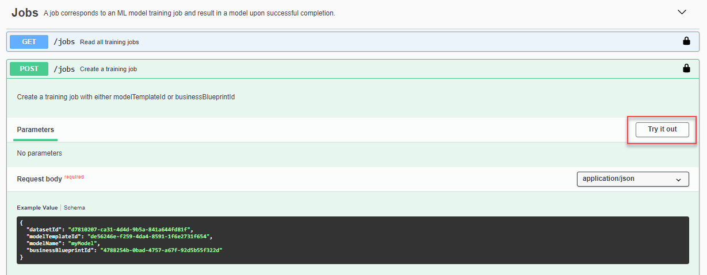
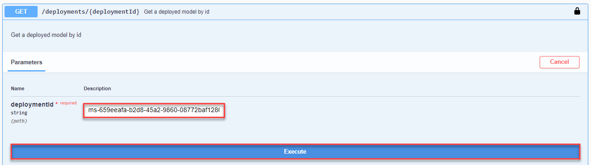
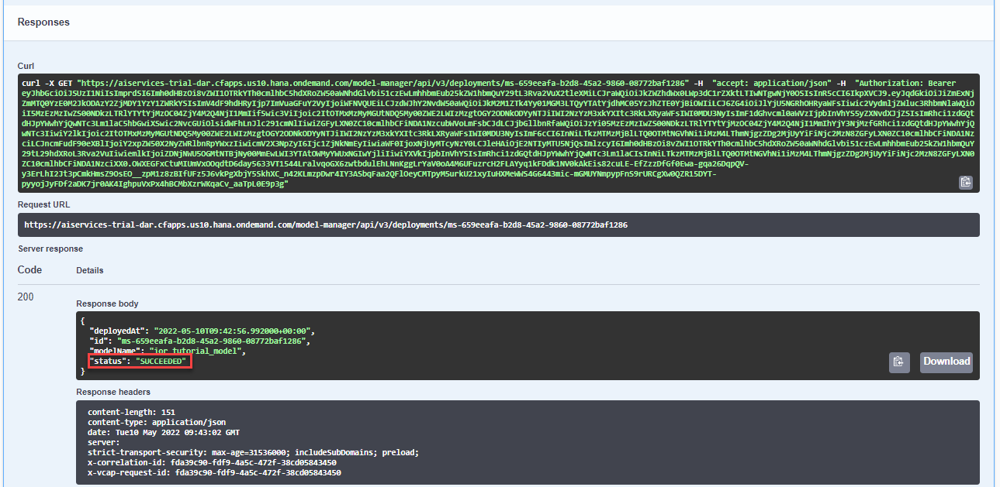

# Use the Invoice Object Recommendation (IOR) Business Blueprint to Train a Machine Learning Model
<!-- description --> Train a machine learning model for the Data Attribute Recommendation service, using the Invoice Object Recommendation (IOR) business blueprint.

## You will learn
  - How to train a machine learning model using the Invoice Object Recommendation (IOR) business blueprint
  - How to deploy a machine learning model to get financial object predictions

---

### Authorize Swagger UI


In the service key you created for Data Attribute Recommendation in the previous tutorial: [Use Free Tier to Set Up Account for Data Attribute Recommendation and Get Service Key](cp-aibus-dar-booster-free-key) or [Use Trial to Set Up Account for Data Attribute Recommendation and Get Service Key](cp-aibus-dar-booster-key), you find a section called `swagger` (as highlighted in the image below) with three entries, called `dm` (data manager), `mm` (model manager) and `inference`.

<!-- border -->

For this tutorial, copy the URL of the Swagger UI for `mm` and open it in a browser tab. The Swagger UI for the model manager allows you to train a machine learning model, to delete it, to deploy the model as well as to `undeploy` the model.

>After finishing this tutorial, keep the Swagger UI for `mm` open to perform the clean up tasks in [Use the Invoice Object Recommendation (IOR) Business Blueprint to Predict Financial Objects](cp-aibus-dar-swagger-ior-predict).

1. To be able to use the Swagger UI endpoints, you need to authorize yourself. In the top right corner, click **Authorize**.

    <!-- border -->

2. Get the `access_token` value created in the previous tutorial: [Get OAuth Access Token for Data Attribute Recommendation Using Any Web Browser](cp-aibus-dar-web-oauth-token), then add **Bearer** (with capitalized "B") in front of it, and enter in the **Value** field.

    ```
    Bearer <access_token>
    ```

3. Click **Authorize** and then click **Close**.

    <!-- border -->


### Create a training job


To train a machine learning model using the data that you uploaded in [Use an Invoice Object Recommendation (IOR) Dataset Schema to Upload Training Data to Data Attribute Recommendation](cp-aibus-dar-swagger-ior-upload), you create a training job.

With each training job you provide a model template or a business blueprint which combines data processing rules and machine learning model architecture. You can find the list of available model templates [here](https://help.sap.com/docs/Data_Attribute_Recommendation/105bcfd88921418e8c29b24a7a402ec3/1e76e8c636974a06967552c05d40e066.html), and the list of available business blueprints [here](https://help.sap.com/docs/Data_Attribute_Recommendation/105bcfd88921418e8c29b24a7a402ec3/091eace025e14793be0e83ef2109b349.html).

The Invoice Object Recommendation (IOR) business blueprint that you use in this tutorial is suited to assign G/L (general ledger) accounts and other financial objects to incoming invoices without a purchase order reference.

To create the training job, proceed as follows:

1. Expand the endpoint **POST /jobs** by clicking on it. Then click **Try it out**.

    <!-- border -->

2. In the text area, replace the parameter value for `datasetId` with the `id` of your dataset that you have created in [Use an Invoice Object Recommendation (IOR) Dataset Schema to Upload Training Data to Data Attribute Recommendation](cp-aibus-dar-swagger-ior-upload). Delete the `modelTemplateId` line from the **Request body**. Replace the parameter value `modelName` with your model name, `ior_tutorial_model`, for example. Make sure the parameter value for `businessBlueprintId` is `4788254b-0bad-4757-a67f-92d5b55f322d`. Click **Execute** to create the training job.

    <!-- border -->

3. In the response of the service, you find the `id` of your training job. Copy the `id` as you'll need it in the next step. Along side the `id`, you find the training job's current status. Initially, the status is `PENDING` which says that the training job is in queue but has not started yet.

    <!-- border -->

You have successfully created a training job.


### Check training job status


To know when your training job has ended, you have to frequently check its status. For that, proceed as follows:

1. Expand the endpoint `GET /jobs/{jobId}` by clicking on it. Then click **Try it out**.

    <!-- border -->

2. Fill the parameter `jobId` with `id` of your training job that you copied in the previous step. Click **Execute**.

    <!-- border -->

3. In the response, you find again the current status of your training job along with other details. Immediately after creation of the training job, the status is `PENDING`. Shortly after, it changes to `RUNNING` which means that the model is being trained. The training of the sample data usually takes about 5 minutes to complete but may run longer, up to a few hours due to limited availability of resources in the free tier environment. You can check the status every now and then. Once training is finished, the status changes to `SUCCEEDED` which means the service has created a machine learning model and you can proceed.

    <!-- border -->

You have successfully trained a machine learning model.


### Deploy machine learning model


To use the trained model, you need to deploy it. Once deployed, the model is ready to make predictions. To deploy your model, proceed as follows:

1. Expand the endpoint `POST /deployments` by clicking on it. Then click **Try it out**.

    <!-- border -->

2. In the text area, replace the parameter `modelName` with the name of your model (`ior_tutorial_model`). Click **Execute** to deploy the model.

    <!-- border -->

3. In the response of the service, you find the `id` of the deployment and its status. Initially, the status is `PENDING`, indicating the deployment is in progress. Make sure to copy the `id` as you need it in the next step.

    <!-- border -->


### Check deployment status


Finally, you have to ensure that your model is deployed successfully in order to use it for predictions. To check the status of your deployment, proceed as follows:

1. Expand the endpoint `GET /deployments/{id}` by clicking on it. Then click **Try it out**.

    <!-- border -->

2. Fill the parameter `deploymentId` with the `id` of your deployment that you copied in the previous step. Click **Execute**.

    <!-- border -->

3. In the response of the service, you find the current status of the deployment. If the status is `SUCCEEDED`, your deployment is done. If the status is still `PENDING`, check back in a few minutes.

    <!-- border -->

You have successfully trained a machine learning model and deployed it. Next, you'll use your model to make predictions.