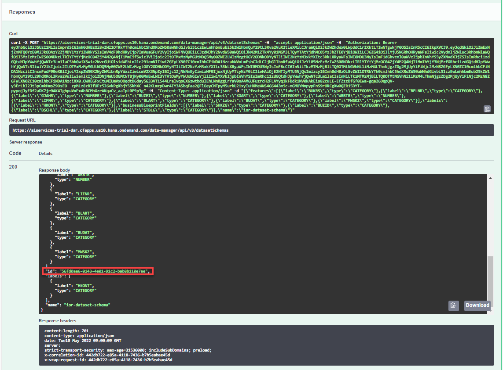
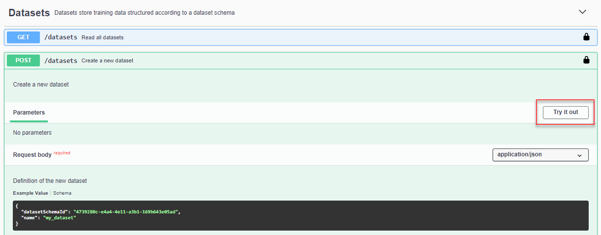
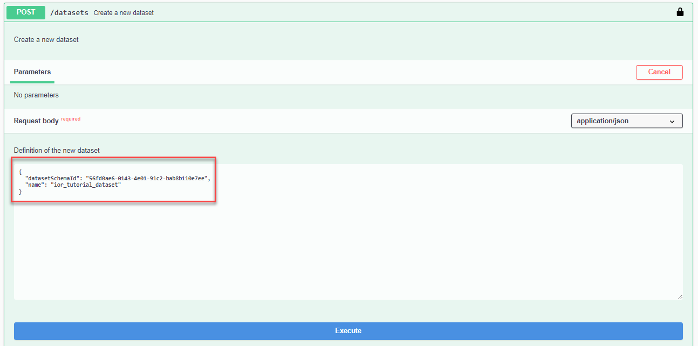
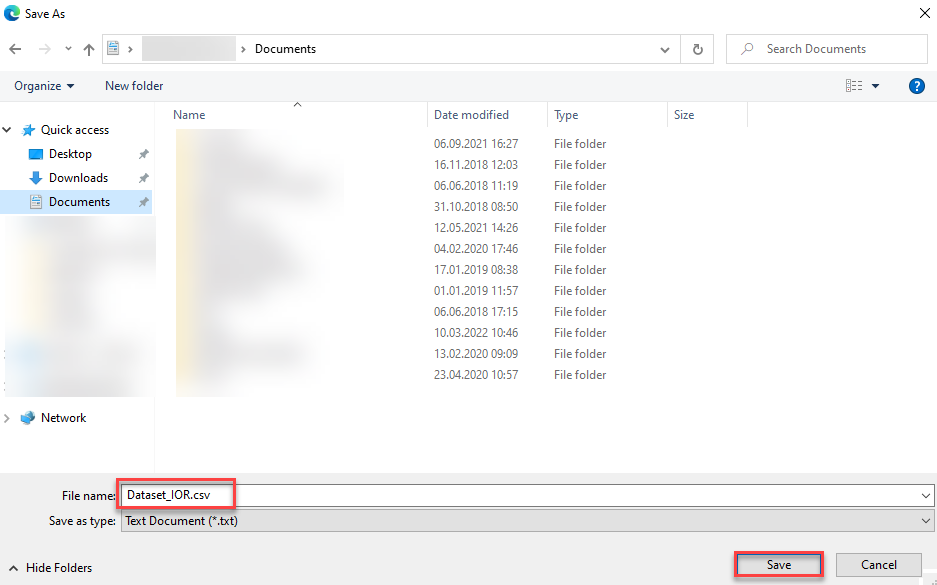

# Use an Invoice Object Recommendation (IOR) Dataset Schema to Upload Training Data to Data Attribute Recommendation
<!-- description --> Upload a dataset to your Data Attribute Recommendation service instance to afterwards be able to train your machine learning model using the Invoice Object Recommendation (IOR) business blueprint.

## You will learn
  - How to authorize your client to communicate with your Data Attribute Recommendation service instance
  - How to do upload data to your Data Attribute Recommendation service instance to train a machine learning model

## Intro
To try out Data Attribute Recommendation, the first step is to upload data that will be used to train a machine learning model. For more information, see [Data Attribute Recommendation help portal documentation](https://help.sap.com/docs/Data_Attribute_Recommendation). For further definition of specific terms, see [Concepts](https://help.sap.com/docs/Data_Attribute_Recommendation/105bcfd88921418e8c29b24a7a402ec3/cff2de73bc9c4625b35eb036439ae70a.html).

Business Use Case: Use the Invoice Object Recommendation (IOR) business blueprint to assign G/L (general ledger) accounts, cost objects and profitability analysis (CO-PA) dimension values to incoming invoices without a purchase order reference. In this tutorial, you'll train your own machine learning model to get recommendations for G/L (general ledger) accounts. The basic steps include uploading historical invoice data for training, training the machine learning model and, finally, asking the model to make financial object predictions for new incoming invoices.

To better understand the Invoice Object Recommendation (IOR) business blueprint from the Data Attribute Recommendation service, take a look at the following blog posts:

-	[Announcement: Invoice Object Recommendation becomes part of Data Attribute Recommendation (Part 1)](https://blogs.sap.com/2022/01/04/announcement-invoice-object-recommendation-becomes-part-of-data-attribute-recommendation-part-1/).

-	[Announcement: Invoice Object Recommendation becomes part of Data Attribute Recommendation – Technical Details (Part 2)](https://blogs.sap.com/2022/01/05/announcement-invoice-object-recommendation-becomes-part-of-data-attribute-recommendation-technical-details-part-2/).

See also [Free Tier Option Technical Constraints](https://help.sap.com/docs/Data_Attribute_Recommendation/105bcfd88921418e8c29b24a7a402ec3/c03b561eea1744c9b9892b416037b99a.html).

---

### Authorize Swagger UI


You'll use Swagger UI, via any web browser, to call the Data Attribute Recommendation APIs. Swagger UI allows developers to effortlessly interact and try out every single operation an API exposes for easy consumption. For more information, see [Swagger UI](https://swagger.io/tools/swagger-ui/).  

In the service key you created for Data Attribute Recommendation in the previous tutorial: [Use Free Tier to Set Up Account for Data Attribute Recommendation and Get Service Key](cp-aibus-dar-booster-free-key) or [Use Trial to Set Up Account for Data Attribute Recommendation and Get Service Key](cp-aibus-dar-booster-key), you find a section called `swagger` (as highlighted in the image below) with three entries, called `dm` (data manager), `mm` (model manager) and `inference`. You'll use all three Swagger UIs throughout the tutorials.

<!-- border -->

For this tutorial, copy the URL of the Swagger UI for `dm` and open it in a browser tab.

>After finishing this tutorial, keep the Swagger UI for `dm` open to perform the clean up tasks in [Use the Invoice Object Recommendation (IOR) Business Blueprint to Predict Financial Objects](cp-aibus-dar-swagger-ior-predict).

1. To be able to use the Swagger UI endpoints, you need to authorize yourself. In the top right corner, click **Authorize**.

    <!-- border -->

2. Get the `access_token` value created in the previous tutorial: [Get OAuth Access Token for Data Attribute Recommendation Using Any Web Browser](cp-aibus-dar-web-oauth-token), then add **Bearer** (with capitalized "B") in front of it, and enter in the **Value** field.

    ```
    Bearer <access_token>
    ```

3. Click **Authorize** and then click **Close**.

    <!-- border -->


### Create dataset schema


Now, you need to create a new dataset schema. A dataset schema describes the structure of datasets.

Use the following dataset schema:

```JSON
{
   "features":[
      {
         "label":"BUKRS",
         "type":"CATEGORY"
      },
      {
         "label":"BELNR",
         "type":"CATEGORY"
      },
      {
         "label":"GJAHR",
         "type":"NUMBER"
      },
      {
         "label":"BUZEI",
         "type":"NUMBER"
      },
      {
         "label":"KOART",
         "type":"CATEGORY"
      },
      {
         "label":"WRBTR",
         "type":"NUMBER"
      },
      {
         "label":"LIFNR",
         "type":"CATEGORY"
      },
      {
         "label":"BLART",
         "type":"CATEGORY"
      },
      {
         "label":"BUDAT",
         "type":"CATEGORY"
      },
      {
         "label":"MWSKZ",
         "type":"CATEGORY"
      }
   ],
   "labels":[
      {
         "label":"HKONT",
         "type":"CATEGORY"
      }
   ],
   "businessBlueprintFields":[
      {
         "label":"SHKZG",
         "type":"CATEGORY"
      },
      {
         "label":"BUZID",
         "type":"CATEGORY"
      },
      {
         "label":"BSCHL",
         "type":"CATEGORY"
      },
      {
         "label":"STBLG",
         "type":"CATEGORY"
      }
   ],
   "name":"ior-dataset-schema"
}
```

The schema is divided into `features` and `labels`. The features are the inputs for the machine learning model whereas the labels are the fields that will be predicted. Thus, this schema provides as input training fields such as BUKRS for company code, and wants to predict G/L accounts (HKONT).

To create the dataset schema, proceed as follows:

1. In Swagger UI, expand the endpoint `POST /datasetSchemas` by clicking on it. Then click **Try it out**.

    <!-- border -->

2. Copy the above dataset schema into the text area. Then click **Execute** to create it.

    <!-- border -->

3. Further below, you find the response of the service. The response includes a representation of dataset schema that was just created. Additionally, the dataset schema received an `id`. Copy it locally as you'll need it in the next step.

    <!-- border -->

You have successfully created a dataset schema.


### Create dataset


Next, you need to create a dataset using the dataset schema that you have created. The dataset is a table that holds the data that you'll upload later.

To create the dataset, proceed as follows:

1. Expand the endpoint `POST /datasets` by clicking on it. Then click **Try it out**.

    <!-- border -->

2. In the text area, replace the parameter `datasetSchemaId` with the  `id` that you copied from the previous step and replace the parameter `name` with an appropriate name for you dataset, `ior_tutorial_dataset`, for example. Then click **Execute** to create the dataset.

    <!-- border -->

3. In the response of the service, you find the `id` of your dataset. Copy it locally as you'll need it in the next steps and also in the next tutorial: [Use the Invoice Object Recommendation (IOR) Business Blueprint to Train a Machine Learning Model](cp-aibus-dar-swagger-ior-model). Additionally, you find the `status` of the dataset. The status is `NO_DATA` as no data file has been uploaded yet.

    <!-- border -->

You have successfully created a dataset.


### Upload data


The final step of this tutorial is to upload data to your dataset.

In this tutorial, you'll use this [dataset](https://raw.githubusercontent.com/sap-tutorials/Tutorials/master/tutorials/cp-aibus-dar-swagger-ior-upload/Dataset_IOR.csv). Right click on the link, then click ***Save link as*** to open the file dialog. In the dialog, replace the file ending `txt` with `csv` as indicated below. Then save the file.

<!-- border -->

In Swagger UI, proceed as follows to upload to the data:

1. Expand the endpoint `POST /datasets/{id}/data` by clicking on it. Then click **Try it out**.

    <!-- border -->

2. Fill the parameter `id` with the `id` of your dataset that you previously copied.

3. Click **Choose File** below the parameter `Request body`. In the dialog that opens, select the IOR dataset that you just downloaded. Then click **Execute** to upload the data.

<!-- border -->

In the response, you'll see that the status of your dataset has changed to `VALIDATING`. The service is now validating the data that you have uploaded.

<!-- border -->

You have successfully uploaded data to your dataset.


### Check dataset status


To check the validation status of your data, proceed as follows:

1. Expand the endpoint `GET /datasets/{id}` by clicking on it. Then click **Try it out**.

    <!-- border -->

2. Fill the parameter `id` with the `id` of your dataset. Click **Execute**.

    <!-- border -->

3. In the response of the service, you find the status of your dataset. If the status is still `VALIDATING`, check back in a few minutes. If the status is `SUCCEEDED`, your data is valid. In case the status is either `INVALID_DATA` or `VALIDATION_FAILED`, create a new dataset and upload the data once again.

    <!-- border -->

You have successfully created a dataset and uploaded data. You can now use the dataset to train a machine learning model.