# Use the Regression Model Template to Predict Data Records
<!-- description --> Predict product data records using your machine learning model.

## You will learn
  - How to predict data records using your machine learning model
  - How to `undeploy` and delete your model
  - How to delete datasets and dataset schemas

---

### Authorize Swagger UI


In the service key you created for Data Attribute Recommendation in the previous tutorial: [Use Free Tier to Set Up Account for Data Attribute Recommendation and Get Service Key](cp-aibus-dar-booster-free-key) or [Use Trial to Set Up Account for Data Attribute Recommendation and Get Service Key](cp-aibus-dar-booster-key), you find a section called `swagger` (as highlighted in the image below) with three entries, called `dm` (data manager), `mm` (model manager) and `inference`.

<!-- border -->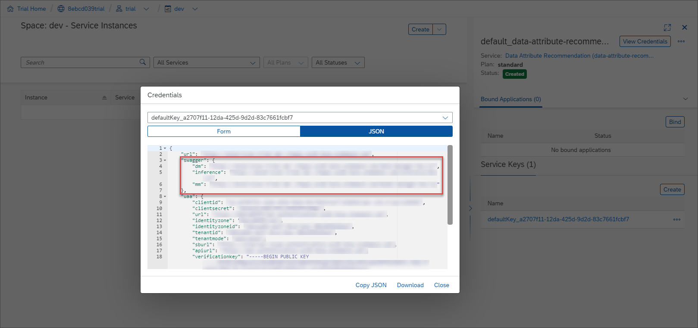

For the following step, copy the URL of the Swagger UI for `inference` and open it in a browser tab. The Swagger UI for inference allows you to predict data records using your machine learning model that you have created in the previous tutorial: [Use the Regression Model Template to Train a Machine Learning Model](cp-aibus-dar-swagger-regression-model).

1. To be able to use the Swagger UI endpoints, you need to authorize yourself. In the top right corner, click **Authorize**.

    <!-- border -->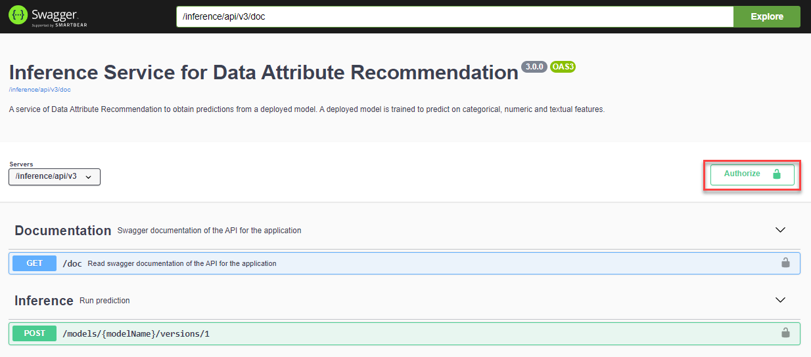

2. Get the `access_token` value created in the previous tutorial: [Get OAuth Access Token for Data Attribute Recommendation Using Any Web Browser](cp-aibus-dar-web-oauth-token), then add **Bearer** (with capitalized "B") in front of it, and enter in the **Value** field.

    ```
    Bearer <access_token>
    ```

3. Click **Authorize** and then click **Close**.

    <!-- border -->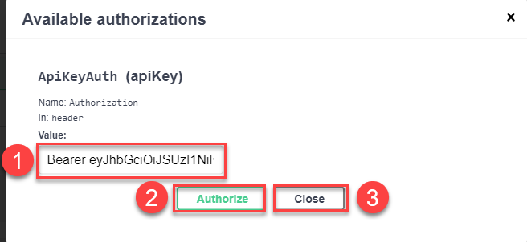


### Predict data records


To predict data records, proceed as follows:

1. Expand the endpoint `POST /models/{modelName}/versions/1` by clicking on it. Then click **Try it out**.

    <!-- border -->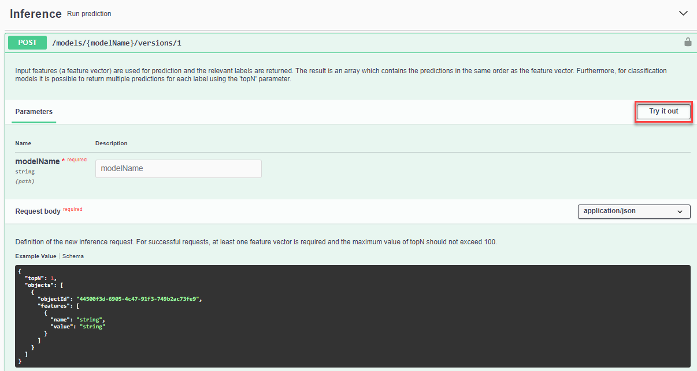

2. In the parameter `modelName`, enter your model name, `regression-model`, for example.

3. In the parameter `body`, you have to provide the data you want to predict. According to the dataset schema that you have created in [Use the Regression Model Template to Upload Data to Data Attribute Recommendation with Swagger UI](cp-aibus-dar-swagger-regression-upload), **the machine learning model takes the manufacturer and description of the product as input and predicts the price of the product**. Replace the text in the parameter `body` with the following:

    ```JSON
    {
       "topN":1,
       "objects":[
          {
             "objectId":"optional-identifier-1",
             "features":[
                {"name":"manufacturer", "value":"Energizer"},
                {"name":"description", "value":"Alkaline batteries; 1.5V"}                
             ]
          },
          {
             "objectId":"optional-identifier-2",
             "features":[
                {"name":"manufacturer","value":"Eidos"},
                {
                   "name":"description",
                   "value":"Unravel a grim conspiracy at the brink of Revolution"
                }                
             ]
          }
       ]
    }
    ```

4. Click **Execute** to send the above input for prediction to the service.

    <!-- border -->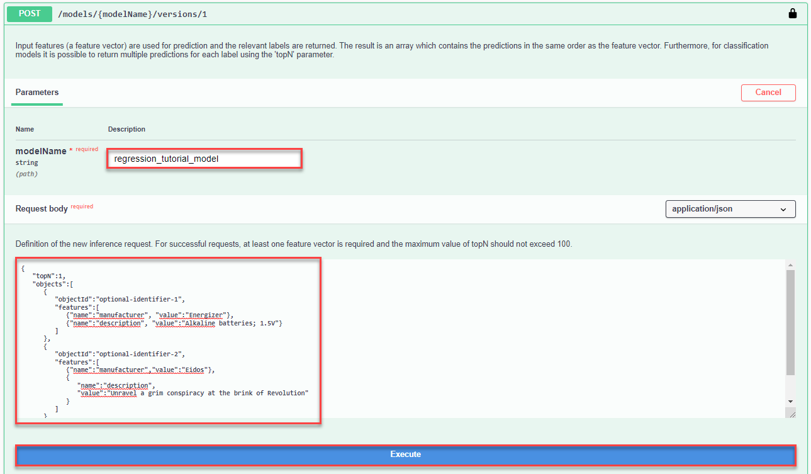

In the response of the service, you find the values that the model predicted.

<!-- border -->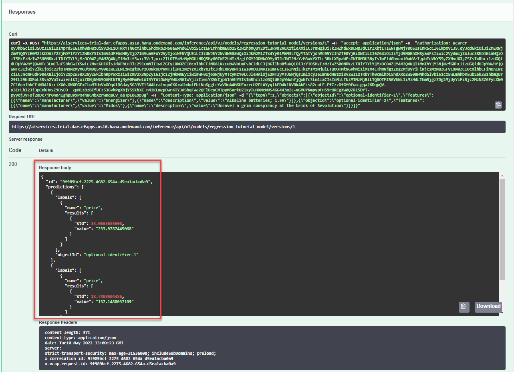

The regression model template produces a different output when compared with the other Data Attribute Recommendation [model templates](https://help.sap.com/viewer/105bcfd88921418e8c29b24a7a402ec3/SHIP/en-US/1e76e8c636974a06967552c05d40e066.html) and [business blueprints](https://help.sap.com/viewer/105bcfd88921418e8c29b24a7a402ec3/SHIP/en-US/091eace025e14793be0e83ef2109b349.html). Instead of providing a pair `value/probability` result, it returns a pair `value/std`.

The regression model template is not deterministic. The `value` is the average of several hundred predictions made by the model for the same input and `std` is the standard deviation of these predictions. The `std` should give a feeling of how certain the model is about the predicted `value`. The smaller the `std`, the more confident the model prediction.

For example, in the first result below ("value": "233.9787445068"), the model has predicted the average price of 234 dollars. Most of the model predictions lie in the area between 201 (234-33) and 267 (234+33) dollars. Therefore the model is quite confident and even more accurate in the second result ("value": "137.1488037109") that has a standard deviation of only 19.

```JSON
{
  "id": "9f989bcf-2275-4682-654a-d5ea1acba0a9",
  "predictions": [
    {
      "labels": [
        {
          "name": "price",
          "results": [
            {
              "std": 33.0863685608,
              "value": "233.9787445068"
            }
          ]
        }
      ],
      "objectId": "optional-identifier-1"
    },
    {
      "labels": [
        {
          "name": "price",
          "results": [
            {
              "std": 18.7408504486,
              "value": "137.1488037109"
            }
          ]
        }
      ],
      "objectId": "optional-identifier-2"
    }
  ],
  "processedTime": "2022-05-10T13:00:23.024141",
  "status": "DONE"
}
```

You have successfully predicted the price of product data records. Feel free to adapt the examples above and retry the prediction.


### Undeploy your model


Now that you have learned the whole process about how to use the Regression Model Template from the Data Attribute Recommendation service, it's time to clean up. This way, the technical limits won't get in your way when trying out other Data Attribute Recommendation tutorials. See [Technical Constraints](https://help.sap.com/docs/Data_Attribute_Recommendation/105bcfd88921418e8c29b24a7a402ec3/686d2ae094014c8085cebecdb1d37e37.html) and [Free Tier Option Technical Constraints](https://help.sap.com/docs/Data_Attribute_Recommendation/105bcfd88921418e8c29b24a7a402ec3/c03b561eea1744c9b9892b416037b99a.html).

First, `undeploy` your model. For that, go back to the Swagger UI for `mm` and:

 1. Expand the endpoint `DELETE /deployments/{deploymentId}` by clicking on it. Then click **Try it out**.

     <!-- border -->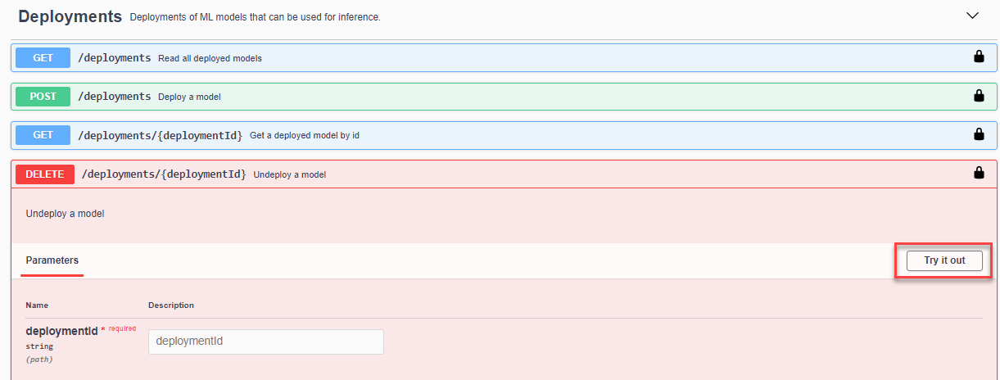

 2. Fill the parameter `deploymentId` with the ID of your deployment. Use the `GET /deployments` endpoint in case you no longer have the deployment `id` in hand.

     <!-- border -->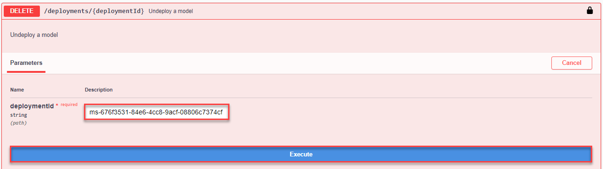

If the response code is `204`, the model has been successfully `undeployed`.

<!-- border -->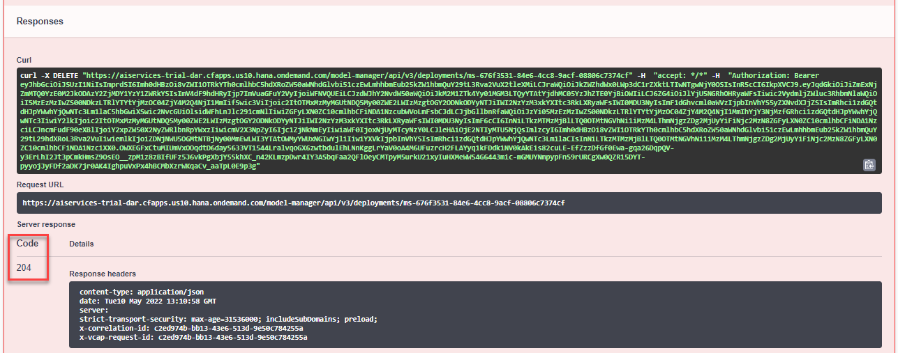

You have successfully `undeployed` your model, but the model is not yet deleted. Instead it isn't in production which means that you cannot make inference requests. You can deploy it again at any time using the `POST /deployments` endpoint.


### Delete your model


Once `undeployed`, you can delete your model.

1. Expand the endpoint `DELETE /models/{modelName}` by clicking on it. Then click **Try it out**.

    <!-- border -->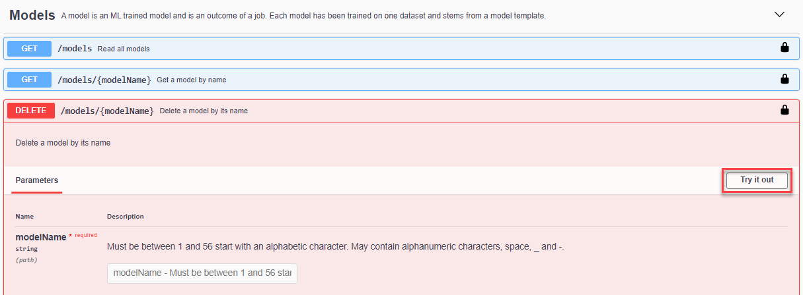

2. Fill the parameter `modelName` with the name of your machine learning model (`ior_tutorial_model`). Use the `GET /models` endpoint in case you no longer have the model `name` in hand.

    <!-- border -->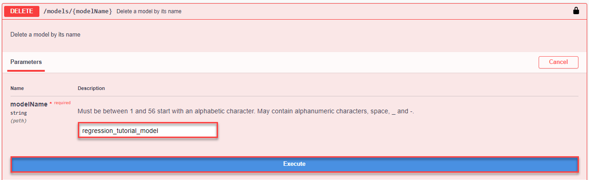

If the response code is `204`, the model has been successfully deleted.

<!-- border -->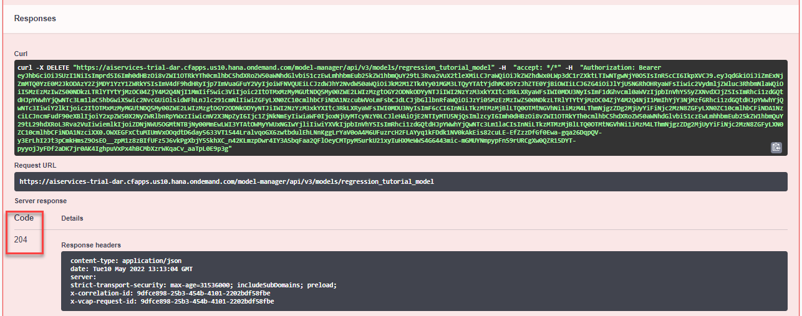


### Delete your training job


Now that the model is deleted, you can delete the training job that created the model.

1. Expand the endpoint `DELETE /jobs/{jobId}` by clicking on it. Then click **Try it out**.

    <!-- border -->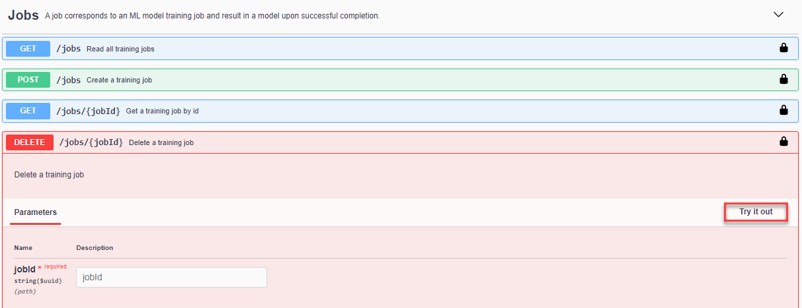

2. Fill the parameter `jobId` with the ID of your training job. Use the `GET /jobs` endpoint in case you no longer have the job `id` in hand.

    <!-- border -->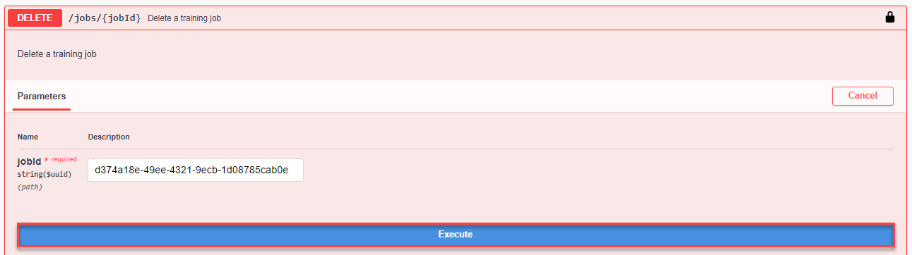

If the response code is `204`, the training job has been successfully deleted.

<!-- border -->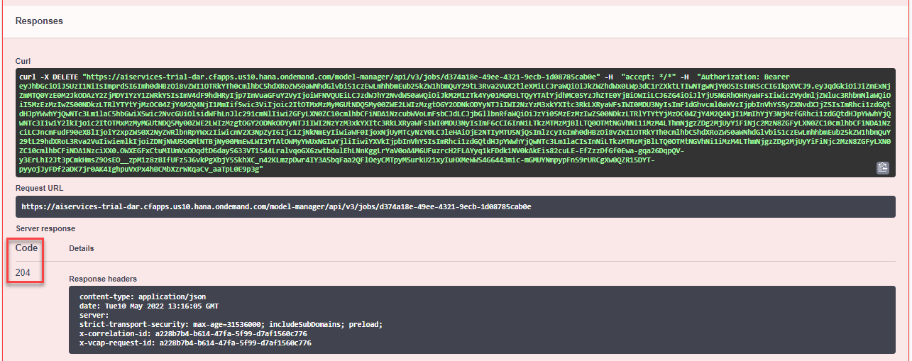


### Delete your dataset


To clear the uploaded data, you can now delete the dataset as the associated training job is already deleted. For that, go back to the Swagger UI for `dm` and:

 1. Expand the endpoint `DELETE /datasets/{id}` by clicking on it. Then click **Try it out**.

     <!-- border -->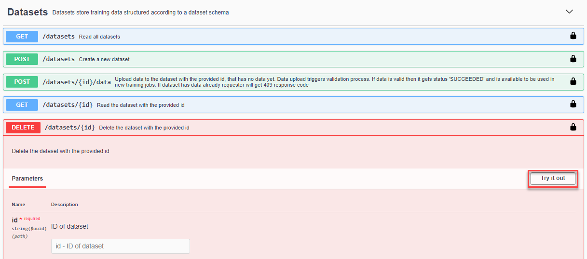

 2. Fill the parameter `id` with the ID of your dataset. Use the `GET /datasets` endpoint in case you no longer have the dataset `id` in hand.

     <!-- border -->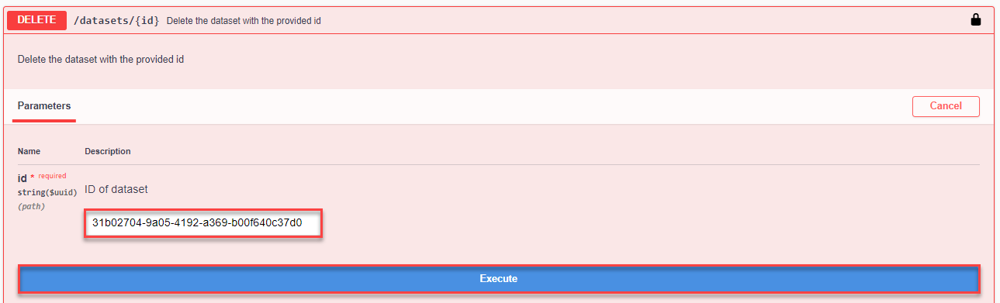

If the response code is `204`, the dataset has been successfully deleted.

<!-- border -->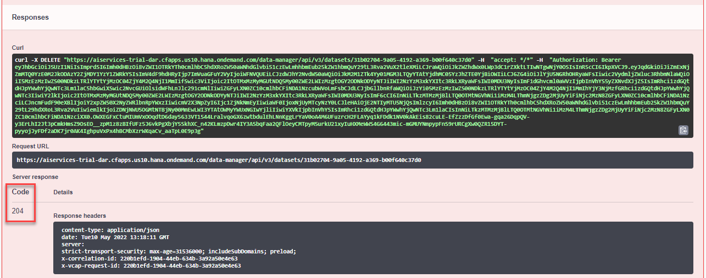


### Delete your dataset schema


If you do not need your dataset schema anymore, you can delete it as well.

1. Expand the endpoint `DELETE /datasetSchemas/{id}` by clicking on it. Then click **Try it out**.

    <!-- border -->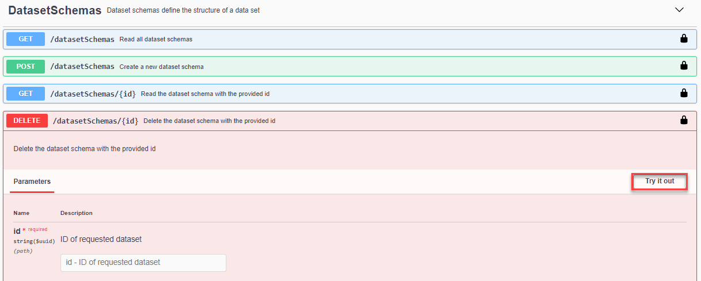

2. Fill the parameter `id` with the ID of your dataset schema. Use the `GET /datasetSchemas` endpoint in case you no longer have the dataset schema `id` in hand.

    <!-- border -->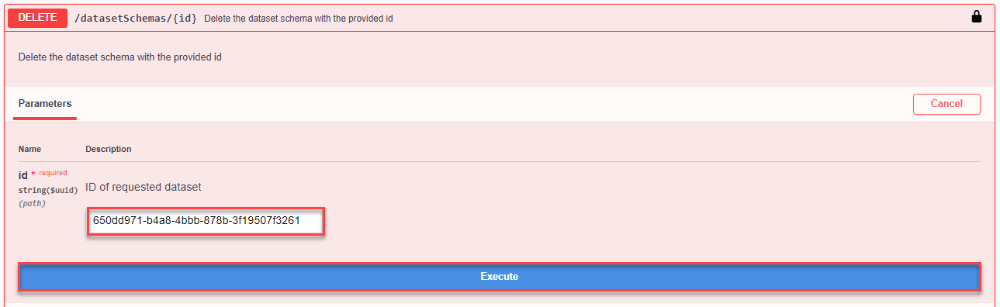

If the response code is `204`, the dataset schema has been successfully deleted.

<!-- border -->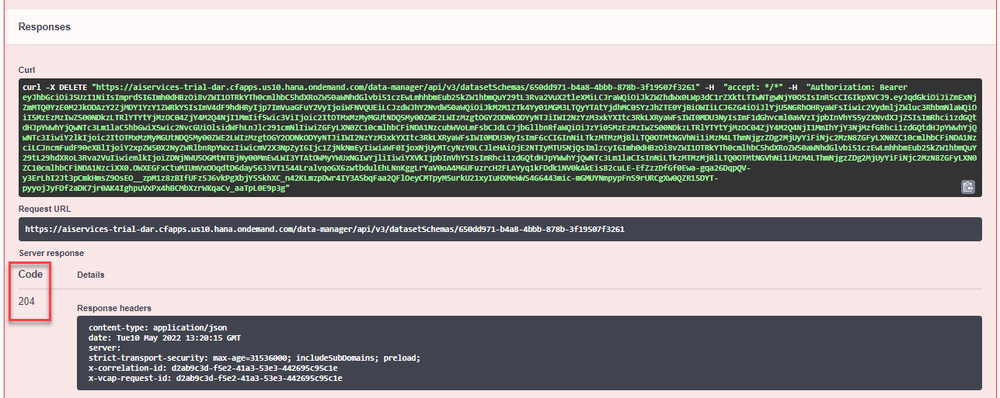

Congratulations, you have completed this tutorial.

