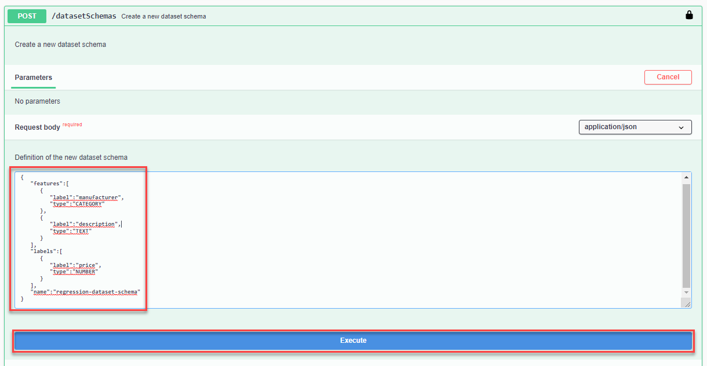
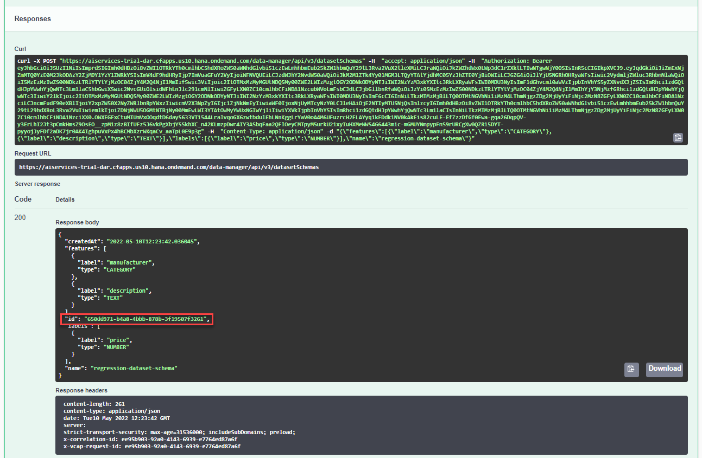
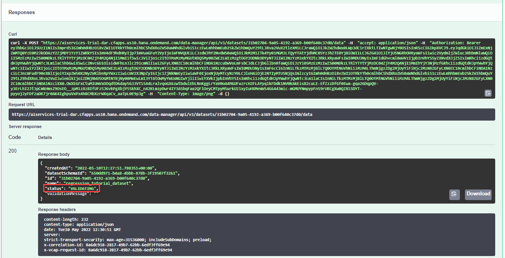
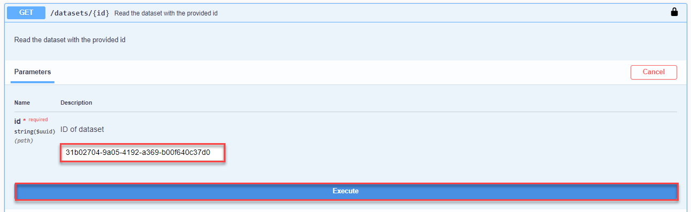

# Use a Regression Dataset Schema to Upload Training Data to Data Attribute Recommendation
<!-- description --> Upload a dataset to your Data Attribute Recommendation service instance to afterwards be able to train your machine learning model using the regression model template.

## You will learn
  - How to authorize your client to communicate with your Data Attribute Recommendation service instance
  - How to do upload data to your Data Attribute Recommendation service instance to train a machine learning model

## Intro
To try out Data Attribute Recommendation, the first step is to upload data that will be used to train a machine learning model. For more information, see [Data Attribute Recommendation help portal documentation](https://help.sap.com/docs/Data_Attribute_Recommendation). For further definition of specific terms, see [Concepts](https://help.sap.com/docs/Data_Attribute_Recommendation/105bcfd88921418e8c29b24a7a402ec3/cff2de73bc9c4625b35eb036439ae70a.html).

Business Use Case: Use the regression model template to predict the price of new products based on a training dataset that has the following product information: manufacturer, description and price.    

The regression model template is a generic neural network for regression which seeks to minimize the mean squared error (MSE). This model template does not support multi-label dataset schemas. Use single-label dataset schemas only.

To better understand the regression model template from the Data Attribute Recommendation service, take a look at the following blog post: [Solving regression use-cases with Data Attribute Recommendation](https://blogs.sap.com/2021/11/14/solving-regression-use-cases-with-data-attribute-recommendation/). See also [Free Tier Option Technical Constraints](https://help.sap.com/docs/Data_Attribute_Recommendation/105bcfd88921418e8c29b24a7a402ec3/c03b561eea1744c9b9892b416037b99a.html).

To create a machine learning model that predicts the price of new products you will first prepare the dataset schema and upload the training data to the service. In this tutorial, you will focus on the data preparation, uploading and defining the dataset schema. For that, you will use a public product dataset from Best Buy.

---

### Authorize Swagger UI


You will use Swagger UI, via any web browser, to call the Data Attribute Recommendation APIs. Swagger UI allows developers to effortlessly interact and try out every single operation an API exposes for easy consumption. For more information, see [Swagger UI](https://swagger.io/tools/swagger-ui/).  

In the service key you created for Data Attribute Recommendation in the previous tutorial: [Use Free Tier to Set Up Account for Data Attribute Recommendation and Get Service Key](cp-aibus-dar-booster-free-key) or [Use Trial to Set Up Account for Data Attribute Recommendation and Get Service Key](cp-aibus-dar-booster-key), you find a section called `swagger` (as highlighted in the image below) with three entries, called `dm` (data manager), `mm` (model manager) and `inference`. You will use all three Swagger UIs throughout the tutorials.

<!-- border -->

For this tutorial, copy the URL of the Swagger UI for `dm` and open it in a browser tab.

>After finishing this tutorial, keep the Swagger UI for `dm` open to perform the clean up tasks in [Use the Regression Model Template to Predict Data Records](cp-aibus-dar-swagger-regression-predict).

1. To be able to use the Swagger UI endpoints, you need to authorize yourself. In the top right corner, click **Authorize**.

    <!-- border -->

2. Get the `access_token` value created in the previous tutorial: [Get OAuth Access Token for Data Attribute Recommendation Using Any Web Browser](cp-aibus-dar-web-oauth-token), then add **Bearer** (with capitalized "B") in front of it, and enter in the **Value** field.

    ```
    Bearer <access_token>
    ```

3. Click **Authorize** and then click **Close**.

    <!-- border -->


### Create dataset schema


Now, you need to create a new dataset schema. A dataset schema describes the structure of datasets.

In these tutorials, you'll use a dataset from [Best Buy](https://www.bestbuy.com/). The original dataset as well as other dataset from Best Buy can be found [here](https://github.com/BestBuyAPIs/open-data-set/). From the original dataset the product information manufacturer, description and price were picked to illustrate the possibility of the service and the regression model template to deal with such information.

Use the following dataset schema:

```JSON
{
   "features":[
      {
         "label":"manufacturer",
         "type":"CATEGORY"
      },
      {
         "label":"description",
         "type":"TEXT"
      }
   ],
   "labels":[
      {
         "label":"price",
         "type":"NUMBER"
      }
   ],
   "name":"regression-dataset-schema"
}
```

The schema is divided into `features` and `labels`. The features are the inputs for the machine learning model whereas the labels are the fields that shall be predicted. Thus, this schema provides the product information (manufacturer and description) as an input and wants to predict the price of the product.

To create the dataset schema, proceed as follows:

1. In Swagger UI, expand the endpoint `POST /datasetSchemas` by clicking on it. Then click **Try it out**.

    <!-- border -->

2. Copy the above dataset schema into the text area. Then click **Execute** to create it.

    <!-- border -->

3. Further below, you find the response of the service. The response includes a representation of dataset schema that was just created. Additionally, the dataset schema received an `id`. Copy it locally as you will need it in the next step.

    <!-- border -->

You have successfully created a dataset schema.


### Create dataset


Next, you need to create a dataset using the dataset schema that you have created. The dataset is a table that holds the data that you will upload later.

To create the dataset, proceed as follows:

1. Expand the endpoint `POST /datasets` by clicking on it. Then click **Try it out**.

    <!-- border -->

2. In the text area, replace the parameter `datasetSchemaId` with id that you copied from the previous step and replace the parameter `name` with an appropriate name for you dataset, `regression_tutorial_dataset`, for example. Then click **Execute** to create the dataset.

    <!-- border -->

3. In the response of the service, you find the `id` of your dataset. Copy it locally as you will need it in the next steps and also in the next tutorial: [Use the Regression Model Template to Train a Machine Learning Model](cp-aibus-dar-swagger-regression-model). Additionally, you find the `status` of the dataset. The status is `NO_DATA` as no data file has been uploaded yet.

    <!-- border -->

You have successfully created a dataset.


### Upload data


The final step is to upload data to your dataset.

In this tutorial, you use this [dataset](https://raw.githubusercontent.com/sap-tutorials/Tutorials/master/tutorials/cp-aibus-dar-swagger-regression-upload/Dataset_Regression.csv) which is a reduced version of Best Buy's dataset. Right click on the link, then click ***Save link as*** to open the file dialog. In the dialog, replace the file ending `txt` with `csv` as indicated below. Then save the file.

<!-- border -->

Open the dataset and take a moment to look at it. As mentioned in step 2 the dataset contains product information as well as product prices. You might ask why the product prices are in the dataset when you actually want to predict them.

The prices are only necessary for training as the service does not know yet which product information are common for certain prices. Instead, the service will recognize patterns and establish such connections during the training process. This allows the service to make price predictions based on the product information later on.

In Swagger UI, proceed as follows to upload to the data:

1. Expand the endpoint `POST /datasets/{id}/data` by clicking on it. Then click **Try it out**.

    <!-- border -->

2. Fill the parameter `id` with the ID of your dataset that you previously copied.

3. Click **Choose File** below the parameter `Request body`. In the dialog that opens, select the regression dataset that you just downloaded. Then click **Execute** to upload the data.

<!-- border -->

In the response, you see that the status of your dataset has changed to `VALIDATING`. The service is now validating the data that you have uploaded.

<!-- border -->

You have successfully uploaded data to your dataset.


### Check dataset status


To check the validation status of your data, proceed as follows:

1. Expand the endpoint `GET /datasets/{id}` by clicking on it. Then click **Try it out**.

    <!-- border -->

2. Fill the parameter `id` with the ID of your dataset. Click **Execute**.

    <!-- border -->

3. In the response of the service, you find the status of your dataset. If the status is still `VALIDATING`, check back in a few minutes. If the status is `SUCCEEDED`, your data is valid. In case the status is either `INVALID_DATA` or `VALIDATION_FAILED`, create a new dataset and upload the data once again.

    <!-- border -->

You have successfully created a dataset and uploaded data. You can now use the dataset to train a machine learning model.