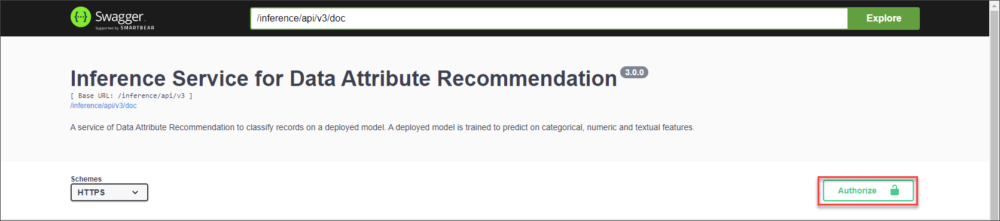
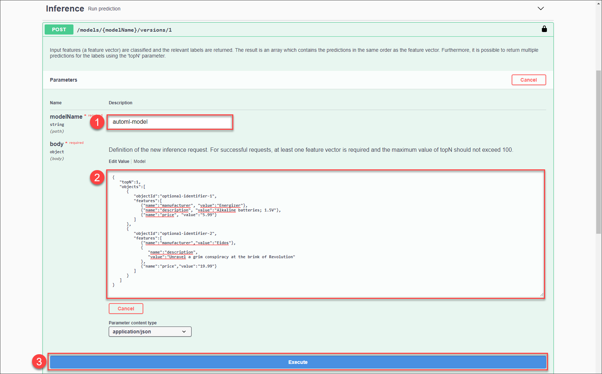

## Details
### You will learn
  - How to classify records using your machine learning model

---

[ACCORDION-BEGIN [Step 1: ](Authorize Swagger UI)]

In the service key you created for Data Attribute Recommendation in the previous tutorial: [Set Up Account for Data Attribute Recommendation and Get Service Key](cp-aibus-dar-booster-key), you find a section called `swagger` (as highlighted in the image below) with three entries, called `dm` (data manager), `inference` and `mm` (model manager).

!

For this tutorial, copy the URL of the Swagger UI for `inference` and open it in a browser tab. The Swagger UI for inference allows you to classify new data using your machine learning model that you have created in [Use the AutoML Template to Train a Machine Learning Model](cp-aibus-dar-swagger-ui-model).

1. To be able to use the Swagger UI endpoints, you need to authorize yourself. In the top right corner, click **Authorize**.

    !

2. Get the `access_token` value created in the previous tutorial: [Get OAuth Access Token for Data Attribute Recommendation Using Any Web Browser](cp-aibus-dar-web-oauth-token), then add **Bearer** (with capitalized "B") in front of it, and enter in the **Value** field.

    ```
    Bearer <access_token>
    ```

3. Click **Authorize** and then click **Close**.

    !

[DONE]
[ACCORDION-END]


[ACCORDION-BEGIN [Step 2: ](Classify records)]

To classify records, proceed as follows:

1. Expand the endpoint `POST /models/{modelName}/versions/1` by clicking on it. Then click **Try it out**.

    !

2. Fill the parameter `modelName` with the name of your machine learning model.

3. In the parameter `body`, you have to provide the data that needs to be classified. According to the dataset schema that you have created in [Upload Data to Data Attribute Recommendation with Swagger UI](cp-aibus-dar-swagger-ui-upload), the machine learning model takes the manufacturer, description and price of the product as input and predicts the product category. Replace the text in the parameter `body` with the following:

    ```JSON
    {
       "topN":1,
       "objects":[
          {
             "objectId":"optional-identifier-1",
             "features":[
                {"name":"manufacturer", "value":"Energizer"},
                {"name":"description", "value":"Alkaline batteries; 1.5V"},
                {"name":"price", "value":"5.99"}
             ]
          },
          {
             "objectId":"optional-identifier-2",
             "features":[
                {"name":"manufacturer","value":"Eidos"},
                {
                   "name":"description",
                   "value":"Unravel a grim conspiracy at the brink of Revolution"
                },
                {"name":"price","value":"19.99"}
             ]
          }
       ]
    }
    ```

4. Click **Execute** to send the above input for classification to the service.

    !

5. In the response of the service, you find ..

You have successfully classified products into product categories. Feel free to adapt the examples above and retry the classification.

[VALIDATE_1]
[ACCORDION-END]
