## Details
### You will learn
  - How to authorize your client to communicate with your Data Attribute Recommendation service instance
  - How to do upload data to your Data Attribute Recommendation service instance to train a machine learning model

To try out Data Attribute Recommendation, the first step is to upload data that will be used to train a machine learning model. For more information, see [Data Attribute Recommendation help portal documentation](https://help.sap.com/dar). For further definition of specific terms, see [Concepts](https://help.sap.com/viewer/105bcfd88921418e8c29b24a7a402ec3/SHIP/en-US/fe501df6d9f94361bfea066f9a6f6712.html).

Business Use Case: When creating the master data of a product, classifying the product into correct category and product hierarchy is a manual process that involves a product expert.

To help automate this manual process, Data Attribute Recommendation can learn from historical data of products and their hierarchies to  automatically suggest the relevant categories with confidence level. This saves a lot of manual effort and helps automate the master data creation process. The same concept can be applied to transactional data like sales orders or any other orders with missing information.   

The first steps to create this machine learning model that predicts categories and subcategories of a product is to prepare the dataset schema and upload to the service the training data. In this tutorial, you will focus on the model training data preparation, uploading and defining the dataset schema. For that, you will use a product dataset from Best Buy.

---

[ACCORDION-BEGIN [Step 1: ](Get an access token)]

To communicate with your service instance, you need to retrieve an OAuth access token which will grant you access to the Data Attribute Recommendation APIs. This access token is added to all your service instance requests.

**Open** Postman and make sure that your `Data Attribute Recommendation environment` is selected. For detailed steps, see [Set Up Postman Environment and Collection to call Data Attribute Recommendation APIs](cp-aibus-dar-setup-postman).

On the left, expand the `Data Attribute Recommendation collection` and open the subfolder `Setup`. In this folder, select the request, `Get Authorization`.

Click **Send** to send the request to your service instance.

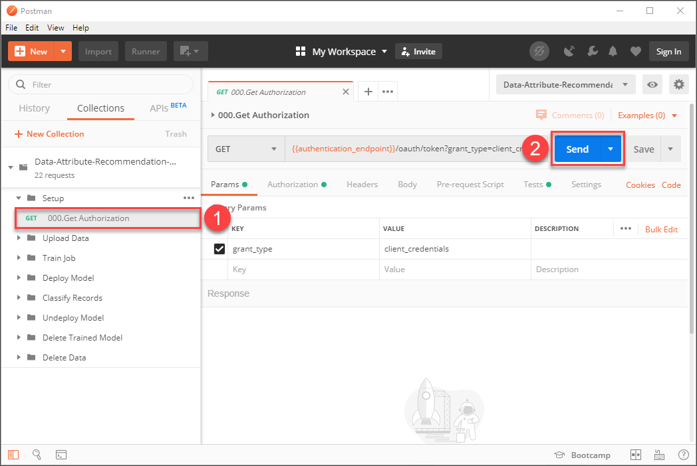

The response includes your `access_token` plus its expiration time `expires_in`. If the token expires, you need to request a new one. There is no need to copy the access token as the collection automatically adds the token to all requests.

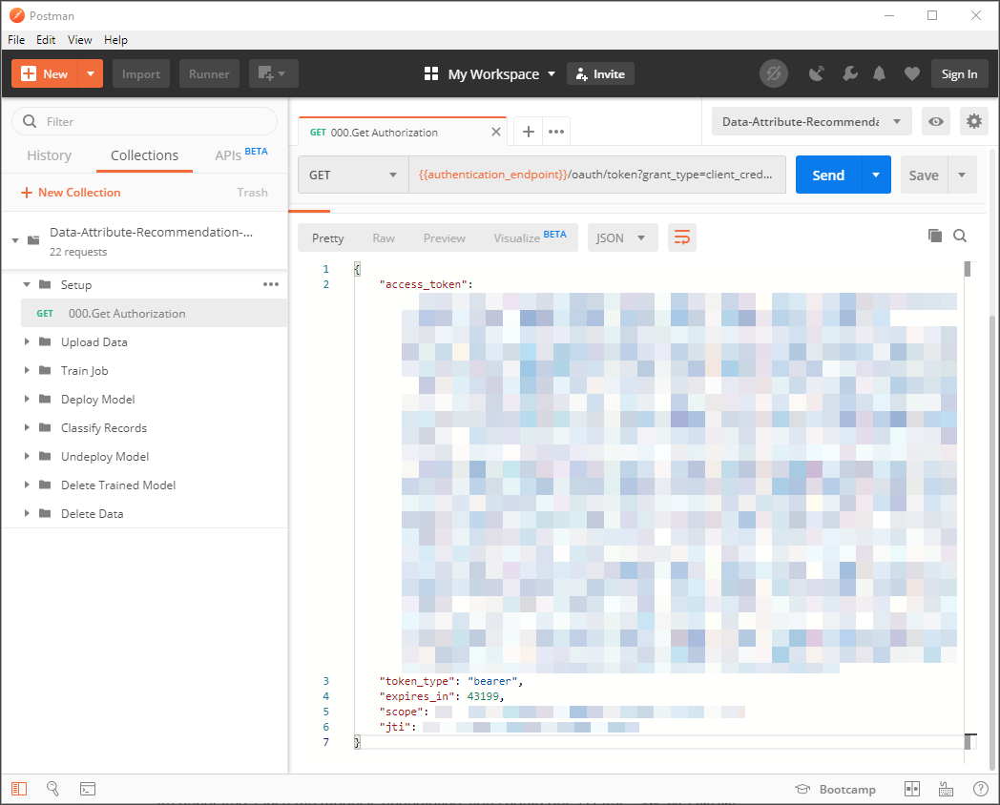

[DONE]
[ACCORDION-END]

[ACCORDION-BEGIN [Step 2: ](Create dataset schema)]

Now, you need to create a new dataset schema. A dataset schema describes the structure of datasets.

In these tutorials, you are using a dataset from [Best Buy](https://www.bestbuy.com/). The original dataset as well as other dataset from Best Buy can be found [here](https://github.com/BestBuyAPIs/open-data-set/). From the original dataset the product information `description`, `manufacturer` and `price` as well as three levels of product categories were picked to illustrate the possibility of the service to deal with such information. In a generic use case you may pick a number and combination of properties yourself.

Expand the subfolder `Upload Data` and select the request `Create new Dataset Schema`. click the `Body` tab to see the dataset schema that you are going to create.

The schema is divided into `features` and `labels`. The features are the inputs for the machine learning model whereas the labels are the fields that shall be predicted. Thus, this schema provides the product information as an input and wants to predict the product categories.

To create this dataset schema, click **Send** to send the request.

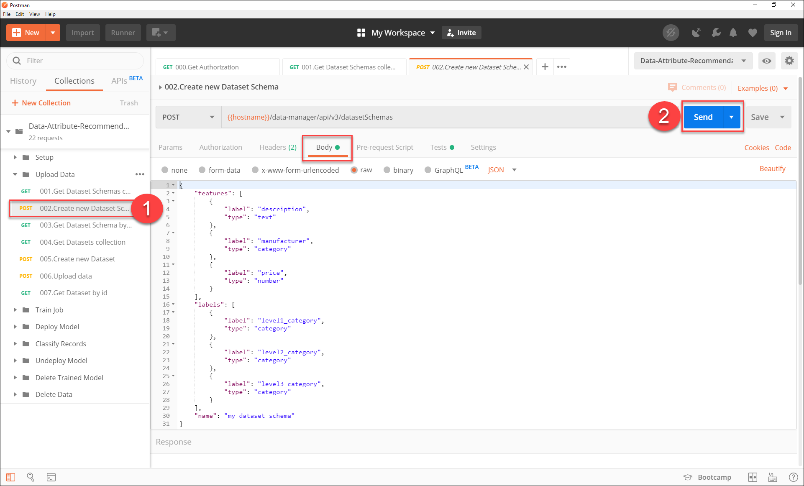

You have successfully created a dataset schema.

[DONE]
[ACCORDION-END]

[ACCORDION-BEGIN [Step 3: ](List all dataset schemas)]

To see the details of all dataset schemas that you have created, select the request `Get Datasets Schemas collection` in the folder `Upload Data`. click **Send** to send the request.

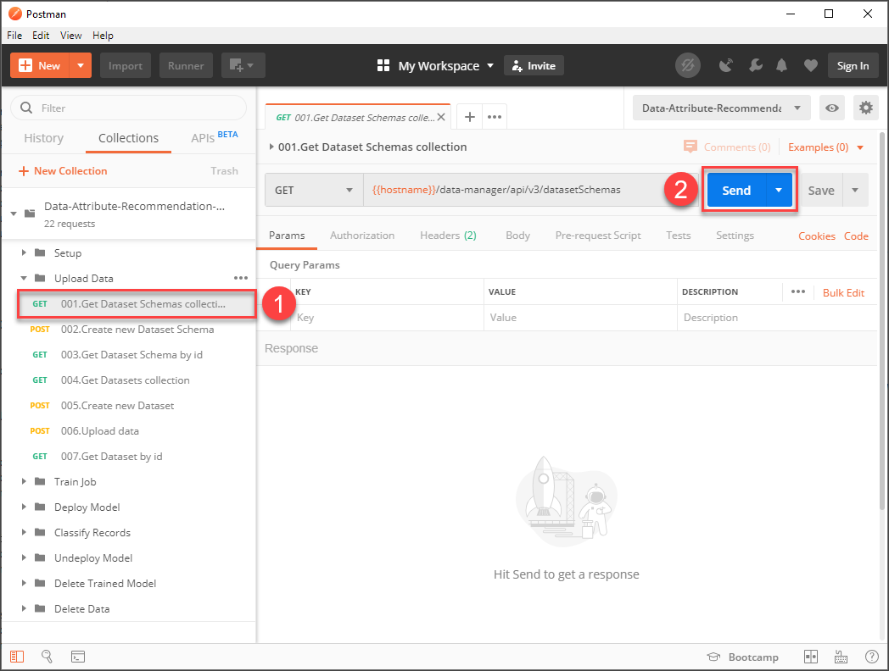

In the response, you find your newly created dataset schema plus all other schemas that you have created. For every schema, its details are listed including the name, id and features of the schema.

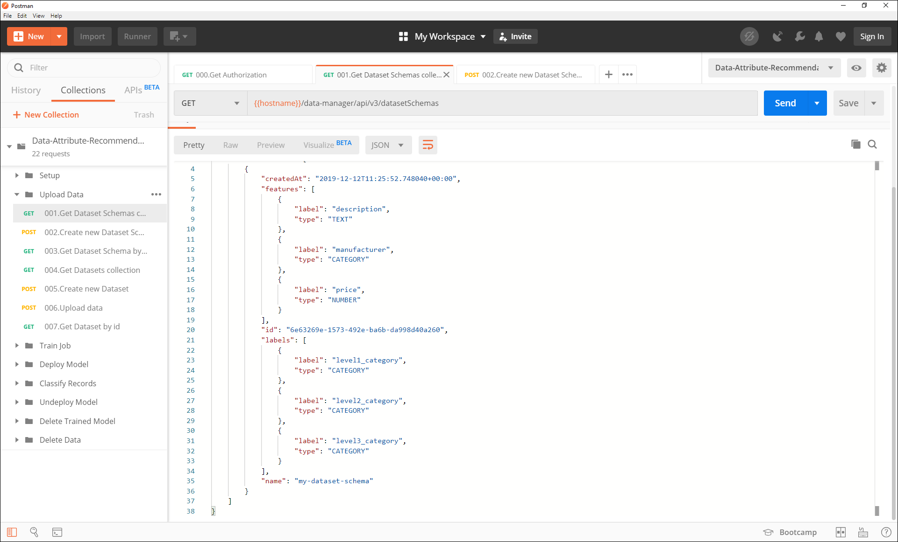

[DONE]
[ACCORDION-END]

[ACCORDION-BEGIN [Step 4: ](Create dataset)]

Next, you need to create a dataset using the dataset schema that you have created. The dataset is a table that holds the data that you will upload later.

To create a dataset, select the request `Create new Dataset` in the folder `Upload Data`. Click **Send** to send the request.

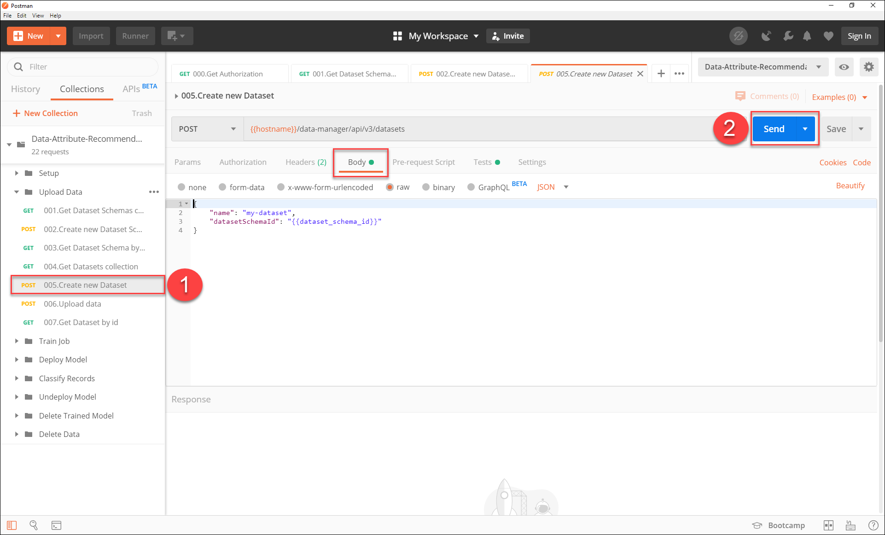

In the response, you find the details of your newly created dataset, including the current `status` of the dataset. The status is `NO_DATA` as no data file has been uploaded yet.

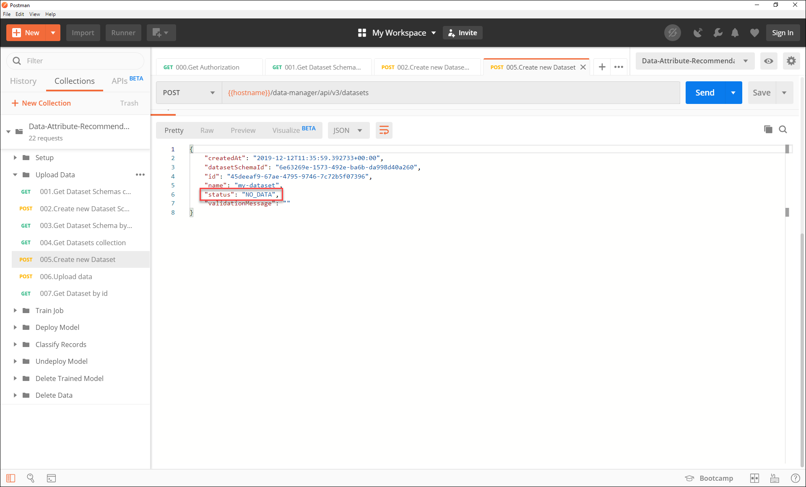

You have successfully created a dataset.

[DONE]
[ACCORDION-END]

[ACCORDION-BEGIN [Step 5: ](Upload data)]

The final step is to upload data to your dataset.

For that, use the [sample data](https://github.com/SAP-samples/data-attribute-recommendation-postman-tutorial/blob/main/Tutorial_Example_Dataset.csv) available on GitHub. **Download** the CSV file that contains the data.

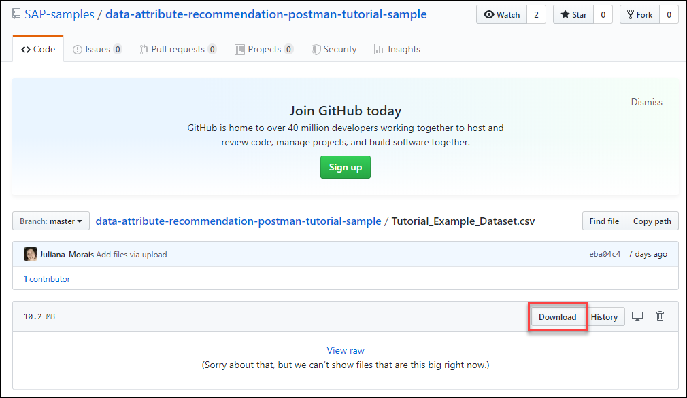

If your browser displays the data instead of downloading it, **right-click** anywhere and click **Save as...** to save the file.

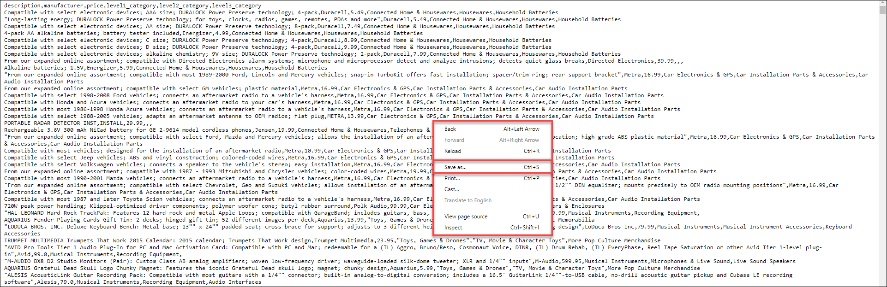

Take a moment to look at the dataset. As mentioned in step 2 the dataset contains product information as well as product categories. You might ask why the product categories are in the dataset when you actually want to predict them?

The categories are only necessary for training as the service does not know yet which product information are common for certain categories. Instead, the service will recognize patterns and establish such connections during the training process. This allows the service to make predictions for categories solely based on the product information later on.

In Postman, select the request `Upload data` in the folder `Upload Data`. Now select the tab `Body` where you can add the data. Make sure that the type `Binary` is selected and click **Select File** to upload the file that contains the data. Press **Send** to send the request.

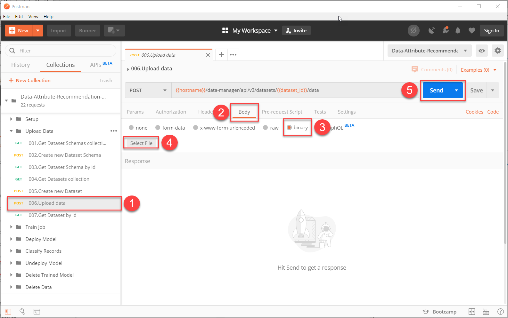

In the response, you see that the status of your dataset has changed to `VALIDATING`. The service is now validating the data that you have uploaded. When validation is done, the status will change accordingly.

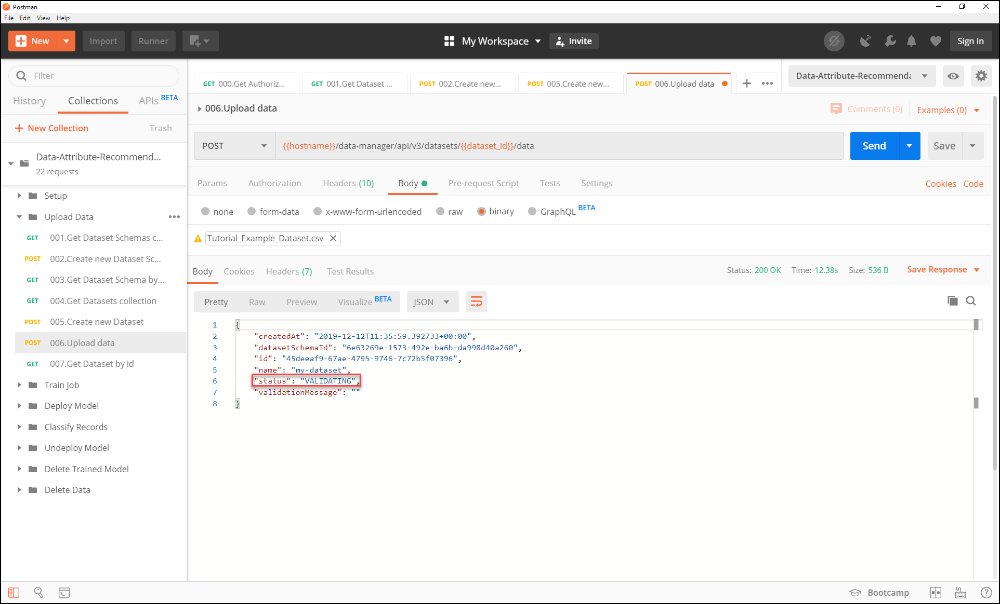

You have successfully uploaded data to your dataset.

[DONE]
[ACCORDION-END]

[ACCORDION-BEGIN [Step 6: ](See dataset status)]

To see the current status of your dataset, select the request **Get Dataset by id** in the folder `Upload Data`. Then click **Send** to send the request.

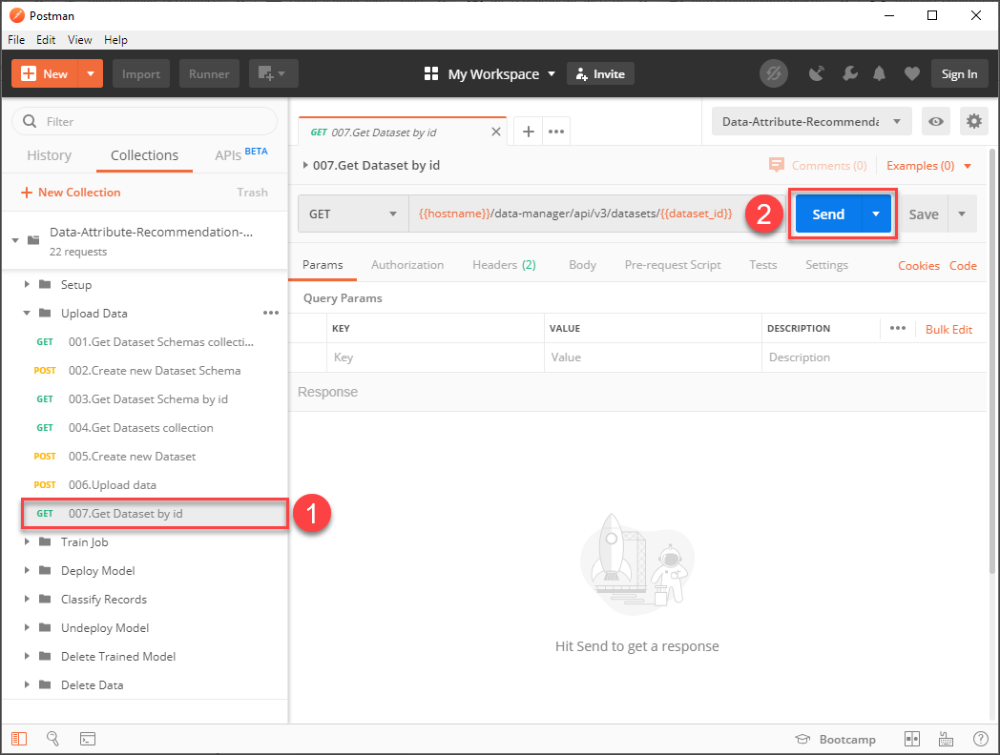

In the response, you can observe the status of your dataset. If the status is `SUCCEEDED`, your data has been validated successfully. If the status is `VALIDATING`, your data is still in the validation process. Wait a minute and then send the request again to check whether the status has changed.

Note that you will not be able to [Use Data Attribute Recommendation to Train a Machine Learning Model](cp-aibus-dar-model) until the dataset is validated and the status changes from `VALIDATING` to `SUCCEEDED`.   

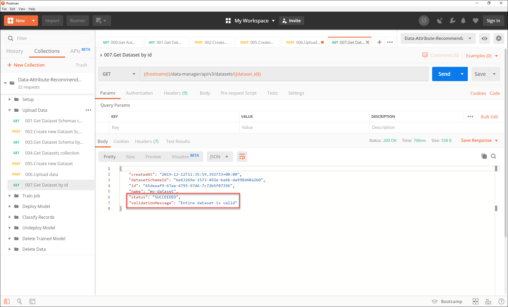

Your data is now validated and ready to be used to train a machine learning model.

[DONE]
[ACCORDION-END]

[ACCORDION-BEGIN [Step 7: ](Test yourself)]

[VALIDATE_1]
[ACCORDION-END]
