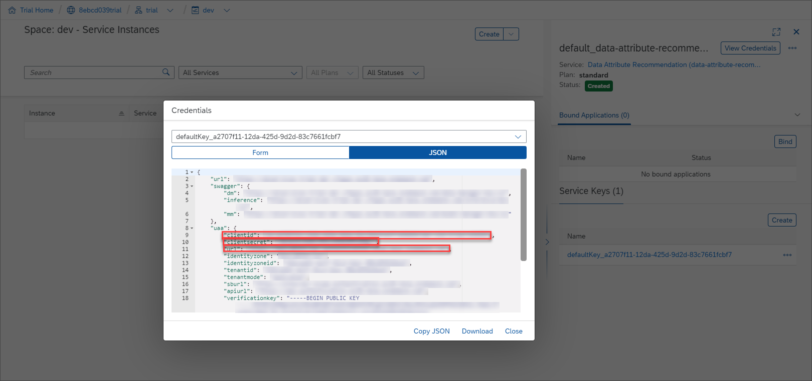
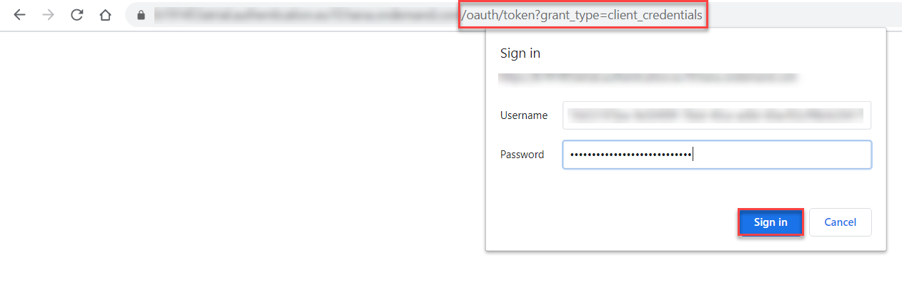

# Get OAuth Access Token for Data Attribute Recommendation via Web Browser
<!-- description --> Retrieve your OAuth access token, which will grant you access to the service APIs.

## You will learn
  - How to use your service key values to get an OAuth access token via any web browser

---

### Get OAuth access token details


To get your OAuth access token you will need the values listed below from the service key you created in the previous tutorial: [Use Free Tier to Set Up Account for Data Attribute Recommendation and Get Service Key](cp-aibus-dar-booster-free-key) or [Use Trial to Set Up Account for Data Attribute Recommendation and Get Service Key](cp-aibus-dar-booster-key).

<!-- border -->


### Get OAuth access token


1. Add **`/oauth/token?grant_type=client_credentials`** to the `url` value (from inside the `uaa` section of the service key), paste it in any web browser and choose **Enter**.

2. Enter the **`clientid`** value from your service key as **Username**.

3. Enter the **`clientsecret`** value from your service key as **Password**.

4. Click **Sign in** or **OK** (depending on the web browser you work with).

<!-- border -->

You should receive a response like the following:

```JSON
{
    "access_token": "<< your access token >>",
    "token_type": "bearer",
    "expires_in": 43199,
    "scope": "<< granted access >>",
    "jti": "<< unique identifier >>"
}
```

Once the token has been generated, make sure to copy and save it locally for easy access. The token is valid for 12 hours (43199 seconds). After that, you'll need to generate a new one.

You have successfully generated your OAuth access token for the service and you are now all set to try out Data Attribute Recommendation.

