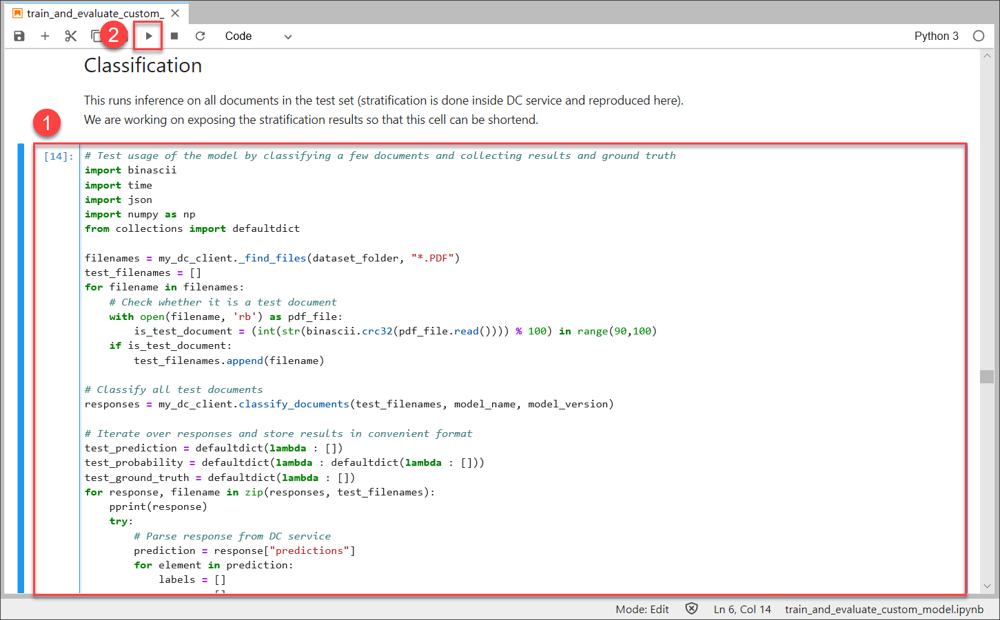
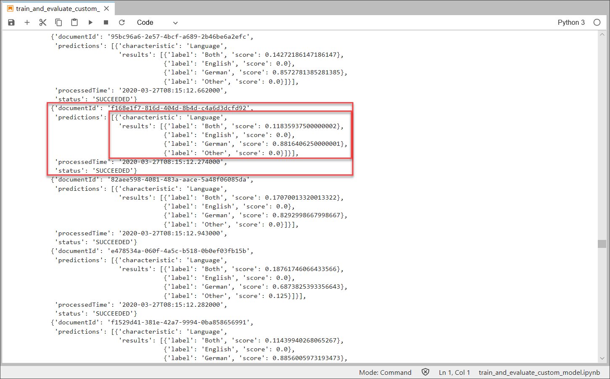
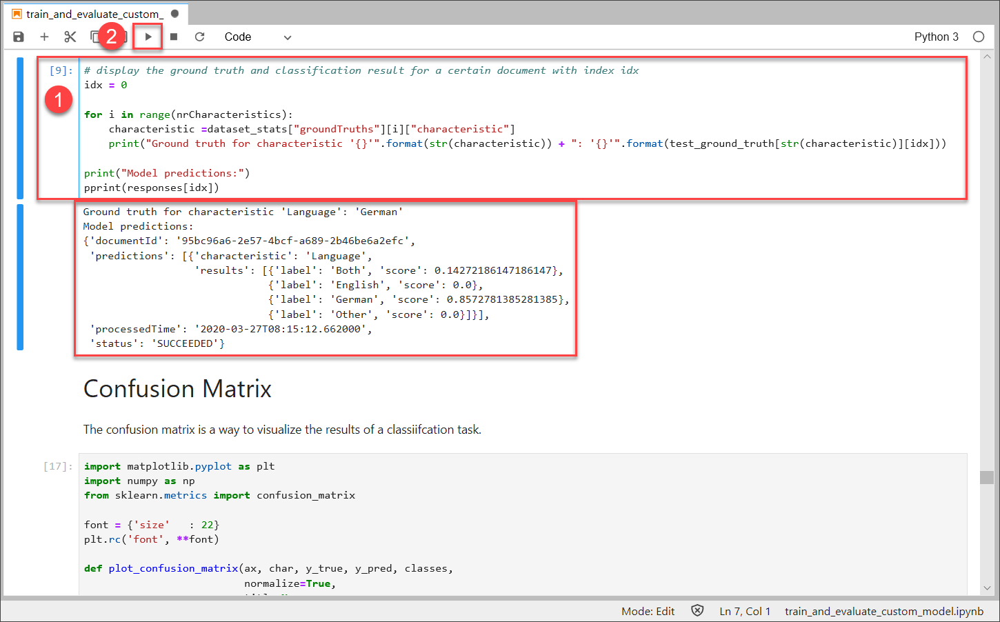
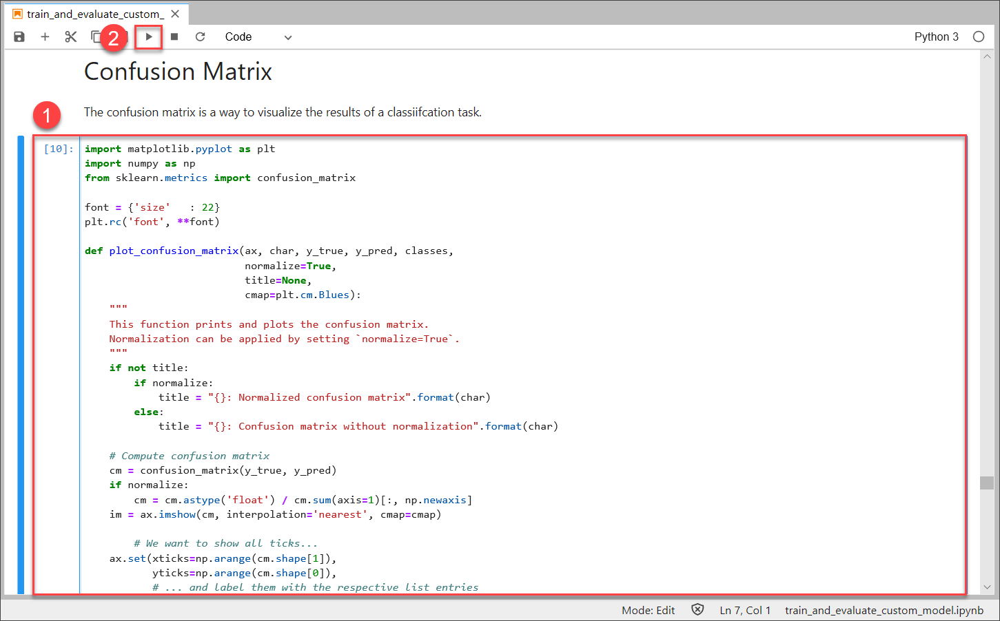
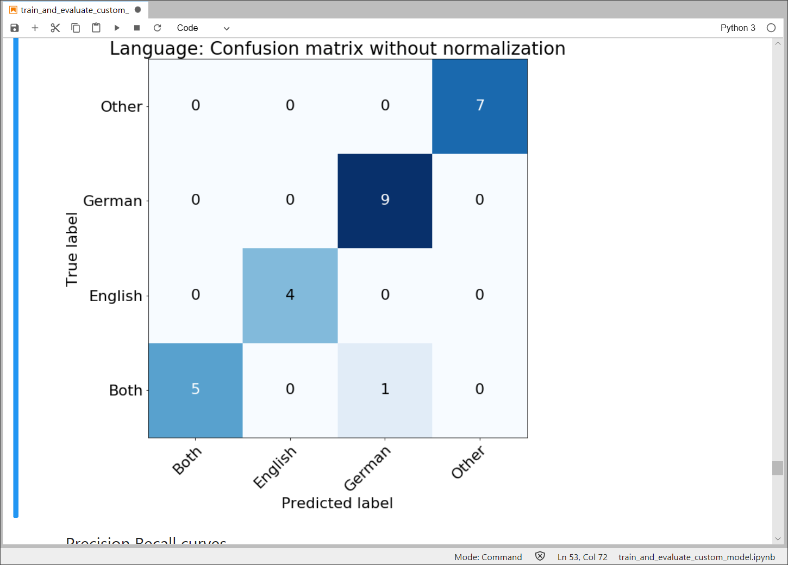

## Details
### You will learn
  - How to classify documents using your Document Classification machine learning model
  - How to evaluate the performance of your model

Based on your deployed machine learning model you can now classify documents. For more information, see [Document Classification](https://help.sap.com/viewer/ca60cd2ed44f4261a3ae500234c46f37/SHIP/en-US).

---

[ACCORDION-BEGIN [Step 1: ](Classify documents)]

As your machine learning model is now deployed it can be used to classify documents. 

Click the cell below the heading `Classification`. The below code reproduces the stratification process mentioned in the previous tutorial. The code picks out the documents that are used for testing and were not used for training the model. It will then send these documents to the service for classification. Click **Run** to start the classification.

Once the classification is done, the result for every tested document is printed as in the image below. The result includes predictions for every characteristic, in this case only `Language`. Moreover, the service assigns a probability to every possible value of that characteristic. In the highlighted example below `German` is predicted with a probability of 0.88.

[DONE]
[ACCORDION-END]

[ACCORDION-BEGIN [Step 2: ](Display the classification and ground truth)]

To actually compare the predictions with the true value, you can print out the ground truth (true value) in addition to the predictions made by the service. In this case, the ground truth is the actual language of the document.

Click the next cell and click **Run**. This prints out the ground truth and the prediction for one document.

In the example above, the ground truth for the language is `German`. The service predicted `German` with a probability of 0.85 and it was able to eliminate `English` and `Other` completely. The service only confused it with `Both` (German and English language) but only with a very small probability. In other words, the service made a very accurate prediction here.

[DONE]
[ACCORDION-END]

[ACCORDION-BEGIN [Step 3: ](Measure performance in a confusion matrix)]

Another tool to measure the overall performance of the model is the confusion matrix. The matrix shows how many documents were wrongly classified, for example, how many documents were confused into a wrong class by the service.

Click the cell below the heading `Confusion Matrix` and click **Run** to create the matrix.

The operation outputs a matrix as in the image below.

The y-axis of the matrix is labeled with the true languages of the documents whereas the x-axis is labeled with the predictions that the service made. In an ideal setting all values would lie on the diagonal as that would mean that the service predicted the true value every time. This case comes pretty close as the service only confused one document in this example. The documents true value is `Both` (English and German text) but it was classified as `German`.

Nevertheless, this is a great result and it is also reflected in the great accuracy of the model mentioned in the previous tutorial.

You have now successfully classified documents and evaluated the performance of your machine learning model. Feel free to modify this notebook to classify your own documents or to use a different dataset.

[DONE]
[ACCORDION-END]

[ACCORDION-BEGIN [Step 4: ](Test yourself)]

[VALIDATE_1]
[ACCORDION-END]
