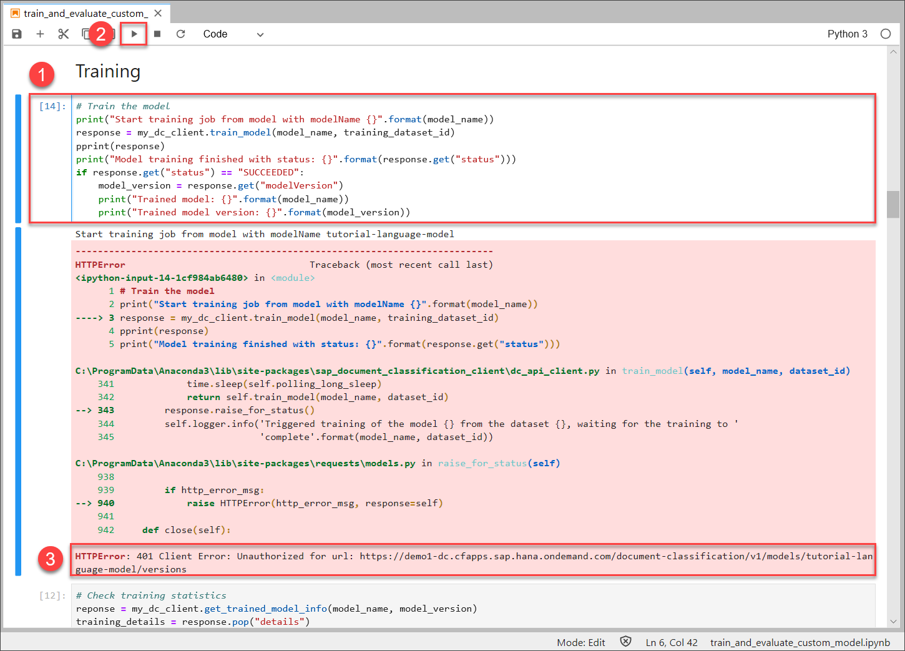
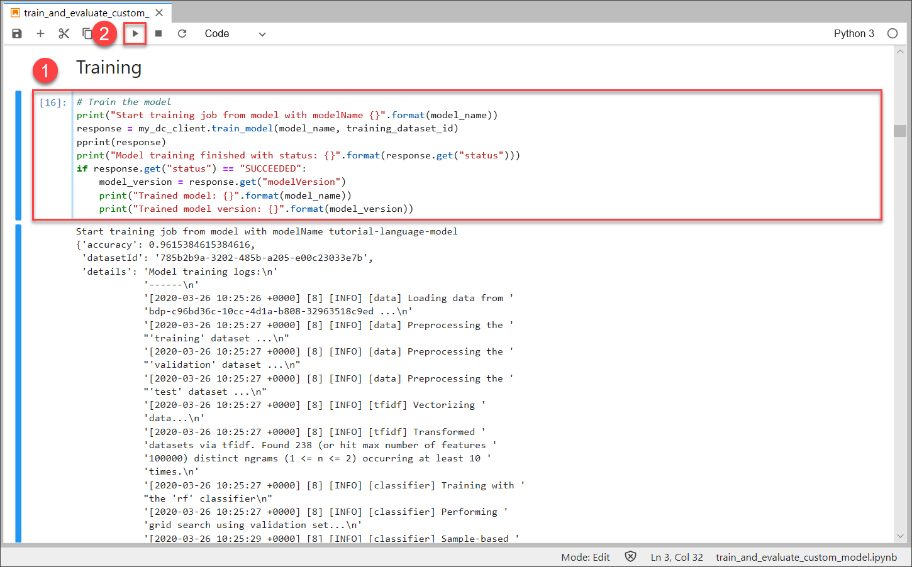
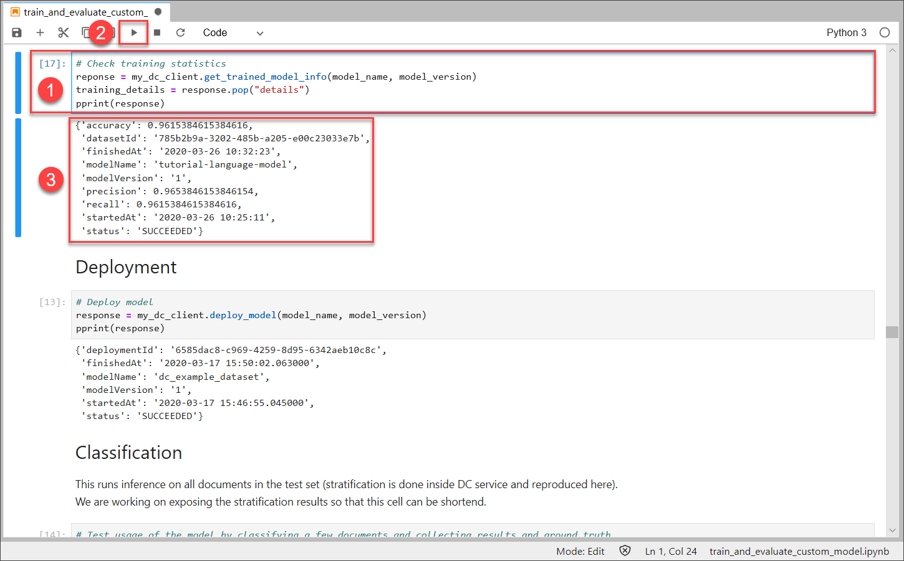
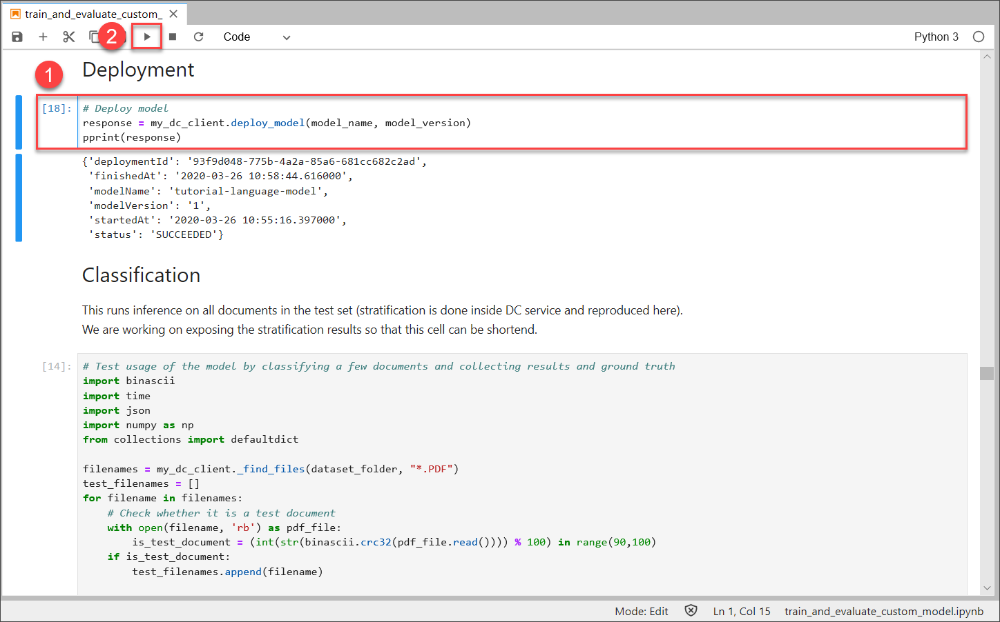

## Details
### You will learn
  - How to train a machine learning model in Document Classification
  - How to deploy a machine learning model using your Document Classification service instance

To use the data uploaded in [Upload Data to Document Classification](cp-aibus-dc-upload), it is necessary to create a training job and deploy the resulting machine learning model. For more information, see [Document Classification](https://help.sap.com/viewer/ca60cd2ed44f4261a3ae500234c46f37/SHIP/en-US).

---

[ACCORDION-BEGIN [Step 1: ](Train a machine learning model)]

Based on the uploaded data, you will now train a machine learning model. The training is essentially the process whereby the model learns and recognizes the patterns in your data. 

Click the first cell below the heading `Training` and click **Run**.

In case more than 12 hours have passed between this and the previous tutorial, you may receive an output as in the image below, saying `401 Client Error: Unauthorized`. That means your access token has expired. Please go back to the previous [tutorial](cp-aibus-dc-upload) and repeat step 3 to retrieve a new access token.

If you had to refresh your access token, click **Run** again. The training of your machine learning model has now started.

This may take about 10 to 15 minutes on average but may as well take longer. You can tell that the training is finished when a lot of output is printed. Go ahead to the next step to retrieve a condensed version of the output.

[DONE]
[ACCORDION-END]

[ACCORDION-BEGIN [Step 2: ](Inspect training statistics)]

Now you can inspect your trained machine learning model.

Scroll by all the output of the training and go to the next cell. Click **Run**. This outputs the statistics of the model as you can see in the image below.

>An important property of the model is the accuracy. The accuracy is the fraction of predictions made by the model that are correct and, thus, it is a good quality indicator. In this case you retrieve an accuracy of around 0.95. The reason for this high accuracy is that the example of language identification is not very complex.

[DONE]
[ACCORDION-END]

[ACCORDION-BEGIN [Step 3: ](Deploy a machine learning model)]

To use the trained model, you need to deploy it. Once deployed, the model is ready to classify new documents.

Click the cell below the heading `Deployment` and click **Run**. This starts the deployment of your previously trained model. The deployment may as well take some minutes.

Once the deployment is finished, the output that is printed below should say that the `status` is `SUCCEEDED`.

Now you have successfully trained and deployed a machine learning model that you can use to classify documents in the next tutorial.

[DONE]
[ACCORDION-END]

[ACCORDION-BEGIN [Step 4: ](Test yourself)]

[VALIDATE_1]
[ACCORDION-END]
