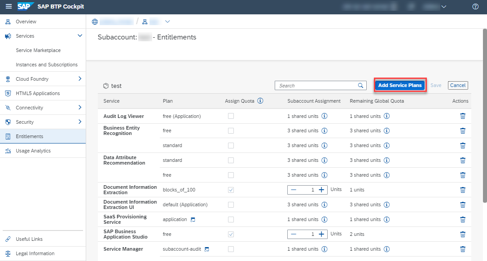
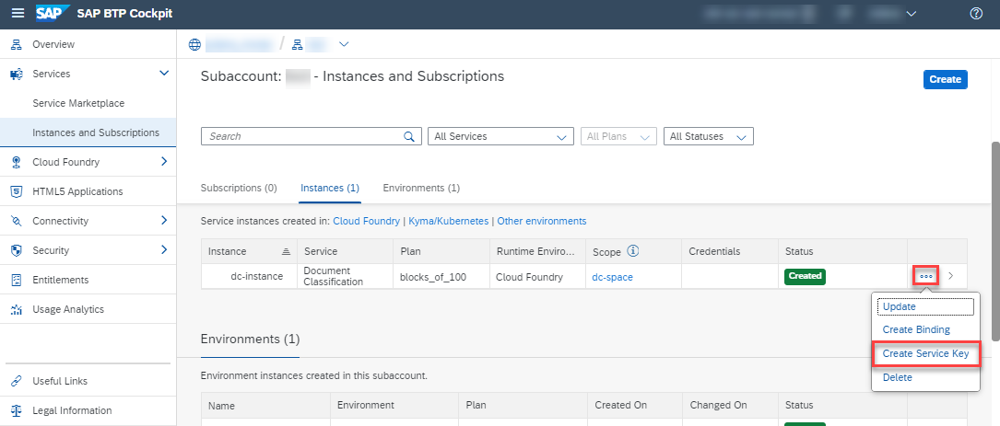

# Create Service Instance for Document Classification with Customer Account
<!-- description --> Create a service instance and the associated service key for Document Classification, one of the SAP AI Business Services, using SAP Business Technology Platform (SAP BTP).

## Prerequisites
  - You have an enterprise global account on SAP BTP.
  - You are entitled to use the service.

## You will learn
  - How to check your Document Classification entitlements
  - How to create a service instance of Document Classification
  - How to create a service key for your service instance

## Intro
This tutorial is intended for productive SAP BTP accounts. Make sure that you have an enterprise global account on SAP BTP and fulfill the prerequisites of this tutorial. If you don't have a global account yet, refer to this [guide](https://help.sap.com/viewer/65de2977205c403bbc107264b8eccf4b/Cloud/en-US/82f9ff522f754e26ae89e0cd7ec7aa11.html#loioa71a081b39e343e097046bf487f57af3).

Additionally, find details about the pricing of the Document Classification service [here](https://help.sap.com/viewer/ca60cd2ed44f4261a3ae500234c46f37/SHIP/en-US/aaab8a7b64b745b0bdba9cfaa0fd264f.html) or use the [SAP BTP estimator](https://discovery-center.cloud.sap/estimator/).

The steps outlined in this tutorial follow the [Initial Setup guide](https://help.sap.com/viewer/ca60cd2ed44f4261a3ae500234c46f37/SHIP/en-US/88bdee94c7c94bc99de8484f5c2db04a.html) of the Document Classification service.

---

### Access the SAP BTP cockpit

First, access the [SAP BTP cockpit](https://account.hana.ondemand.com/cockpit#/home/allaccounts). Here, click the tile representing your global account.

<!-- border -->

Click the tile that represents the subaccount that you'll use throughout these tutorials.

<!-- border -->

>If you don't have a subaccount or you want to create a new one, follow the procedure outlined [here](https://help.sap.com/viewer/65de2977205c403bbc107264b8eccf4b/Cloud/en-US/05280a123d3044ae97457a25b3013918.html).

### Check your entitlements

To use Document Classification, you need to make sure that your account is properly configured.

1. On the navigation side bar, click **Entitlements** to see a list of all eligible services. You are entitled to use every service in this list according to the assigned service plan.

2. Search for `Document Classification`. ***If you find the service in the list, you are entitled to use it. Now you can set this step to **Done** and proceed with Step 3.***

<!-- border -->

***ONLY if you DO NOT find the service in your list, proceed as follows:***

  1.  Click **Configure Entitlements**.

    <!-- border -->

  2.  Click **Add Service Plans**.

    <!-- border -->

  3.  In the dialog, select `Document Classification` and choose the `blocks_of_100` service plan. Click **Add 1 Service Plan**.

    <!-- border -->

  4.  Click **Save** to save your entitlement changes.

    <!-- border -->

You are now entitled to use Document Classification and create instances of the service.

### Access service via Service Marketplace

The Service Marketplace is where you find all the services available on SAP BTP.

  1.  To access it, click **Service Marketplace** on the navigation side bar.

    <!-- border -->

  2.  Next, search for **Document Classification** and click the tile to access the service.

    <!-- border -->

### Create service instance

Next, you will create an instance of the Document Classification service.

Click **Instances** on the navigation side bar and then click **New Instance** to start the creation dialog.

<!-- border -->

In the dialog, choose the `blocks_of_100` service plan. Enter a name for your new instance, for example, `dc-instance` and click **Create Instance**.

<!-- border -->

In the following dialog, click on **View Instance** to be navigated to the list of your service instances.

<!-- border -->

You have successfully created a service instance for Document Classification.

### Create service key

You are now able to create a service key for your new service instance. Service keys are used to generate credentials to enable apps to access and communicate with the service instance.

  1. Click the dots to open the menu and select **Create Service Key**.

      <!-- border -->

  2. In the dialog, enter `dc-service-key` as the name of your service key. Click **Create** to create the service key.

      <!-- border -->

You have successfully created a service key for your service instance. You can now view the service key in the browser or download it.

<!-- border -->

You will need the service key values in the next tutorial.

