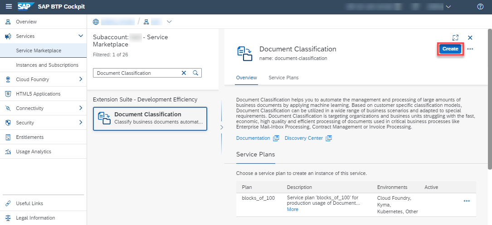

## Prerequisites
  - SAP Cloud Platform global account
  - CPEA (Cloud Platform Enterprise Agreement) license

## Details
### You will learn
  - How to check your Document Classification entitlements
  - How to create a service instance of Document Classification
  - How to create service keys for your service instance

This tutorial is intended for productive SAP Cloud Platform accounts. Make sure that you have an SAP Cloud Platform global account and fulfill the prerequisites of this tutorial. If you don't have a global account yet, refer to this [guide](https://help.sap.com/viewer/65de2977205c403bbc107264b8eccf4b/Cloud/en-US/82f9ff522f754e26ae89e0cd7ec7aa11.html#loioa71a081b39e343e097046bf487f57af3).

Additionally, find details about the pricing of the Document Classification service [here](https://help.sap.com/viewer/ca60cd2ed44f4261a3ae500234c46f37/SHIP/en-US/aaab8a7b64b745b0bdba9cfaa0fd264f.html) or use the [SAP Cloud Platform estimator](https://www.sap.com/products/cloud-platform/pricing/estimator-tool.html).

The steps outlined in this tutorial follow the [Initial Setup guide](https://help.sap.com/viewer/ca60cd2ed44f4261a3ae500234c46f37/SHIP/en-US/88bdee94c7c94bc99de8484f5c2db04a.html) of the Document Classification service.

---

[ACCORDION-BEGIN [Step 1: ](Access the SAP Cloud Platform cockpit)]

First, access the [SAP Cloud Platform cockpit](https://account.hana.ondemand.com/cockpit#/home/allaccounts). Here, click on the tile representing your global account.

Next, access your subaccount that will be used throughout the tutorial. Therefore, click **Subaccounts** on the navigation side bar and then select the tile that represents the subaccount that shall be used throughout these tutorials.

>If you don't have a subaccount or you want to create a new one, follow the procedure outlined [here](https://help.sap.com/viewer/65de2977205c403bbc107264b8eccf4b/Cloud/en-US/05280a123d3044ae97457a25b3013918.html).

[DONE]
[ACCORDION-END] 

[ACCORDION-BEGIN [Step 2: ](Check your entitlements)]

To use Document Classification, you need to make sure that your subaccount is entitled to use the service.

Click **Entitlements** on the navigation side bar and search for `Document Classification` in your list of entitlements. If you find the service in the list, proceed with the next step.

In case you do not find the service in the list, proceed as follows:

  1.  Click **Configure Entitlements**.

    

  2.  Click **Add Service Plans**.

    

  3.  In the dialog, select `Document Classification` and choose the default service plan. Click **Add 1 Service Plan**.

    

  4.  Click **Save** to save your entitlement changes.

    

You are now entitled to use Document Classification and create instances of the service.

[DONE]
[ACCORDION-END]

[ACCORDION-BEGIN [Step 3: ](Access your space)]

Now that your subaccount is properly configured, you can access your space.

A space is essentially the place where all applications and services live and, thus, the place where your service instance of Document Classification will be deployed.

Click **Spaces** on the navigation side bar and select the tile that represents the space that shall be used throughout these tutorials.

>If you don't have a space yet or you want to create a new one, follow the procedure outlined [here](https://help.sap.com/viewer/65de2977205c403bbc107264b8eccf4b/Cloud/en-US/2f6ed22ccf424dae84345f4500c2d8ea.html). Once the space is created, access it.

[DONE]
[ACCORDION-END]

[ACCORDION-BEGIN [Step 4: ](Access service via Service Marketplace)]

The Service Marketplace is where you find all the services available on SAP Cloud Platform.

  1.  To access it, click **Service Marketplace** on the navigation side bar.

    

  2.  Next, search for **Document Classification** and click the tile to access the service.

    

[DONE]
[ACCORDION-END]

[ACCORDION-BEGIN [Step 5: ](Create service instance)]

Next, you will create an instance of the Document Classification service.

Click **Instances** on the navigation side bar and then click **New Instance** to start the creation dialog.

In the dialog, proceed as follows:

  1. Leave the default value for the service plan and click **Next**.

    

  2.  Leave the parameters empty and click **Next**.

  3.  Do not assign any application and click **Next**.

  4.  Enter a name for your new instance, such as `dc-instance`. Click **Finish** to create the instance.

    

You have successfully created a service instance for Document Classification.

[DONE]
[ACCORDION-END]

[ACCORDION-BEGIN [Step 6: ](Create service keys)]

The last step before you can finally use the service is to create service keys for your newly created service instance.

Therefore, access your service instance by clicking on its name.

Then, select **Service Keys** on the navigation side bar and click **Create Service Key** to start the creation dialog.

In the dialog, proceed as follows:

  1.  Enter `dc-service-key` as the name for your service key. Leave the Configuration Parameters (JSON) box empty

  2.  Click **Save** to create the service keys.

    

You have successfully created a service key for your service instance. Make a local copy of the service key. You will need the service key values in the following tutorials.

[VALIDATE_1]
[ACCORDION-END]
