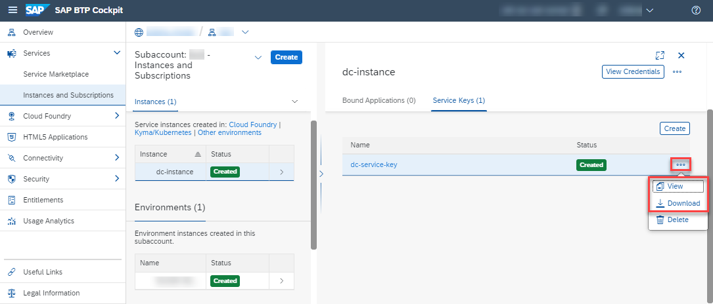

## Prerequisites
  - You have an enterprise global account on SAP BTP.
  - You are entitled to use the service.

## Details
### You will learn
  - How to check your Document Classification entitlements
  - How to create a service instance of Document Classification
  - How to create a service key for your service instance

This tutorial is intended for productive SAP BTP accounts. Make sure that you have an enterprise global account on SAP BTP and fulfill the prerequisites of this tutorial. If you don't have a global account yet, refer to this [guide](https://help.sap.com/viewer/65de2977205c403bbc107264b8eccf4b/Cloud/en-US/82f9ff522f754e26ae89e0cd7ec7aa11.html#loioa71a081b39e343e097046bf487f57af3).

Additionally, find details about the pricing of the Document Classification service [here](https://help.sap.com/viewer/ca60cd2ed44f4261a3ae500234c46f37/SHIP/en-US/aaab8a7b64b745b0bdba9cfaa0fd264f.html) or use the [SAP BTP estimator](https://www.sap.com/products/cloud-platform/pricing/estimator-tool.html).

The steps outlined in this tutorial follow the [Initial Setup guide](https://help.sap.com/viewer/ca60cd2ed44f4261a3ae500234c46f37/SHIP/en-US/88bdee94c7c94bc99de8484f5c2db04a.html) of the Document Classification service.

---

[ACCORDION-BEGIN [Step 1: ](Access the SAP BTP cockpit)]

First, access the [SAP BTP cockpit](https://account.hana.ondemand.com/cockpit#/home/allaccounts). Here, click on the tile representing your global account.

Next, access your subaccount that will be used throughout the tutorial. Therefore, click **Subaccounts** on the navigation side bar and then select the tile that represents the subaccount that shall be used throughout these tutorials. 

>If you don't have a subaccount or you want to create a new one, follow the procedure outlined [here](https://help.sap.com/viewer/65de2977205c403bbc107264b8eccf4b/Cloud/en-US/05280a123d3044ae97457a25b3013918.html).

[DONE]
[ACCORDION-END]

[ACCORDION-BEGIN [Step 2: ](Check your entitlements)]

To use Document Classification, you need to make sure that your account is properly configured.

1. On the navigation side bar, click **Entitlements** to see a list of all eligible services. You are entitled to use every service in this list according to the assigned service plan.

2. Search for `Document Classification`. ***If you find the service in the list, you are entitled to use it. Now you can set this step to **Done** and proceed with Step 3.***

***ONLY if you DO NOT find the service in your list, proceed as follows:***

  1.  Click **Configure Entitlements**.

    

  2.  Click **Add Service Plans**.

    

  3.  In the dialog, select `Document Classification` and choose the default service plan. Click **Add 1 Service Plan**.

    

  4.  Click **Save** to save your entitlement changes.

    

You are now entitled to use Document Classification and create instances of the service.

[DONE]
[ACCORDION-END]

[ACCORDION-BEGIN [Step 3: ](Access your space)]

Now that your subaccount is properly configured, you can access your space.

A space is essentially the place where all applications and services live and, thus, the place where your service instance of Document Classification will be deployed.

Click **Spaces** on the navigation side bar and select the tile that represents the space that shall be used throughout these tutorials.

>If you don't have a space yet or you want to create a new one, follow the procedure outlined [here](https://help.sap.com/viewer/65de2977205c403bbc107264b8eccf4b/Cloud/en-US/2f6ed22ccf424dae84345f4500c2d8ea.html). Once the space is created, access it.

[DONE]
[ACCORDION-END]

[ACCORDION-BEGIN [Step 4: ](Access service via Service Marketplace)]

The Service Marketplace is where you find all the services available on SAP BTP.

  1.  To access it, click **Service Marketplace** on the navigation side bar.

    

  2.  Next, search for **Document Classification** and click the tile to access the service.

    

[DONE]
[ACCORDION-END]

[ACCORDION-BEGIN [Step 5: ](Create service instance)]

Next, you will create an instance of the Document Classification service.

Click **Instances** on the navigation side bar and then click **New Instance** to start the creation dialog.

In the dialog, leave the default value for the service and the service plan. Enter a name for your new instance as `dc-instance` and click **Create Instance** to skip the other steps and create the instance.

In the following dialog, click on **View Instance** to be navigated to the list of your service instances.

You have successfully created a service instance for Document Classification.

[DONE]
[ACCORDION-END]

[ACCORDION-BEGIN [Step 6: ](Create service key)]

You are now able to create a service key for your new service instance. Service keys are used to generate credentials to enable apps to access and communicate with the service instance.

  1. Click the navigation arrow to open the details of your service instance. Then, click the dots to open the menu and select **Create Service Key**.

      

  2. In the dialog, enter `dc-service-key` as the name of your service key. Click **Create** to create the service key.

      

You have successfully created a service key for your service instance. You can now either view the service key in the browser or download it.

You will need the service key values in the next tutorial.

[VALIDATE_1]
[ACCORDION-END]
