## Details
### You will learn
  - How to check your Document Classification entitlements
  - How to create a service instance of Document Classification
  - How to create service keys for your service instance

---

[ACCORDION-BEGIN [Step 1: ](Enter your trial account)]

Access the [SAP Cloud Platform Cockpit](https://cockpit.hanatrial.ondemand.com/cockpit/#/home/trial) and login if necessary. Click **Enter Your Trial Account** to access your global account created in [Get a Free Trial Account on SAP Cloud Platform](hcp-create-trial-account).

On the navigation side bar, click **Subaccounts** and select your **trial** subaccount.

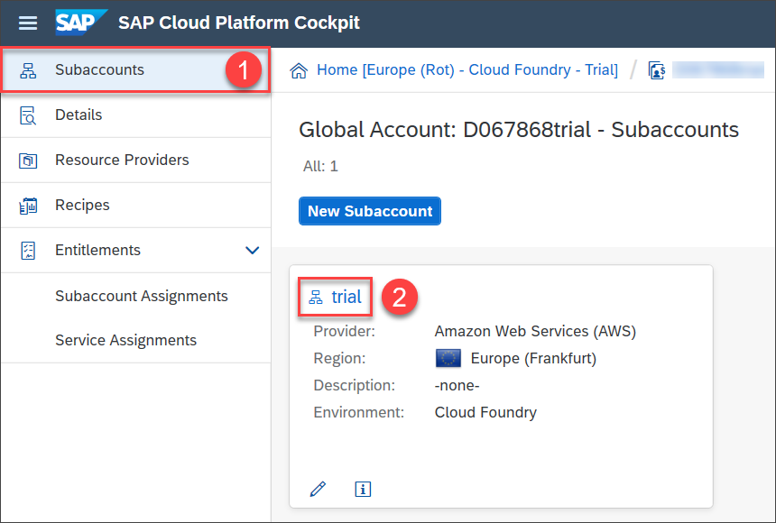

[DONE]
[ACCORDION-END]

[ACCORDION-BEGIN [Step 2: ](Check entitlements)]

To use Document Classification, you need to make sure that your account is properly configured.

On the navigation side bar, click **Entitlements** to see a list of all eligible services. You are entitled to use every service in this list according to the assigned service plan.

Search for **Document Classification Trial**. If you find the service in the list, you are entitled to use it. Now you can set this step to **Done** and proceed with Step 3.

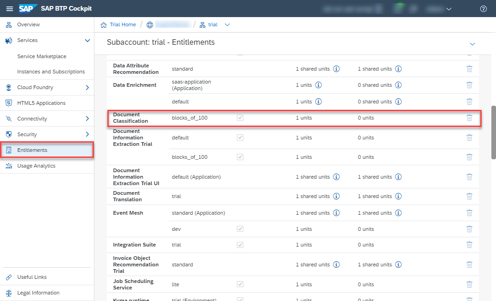

If you do not find the service in your list, proceed as follows:

  1. Click **Configure Entitlements**.

    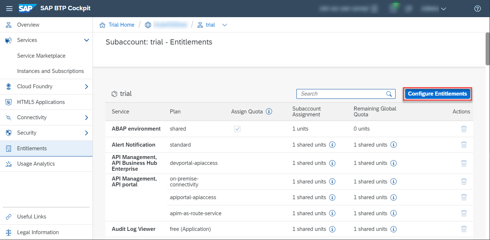

  2. Click **Add Service Plans** to add service plans to your entitlements.

    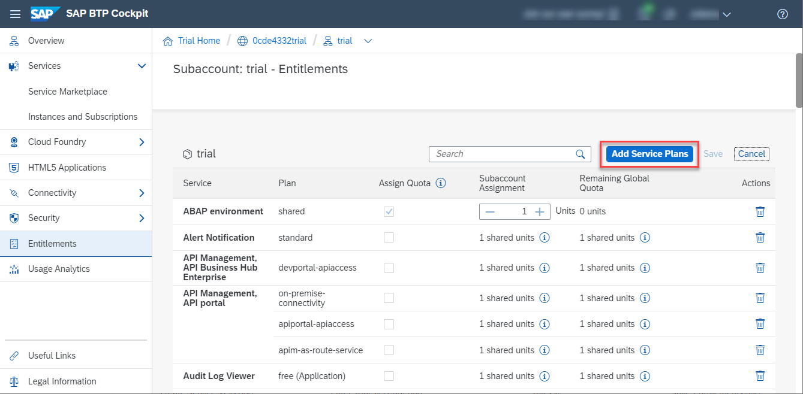

  3. Select **Document Classification Trial**, and choose the **default** service plan. Click **Add 1 Service Plan**.

    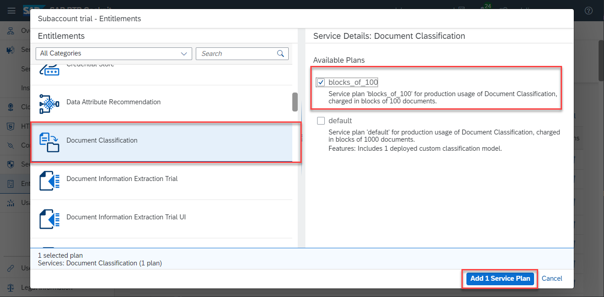

  4. **Save** your entitlement changes.

    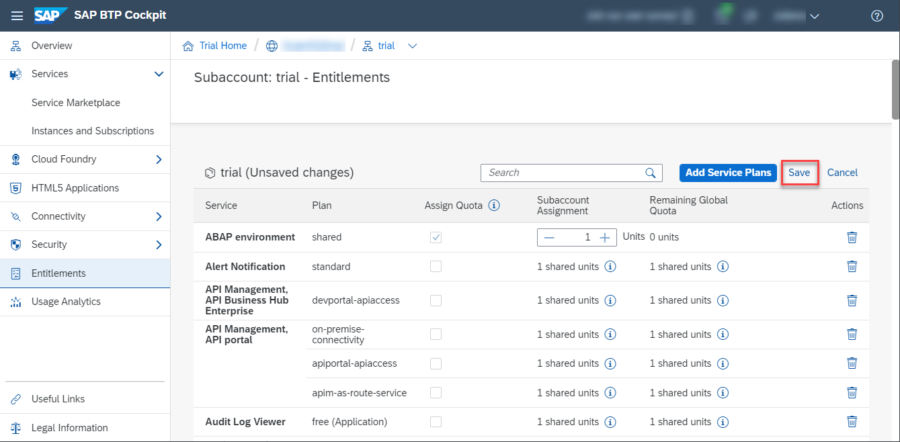

You are now entitled to use the service and to create instances of the service.

[DONE]
[ACCORDION-END]

[ACCORDION-BEGIN [Step 3: ](Access your space)]

All applications and services live in spaces. By default, trial accounts only have the **dev** space available.

To access your spaces, click **Spaces** on the navigation side bar and select the **dev** space to open it.

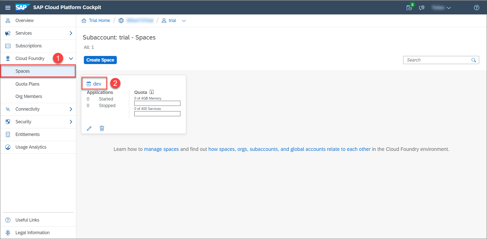

In this space you will create your service instance.

[DONE]
[ACCORDION-END]

[ACCORDION-BEGIN [Step 4: ](Access service via Service Marketplace)]

The **Service Marketplace** is where you find the available services on SAP Cloud Platform.

To access it, click **Service Marketplace** on the navigation side bar.

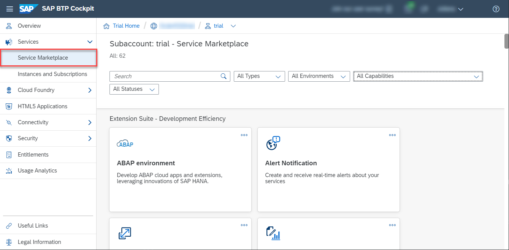

Next, search for **Document Classification**. Click the tile to access the service.

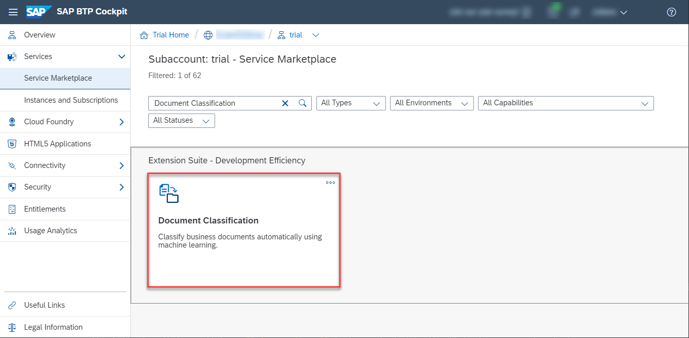

[DONE]
[ACCORDION-END]

[ACCORDION-BEGIN [Step 5: ](Create service instance)]

You will now create an instance of your service.

To create an instance, click **Instances** on the navigation side bar.

Next, click **New Instance** to start the creation dialog.

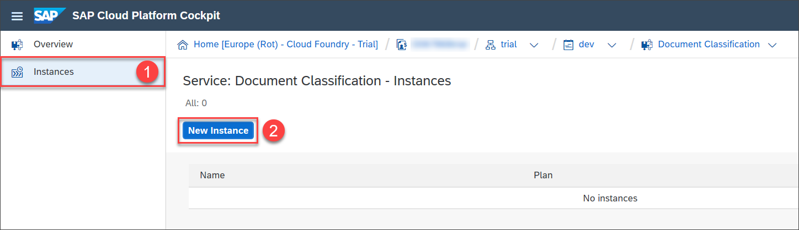

  1. In the dialog, leave the default value for the service plan and click **Next**.

    

  2. Leave the parameters empty and click **Next**.

  3. Do not assign any application and click **Next**.

  4. Finally, enter the name `dc-inst` for your new instance. Click **Finish** to create the instance.

    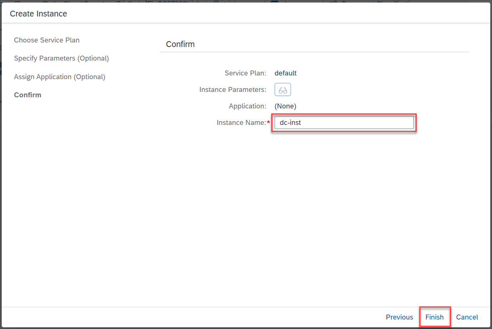

You have successfully created a service instance for Document Classification.

[DONE]
[ACCORDION-END]

[ACCORDION-BEGIN [Step 6: ](Create service keys)]

Finally, you are now able to create service keys for your new service instance. Service keys are used to generate credentials to enable apps to access and communicate with the service instance.

To create service keys, first access your service instance by clicking its name.

Now select **Service Keys** on the navigation side bar. Then click **Create Service Key** to start the creation dialog.

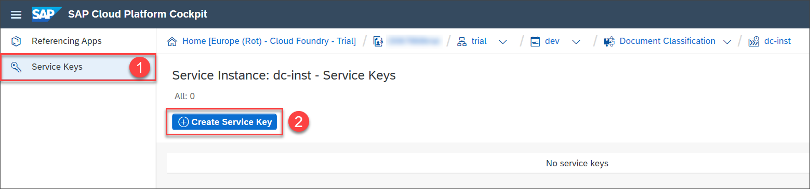

In the dialog, enter the name `dc-key` for your service key. Leave empty the "Configuration Parameters (JSON)" box. Click **Save** to create the service keys.

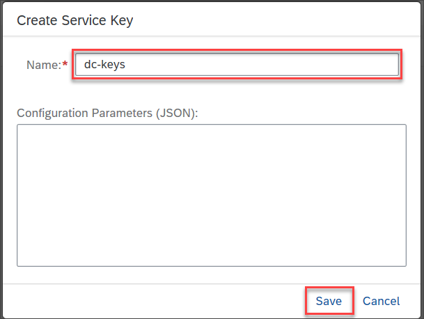

You have successfully created service keys for your service instance. Make a local copy of the service keys. You will need the service keys values in the next tutorial.

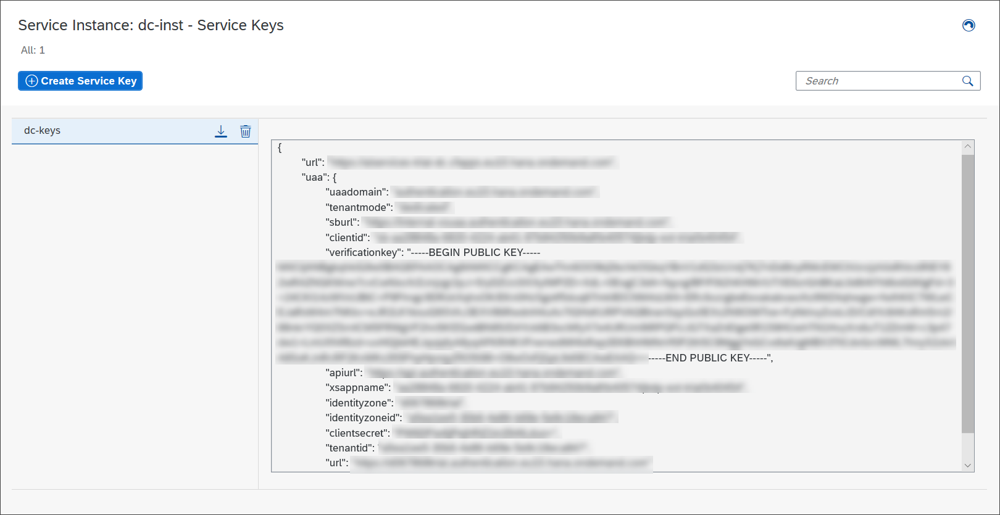

[DONE]
[ACCORDION-END]

[ACCORDION-BEGIN [Step 7: ](List your service instance)]

To list and access your service instances, there is no need to access the service via the Service Marketplace every time. In your **Space** you can see a list of all your service instances.

**Go back** to your **dev** space using the breadcrumbs at the top of the page.

As you navigate through the SAP Cloud Platform Cockpit and dig into more detail the breadcrumbs at the top of the page show you the hierarchy of your navigation. You can use them to go back to previous steps.

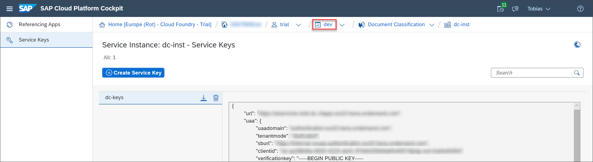

Back in your space, click **Service Instances** on the navigation side bar.

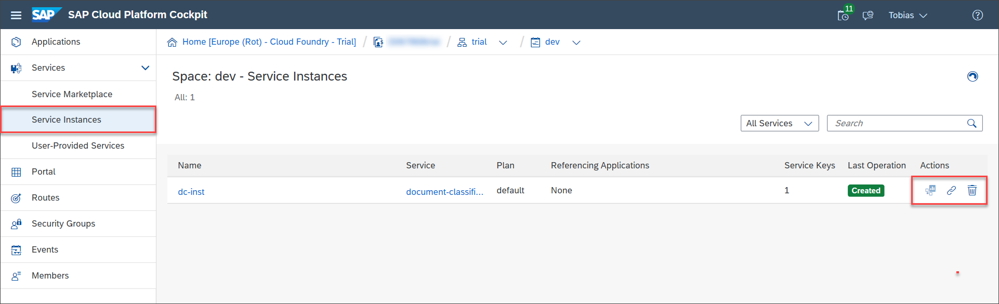

The list shows all your service instances across all services, including the service instance you have just created. You find here information on the service plan, referencing applications, created service keys and the current status of your instances. From here, you can manage your service instances, access or delete them, for example.

[DONE]
[ACCORDION-END]

[ACCORDION-BEGIN [Step 8: ](Validate your service keys)]

In the text area below, paste the `tenantmode` value from the service keys you created for your service instance, then click **Submit Answer**.

[VALIDATE_1]
[ACCORDION-END]
