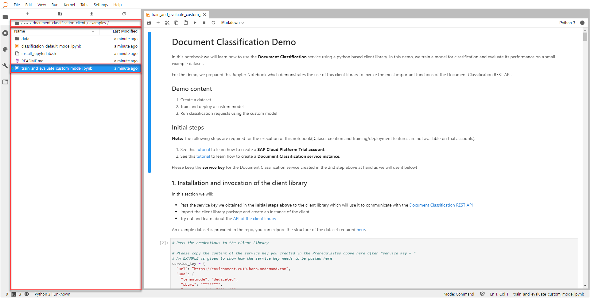

## Details
### You will learn
  - How to install Python and Anaconda
  - How to set up a local JupyterLab instance

In order to give you a head start, a client library for the Document Classification service is available. The library already has all necessary operations implemented and ready to use, like, for example, `Creating a Dataset` and `Training a Model`. The client library can be found [here](https://github.com/SAP/business-document-processing).

Additionally, a Jupyter Notebook is used in the following tutorials to make the steps interactive and easy to follow. For more information on Jupyter Notebooks, see [Jupyter](https://jupyter.org/). The notebook that was created for this tutorial mission is also available in the client library repository.

---

[ACCORDION-BEGIN [Step 1: ](Install Anaconda)]

First, you need to install Anaconda. Anaconda is a platform that offers tools to process large datasets and is often used by data scientists. When installing Anaconda, the programming language Python is installed as well.

If you are on Linux, there is a script available for the installation of Anaconda [here](https://github.com/SAP/business-document-processing/blob/main/examples/install_jupyterlab.sh). The first three commands are necessary to install Anaconda whereas the other commands are used in the following step of this tutorial.

If you are on a different operating system or the script does not work for you, head over to the [Anaconda installation guide](https://docs.anaconda.com/anaconda/install/) and look for your operating system. Once there, follow the installation guide.

[OPTION BEGIN [Windows]]

To verify the installation, search for `Anaconda Prompt` in your programs and open it. In the command prompt, enter `conda --version` and the version is printed as in the image below.

[OPTION END]

[OPTION BEGIN [Mac and Linux]]

To verify the installation, open a new Terminal or Command Prompt. In the command prompt, enter `conda --version` and the version is printed as in the image below.

[OPTION END]


You have successfully installed Anaconda.

[DONE]
[ACCORDION-END]


[ACCORDION-BEGIN [Step 2: ](Start a JupyterLab server)]

As mentioned before, you now need to execute the other commands of the [script](https://github.com/SAP/business-document-processing/blob/main/examples/install_jupyterlab.sh).

[OPTION BEGIN [Windows]]

Open the `Anaconda Prompt` again and copy the commands from line 7 to line 10 into the command prompt. Anaconda will now install [JupyterLab](https://jupyterlab.readthedocs.io/en/stable/) which is a user interface that enables you to work with Jupyter Notebooks.

[OPTION END]

[OPTION BEGIN [Mac and Linux]]

Open a Terminal or Command Prompt again and copy the commands from line 7 to line 10 into the command prompt. Anaconda will now install [JupyterLab](https://jupyterlab.readthedocs.io/en/stable/) which is a user interface that enables you to work with Jupyter Notebooks.

[OPTION END]

Once the installation is done, enter `jupyter lab` to start JupyterLab. Once you started JupyterLab, the browser automatically opens the respective web page. Additionally, you can find the URLs in the output in the command prompt as you can see in the image below.


You have successfully installed a local instance of JupyterLab and you are now able to work with Jupyter Notebooks.

[DONE]
[ACCORDION-END]


[ACCORDION-BEGIN [Step 3: ](Open the Jupyter Notebook)]

As everything is installed now, you can open the Jupyter Notebook that is used in the following tutorials. Therefore, you are going to clone the [repository](https://github.com/SAP/business-document-processing) that includes the notebook and the example dataset.

Open JupyterLab in your browser, using the URL from the command prompt from the previous step. Once opened, click the tile under the heading `Notebook` to open an empty notebook.

>Alternatively, you can click **File** > **New** > **Notebook** to open an empty notebook.


In the notebook, click into the first cell and enter the following command:

```
!git clone https://github.com/SAP/business-document-processing.git
```

Then click **Run**. This command clones the repository.


Once everything is done, a folder appears on the left named `document-classification-client`. This folder is the cloned repository.

Now navigate into the folder `document-classification-client` > `examples` using the navigation pane on the left. In this folder the actual notebook, called `train_and_evaluate_custom_model.ipynb`, is located. Open the notebook by double-clicking it. The content of the notebook will now appear on the right side of the page.



[DONE]
[ACCORDION-END]


[ACCORDION-BEGIN [Step 4: ](What is a Jupyter Notebook)]

Jupyter Notebooks are interactive playgrounds to code and are often used in data science to explore datasets.

Notebooks contain a number of cells in a sequence whereas each cell mainly contains text or code but can also output diagrams and graphics.

Throughout this tutorial mission, you walk through the notebook and explore the capabilities of the Document Classification service as well as understand the capabilities of Jupyter Notebooks.


[DONE]
[ACCORDION-END]


[ACCORDION-BEGIN [Step 6: ](Test yourself)]

[VALIDATE_1]
[ACCORDION-END]
