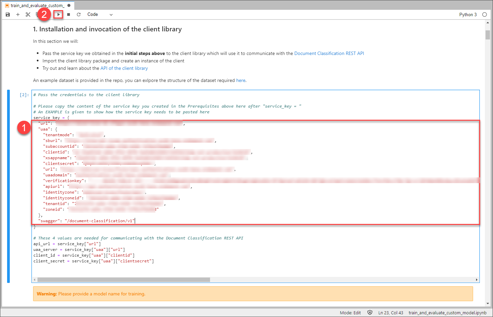
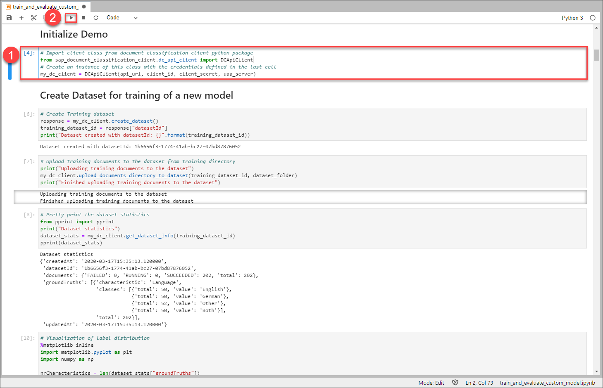
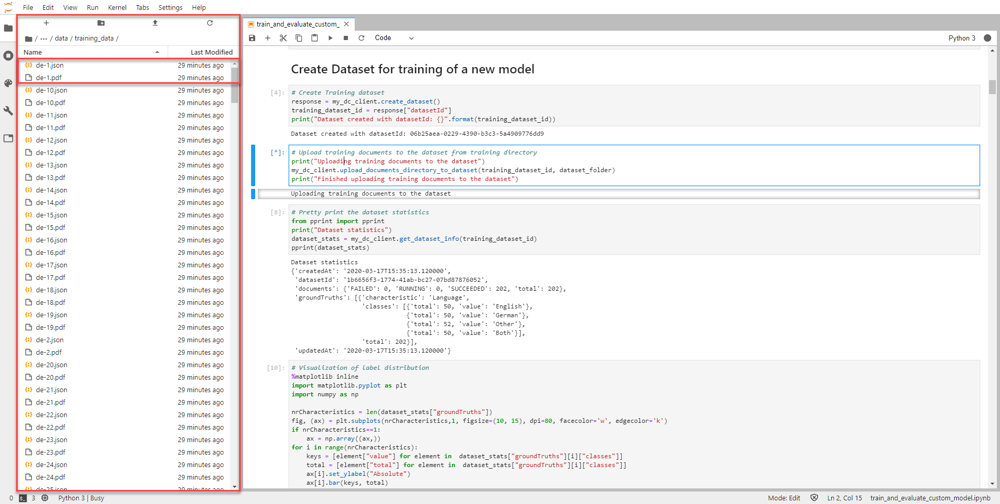
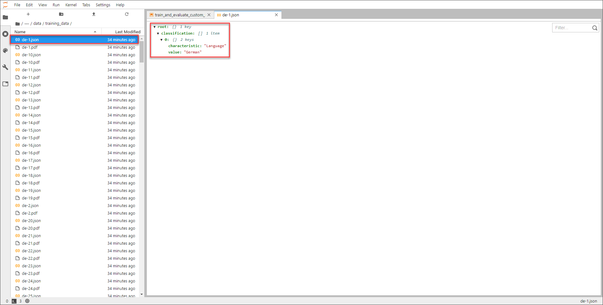

## Details
### You will learn
  - How to install the client library for Document Classification
  - How to generate an authentication token
  - How to create a dataset and upload data to your Document Classification service instance

To try out Document Classification, the first step is to upload data that will be used to train a machine learning model. For more information, see [Document Classification](https://help.sap.com/viewer/ca60cd2ed44f4261a3ae500234c46f37/SHIP/en-US).

---

[ACCORDION-BEGIN [Step 1: ](Install the library and the dataset)]

To get started, make sure to have your local JupyterLab instance running.

[OPTION BEGIN [Windows]]

To start it, open the `Anaconda Prompt` from your programs and enter `jupyter lab`. Then the browser opens the web page automatically. Otherwise you can use the URLs that are printed in the console.

[OPTION END]

[OPTION BEGIN [Mac and Linux]]

To start it, open a new Terminal or Command Prompt and enter `jupyter lab`. Then the browser opens the web page automatically. Otherwise you can use the URLs that are printed in the console.

[OPTION END]

In the JupyterLab interface, navigate into the folder where the notebook is located using the navigation pane on the left. Open the notebook by double-clicking it. The content of the notebook will now appear on the right. If you are not familiar with that, please review the previous [tutorial](cp-aibus-dc-setup).

The first step is to install the client library and to clone the [repository](https://github.com/SAP/document-classification-client) so that you have the example dataset ready to use.

To do so, click the first cell indicated by its grey background. Once you clicked the cell, a blue bar appears on the right side which always indicates at which position in the notebook you currently are. A cell can be run by clicking **Run** at the top.

>To run a cell, you can also use the shortcut Shift + Enter.

The current cell contains code that installs the Document Classification client library as well as other libraries that are used throughout this tutorial. Click **Run** to execute the code.

While the code is executed, a star `*` is printed on the left side of the cell which indicates that the operation is still running. Make sure that you wait until the operation is done. Once all the code was executed, the star `*` turns into a number which indicates how many cells you have executed in this notebook.

Now that everything is installed, you can proceed and connect with your service instance.

[DONE]
[ACCORDION-END]

[ACCORDION-BEGIN [Step 2: ](Prepare environment configuration)]

Next, you make use of the service keys that were created in this [tutorial](cp-aibus-dc-prod-service-instance).

Scroll down in your notebook and click the next cell as you can see in the image below. You will now have to adapt the template and fill it with your service keys values. Use the table below and insert the values from your service key into the corresponding spaces of the code:

|  Service key property                                                 | Property in notebook
|  :-----------------------------------------------------------         | :--------------------
|  `url` (outside the `uaa` section of the service key)                 | `url`
|  `url` (inside the `uaa` section of the service key)                  | `uaa_url`
|  `clientid` (inside the `uaa` section of the service key)             | `uaa_clientid`
|  `clientsecret` (inside the `uaa` section of the service key)         | `uaa_clientsecret`

Additionally, it is necessary to name the machine learning model and to provide the path to the example dataset. For `model_name`, use `tutorial-language-model`; for `dataset_folder` leave the default value to `data`.

Once you have filled in all the blanks, click **Run**.

All these variables are now set and are used throughout the tutorial.

[DONE]
[ACCORDION-END]

[ACCORDION-BEGIN [Step 3: ](Retrieve an access token)]

In this step, the client library will be initialized which automatically creates an access token to use for communication with your service instance.

Scroll down in your notebook and click the next cell below the heading `Initialize Demo`. Click **Run** to first import the client library to make it available to use.

Once this cell is executed, the position automatically jumps into the next cell. Click **Run** again to instantiate the client library and, thus, to create an access token.

To view your access token, click the next cell below the heading `Display access token`. Click **Run**.

Your access token is now printed below. You do not need to make a copy of it as the token is added to all requests automatically.

[DONE]
[ACCORDION-END]

[ACCORDION-BEGIN [Step 4: ](Create a dataset)]

Now you have to create a dataset. A dataset holds the actual data that is used to train a machine learning model later on.

For that, scroll down in your notebook and click the first cell below the heading `Create Dataset for training of a new model`. The code in this cell creates a new dataset and prints out the `datasetId` below.

You can now upload data into your newly created dataset.

[DONE]
[ACCORDION-END]

[ACCORDION-BEGIN [Step 5: ](Upload data)]

After you have created a dataset, the position automatically jumps into the next cell. This cell contains code that uploads all the documents from the dataset to the service.

At this point, it makes sense to actually look at the example dataset. On the left pane, navigate into the folder `data` which contains all documents.

In the folder, you find multiple PDF documents which contain texts in different languages. The service can only analyze PDF documents so make sure to convert documents to PDF if you want to upload them to Document Classification. Please review the [documentation](https://help.sap.com/viewer/ca60cd2ed44f4261a3ae500234c46f37/SHIP/en-US/0cf28785e2454be093e960f4c1ad11ce.html) for input limits.

Along that, a corresponding JSON file exists for every PDF document with the same file name. These files are only necessary in the training dataset as they contain the classification for the PDF documents from which the service then trains the machine learning model.

Go ahead and open any of the JSON files by double-clicking it. On the right, the structure of the file opens. Expand the structure by using the arrows. You then see all characteristics and the corresponding values that are assigned to the PDF document.

In this tutorial, you train a model to identify languages of documents. Thus, each JSON file contains the characteristic `Language` and a value. In this dataset, the possible values are `English`, `German`, `Both` (if documents contain both English and German text) and `Other` in case none of the other values applies.

Now that you understand how a training dataset is structured, go ahead and upload the data. Close any other tabs and go back to your notebook. Make sure you are in the right cell and click **Run**.

The training documents are now uploaded. This may take a few minutes. Once done, a message is printed below which notifies you about the successful upload.

The service splits the uploaded data internally, so that 80% of the documents are later used as training documents. The other share of documents is used for testing. This process is called `stratification`.

[DONE]
[ACCORDION-END]

[ACCORDION-BEGIN [Step 6: ](Inspect dataset statistics)]

Instead of opening every PDF document in your dataset, you can easily access the statistics and distribution of the dataset.

The position should automatically have moved into the next cell. Click **Run** to print out the dataset statistics.

The statistics show most importantly the upload success, for example, how many uploads have failed, succeeded or are still running, and the ground truths. That includes all characteristics, the respective values and the distribution among the dataset.

As mentioned earlier, the dataset's only characteristic is `language` with the four possible values. The values are almost equally distributed among the 202 documents in the dataset.

Last but not least, these statistics can also be shown graphically. The position should have moved automatically again. Click **Run** to create a bar chart of the distribution of the values in the dataset. You may need to scroll to see the whole chart.

The chart shows the possible languages on the x-axis and the y-axis provides the number of documents that each language has in the dataset.

By now you have successfully created a dataset, inspected the training data and uploaded it to the service.

[DONE]
[ACCORDION-END]

[ACCORDION-BEGIN [Step: 7](Test yourself)]

[VALIDATE_1]
[ACCORDION-END]
