# Get Access to the SAP Document AI Workspace
<!-- description --> Use either the embedded edition plan or the premium edition plan to get access to the SAP Document AI workspace, using an enterprise account in the SAP Business Technology Platform (SAP BTP).

## Prerequisites
- You have created a service instance for SAP Document AI using either the embedded edition (embedded_edition) plan or the premium edition (premium_edition) plan (instead of the free plan): [Use Free Tier to Create a Service Instance for SAP Document AI](cp-aibus-dox-free-service-instance)

## You will learn
  - How to get a tenant for Cloud Identity Services
  - How to activate an account for Cloud Identity Services and establish trust
  - How to subscribe, assign authorization policies and access the SAP Document AI workspace

---

### Access the SAP BTP cockpit

After completing the prerequisite tutorial [Use Free Tier to Create a Service Instance for SAP Document AI](cp-aibus-dox-free-service-instance), you can start with the steps to subscribe to the SAP Document AI workspace.

For now, the SAP Document AI workspace is only available for enterprise accounts with the plans embedded edition (embedded_edition) and premium edition (premium_edition). Make sure to choose one of these 2 plans when creating your service instance (instead of the free plan). For more information, see [Service Plans](https://help.sap.com/docs/document-ai/sap-document-ai/service-plans)

1. Open the [SAP BTP cockpit](https://cockpit.btp.cloud.sap).

2. Click the tile to access your subaccount.

<!-- border -->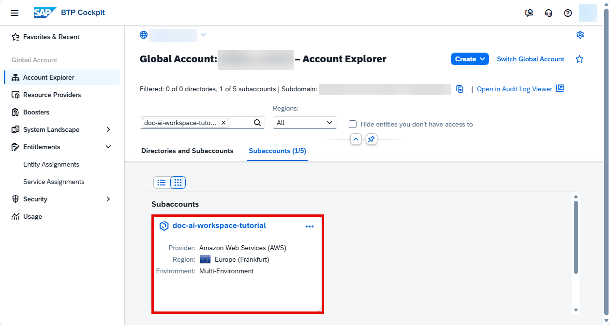

### Check your entitlements

To use the SAP Document AI workspace, you need to make sure that your account is properly configured.

The SAP Document AI workspace requires a tenant for Cloud Identity Services. For more information, see [Get Your Tenant](https://help.sap.com/docs/cloud-identity-services/cloud-identity-services/get-your-tenant?version=Cloud). 

1. On the navigation side bar, click **Entitlements** to see a list of all eligible services. You're entitled to use every service in this list according to the assigned service plan.

2. Search for `Cloud Identity Services`. ***If you find it in the list, you're entitled to use it. Now you can set this step to **Done** and proceed with Step 3.***

<!-- border -->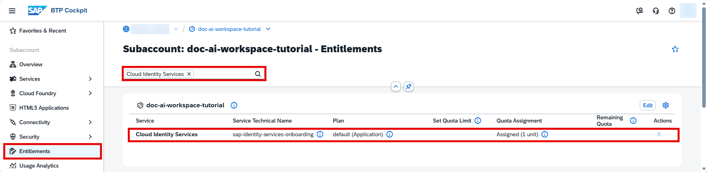

***ONLY if you DO NOT find `Cloud Identity Services` in your list, proceed as follows:***

  1.  Click **Edit**.
  
        <!-- border -->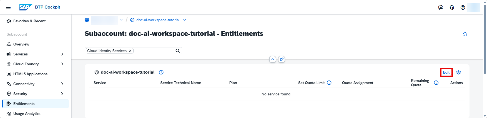

  2.  Click **Add Service Plans**.
            
        <!-- border -->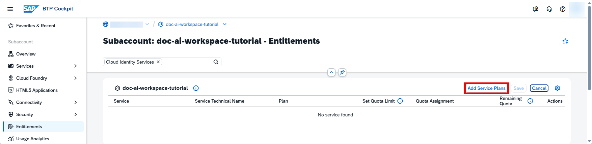

  3.  Search for `Cloud Identity Services`. Choose the `default (Application)` plan (or the `additional-tenant (Application)` plan). Click **Add 1 Service Plan**.
      
        <!-- border -->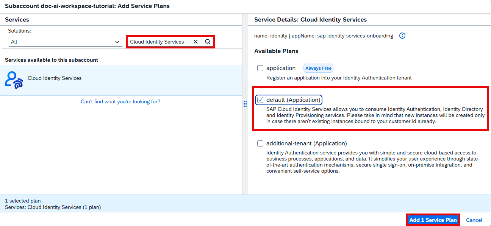

  4.  Click **Save** to save your entitlement changes.
    
        <!-- border -->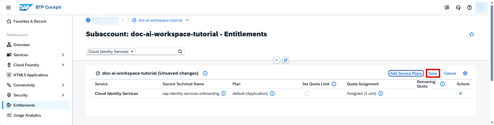

You're now entitled to create a tenant for Cloud Identity Services.

### Get your tenant for Cloud Identity Services 

The Service Marketplace is where you find all the services and applications available on SAP BTP.

1. On the navigation side bar, click **Service Marketplace**. Search for `Cloud Identity Services` and click the tile.

    <!-- border -->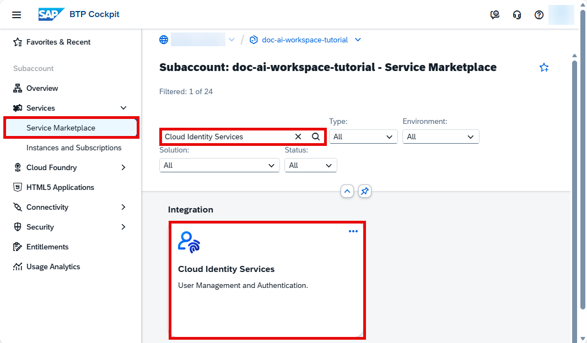

2. In the top-right corner, click **Create**.

    <!-- border -->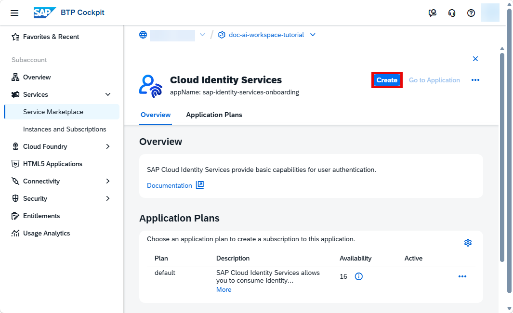

3. In the dialog, click **Create**.

  <!-- border -->

The subscription is going to be created now. Click on **View Subscription** to go to the list of your existing subscriptions.

<!-- border -->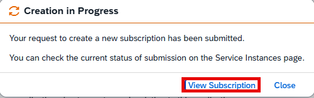

### Activate your account for Cloud Identity Services

1. Go to your inbox and open the account activation email (`Activation Information for SAP Cloud Identity Services`). Click the activation link.

    <!-- border -->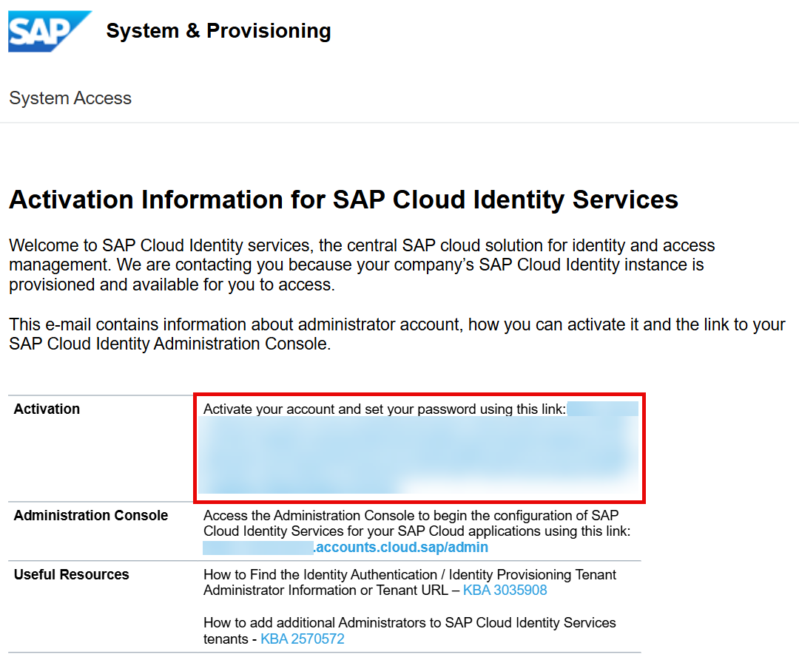

2. Enter a password and click **Continue**.

    <!-- border -->

3. You're informed that your account is successfully activated. Click **Continue**.

     <!-- border -->

This opens the administration console of SAP Cloud Identity Services:

<!-- border -->

Leave the administration console of SAP Cloud Identity Services open. We'll go back here in step 7.

### Establish trust

1. Back on the SAP BTP cockpit, under **Security**, click **Trust Configuration** and then in the top-right corner, click **Establish Trust**.

    <!-- border -->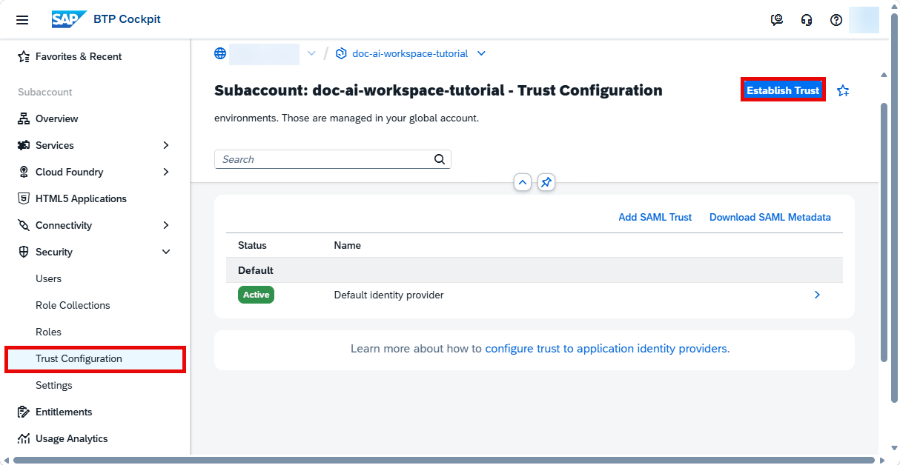    

2. Choose your tenant for Cloud Identity Services and click **Next** 3 times.

    <!-- border -->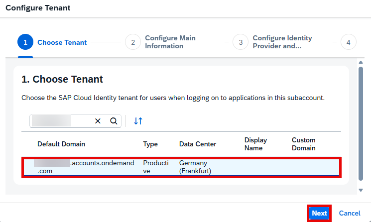 

3. Click **Finish**.

    <!-- border -->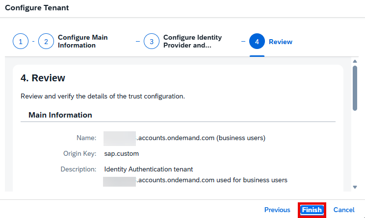     

Your tenant for Cloud Identity Services is added to the list:

<!-- border -->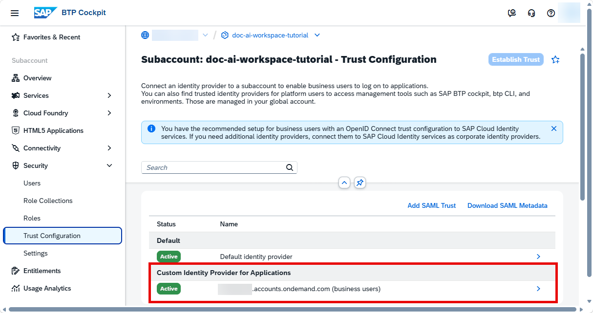

### Get subscribed to the SAP Document AI workspace

Before subscribing to the SAP Document AI workspace, make sure that a service instance has alread been created for SAP Document AI using either the embedded edition (embedded_edition) plan or the premium edition (premium_edition) plan.

1. On the navigation side bar, click **Service Marketplace**. Search for `SAP Document AI` and click the tile.

    <!-- border -->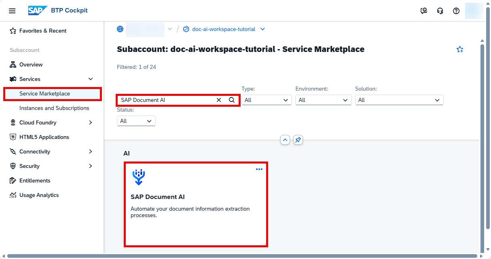

3. Click **Create**.

    <!-- border -->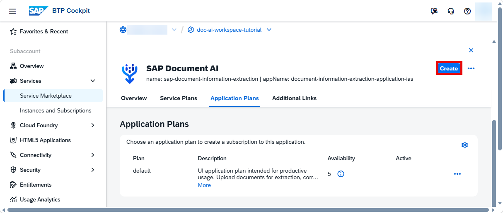

4. In the dialog, choose the `default` plan and click **Create**.

  <!-- border -->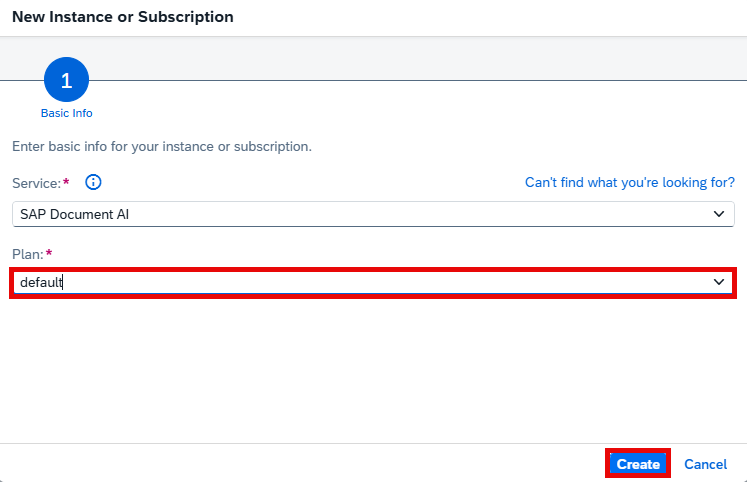

The subscription is going to be created now. Click on **View Subscription** to go to the list of your existing subscriptions.

<!-- border -->

### Assign authorization policies

SAP Document AI provides default policies that you can assign to users. These policies determine which actions a user can carry out on the SAP Document AI workspace. For more information, see [Authorization Policies](https://help.sap.com/docs/document-ai/sap-document-ai/authorization-policies-workspace).

1. Go back to the administration console of SAP Cloud Identity Services that you left open in step 4.

2. Under **Applications & Resources**, choose the **Applications** tile.

    <!-- border -->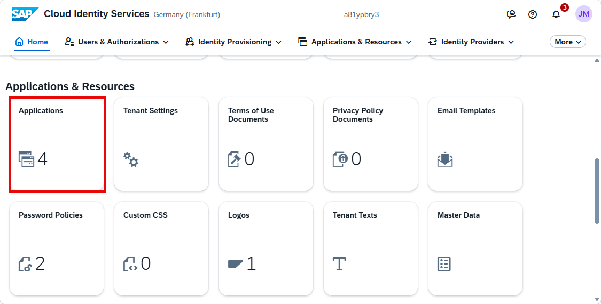

3. Choose the bundled application `SAP Document AI`.

    <!-- border -->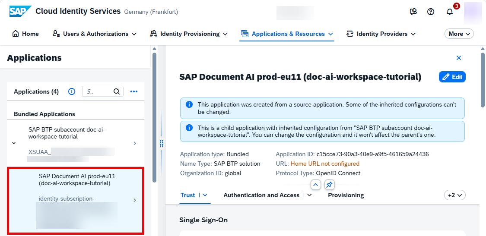

4. Choose the **Authorization Policies** tab and choose an authorization policy that you want to assign – for example, `Admin`. 

    <!-- border -->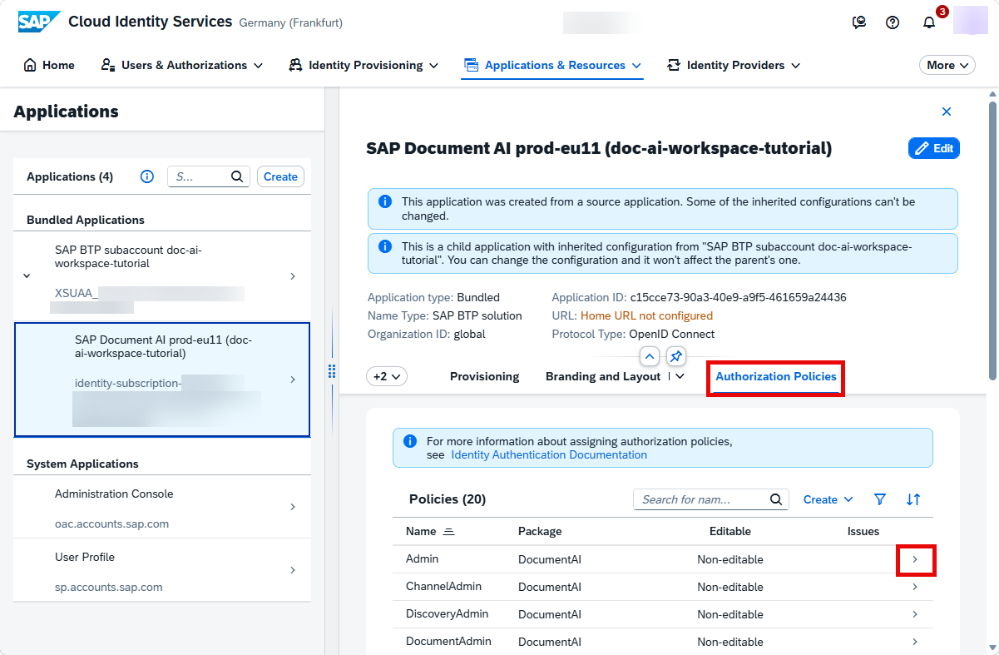

    The administration console opens the **Assignments** pane.

5. Choose **Add**.

    <!-- border -->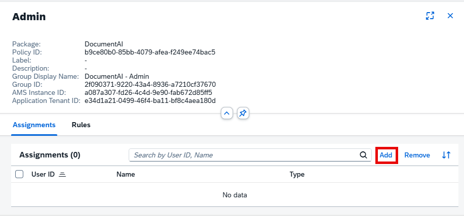

6. Select the users that you want to add to the authorization policy and choose **Add**.

    <!-- border -->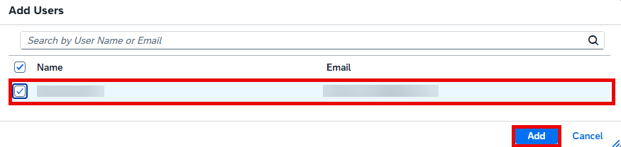

You have added the selected users to an authorization policy. These users are authorized to access and use the resources with the rules and restrictions defined in the authorization policy. 

### Go to application

1. Back on the SAP BTP cockpit, under **Services**, click **Instances and Subscriptions**, Choose the three dots at the right end of the row with the SAP Document AI application and select **Go to Application** from the dropdown.

    <!-- border -->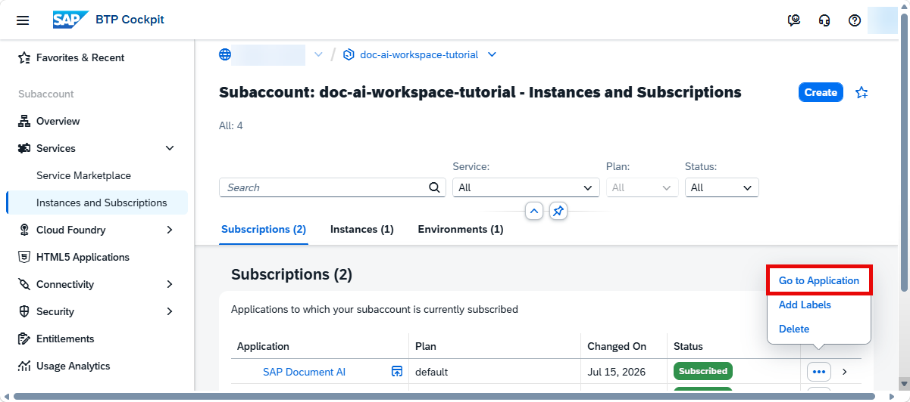

    The logon screen appears.

2. Enter your Identity Authentication service *Email or User Name* and *Password* to log on.    

    A **Permission Denied** dialog is displayed. Or the SAP Document AI basic UI appears (in case you've already used the same subaccount to access the SAP Document AI basic UI as described in [Use Free Tier to Subscribe to SAP Document AI Basic UI](cp-aibus-dox-free-ui-sub)). To access the SAP Document AI workspace, do the following:

    - On the **Permission Denied** dialog, do the following:
    Choose the link (`here`) in “Or choose `here` if you already have access to the SAP Document AI workspace.”

    <!-- border -->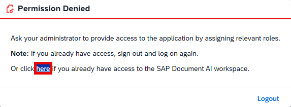

    - From the SAP Document AI basic UI, toggle the **Workspace** switch at the top of the screen from **OFF** to **ON**. Alternatively, edit the URL of the SAP Document AI basic UI, replacing /ui and everything that follows it with /workspace.
    
    <!-- border -->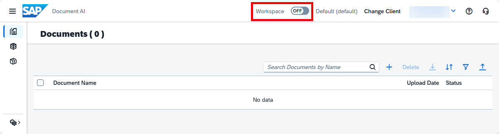

    The SAP Document AI workspace appears.

    <!-- border -->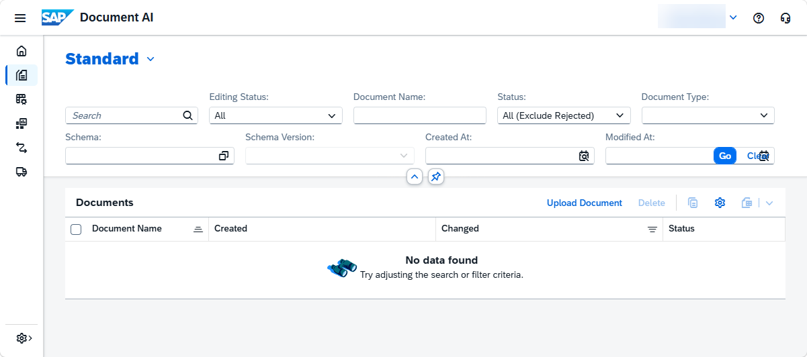

You have successfully subscribed to the SAP Document AI workspace.