# Activate the Instant Learning Feature with Swagger UI
<!-- description --> Use Swagger UI and the Configuration API to activate the instant learning feature of SAP Document AI, one of the SAP AI Business Services in SAP Business Technology Platform (SAP BTP).

## You will learn
  - How to access and consume the SAP Document AI APIs via Swagger UI
  - How to use the Configuration API to activate the instant learning feature, see the list of all configurations already created and their scope, and delete configurations

## Intro
Before using the instant learning feature, you need to activate it. This tutorial shows you how to do that. For more information on how to use the instant learning feature, see [Instant Learning (Premium Edition)](https://help.sap.com/docs/document-information-extraction/document-information-extraction/instant-learning-premium-edition-only) and [Instant Learning (Premium Edition): Best Practices](https://help.sap.com/docs/document-information-extraction/document-information-extraction/instant-learning-premium-edition-best-practices).

---

### Access and authorize Swagger UI


To use a trial account to perform this tutorial, first follow the steps described in [Use Trial to Set Up Account for SAP Document AI and Get Service Key](cp-aibus-dox-booster-key).

To perform this tutorial using the Free (`free`) service plan or one of the service plans intended for productive use – either Premium Edition (`premium_edition`) or Base Edition (`blocks_of_100`) –, first follow the steps described in [Use Free Tier to Set Up Account for SAP Document AI and Get Service Key](cp-aibus-dox-free-booster-key). For more information on the service plans available for SAP Document AI, see [Service Plans](https://help.sap.com/docs/document-information-extraction/document-information-extraction/service-plans).

Next, perform the steps described in [Get OAuth Access Token for SAP Document AI via Web Browser](cp-aibus-dox-web-oauth-token). 

Finally, you need to access and authorize the SAP Document AI Swagger UI as described below. You'll use Swagger UI to call the SAP Document AI APIs via any web browser. Swagger UI allows developers to effortlessly interact and try out every single operation an API exposes for easy consumption. For more information, see [Swagger UI](https://swagger.io/tools/swagger-ui/).   

To access and authorize the SAP Document AI Swagger UI, you'll need the following entries from the service key that you created for SAP Document AI in the tutorials [Use Trial to Set Up Account for SAP Document AI and Get Service Key](cp-aibus-dox-booster-key) or [Use Free Tier to Set Up Account for SAP Document AI and Get Service Key] (cp-aibus-dox-free-booster-key):

- `tenantuiurl` 
  
- `swagger`

>You'll find both of these entries **outside** the `uaa` section of the service key. (See the image below.)

1. To access the SAP Document AI Swagger UI, copy the  `tenantuiurl` value and paste it into a text editor. Then, copy the `swagger` value `/document-information-extraction/v1/` and paste it onto the end of the `tenantuiurl` value. Finally, copy the entire string, paste it into the address bar of your web browser, and press **Enter**.

    <!-- border -->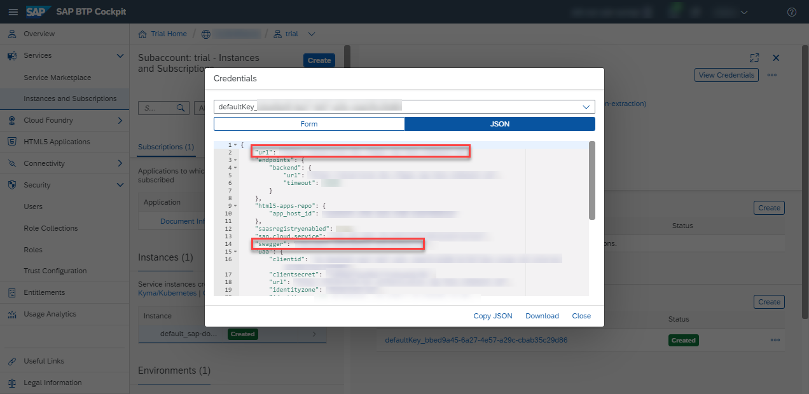

2. To be able to use the Swagger UI endpoints, you need to authorize yourself. In the top-right corner, click **Authorize**.

    <!-- border -->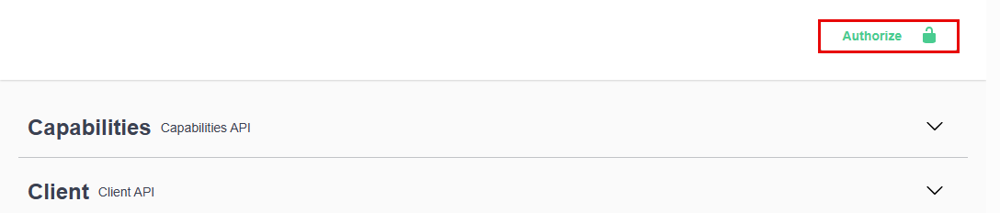

3. Copy the `access_token` value created in the tutorial [Get OAuth Access Token for SAP Document AI Using Any Web Browser](cp-aibus-dox-web-oauth-token) and paste it into a text editor. Move your cursor to the start of the line containing the value and enter **Bearer** followed by a space. Finally, copy the entire string, and paste it into the **Value** field.

    ```
    Bearer <access_token>
    ```
    
4. Click **Authorize**, and then click **Close**.
   
    <!-- border -->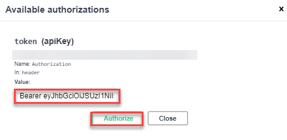

    <!-- border -->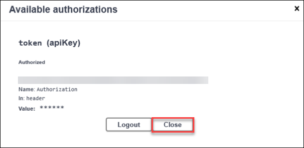


### Test Swagger UI authorizations


Use the **GET /capabilities** endpoint to check if you now have access to the SAP Document AI APIs via Swagger UI.

Click the endpoint name to expand it, click **Try it out**, and then **Execute**.

<!-- border -->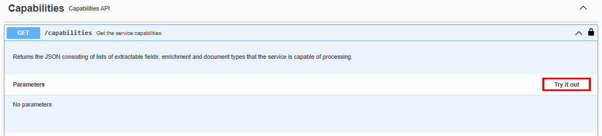

<!-- border -->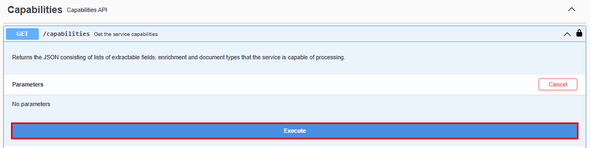

You should receive a response like the following:

<!-- border -->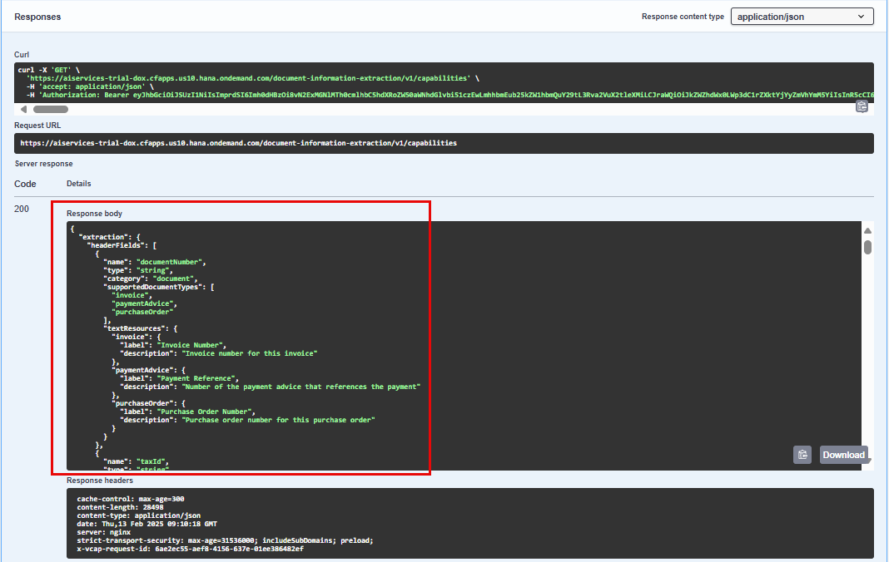

>If you get an error response code 401 (Unauthorized), your token is probably incorrect. Check whether you've added the word **`Bearer`**, followed by a space, before the token and whether the token value is complete and has been copied properly from the **`access_token`** value in your service key.


### Create configuration


Activate the instant learning feature using the **`enableInstantLearning`** configuration key.

1. Expand the **POST /configuration** endpoint.

2. Click **Try it out**.

    <!-- border -->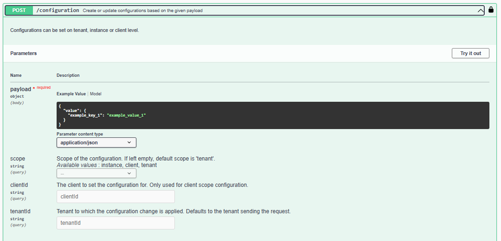

3. Enter the following in the **`payload`** field:

    ```JSON
    {
      "value": {
        "enableInstantLearning":"true"
      }
    }  
    ```

    You can also make the following optional entries: 

       - Choose the scope of the configuration. If you leave this parameter empty, the tenant scope is used.
  
       - Specify the ID of the client you want to set the configuration for.
        
       - Enter the ID of the tenant that you want to set the configuration for. If you leave this parameter empty, the tenantId sending the request is used. 
    
    For more information, see [Create Configuration](https://help.sap.com/docs/document-information-extraction/document-information-extraction/create-configuration).


4. Click **Execute**.

    <!-- border -->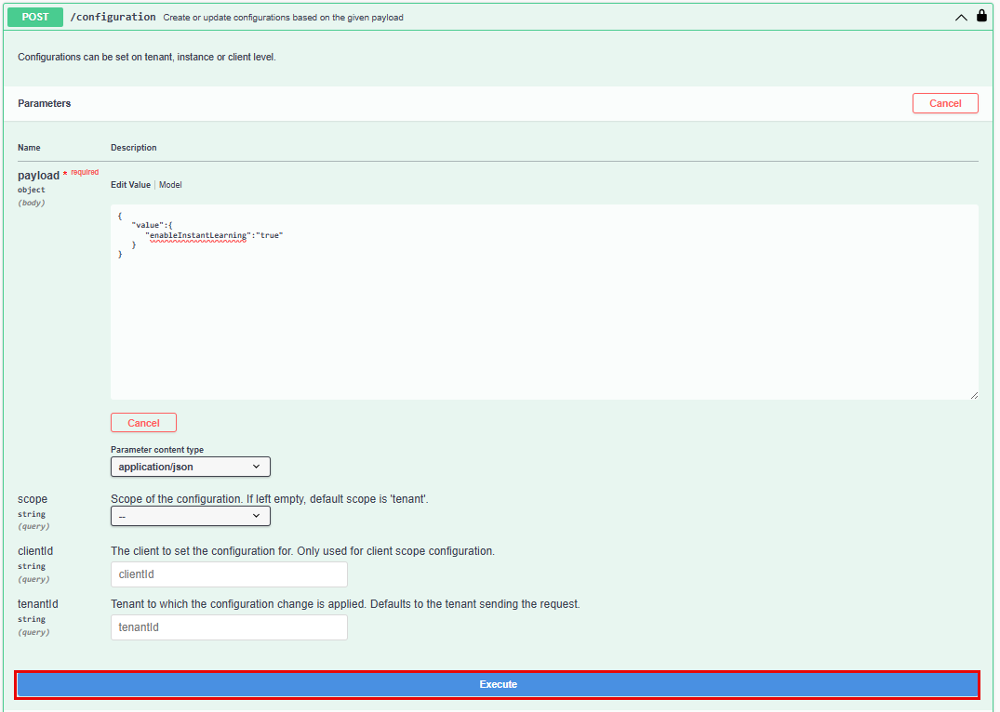

You should receive a response like the following:

<!-- border -->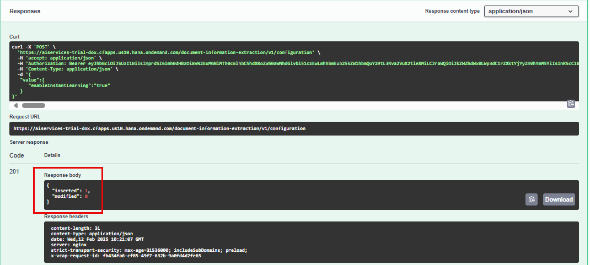

You've activated the instant learning feature, and you're now all set to start using it as detailed in [Instant Learning (Premium Edition)](https://help.sap.com/docs/document-information-extraction/document-information-extraction/instant-learning-premium-edition-only).

Steps 4 and 5 are optional. If you wish, you can complete this tutorial by simply setting them to **Done**.


### Get configuration (optional)


See the list of all configurations already created and their scope, including the **`enableInstantLearning`** configuration you've just created.

1. Expand the **Get /configuration** endpoint.

2. Click **Try it out**.

    <!-- border -->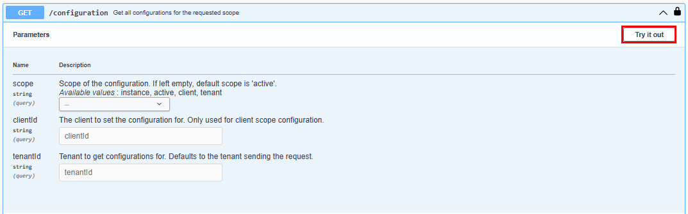

3. Click **Execute**.

    <!-- border -->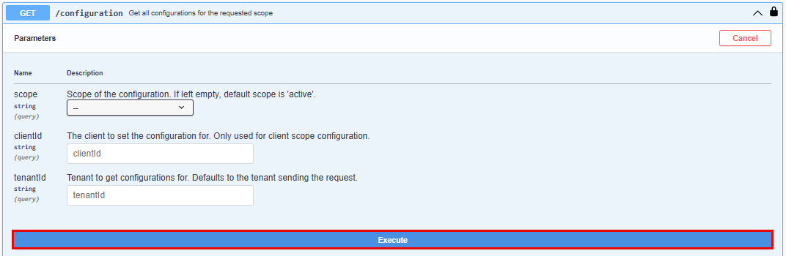

You should receive a response like the following:

<!-- border -->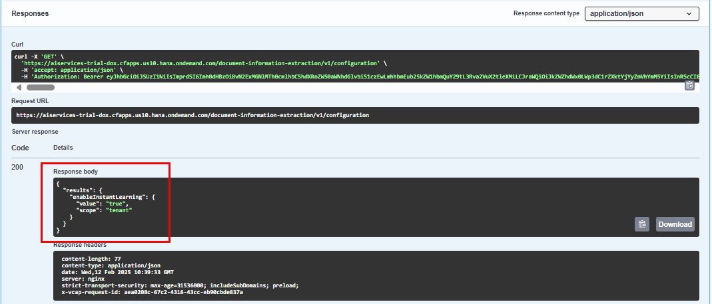


### Delete configuration (optional)


Do the following to delete the **`enableInstantLearning`** configuration:

1. Expand the **DELETE /configuration** endpoint.

2. Click **Try it out**.

    <!-- border -->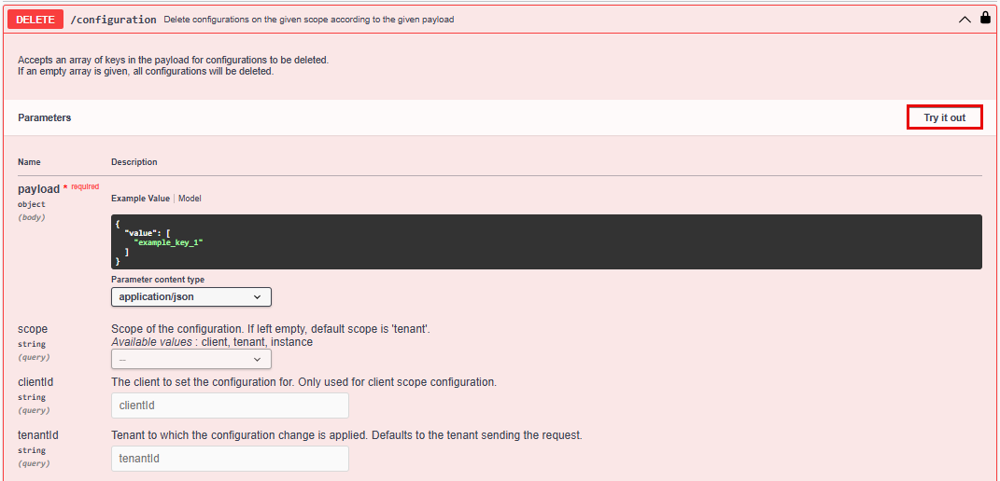

3. Enter the following in the **`payload`** field:

    ```JSON
    {
      "value": [
        "enableInstantLearning"
      ]
    }  
    ```

4. Click **Execute**.

    <!-- border -->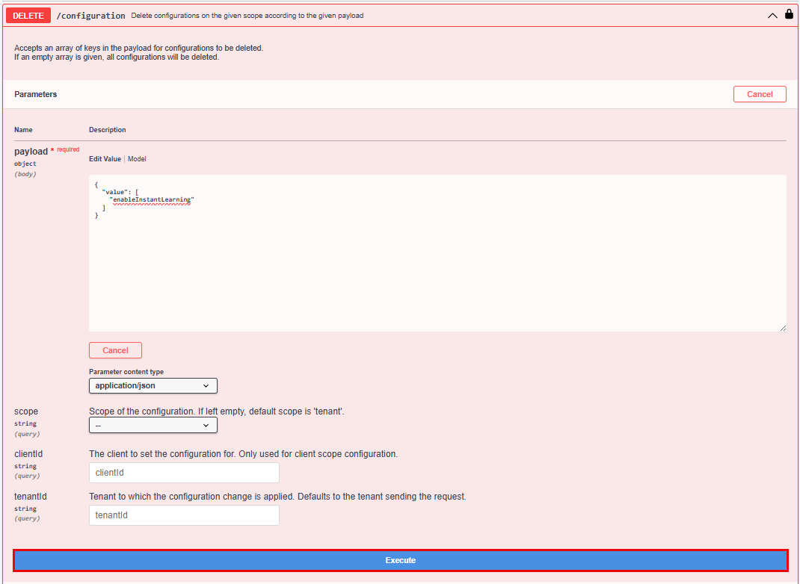

You should receive a response like the following:

<!-- border -->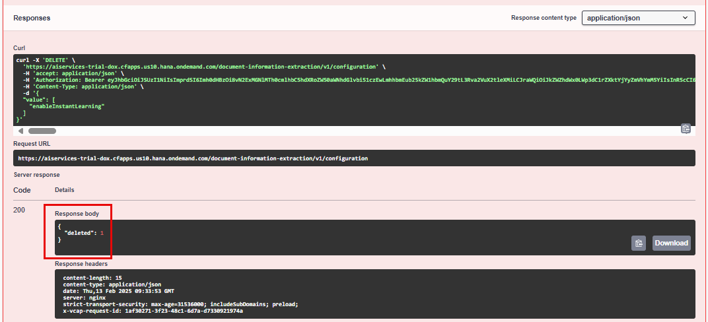

Congratulations, you've completed this tutorial.