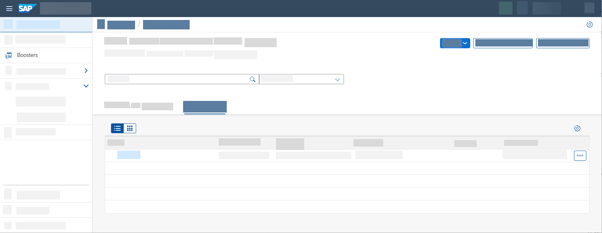
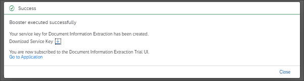
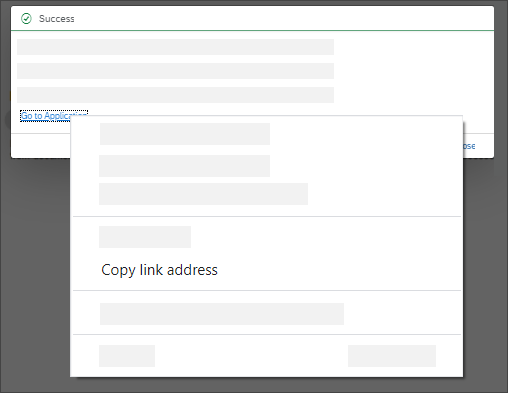

## Prerequisites
- You have created a trial account on SAP Cloud Platform: [Get a Free Trial Account on SAP Cloud Platform](hcp-create-trial-account)
- You have a subaccount and dev space with **Europe (Frankfurt)** or **US East (VA)** as region: [Manage Entitlements on SAP Cloud Platform Trial](cp-trial-entitlements). See also [Create a Subaccount](https://help.sap.com/viewer/65de2977205c403bbc107264b8eccf4b/Cloud/en-US/261ba9ca868f469baf64c22257324a75.html).

## Details
### You will learn
  - How to access your trial account
  - What are interactive guided boosters
  - How to use the **Set up account for Document Information Extraction** booster to assign entitlements, update your subaccount, create a service instance, subscribe to and access the Document Information Extraction Trial UI.
---

[ACCORDION-BEGIN [Step 1: ](Enter your trial account)]

1. In your web browser, open the [SAP Cloud Platform trial cockpit](https://cockpit.hanatrial.ondemand.com/).

2. Navigate to the trial global account by clicking **Enter Your Trial Account**.

    !

    >If this is your first time accessing your trial account, you'll have to configure your account by choosing a region. **Please select Europe (Frankfurt) or US East (VA)**. Your user profile will be set up for you automatically.

    >Wait till your account is set up and ready to go. Your global account, your subaccount, your organization, and your space are launched. This may take a couple of minutes.

    >Choose **Continue**.

    >!

    >For more details on how to configure entitlements, quotas, subaccounts and service plans on SAP Cloud Platform Trial, see [Manage Entitlements on SAP Cloud Platform Trial](cp-trial-entitlements).

[DONE]
[ACCORDION-END]

[ACCORDION-BEGIN [Step 2: ](Run booster)]

SAP Cloud Platform creates interactive guided boosters to automate trial cockpit steps, so users can save time when trying out the services.

Now, you will use the **Set up account for Document Information Extraction** booster to automatically assign entitlements, update your subaccount, create a service instance, subscribe to and access the Document Information Extraction Trial UI.

1. On the navigation side bar, click **Boosters**.

    !

2. Search for **Set up account for Document Information Extraction** and click the tile to access the booster.

    !

3. Click **Start**.

    !

    >If you have more than one subaccount, the booster will choose automatically the correct subaccount and space, but this will require that you click **Next** twice and **Finish** once, before being able to see the **Success** dialog box.

    !

[VALIDATE_1]
[ACCORDION-END]

[ACCORDION-BEGIN [Step 3: ](Go to Application)]

1. Right click **Go to Application**, then click ***Copy link*** to save the link to be able to open the application once again in the future.

    !

2. Click **Go to Application**.

    !

You have successfully used the booster **Set up account for Document Information Extraction** to subscribe to and access the Document Information Extraction Trial UI.

!

>If you face any issue with the booster **Set up account for Document Information Extraction**, you can alternatively follow the steps in [Subscribe to Document Information Extraction Trial UI](cp-aibus-dox-ui-sub) to subscribe to the user interface application manually.

You are now all set to [Use Machine Learning to Extract Information from Documents](cp-aibus-dox-ui). Step 4 is optional. If you're not interested, you can set it to **Done** and go directly to the next tutorial.

[DONE]
[ACCORDION-END]

[ACCORDION-BEGIN [Step 4: ](Access subscription (optional))]

> This is an optional step. Use it only if you want to access the subscription to the Document Information Extraction Trial UI, you've done with the **Set up account for Document Information Extraction** booster, without having to run it once again.

Do the following to access your subscription to the Document Information Extraction Trial UI, without having to run the **Set up account for Document Information Extraction** booster once again:

1. Close the booster **Success** dialog box.

    !

2. Access your trial account.

    !

3. Click **Subaccounts** on the navigation side bar and select **trial** to access your subaccount.

    !

4. Click **Subscriptions** on the navigation side bar.

    !

5. Search for **Document Information Extraction Trial UI**.

    !

6. Access the tile for **Document Information Extraction Trial UI** to **Go to Application**, **Copy link** to the UI application and **Manage Roles**.

    !

Congratulations, you have completed this tutorial.

[DONE]
[ACCORDION-END]
