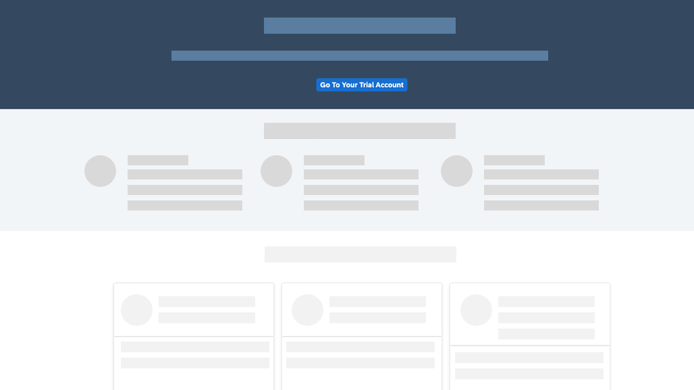
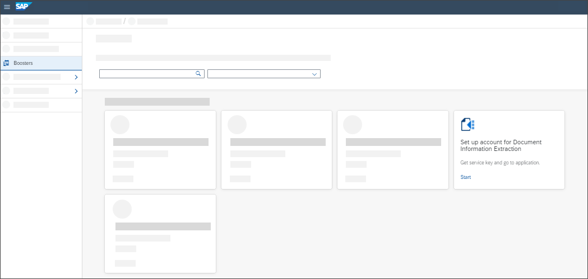
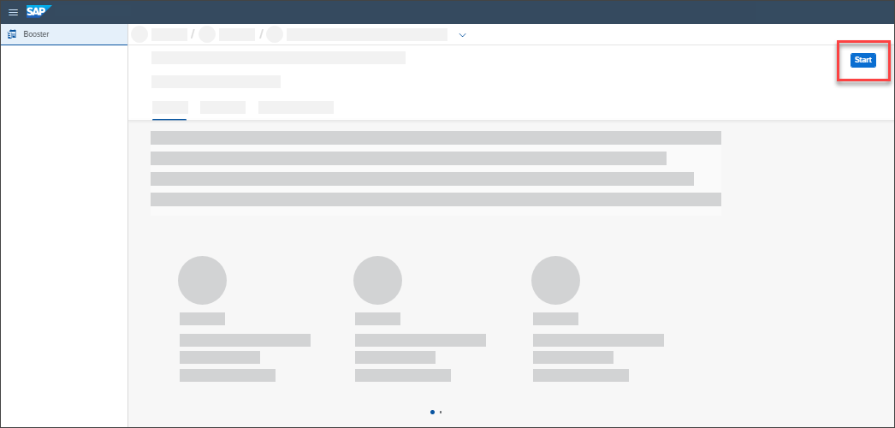
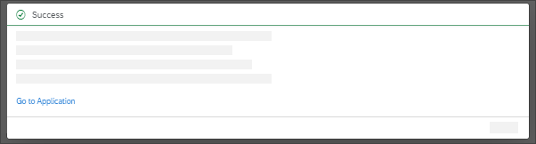
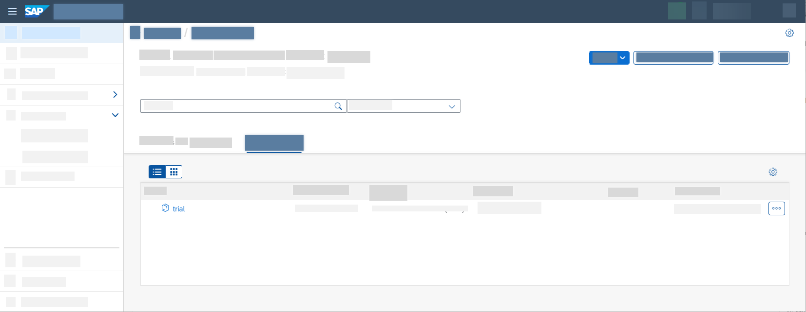
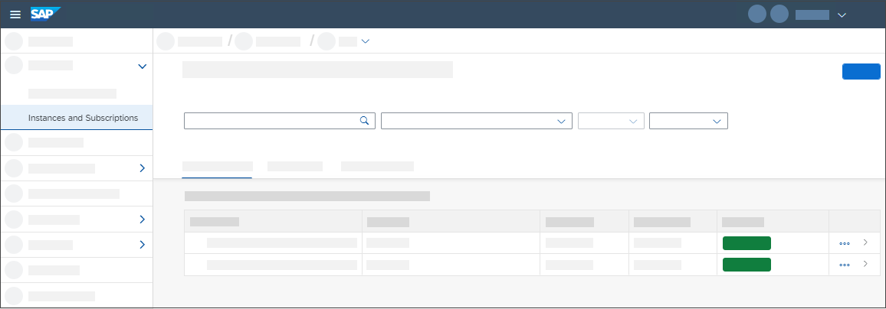
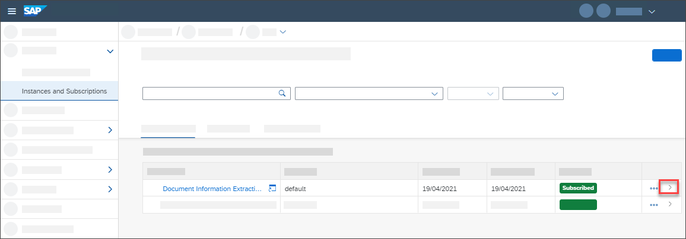
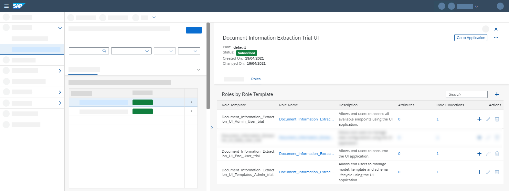

# Use Trial to Set Up Account for Document Information Extraction and Go to Application
<!-- description --> Get access to the Document Information Extraction Trial UI using a booster in SAP Business Technology Platform (SAP BTP) Trial that automatically creates a service instance, and subscribes you to the UI application for Document Information Extraction.

## Prerequisites
- You have created a trial account on SAP BTP: [Get a Free Account on SAP BTP Trial](hcp-create-trial-account)
- You have a trial subaccount and dev space with **US East (VA)** as region: [Manage Entitlements on SAP BTP Trial](cp-trial-entitlements). See also [Create a Subaccount](https://help.sap.com/viewer/65de2977205c403bbc107264b8eccf4b/Cloud/en-US/261ba9ca868f469baf64c22257324a75.html).

## You will learn
  - How to access your trial account
  - What are interactive guided boosters
  - How to use the **Set up account for Document Information Extraction** booster to assign entitlements, update your subaccount, create a service instance, subscribe to and access the Document Information Extraction Trial UI.

---

### Go to your trial account

1. In your web browser, open the [SAP BTP Trial cockpit](https://cockpit.hanatrial.ondemand.com/).

2. Navigate to your trial global account by clicking **Go To Your Trial Account**.

    <!-- border -->

    >If this is your first time accessing your trial account, you'll have to configure your account by choosing a region. **Please select US East (VA)**. Your user profile will be set up for you automatically.

    >Wait till your account is set up and ready to go. Your global account, your subaccount, your organization, and your space are launched. This may take a couple of minutes.

    >Choose **Continue**.

    >For more details on how to configure entitlements, quotas, subaccounts and service plans on SAP BTP Trial, see [Manage Entitlements on SAP BTP Trial](cp-trial-entitlements).

### Run booster

SAP BTP creates interactive guided boosters to automate cockpit steps, so users can save time when trying out the services.

Now, you will use the **Set up account for Document Information Extraction** booster to automatically assign entitlements, update your subaccount, create a service instance, subscribe to and access the Document Information Extraction Trial UI.

1. On the navigation side bar, click **Boosters**.

    <!-- border -->

2. Search for **Set up account for Document Information Extraction** and click the tile to access the booster.

    <!-- border -->

3. Click **Start**.

    <!-- border -->

    >If you have more than one subaccount, the booster will choose automatically the correct subaccount and space, but this will require that you click **Next** twice and **Finish** once, before being able to see the **Success** dialog box.

    

### Go to Application

1. Right click **Go to Application**, then click ***Copy link*** to save the link to be able to open the application once again in the future.

    

2. Click **Go to Application**.

    

You have successfully used the booster **Set up account for Document Information Extraction** to subscribe to and access the Document Information Extraction Trial UI.

<!-- border -->

>If you face any issue with the booster **Set up account for Document Information Extraction**, you can alternatively follow the steps in [Subscribe to Document Information Extraction Trial UI](cp-aibus-dox-ui-sub) to subscribe to the user interface application manually.

You're now all set to [Use Machine Learning to Extract Information from Documents](cp-aibus-dox-ui). Step 4 is optional. If you're not interested, you can set it to **Done** and go directly to the next tutorial.

### Access subscription (optional)

> This is an optional step. Use it only if you want to access the Document Information Extraction Trial application, you've subscribed to using the **Set up account for Document Information Extraction** booster, without having to run it once again.

Do the following to access the Document Information Extraction Trial application, without having to run the **Set up account for Document Information Extraction** booster once again:

1. Navigate to your trial global account by clicking **Go To Your Trial Account**.

2. From your global account page, choose `trial` to access your subaccount.

    <!-- border -->

3. Click **Instances and Subscriptions** on the navigation side bar.

    <!-- border -->

4. Search for **Document Information Extraction Trial** under **Subscriptions** and click the arrow on the right to access it.

    <!-- border -->

5. Here, you can click **Go to Application** to navigate to the application.

    <!-- border -->

Congratulations, you've completed this tutorial.