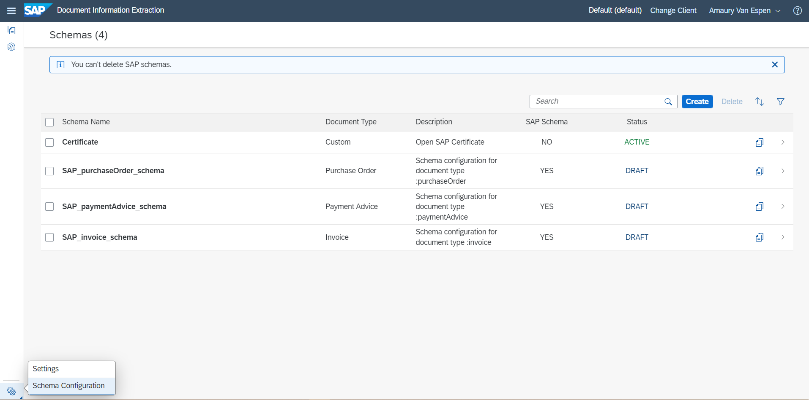
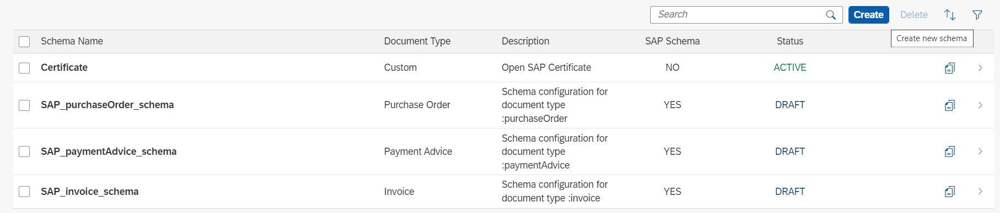
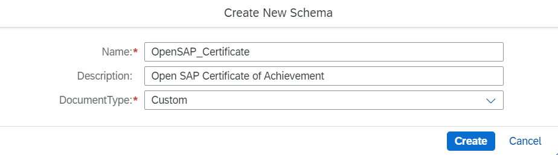
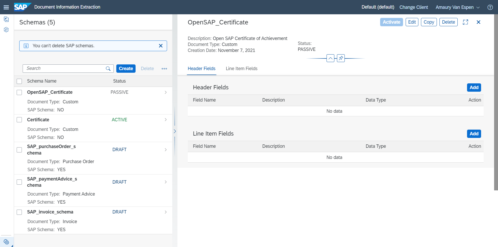
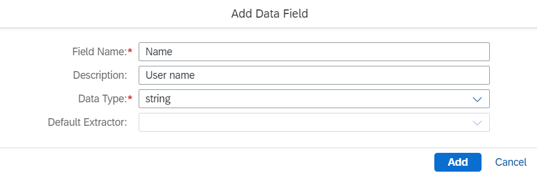
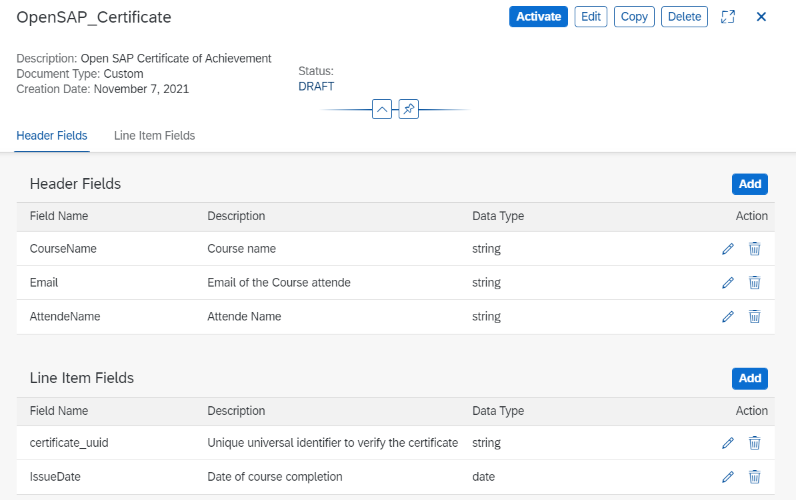
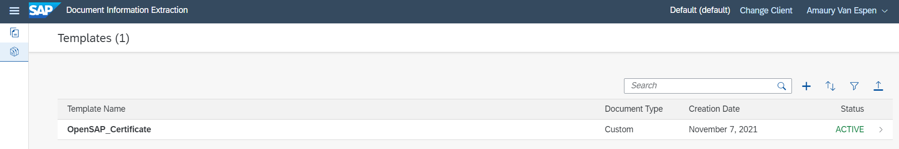
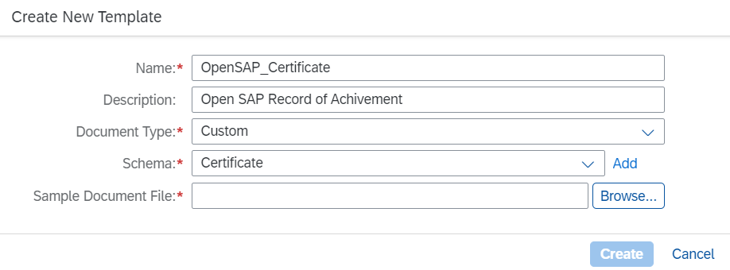
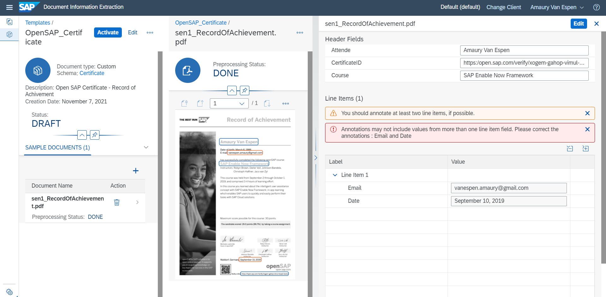

## Prerequisites
- You have created a trial account on SAP BTP: [Get a Free Account on SAP BTP Trial](hcp-create-trial-account)
- You have a trial subaccount and dev space with **US East (VA)** as region: [Manage Entitlements on SAP BTP Trial](cp-trial-entitlements). See also [Create a Subaccount](https://help.sap.com/viewer/65de2977205c403bbc107264b8eccf4b/Cloud/en-US/261ba9ca868f469baf64c22257324a75.html). You can also use old trial subaccounts created before October 2021 with **Europe (Frankfurt)** as region.
- You have [set up Account for Document Information Extraction](https://developers.sap.com/tutorials/cp-aibus-dox-booster-app.html) and Go to Application

## Details
### You will learn
  - How to access create your own schema
  - How to create a document template
  - How to enhance use of the Document Information Extraction Trial UI.

---

[ACCORDION-BEGIN [Step 1: ](Create a Schema)]

1. In your web browser, open the SAP BTP Trial cockpit and [go to the Instances and subscriptions tab of your trial subaccount](https://cockpit.hanatrial.ondemand.com/).

2. Navigate to your Document Information Extraction Application by clicking **Go To Application**.

    >Click on the bottom left corner **Settings > Schema configuration**.
    
    !
    
    >Click create

    !
    
    >Add name, description and chosse **custom** as DocumentType then Create
    
    !

[DONE]
[ACCORDION-END]

[ACCORDION-BEGIN [Step 2: ](Customize configuration)]

Once you've created a schema, you will be invited to customize configuration.

Now, you will add Header fields and Line Item fields to use with Document Information Extraction Trial UI.

1. On the custom configuration line, click **arrow** ">".

    !

2. Add Header fields **Name** and then repeat the step for each "Header fields" in your document, like "Email" with type string.

    !

3. Add Line item fields **certification_uuid** and **issue_date**.

    !

    >Once you've added all teh required fields, active the custom schema configuration.

    

[VALIDATE_1]
[ACCORDION-END]

[ACCORDION-BEGIN [Step 3: ](Add template)]

1. On the top left corner **Go to Template**, then click ***Create a new template***.

    

2. Fill the form with DocumentType **Custom** and choose the **Schema** you've just created.

    
    
3. Browse a sample document.

[DONE]
[ACCORDION-END]

[ACCORDION-BEGIN [Step 4: ](Customize annotations)]

Select the region of the document to map with field:

    !

Congratulations, you have completed this tutorial.

[DONE]
[ACCORDION-END]
