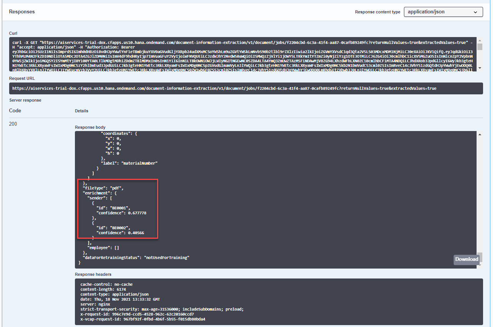

## Prerequisites
- [Set Up Account for Document Information Extraction](cp-aibus-dox-service-instance-booster)
- [Get OAuth Access Token for Document Information Extraction Using Any Web Browser](cp-aibus-dox-web-oauth-token)
- [Use Machine Learning to Extract Information from Documents with Swagger UI](cp-aibus-dox-swagger-ui) (step 1 only)

## Details
### You will learn
  - How to create, update, list and delete enrichment data using the business entity

After completing the tutorial mission [Use Machine Learning to Process Business Documents](mission.cp-aibus-extract-document-service), you can also use Document Information Extraction to enrich the information extracted from documents with your own master data. You can, for example, match enrichment data entities, such as supplier IDs, with the document [Extracted Header Fields](https://help.sap.com/viewer/5fa7265b9ff64d73bac7cec61ee55ae6/SHIP/en-US/b1c07d0c51b64580881d11b4acb6a6e6.html), such as sender names.

When enriching data with Document Information Extraction, you use 2 types of entities that you find in business documents. The `business entity` represents different kinds of organizations with which you deal as a company. It can represent, for example, suppliers and customers. The `employee entity` represents an employee in the company.

When you finish this tutorial, you will have explored all Data API functionalities to create, update, list and delete enrichment data using the `business entity` type. See [Enrichment Data API documentation](https://help.sap.com/viewer/5fa7265b9ff64d73bac7cec61ee55ae6/SHIP/en-US/ca4b609107dd47a78d880cb5eaceb8c8.html).

---

[ACCORDION-BEGIN [Step 1: ](Create client)]

After completing the prerequisite tutorials [Set Up Account for Document Information Extraction](cp-aibus-dox-service-instance-booster) and [Get OAuth Access Token for Document Information Extraction Using Any Web Browser](cp-aibus-dox-web-oauth-token), and performing at least step 1 in the tutorial [Use Machine Learning to Extract Information from Documents with Swagger UI](cp-aibus-dox-swagger-ui) to access and authorize the Document Information Extraction Swagger UI, you need to create a client. This client is used in most of the endpoints to distinguish and separate data.

You can either create a single client or multiple clients in the **payload** field of the **POST /clients** endpoint. The **`clientId`** values created here will be used in other service endpoints.

1. Expand the **POST /clients** endpoint.

2. Click **Try it out**.

3. Enter your **`clientId`** and **`clientName`** values in the **payload** field in the format you see in **Examples for payload parameter** (`c_29` and `client 29`, for example).

4. Click **Execute**.


You should receive a response like the following:


>**CAUTION:**

>Be aware of the following Document Information Extraction trial account limitations:​

>- Maximum 40 uploaded document pages per week​ (the documents can have more than 1 page)

>- Maximum 1 created `clientId`

>- Maximum 10 created enrichment `dataIds`


[DONE]
[ACCORDION-END]


[ACCORDION-BEGIN [Step 2: ](Create enrichment data)]

Use the **POST /data/jobs** endpoint to add your own master data records to the database to enrich the information extracted from documents.

1. Expand the **POST /data/jobs** endpoint.

2. Click **Try it out**.

3. Define the data in the **`payload`** field, so that the system knows which extracted field (using, for example, supplier IDs from master data) should be enriched.

    ```JSON
    {
       "value":[
          {
             "id":"BE0001",
             "name":"Sliced Invoices",
             "accountNumber":"",
             "address1":"123 Somewhere Street Your AZ 12345 123 Somewhere St Melbourne, VIC 3000",
             "address2":"",
             "city":"",
             "countryCode":"",
             "postalCode":"",
             "state":"",
             "email":"",
             "phone":"",
             "bankAccount":"",
             "taxId":""
          },
          {
             "id":"BE0002",
             "name":"Sliced",
             "accountNumber":"",
             "address1":"123 Somewhere Street Your AZ 12345 123 Somewhere St Melbourne, VIC 3000",
             "address2":"",
             "city":"",
             "countryCode":"",
             "postalCode":"",
             "state":"",
             "email":"",
             "phone":"",
             "bankAccount":"",
             "taxId":""
          }
       ]
    }
    ```

4. Choose the enrichment data **`type`** `businessEntity`.

5. Enter your **`clientId`** (created in the previous step).

6. When you choose the enrichment data **`type`** business entity, you have the option to choose a **`subtype`** (`supplier`, `customer` or `companyCode`). In this example, choose `supplier`.

7. Click **Execute**.

!

> ### What just happened?
>
> In this example, in the **`payload`** field, several master data records (name, ID and address, for example) from 2 different suppliers (Sliced Invoices and Sliced) are provided, so this additional information can be added to the document extracted fields prediction when the information matches.

You should receive a response like the following with status PENDING:

!

Copy the **`id`** from the **Response body** to see the result of the enrichment data status in the next step.

[VALIDATE_1]
[ACCORDION-END]


[ACCORDION-BEGIN [Step 3: ](See created enrichment data status)]

Use the **GET /data/jobs/{`id`}** endpoint to see the status of the uploaded enrichment data.

1. Expand the **GET /data/jobs/{`id`}** endpoint.

2. Click **Try it out**.

3. Enter the **`id`** received in the **POST /data/jobs** endpoint as the **`id`**.

4. Click **Execute**.

!

You should receive a response like the following with status SUCCESS:

!

[DONE]
[ACCORDION-END]


[ACCORDION-BEGIN [Step 4: ](Upload document to get prediction with enrichment data)]

>Document Information Extraction uses a globally pre-trained machine learning model that currently obtains better accuracy results with invoices and payment advices in the languages listed in [Supported Languages and Countries](https://help.sap.com/viewer/5fa7265b9ff64d73bac7cec61ee55ae6/SHIP/en-US/5bf847f7d1a848dcb3513eff9ec70412.html). The team is working to support additional document types and languages in the near future.

When enrichment data has been uploaded and fits to a certain prediction it is added to the results from the **GET /document/jobs/{`id`}** endpoint. To have the enrichment data in the prediction, you need to have the following part in the query of the **POST /document/jobs** endpoint (it is usually already there by default):

```JSON
"enrichment": {
    "sender": {
      "top": 5,
      "type": "businessEntity",
      "subtype": "supplier"
    },
    "employee": {
      "type": "employee"
    }
}
```

Do the following:

1. Expand the **POST /document/jobs** endpoint.

2. Click **Try it out**.

3. Right click [Sample Invoice 1](https://raw.githubusercontent.com/SAPDocuments/Tutorials/master/tutorials/cp-aibus-dox-swagger-ui/data/sample-invoice-1.pdf), then click ***Save link as*** to download locally the document file for this enrich business data example.
> You can also upload to the service and enrich any document file in PDF or single-page PNG and JPEG format that has content in headers and tables, such as an invoice. In this case, make sure the data you define in the **`payload`** field, in step 2, matches your document fields.

4. Upload the document file you want to enrich.

5. In **options**, enter the list of fields to be extracted from the uploaded file (`documentNumber`, `taxId`, `purchaseOrderNumber`, `shippingAmount`, `netAmount`, `senderAddress`, `senderName`, `grossAmount`, for example), the client id you created in step 1 (`c_29`, for example), the document type (`invoice`, for example), `receivedDate` (2020-02-17, for example), the enrichment data type `businessEntity` and subtype `supplier`.

    ```JSON
    {
       "extraction":{
          "headerFields":[
             "documentNumber",
             "taxId",
             "purchaseOrderNumber",
             "shippingAmount",
             "netAmount",
             "senderAddress",
             "senderName",
             "grossAmount",
             "currencyCode",
             "receiverContact",
             "documentDate",
             "taxAmount",
             "taxRate",
             "receiverName",
             "receiverAddress"
          ],
          "lineItemFields":[
             "description",
             "netAmount",
             "quantity",
             "unitPrice",
             "materialNumber"
          ]
       },
       "clientId":"c_29",
       "documentType":"invoice",
       "receivedDate":"2020-02-17",
       "enrichment":{
          "sender":{
             "top":5,
             "type":"businessEntity",
             "subtype":"supplier"
          },
          "employee":{
             "type":"employee"
          }
       }
    }
    ```

6. Click **Execute**.

This is how the request should look like:

!

And that's how the response looks like:

!

Copy the **`id`** from the **Response body** to get enrichment data prediction in the next step.

[DONE]
[ACCORDION-END]


[ACCORDION-BEGIN [Step 5: ](Get enrichment data prediction)]

When enrichment data has been uploaded and fits to a certain prediction it is added to the results from the **GET /document/jobs/{`id`}** endpoint.

> Enrichment data is refreshed automatically every 4 hours. It might take up to 4 hours until the enrichment data prediction is available in the response.

1. Expand the **GET /document/jobs/{`id`}** endpoint.

2. Click **Try it out**.

3. Set **`returnNullValues`** and **`extractedValues`** to `true`.

4. Enter the **`id`** received in the **POST /document/jobs** endpoint as the **`id`**.

5. Click **Execute**.

The endpoint request and response look as follows:

!

!

> ### What just happened?
>
> In this example, in the response, one of the extracted fields is the sender name Sliced Invoices. This information is enriched with the supplier ID enrichment data created in step 2. The prediction suggests the supplier ID BE0001 (from sender name Sliced Invoices) with higher probability than the supplier ID BE0002 (from sender name Sliced).

This is an example of a full prediction including the enrichment data part:

```JSON
{
  "status": "DONE",
  "id": "afc5f228-7393-431a-ae9a-3dddf440a9bd",
  "fileName": "sample-invoice-1.pdf",
  "documentType": "invoice",
  "created": "2020-11-11T12:30:22.023360+00:00",
  "finished": "2020-11-11T12:32:05.308440+00:00",
  "country": "XX",
  "extraction": {
    "headerFields": [
      {
        "name": "taxRate",
        "category": "amounts",
        "value": null,
        "type": "number",
        "page": null,
        "confidence": null,
        "coordinates": {
          "x": 0,
          "y": 0,
          "w": 0,
          "h": 0
        },
        "group": 1
      },
      {
        "name": "taxAmount",
        "category": "amounts",
        "value": 8.5,
        "type": "number",
        "page": 1,
        "confidence": 0.999595546722412,
        "coordinates": {
          "x": 0.877468764781952,
          "y": 0.481470912694931,
          "w": 0.0362756848335266,
          "h": 0.00883695483207703
        },
        "group": 1
      },
      {
        "name": "senderName",
        "category": "sender",
        "value": "Sliced Invoices",
        "type": "string",
        "page": 1,
        "confidence": 0.617510483307498,
        "coordinates": {
          "x": 0.0709391374445788,
          "y": 0.156784492588369,
          "w": 0.100362756952842,
          "h": 0.00826681870011403
        }
      },
      {
        "name": "documentNumber",
        "category": "document",
        "value": "INV-3337",
        "type": "string",
        "page": 1,
        "confidence": 0.656084211099715,
        "coordinates": {
          "x": 0.759774284562676,
          "y": 0.136830102622577,
          "w": 0.0612656187021362,
          "h": 0.00826681870011403
        }
      },
      {
        "name": "purchaseOrderNumber",
        "category": "details",
        "value": "12345",
        "type": "string",
        "page": 1,
        "confidence": 0,
        "coordinates": {
          "x": 0.760177347843611,
          "y": 0.155644241733181,
          "w": 0.0390971382507054,
          "h": 0.00798175598631698
        }
      },
      {
        "name": "receiverAddress",
        "category": "receiver",
        "value": "123 Somewhere St Melbourne, VIC 3000",
        "type": "string",
        "page": 1,
        "confidence": 0.584470650866444,
        "coordinates": {
          "x": 0.0725513905683192,
          "y": 0.303591790193843,
          "w": 0.138250705360742,
          "h": 0.0250855188141391
        }
      },
      {
        "name": "grossAmount",
        "category": "amounts",
        "value": 93.5,
        "type": "number",
        "page": 1,
        "confidence": 0.653526421749231,
        "coordinates": {
          "x": 0.869407496977025,
          "y": 0.500285062713797,
          "w": 0.0447400241837969,
          "h": 0.0091220068415051
        }
      },
      {
        "name": "netAmount",
        "category": "amounts",
        "value": 85,
        "type": "number",
        "page": 1,
        "confidence": 0.641649420965802,
        "coordinates": {
          "x": 0.869407496977025,
          "y": 0.462371721778791,
          "w": 0.0447400241837969,
          "h": 0.00969213226909921
        }
      },
      {
        "name": "receiverName",
        "category": "receiver",
        "value": "Test Business",
        "type": "string",
        "page": 1,
        "confidence": 0.610726446327236,
        "coordinates": {
          "x": 0.071745264006449,
          "y": 0.2884834663626,
          "w": 0.0923014913341395,
          "h": 0.00826681870011403
        }
      },
      {
        "name": "senderAddress",
        "category": "sender",
        "value": "Suite 5A-1204 123 Somewhere Street Your City AZ 12345",
        "type": "string",
        "page": 1,
        "confidence": 0.602965183910869,
        "coordinates": {
          "x": 0.0721483272873841,
          "y": 0.1730330672748,
          "w": 0.15074566706973,
          "h": 0.040193842645382
        }
      },
      {
        "name": "receiverContact",
        "category": "receiver",
        "value": null,
        "type": "string",
        "page": null,
        "confidence": null,
        "coordinates": {
          "x": 0,
          "y": 0,
          "w": 0,
          "h": 0
        }
      },
      {
        "name": "taxId",
        "category": "amounts",
        "value": null,
        "type": "string",
        "page": null,
        "confidence": null,
        "coordinates": {
          "x": 0,
          "y": 0,
          "w": 0,
          "h": 0
        },
        "group": 1
      },
      {
        "name": "shippingAmount",
        "category": "amounts",
        "value": null,
        "type": "number",
        "page": null,
        "confidence": null,
        "coordinates": {
          "x": 0,
          "y": 0,
          "w": 0,
          "h": 0
        }
      },
      {
        "name": "currencyCode",
        "category": "amounts",
        "value": "USD",
        "type": "string",
        "page": 1,
        "confidence": 0.933853209018707,
        "coordinates": {
          "x": 0,
          "y": 0,
          "w": 0,
          "h": 0
        }
      },
      {
        "name": "documentDate",
        "category": "document",
        "value": "2016-01-25",
        "type": "date",
        "page": 1,
        "confidence": 0.986256398260593,
        "coordinates": {
          "x": 0.758968158000806,
          "y": 0.174458380843786,
          "w": 0.1136638452237,
          "h": 0.00940706955530218
        }
      }
    ],
    "lineItems": [
      [
        {
          "name": "description",
          "category": "details",
          "value": "Web Design This is a sample description...",
          "type": "string",
          "page": 1,
          "confidence": 0.620112451872042,
          "coordinates": {
            "x": 0.171704957678356,
            "y": 0.413911060433295,
            "w": 0.174929463925836,
            "h": 0.0216647662485747
          }
        },
        {
          "name": "quantity",
          "category": "details",
          "value": 1,
          "type": "number",
          "page": 1,
          "confidence": 0.638236153693426,
          "coordinates": {
            "x": 0.102378073357517,
            "y": 0.42018244013683,
            "w": 0.0270052398226522,
            "h": 0.00826681870011403
          }
        },
        {
          "name": "netAmount",
          "category": "amounts",
          "value": 85,
          "type": "number",
          "page": 1,
          "confidence": 0.63175144701293,
          "coordinates": {
            "x": 0.869407496977025,
            "y": 0.419612314709236,
            "w": 0.0447400241837969,
            "h": 0.00940706955530213
          }
        },
        {
          "name": "unitPrice",
          "category": "details",
          "value": 85,
          "type": "number",
          "page": 1,
          "confidence": 0.638240830464797,
          "coordinates": {
            "x": 0.609834744054817,
            "y": 0.419612314709236,
            "w": 0.0447400241837969,
            "h": 0.00940706955530213
          }
        },
        {
          "name": "materialNumber",
          "category": "details",
          "value": null,
          "type": "string",
          "page": 1,
          "confidence": null,
          "coordinates": {
            "x": 0,
            "y": 0,
            "w": 0,
            "h": 0
          }
        }
      ]
    ]
  },
  "fileType": "pdf",
  "enrichment": {
    "sender": [
      {
        "id": "BE0001",
        "confidence": 0.5625
      },
      {
        "id": "BE0002",
        "confidence": 0.4625
      }
    ],
    "employee": []
  }
}
```

You have now successfully used the business entity to get enrichment data predictions for the document you uploaded to Document Information Extraction.

[DONE]
[ACCORDION-END]


[ACCORDION-BEGIN [Step 6: ](See all enrichment data entries)]

To see a list of the enrichment data entries you have created:

1. Expand the **GET /data** endpoint.

2. Click **Try it out**.

3. Choose the enrichment data **`type`** `businessEntity`.

4. Enter your **`clientId`**.

5. Choose the enrichment data **`subtype`** `supplier`.

6. Click **Execute**.


You should receive a response like the following:


[DONE]
[ACCORDION-END]


[ACCORDION-BEGIN [Step 7: ](Delete enrichment data)]

To delete enrichment data which has been uploaded before:

1. Expand the **DELETE /data** endpoint.

2. Click **Try it out**.

3. Define the data in the **`payload`** field, so that the system knows which data entry (using, for example, the data entry ID) should be deleted.

    ```JSON
    {
       "value":[
          {
             "id":"BE0001"
          }
       ]
    }
    ```

4. Choose the enrichment data **`type`** `businessEntity`.

5. Enter your **`clientId`**.

6. Choose the enrichment data **`subtype`** `supplier`.

7. Click **Execute**.


You should receive a response like the following:


[DONE]
[ACCORDION-END]


[ACCORDION-BEGIN [Step 8: ](Delete client)]

If you want to delete a client you created in Step 1, use the **DELETE /clients** endpoint.

1. Expand the **DELETE /clients** endpoint.

2. Click **Try it out**.

3. Enter in the **payload** field the client id or multiple client ids (`c_29`, for example) you want to delete.

4. Click **Execute**.


You should receive a response like the following:


Congratulations, you have completed this tutorial.

[DONE]
[ACCORDION-END]
