## Details
### You will learn
  - How to create, update, list and delete enrichment data using the business entity

You can also use Document Information Extraction to enrich the information extracted from documents with your own master data records. You can, for example, match enrichment data entities, such as supplier IDs, with the document [Extracted Header Fields](https://help.sap.com/viewer/5fa7265b9ff64d73bac7cec61ee55ae6/SHIP/en-US/b1c07d0c51b64580881d11b4acb6a6e6.html), such as sender names.

When enriching data with Document Information Extraction, you use 2 types of entities that you find in business documents. The `business entity` represents different kinds of organizations with which you deal as a company. It can represent, for example, suppliers and customers. The `employee entity` represents an employee in the company.

When you finish this tutorial, you will have explored all Data API functionalities to create, update, list and delete enrichment data using the `business entity` type. See [Enrichment Data API documentation](https://help.sap.com/viewer/5fa7265b9ff64d73bac7cec61ee55ae6/SHIP/en-US/ca4b609107dd47a78d880cb5eaceb8c8.html).

---

[ACCORDION-BEGIN [Step 1: ](Get client)]

After performing step 1 of the tutorial [Use Machine Learning to Extract Information from Documents with Swagger UI](cp-aibus-dox-swagger-ui) to access and authorize the Document Information Extraction Swagger UI, you need to create a client.

When you create a service instance for Document Information Extraction, a `default` client is automatically created. A client is used in most of the endpoints to distinguish and separate data.

Trial users can only create one client. To see your list of clients:

1. Expand the **GET /clients** endpoint.

2. Click **Try it out**.

3. Enter a maximum number of clients to be listed in the **limit** field.

4. Click **Execute**.

!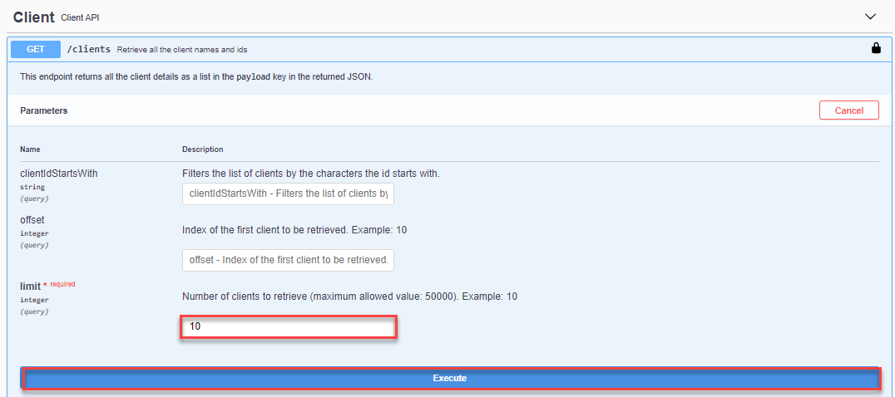

You should receive a response like the following:

!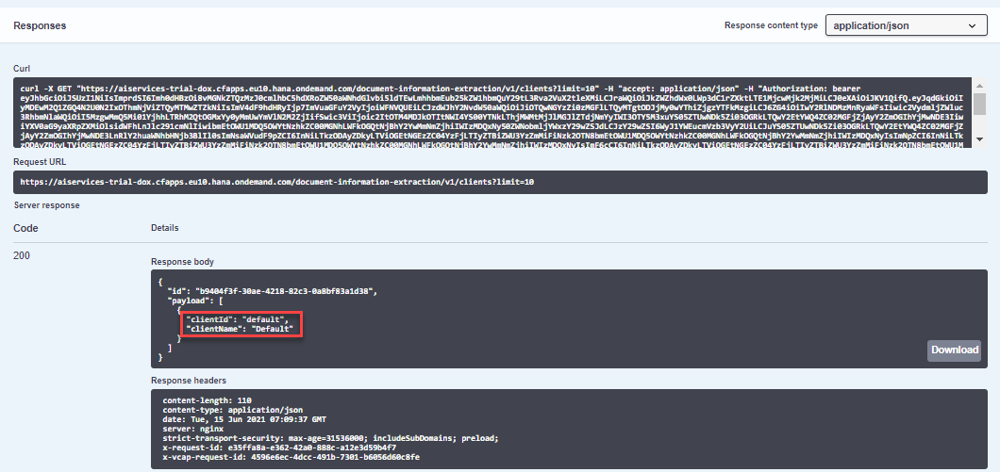

[DONE]
[ACCORDION-END]


[ACCORDION-BEGIN [Step 2: ](Delete client)]

Use the **DELETE /clients** endpoint to delete the `default` client.

1. Expand the **DELETE /clients** endpoint.

2. Click **Try it out**.

3. Enter in the **payload** field the client id (`default`) you want to delete.

4. Click **Execute**.

!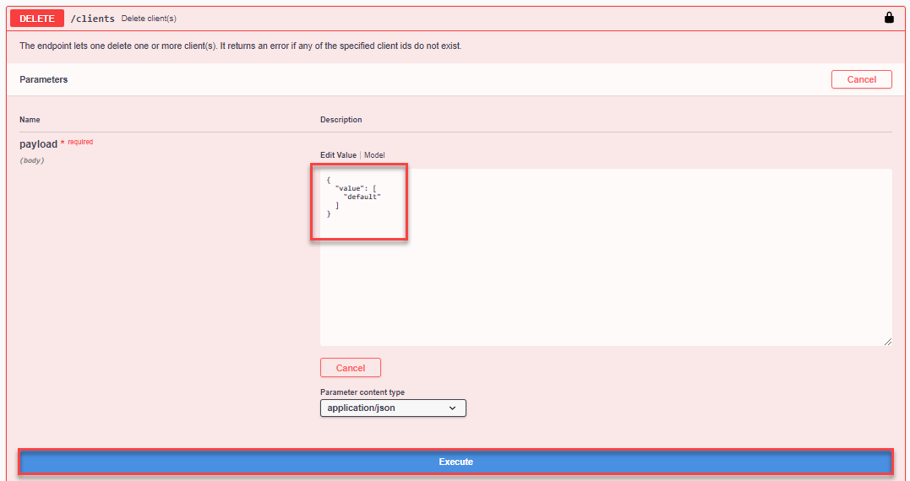

You should receive a response like the following:

!

[DONE]
[ACCORDION-END]


[ACCORDION-BEGIN [Step 3: ](Create client)]

Use the **POST /clients** endpoint to create your own client. The **`clientId`** value created here will be used in other service endpoints.

1. Expand the **POST /clients** endpoint.

2. Click **Try it out**.

3. Enter your **`clientId`** and **`clientName`** values in the **payload** field in the format you see in **Examples for payload parameter** (`c_29` and `client 29`, for example).

4. Click **Execute**.

!

You should receive a response like the following:

!

You can repeat step 1 to see the **`clientId`** and **`clientName`** of the client you have just created.


>**CAUTION:**

>Be aware of the following Document Information Extraction trial account limitations:​

>- Maximum 40 uploaded document pages per week​ (the documents can have more than 1 page)

>- Maximum 1 created `clientId`

>- Maximum 10 created enrichment `dataIds`


[DONE]
[ACCORDION-END]


[ACCORDION-BEGIN [Step 4: ](Create enrichment data)]

Use the **POST /data/jobs** endpoint to add your own master data records to the database to enrich the information extracted from documents.

1. Expand the **POST /data/jobs** endpoint.

2. Click **Try it out**.

3. Define the data in the **`payload`** field, so that the system knows which extracted field (using, for example, supplier IDs from master data) should be enriched.

    ```JSON
    {
       "value":[
          {
             "id":"BE0001",
             "name":"Sliced Invoices",
             "accountNumber":"",
             "address1":"123 Somewhere Street Your AZ 12345 123 Somewhere St Melbourne, VIC 3000",
             "address2":"",
             "city":"",
             "countryCode":"",
             "postalCode":"",
             "state":"",
             "email":"",
             "phone":"",
             "bankAccount":"",
             "taxId":""
          },
          {
             "id":"BE0002",
             "name":"Sliced",
             "accountNumber":"",
             "address1":"123 Somewhere Street Your AZ 12345 123 Somewhere St Melbourne, VIC 3000",
             "address2":"",
             "city":"",
             "countryCode":"",
             "postalCode":"",
             "state":"",
             "email":"",
             "phone":"",
             "bankAccount":"",
             "taxId":""
          }
       ]
    }
    ```

4. Choose the enrichment data **`type`** `businessEntity`.

5. Enter your **`clientId`** (created in the previous step).

6. When you choose the enrichment data **`type`** business entity, you have the option to choose a **`subtype`** (`supplier`, `customer` or `companyCode`). In this example, choose `supplier`.

7. Click **Execute**.

!

> ### What just happened?
>
> In this example, in the **`payload`** field, several master data records (name, ID and address, for example) from 2 different suppliers (Sliced Invoices and Sliced) are provided, so this additional information can be added to the document extracted fields prediction when the information matches.

You should receive a response like the following with status PENDING:

!

Copy the **`id`** from the **Response body** to see the result of the enrichment data status in the next step.

[VALIDATE_1]
[ACCORDION-END]


[ACCORDION-BEGIN [Step 5: ](See created enrichment data status)]

Use the **GET /data/jobs/{`id`}** endpoint to see the status of the uploaded enrichment data.

1. Expand the **GET /data/jobs/{`id`}** endpoint.

2. Click **Try it out**.

3. Enter the **`id`** received in the **POST /data/jobs** endpoint as the **`id`**.

4. Click **Execute**.

!

You should receive a response like the following with status SUCCESS:

!

> ### What just happened?
>
> The **`refreshedAt`** parameter tells when the enrichment data job was refreshed for the last time. When the response is **null**, it means that the enrichment data has not yet been refreshed.
> Enrichment data is refreshed automatically every 4 hours. It might take up to 4 hours until the enrichment data prediction is available in the response.

[DONE]
[ACCORDION-END]


[ACCORDION-BEGIN [Step 6: ](Create configuration)]

Set data activation to manual, instead of using the default automatic refresh of enrichment data that takes place every 4 hours.

> If you have already performed this step in the previous tutorial: [Use Machine Learning to Enrich Employee Data with Swagger UI](cp-aibus-dox-data-api-emp), you can skip it now. Set it to done and move directly to step 7.

1. Expand the **POST /configuration** endpoint.

2. Click **Try it out**.

3. Enter the following in the **`payload`** field:

    ```JSON
    {
      "value": {
        "manualDataActivation":"true"
      }
    }  
    ```

4. Click **Execute**.

!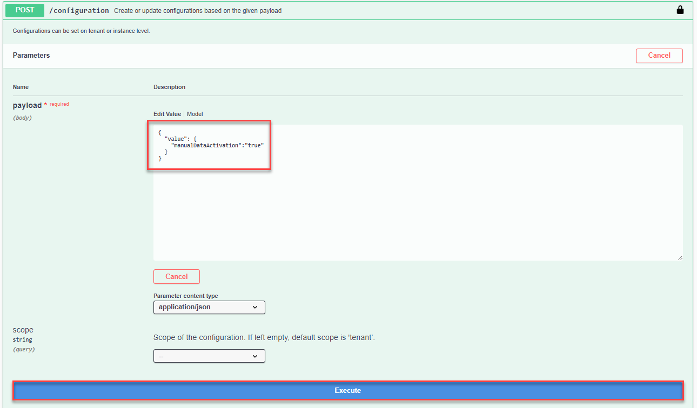

You should receive a response like the following:

!

[DONE]
[ACCORDION-END]


[ACCORDION-BEGIN [Step 7: ](Create data activation)]

Create a data activation job record to see new or updated enrichment data in the extraction results. Only activated enrichment data will be added to the extraction results.

1. Expand the **POST /data/activation** endpoint.

2. Click **Try it out**.

4. Click **Execute**.

!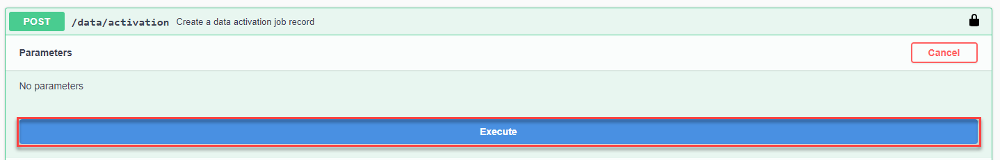

You should receive a response like the following:

!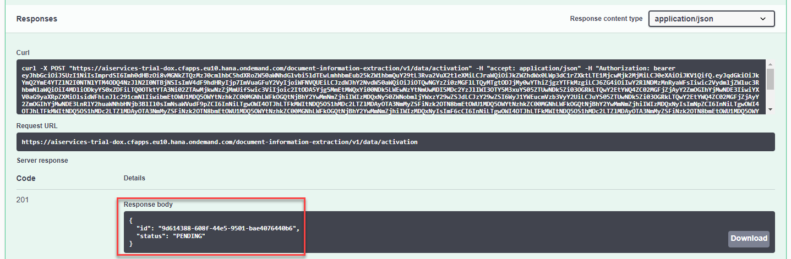

>If you have already used this endpoint recently, you should receive a response like the following:

>!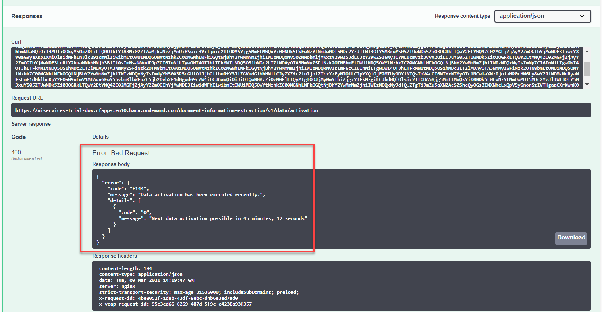

>Wait until next data activation is possible to perform this step once again before moving to step 8.

[DONE]
[ACCORDION-END]


[ACCORDION-BEGIN [Step 8: ](Upload document to get prediction with enrichment data)]

>Document Information Extraction uses a globally pre-trained machine learning model that currently obtains better accuracy results with invoices and payment advices in the languages listed in [Supported Languages and Countries](https://help.sap.com/viewer/5fa7265b9ff64d73bac7cec61ee55ae6/SHIP/en-US/5bf847f7d1a848dcb3513eff9ec70412.html). The team is working to support additional document types and languages in the near future.

When enrichment data has been uploaded and fits to a certain prediction it is added to the results from the **GET /document/jobs/{`id`}** endpoint. To have the enrichment data in the prediction, you need to have the following part in the query of the **POST /document/jobs** endpoint (it is usually already there by default):

```JSON
"enrichment": {
    "sender": {
      "top": 5,
      "type": "businessEntity",
      "subtype": "supplier"
    },
    "employee": {
      "type": "employee"
    }
}
```

Do the following:

1. Expand the **POST /document/jobs** endpoint.

2. Click **Try it out**.

3. Right click [Sample Invoice 1](https://raw.githubusercontent.com/SAPDocuments/Tutorials/master/tutorials/cp-aibus-dox-swagger-ui/data/sample-invoice-1.pdf), then click ***Save link as*** to download locally the document file for this enrich business data example.
> You can also upload to the service and enrich any document file in PDF or single-page PNG and JPEG format that has content in headers and tables, such as an invoice. In this case, make sure the data you define in the **`payload`** field, in step 4, matches your document fields.

4. Upload the document file you want to enrich.

5. In **options**, enter the list of fields to be extracted from the uploaded file (`documentNumber`, `taxId`, `purchaseOrderNumber`, `shippingAmount`, `netAmount`, `senderAddress`, `senderName`, `grossAmount`, for example), the client id you created in step 3 (`c_29`, for example), the document type (`invoice`, for example), `receivedDate` (2020-02-17, for example), the enrichment data type `businessEntity` and subtype `supplier`.

    ```JSON
    {
       "extraction":{
          "headerFields":[
             "documentNumber",
             "taxId",
             "purchaseOrderNumber",
             "shippingAmount",
             "netAmount",
             "senderAddress",
             "senderName",
             "grossAmount",
             "currencyCode",
             "receiverContact",
             "documentDate",
             "taxAmount",
             "taxRate",
             "receiverName",
             "receiverAddress"
          ],
          "lineItemFields":[
             "description",
             "netAmount",
             "quantity",
             "unitPrice",
             "materialNumber"
          ]
       },
       "clientId":"c_29",
       "documentType":"invoice",
       "receivedDate":"2020-02-17",
       "enrichment":{
          "sender":{
             "top":5,
             "type":"businessEntity",
             "subtype":"supplier"
          },
          "employee":{
             "type":"employee"
          }
       }
    }
    ```

6. Click **Execute**.

This is how the request should look like:

!

And that's how the response looks like:

!

Copy the **`id`** from the **Response body** to get enrichment data prediction in the next step.

[DONE]
[ACCORDION-END]


[ACCORDION-BEGIN [Step 9: ](Get enrichment data prediction)]

When enrichment data has been uploaded and fits to a certain prediction it is added to the results from the **GET /document/jobs/{`id`}** endpoint.

> Enrichment data is refreshed automatically every 4 hours. It might take up to 4 hours until the enrichment data prediction is available in the response. If the enrichment data prediction is NOT available in the response in your first try, perform again (some hours later) steps 6 and 7. Do not perform steps 9 and 10 before you see the enrichment data prediction in the response in step 7.

1. Expand the **GET /document/jobs/{`id`}** endpoint.

2. Click **Try it out**.

3. Set **`returnNullValues`** and **`extractedValues`** to `true`.

4. Enter the **`id`** received in the **POST /document/jobs** endpoint as the **`id`**.

5. Click **Execute**.

!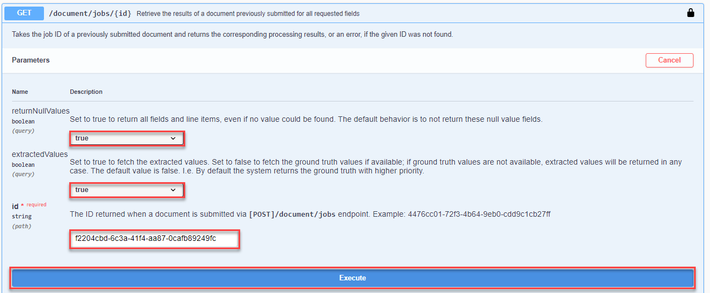

You should receive a response like the following:

!

> ### What just happened?
>
> In this example, in the response, one of the extracted fields is the sender name Sliced Invoices. This information is enriched with the supplier ID enrichment data created in step 4. The prediction suggests the supplier ID BE0001 (from sender name Sliced Invoices) with higher probability than the supplier ID BE0002 (from sender name Sliced).

You have now successfully used the business entity to get enrichment data predictions for the document you uploaded to Document Information Extraction.

[DONE]
[ACCORDION-END]


[ACCORDION-BEGIN [Step 10: ](See all enrichment data entries)]

To see a list of the enrichment data entries you have created:

1. Expand the **GET /data** endpoint.

2. Click **Try it out**.

3. Choose the enrichment data **`type`** `businessEntity`.

4. Enter your **`clientId`**.

5. Choose the enrichment data **`subtype`** `supplier`.

6. Click **Execute**.

!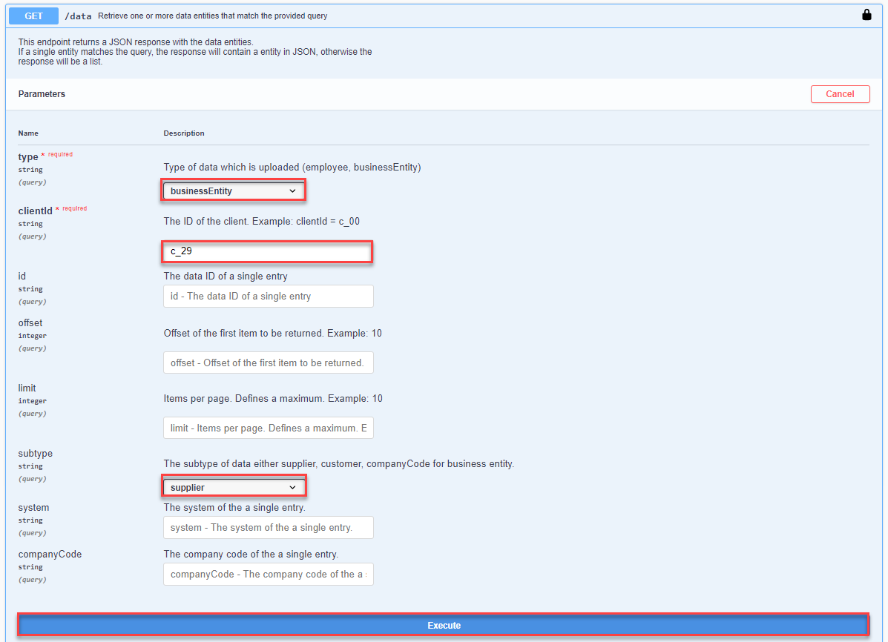

You should receive a response like the following:

!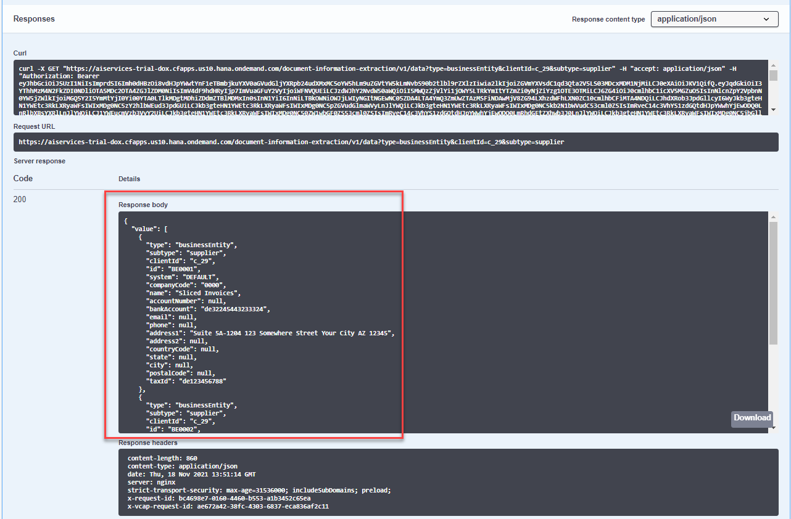

[DONE]
[ACCORDION-END]


[ACCORDION-BEGIN [Step 11: ](Delete enrichment data)]

To delete enrichment data which has been uploaded before:

1. Expand the **DELETE /data** endpoint.

2. Click **Try it out**.

3. Define the data in the **`payload`** field, so that the system knows which data entry (using, for example, the data entry ID) should be deleted.

    ```JSON
    {
       "value":[
          {
             "id":"BE0001"
          },
          {
             "id":"BE0002"
          }
       ]
    }
    ```

4. Choose the enrichment data **`type`** `businessEntity`.

5. Enter your **`clientId`**.

6. Choose the enrichment data **`subtype`** `supplier`.

7. Click **Execute**.

!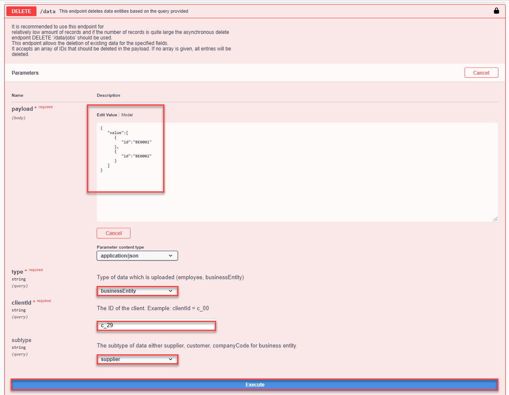

You should receive a response like the following:

!

You can repeat step 2 and delete the client you created in step 3.

Congratulations, you have completed this tutorial.

[DONE]
[ACCORDION-END]
