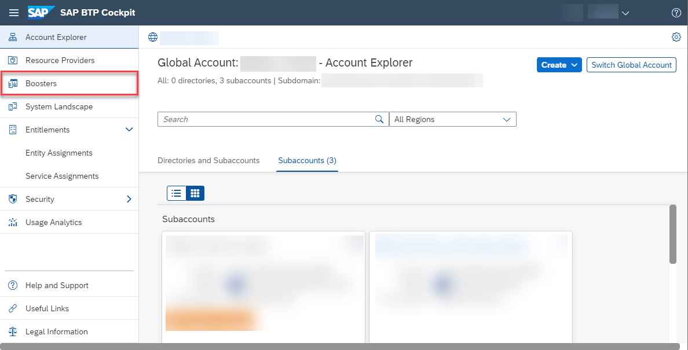
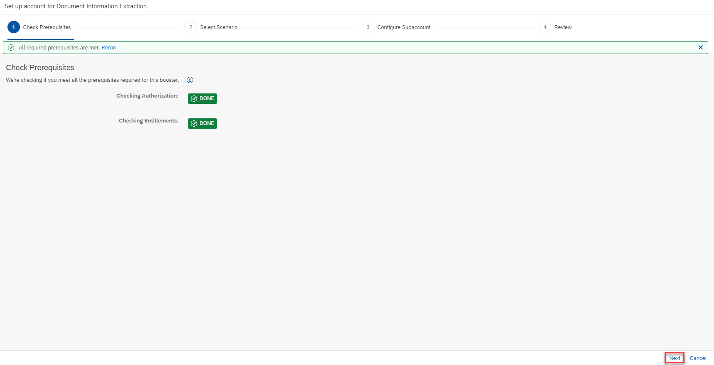
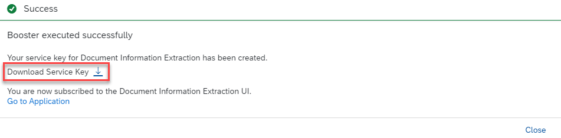
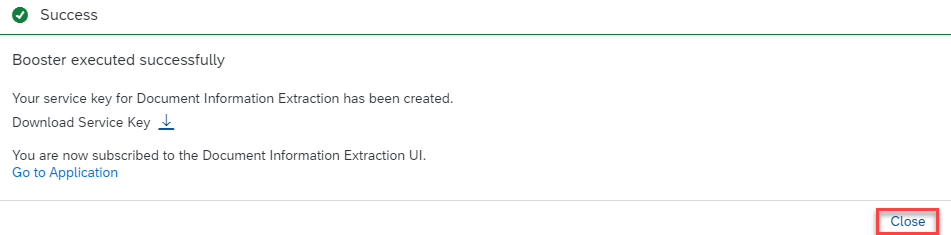
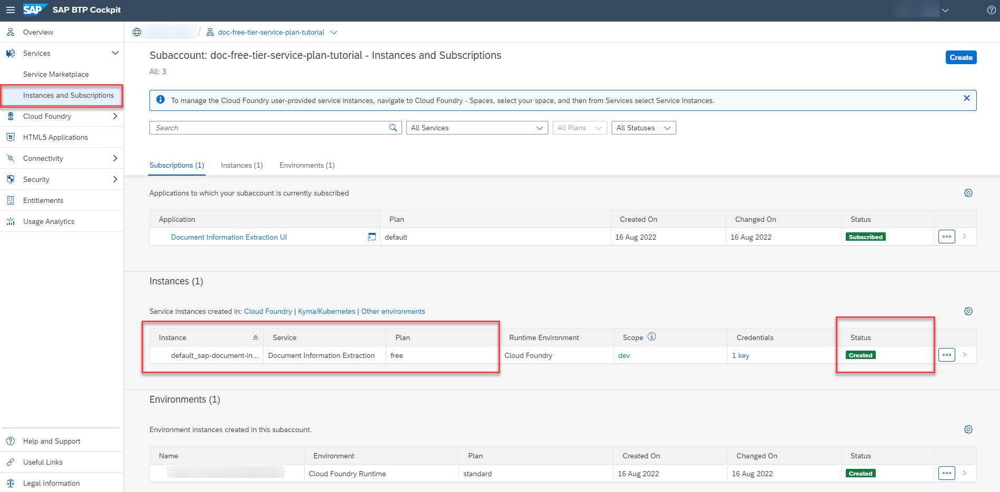
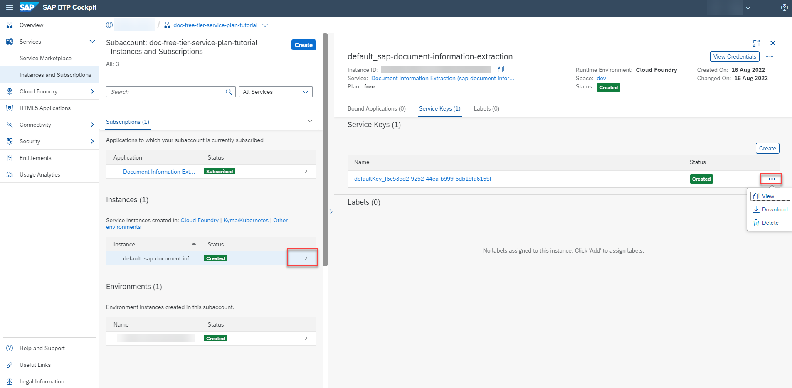

# Use Free Tier to Set Up Account for SAP Document AI and Get Service Key
<!-- description --> Use the free tier service plan and an SAP BTP booster to automatically create a service instance, and the associated service key for SAP Document AI.

## Prerequisites
- You have created an account on SAP BTP to try out free tier service plans: [Get an Account on SAP BTP to Try Out Free Tier Service Plans](btp-free-tier-account)
- You are entitled to use the SAP Document AI service: [Manage Entitlements Using the Cockpit](btp-cockpit-entitlements)

## You will learn
  - How to access your SAP BTP account
  - What are interactive guided boosters
  - How to use the **Set up account for SAP Document AI** booster to assign entitlements, update your subaccount (or create a new one), create a service instance and the associated service key for SAP Document AI

---

### Go to your SAP BTP account

1. Open the [SAP BTP cockpit](https://account.hana.ondemand.com/cockpit#/home/allaccounts).

2. Access your global account.

    <!-- border -->

### Run booster

SAP Business Technology Platform creates interactive guided boosters to automate cockpit steps, so users can save time when trying out the services.

Now, you will use the **Set up account for SAP Document AI** booster to automatically assign entitlements, update your subaccount (or create a new one), create a service instance and the associated service key for SAP Document AI.

1. On the navigation side bar, click **Boosters**.

    <!-- border -->

2. Search for **SAP Document AI** and click **Start**.

    <!-- border -->

3. Click **Next**.

    <!-- border -->

4. If you want to create a dedicated subaccount for the service instance, choose **Create Subaccount**. If you want to use an already created subaccount, choose **Select Subaccount** (the selection comes in the next step). For this tutorial, we'll create a dedicated subaccount. When you're done with the selection, click **Next**.

    <!-- border -->

5. Choose the **free** plan. You can also rename the subaccount to `doc-ai-free-tier-service-plan-tutorial`, for example. Choose the region closest to you. For this tutorial, we'll use **Europe (Frankfurt)**. Click **Next**.

    <!-- border -->

    >You can also perform this tutorial series using the following service plans intended for productive use: Premium Edition (premium_edition) or Base Edition (blocks_of_100). To do so, choose either the `premium_edition` or the `blocks_of_100` plan in this step (instead of free). For more information on the service plans available for SAP Document AI, see [Service Plans](https://help.sap.com/docs/DOCUMENT_INFORMATION_EXTRACTION/5fa7265b9ff64d73bac7cec61ee55ae6/2c17b2aa8d6b4fa8a5c6259a33feb360.html).

6. Click **Finish**.

    <!-- border -->

    Follow the progress of the booster automated tasks.

    <!-- border -->

    When the automated tasks are done, see the **Success** dialog box.

    <!-- border -->

### Get service key

You have successfully used the booster **Set up account for SAP Document AI** to create a service key for SAP Document AI.

Click **Download Service Key** to save the service key locally on your computer.

<!-- border -->

>If you face any issue with the booster **Set up account for SAP Document AI**, you can alternatively follow the steps in [Use Free Tier to Create a Service Instance for SAP Document AI](cp-aibus-dox-free-service-instance) to manually create the service instance and service key for SAP Document AI using the free tier service plan.

Step 4 is optional. If you're not interested, you can set it to **Done** and go directly to the next tutorial.

### Access service instance and service key (optional)

> This is an optional step. Use it only if you want to access the service instance and service key, you created with the **Set up account for SAP Document AI** booster, without having to run it once again.

Do the following to access your service instance and service key, without having to run the **Set up account for SAP Document AI** booster once again:

1. Close the booster **Success** dialog box.

    <!-- border -->

2. Click **Account Explorer** on the navigation side bar and access the subaccount you used to create the service instance and service key for SAP Document AI.

    <!-- border -->

3. Click **Instances and Subscriptions** on the navigation side bar. You see the service instance you created with the **Set up account for SAP Document AI** booster.

    <!-- border -->

4. Click the navigation arrow to open the details of your service instance. Select **Service Keys (1)**. Then, click the dots to **View**, **Download** or **Delete** your service key.

    <!-- border -->

Congratulations, you've completed this tutorial.