# Use Free Tier to Create a Service Instance for SAP Document AI
<!-- description --> Use the free tier service plan to create a service instance and the associated service key for SAP Document AI using the free tier service plan.

## Prerequisites
- You have created an account on SAP BTP to try out free tier service plans: [Get an Account on SAP BTP to Try Out Free Tier Service Plans](btp-free-tier-account)
- You are entitled to use SAP Document AI: [Manage Entitlements Using the Cockpit](btp-cockpit-entitlements)

## You will learn
  - How to check your subaccount entitlements and add SAP Document AI
  - How to create a service instance of SAP Document AI
  - How to create a service key for your service instance

---

### Access the SAP BTP cockpit

1. Open the [SAP BTP cockpit](https://cockpit.btp.cloud.sap).

2. Click the tile to access your subaccount.

<!-- border -->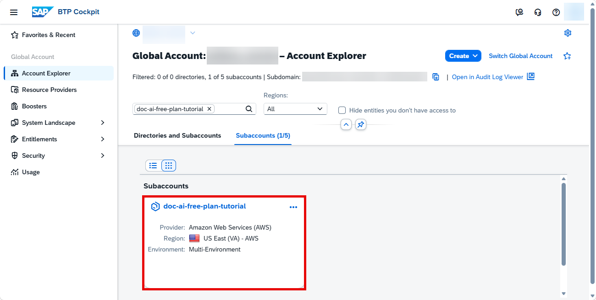

### Check your entitlements

To use SAP Document AI, you need to make sure that your account is properly configured.

1. On the navigation side bar, click **Entitlements** to see a list of all eligible services. You are entitled to use every service in this list according to the assigned service plan.

2. Search for `SAP Document AI`. ***If you find it in the list, you are entitled to use it. Now you can set this step to **Done** and proceed with Step 3.***

<!-- border -->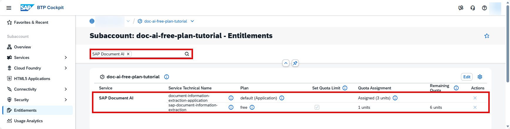

***ONLY if you DO NOT find `SAP Document AI` in your list, proceed as follows:***

  1.  Click **Edit**.

    <!-- border -->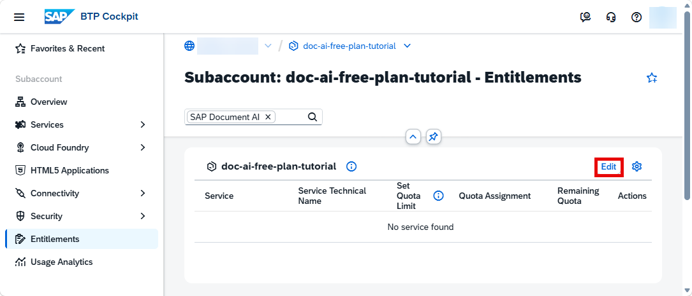

  2.  Click **Add Service Plans**.

    <!-- border -->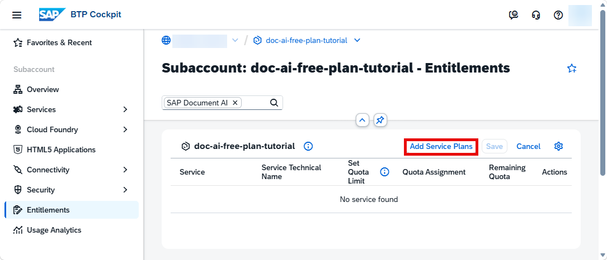

  3.  Search for `SAP Document AI`. Choose the `free (Free Tier)` and `default (Application)` service plans. Click **Add 2 Service Plans**.

    >You can also perform this tutorial series using the following service plans intended for productive use: base edition (blocks_of_100), embedded edition (embedded_edition), or premium edition (premium_edition). To do so, choose either the `blocks_of_100`, `embedded_edition`, or `premium_edition` plan in this step (instead of `free`). For more information about the service plans available for SAP Document AI, see [Service Plans](https://help.sap.com/docs/document-information-extraction/document-information-extraction/service-plans).

    <!-- border -->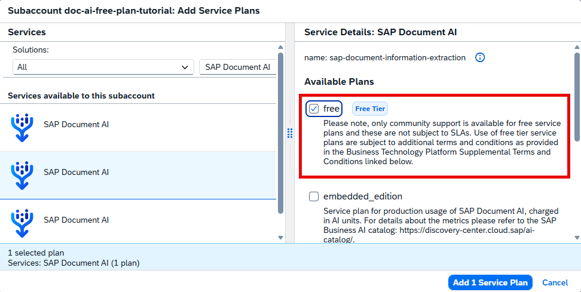

    <!-- border -->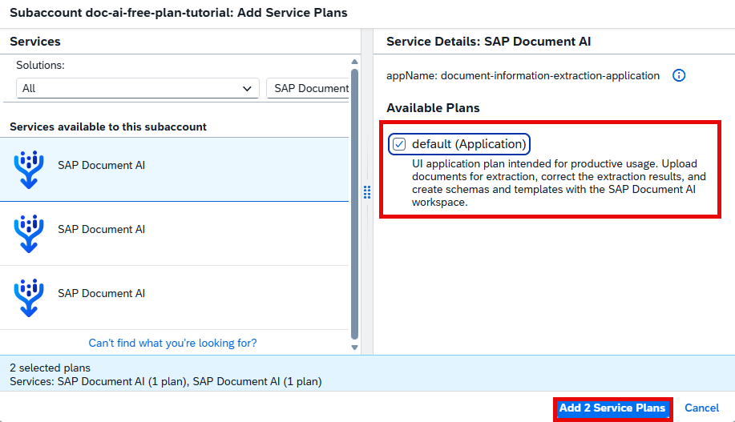

  4.  Click **Save** to save your entitlement changes.

    <!-- border -->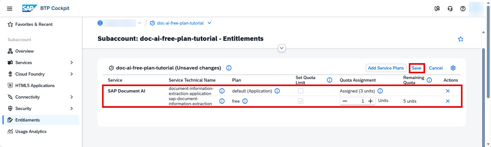

You are now entitled to use SAP Document AI and create service instances.

### Create service instance

The Service Marketplace is where you find all the services available on SAP BTP. You'll now create a service instance of SAP Document AI.

1.  Click **Service Marketplace** on the navigation side bar. Search for **SAP Document AI** and click the tile to access it.

    <!-- border -->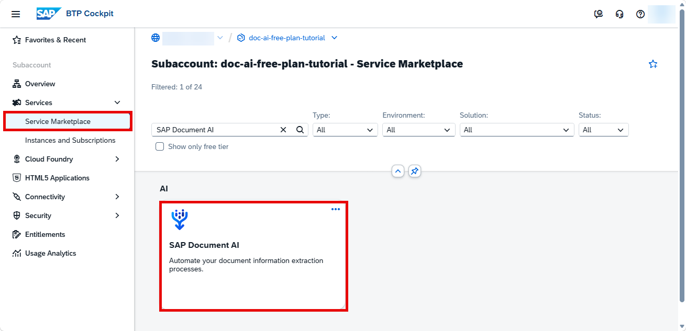

2. Click **Create** to start the service instance creation dialog.

    <!-- border -->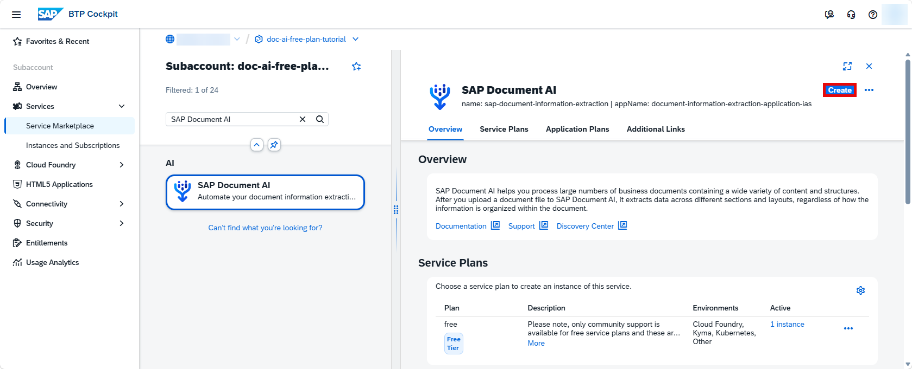

3. In the dialog, choose the `free` plan. Enter a name for your new instance, for example, `doc-ai-instance` and click **Create**.

    >Choose `blocks_of_100` in this step (instead of `free`) if you're using the base edition plan to perform this tutorial series.
    >Choose `embedded_edition` in this step (instead of `free`) if you're using the embedded edition plan to perform this tutorial series.
    >Choose `premium_edition` in this step (instead of `free`) if you're using the premium edition plan to perform this tutorial series.

    <!-- border -->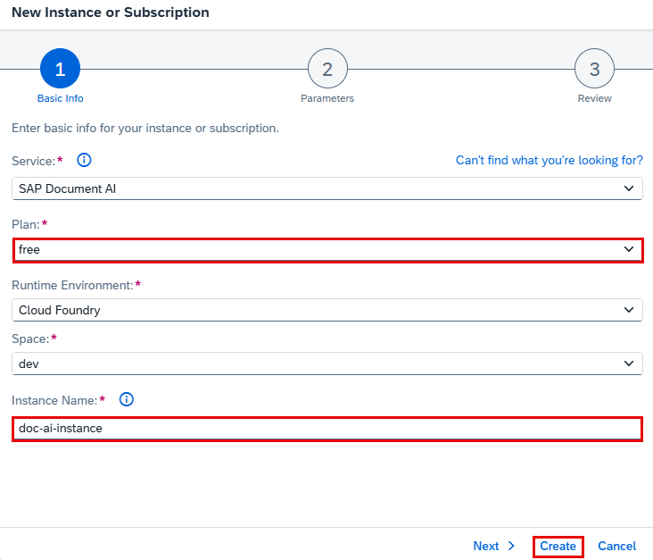

4. In the following dialog, click on **View Instance** to navigate to the list of your service instances.

    <!-- border -->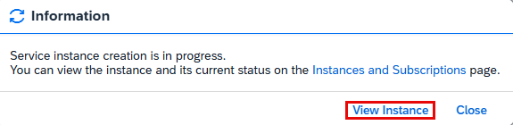

You have successfully created a service instance for SAP Document AI.

### Create service key

You are now able to create a service key for your new service instance. Service keys are used to generate credentials to enable apps to access and communicate with the service instance.

1. Click the dots to open the menu and select **Create Service Key**.

    <!-- border -->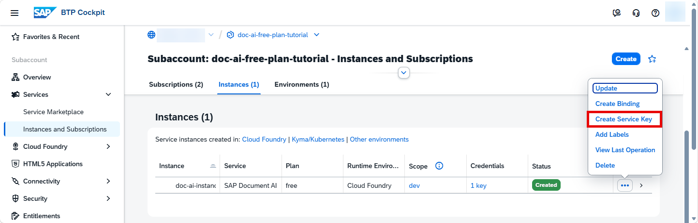

2. In the dialog, enter `doc-ai-key` as the name of your service key. Click **Create** to create the service key.

    <!-- border -->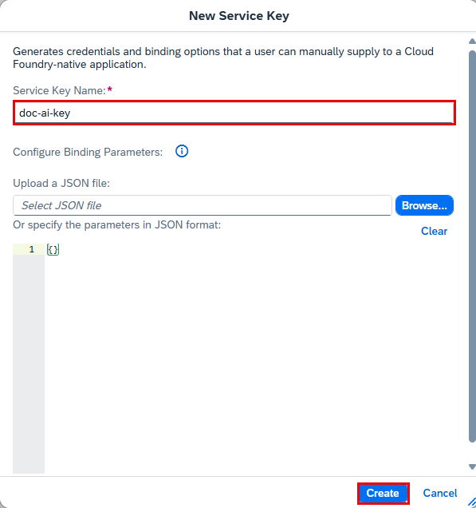

You have successfully created a service key for your service instance. You can now view the service key in the browser or download it.

<!-- border -->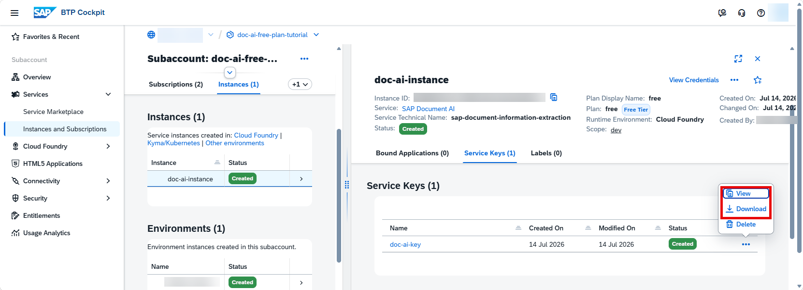