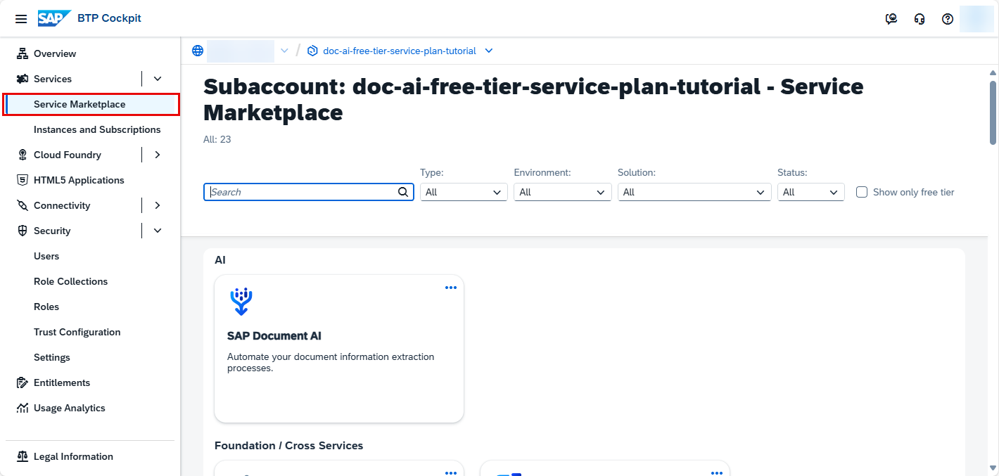
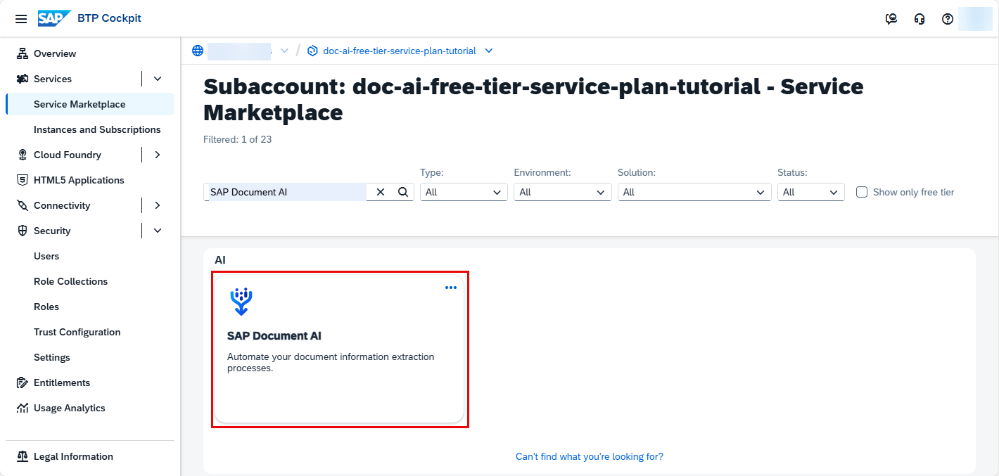
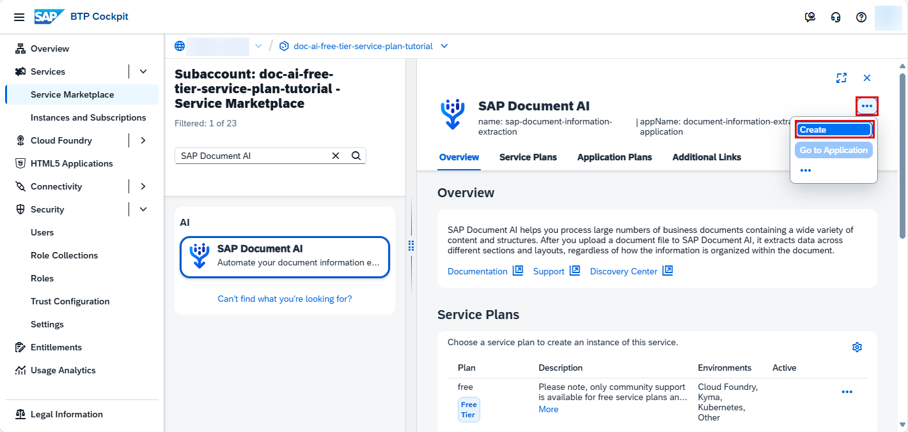

# Use Free Tier to Subscribe to SAP Document AI Basic UI
<!-- description --> Use the free tier service plan to get access to the SAP Document AI user interface application, using SAP Business Technology Platform (SAP BTP).

## Prerequisites
- You have created a service instance for SAP Document AI: [Use Free Tier to Create a Service Instance for SAP Document AI](cp-aibus-dox-free-service-instance)

## You will learn
  - How to check your subaccount entitlements and add SAP Document AI basic UI
  - How to subscribe, assign role collection and access SAP Document AI basic UI

---

### Access the SAP BTP cockpit

After completing the prerequisite tutorial [Use Free Tier to Create a Service Instance for SAP Document AI](cp-aibus-dox-free-service-instance), to create a service instance for SAP Document AI, you can start with the steps to subscribe to the SAP Document AI basic UI.

1. Open the [SAP BTP cockpit](https://account.hana.ondemand.com/cockpit#/home/allaccounts).

2. Access your global account.

    <!-- border -->

3. Click the tile to access your subaccount.

<!-- border -->

### Get subscribed

1. On the navigation side bar, click **Service Marketplace**.

    <!-- border -->

2. Search for **SAP Document AI** and click the tile.

    <!-- border -->

3. Click **Create**.

    <!-- border -->

4. In the dialog, choose the `default (Subscription)` plan and click **Create** once again.

  <!-- border -->

The subscription will now be created. Click on **View Subscription** to go to the list of your existing subscriptions.

<!-- border -->

### Assign role collection

1. Under **Security**, click **Users** and then the **Actions** arrow.

    <!-- border -->    

2. Click **Assign Role Collection**.

    <!-- border -->

3. Choose **`Document_Information_Extraction_UI_Templates_Admin`** to access all the features available in the UI application and click **Assign Role Collection**.

    <!-- border -->

You're now assigned to the **`Document_Information_Extraction_UI_Templates_Admin`** role collection.

<!-- border -->

### Go to application

Go back to **Instances and Subscriptions**, click the dots to open the menu and select **Go to Application** to open the app.

<!-- border -->

The SAP Document AI basic UI is displayed:

<!-- border -->

You've successfully subscribed to the SAP Document AI application.