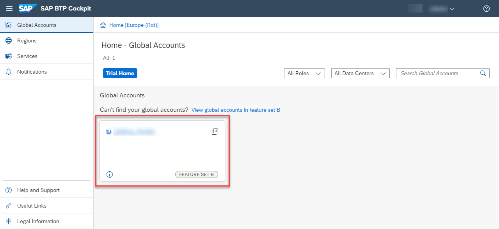
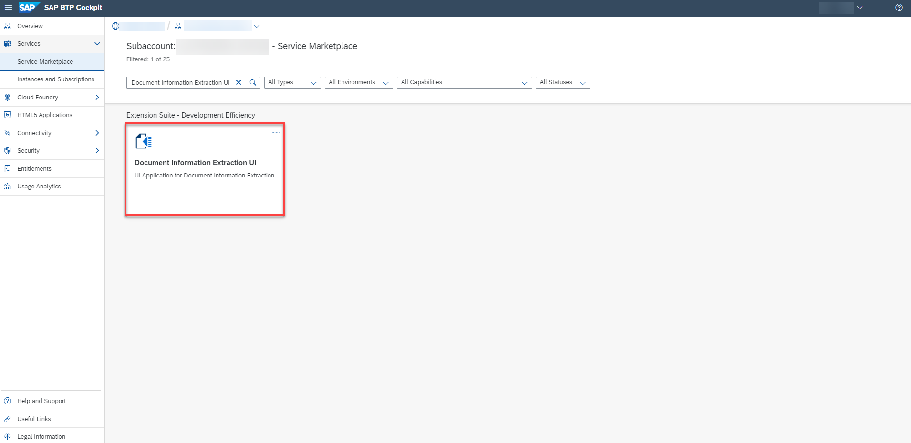
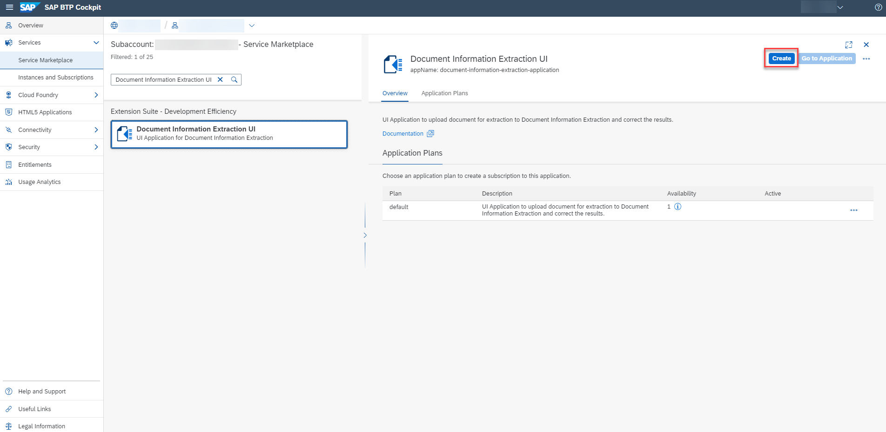
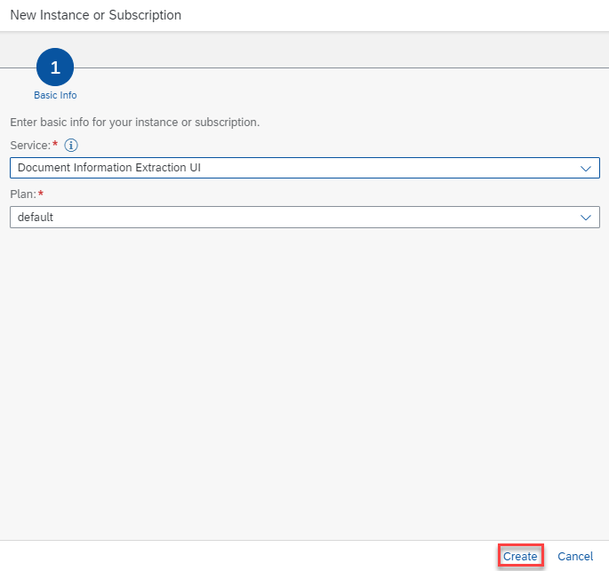
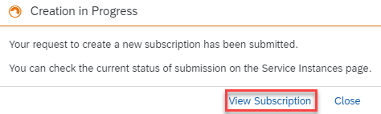
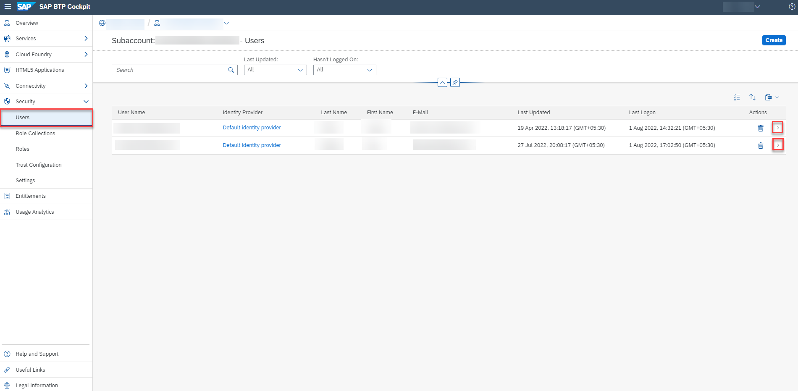
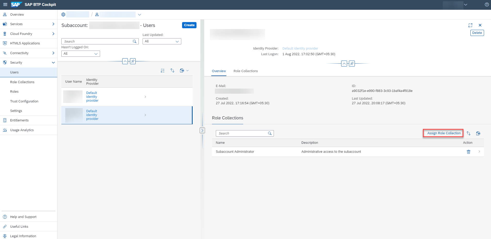
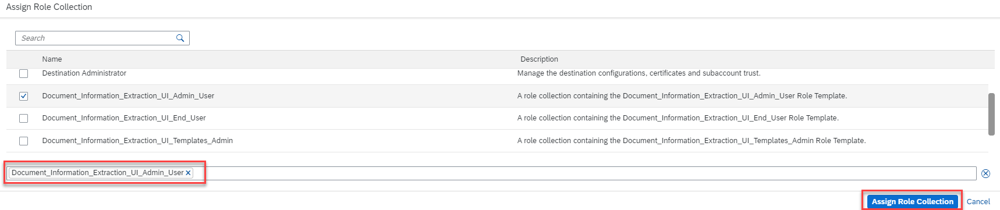
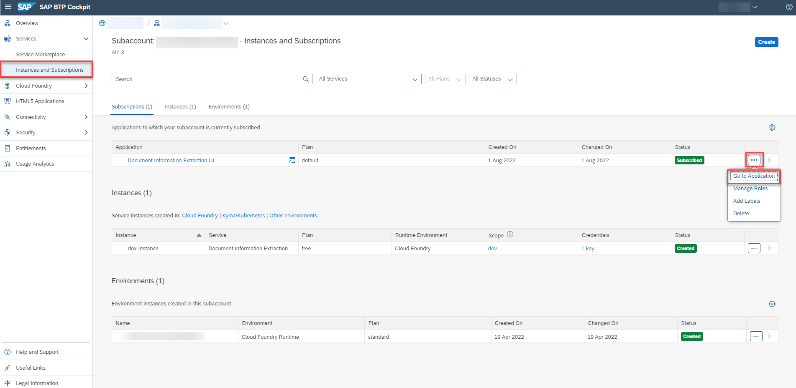

# Use Free Tier to Subscribe to Document Information Extraction UI
<!-- description --> Use the free tier service plan to get access to the Document Information Extraction user interface application, using SAP Business Technology Platform (SAP BTP).

## Prerequisites
- You have created a service instance for Document Information Extraction: [Use Free Tier to Create a Service Instance for Document Information Extraction](cp-aibus-dox-free-service-instance)

## You will learn
  - How to check your subaccount entitlements and add Document Information Extraction UI
  - How to subscribe, assign role collection and access Document Information Extraction UI

---

### Access the SAP BTP cockpit

After completing the prerequisite tutorial [Use Free Tier to Create a Service Instance for Document Information Extraction](cp-aibus-dox-free-service-instance), to create a service instance for Document Information Extraction, you can start with the steps to subscribe to the Document Information Extraction UI.

1. Open the [SAP BTP cockpit](https://account.hana.ondemand.com/cockpit#/home/allaccounts).

2. Access your global account.

    <!-- border -->

3. Click the tile to access your subaccount.

<!-- border -->

### Check entitlements

To use Document Information Extraction UI, you need to make sure that your account is properly configured.

1. On the navigation side bar, click **Entitlements** to see a list of all eligible services. You are entitled to use every service in this list according to the assigned service plan.

2. Search for `Document Information Extraction UI`. ***If you find the service in the list, you are entitled to use it. Now you can set this step to **Done** and proceed with Step 3.***

    <!-- border -->

***ONLY if you DO NOT find the service in your list, proceed as follows:***

  1.  Click **Configure Entitlements**.

    <!-- border -->

  2.  Click **Add Service Plans**.

    <!-- border -->

  3.  In the dialog, select `Document Information Extraction UI` and choose the `default` service plan. Click **Add 1 Service Plan**.

    <!-- border -->

  4.  Click **Save** to save your entitlement changes.

    <!-- border -->

### Get subscribed

1. On the navigation side bar, click **Service Marketplace**.

    <!-- border -->

2. Search for **Document Information Extraction UI** and click the tile.

    <!-- border -->

3. Click **Create**.

    <!-- border -->

4. In the dialog, click **Create** once again.

  <!-- border -->

The subscription will now be created. Click on **View Subscription** to go to the list of your existing subscriptions.

<!-- border -->

### Assign role collection

1. Under **Security**, click **Users** and then the **Actions** arrow.

    <!-- border -->    

2. Click **Assign Role Collection**.

    <!-- border -->

3. Choose **`Document_Information_Extraction_UI_Admin_User`** to access all the features available in the UI application and click **Assign Role Collection**.

    <!-- border -->

You're now assigned to the **`Document_Information_Extraction_UI_Admin_User`** role collection.

<!-- border -->

### Go to application

Go back to **Instances and Subscriptions**, click the dots to open the menu and select **Go to Application** to open the app.

<!-- border -->

The Document Information Extraction UI is displayed:

<!-- border -->

You have successfully subscribed to the Document Information Extraction UI.

