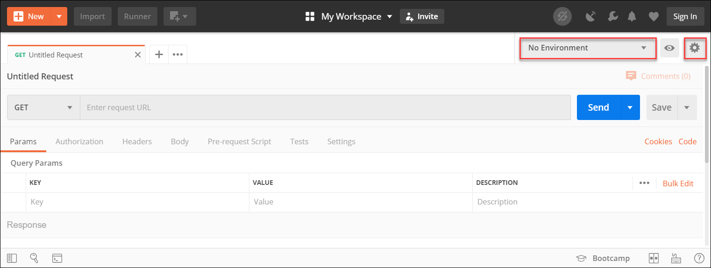
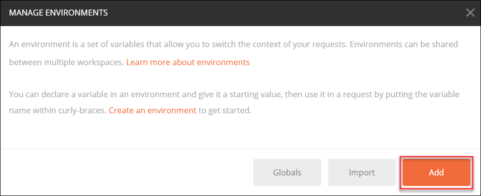
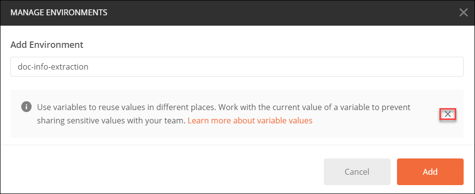
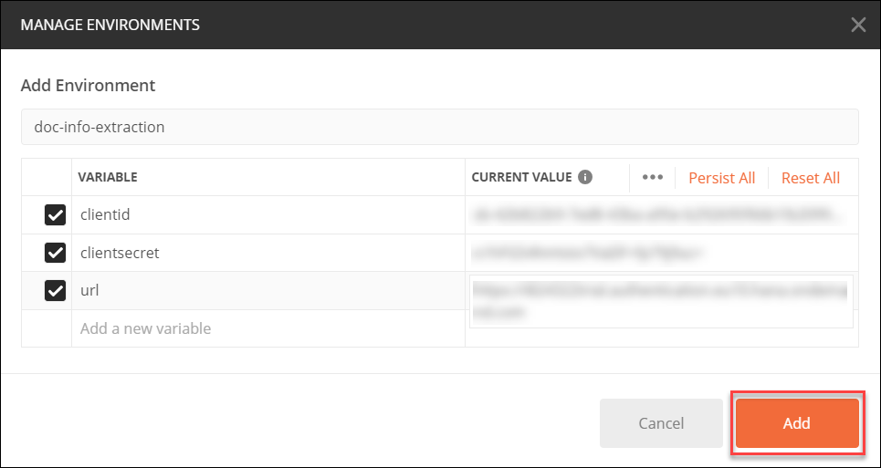
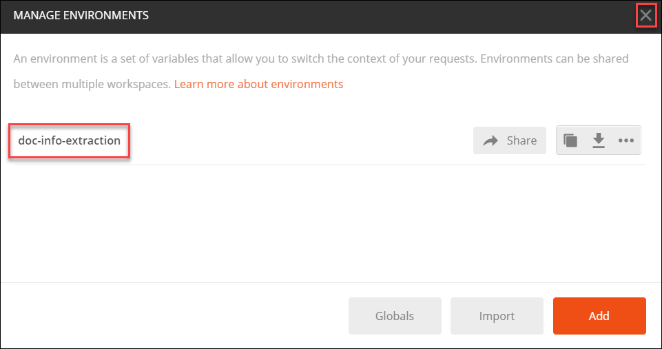
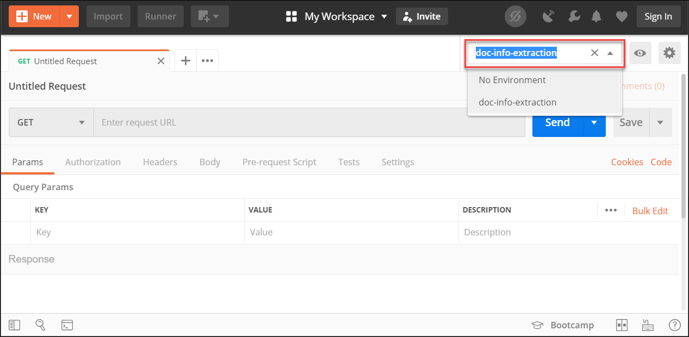
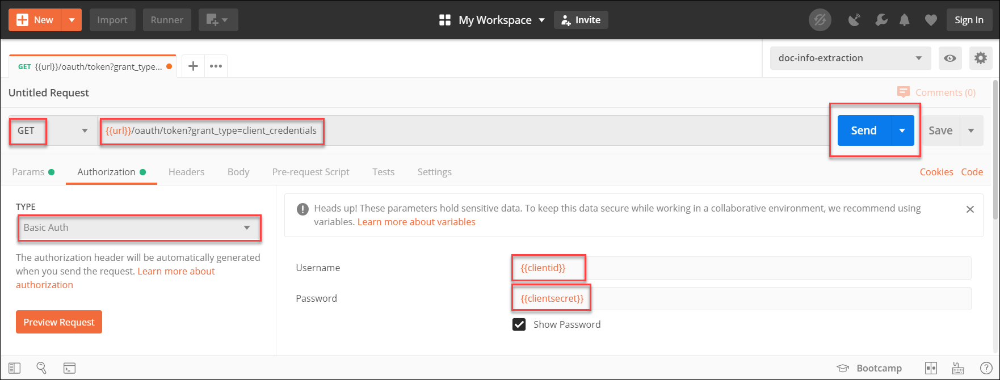
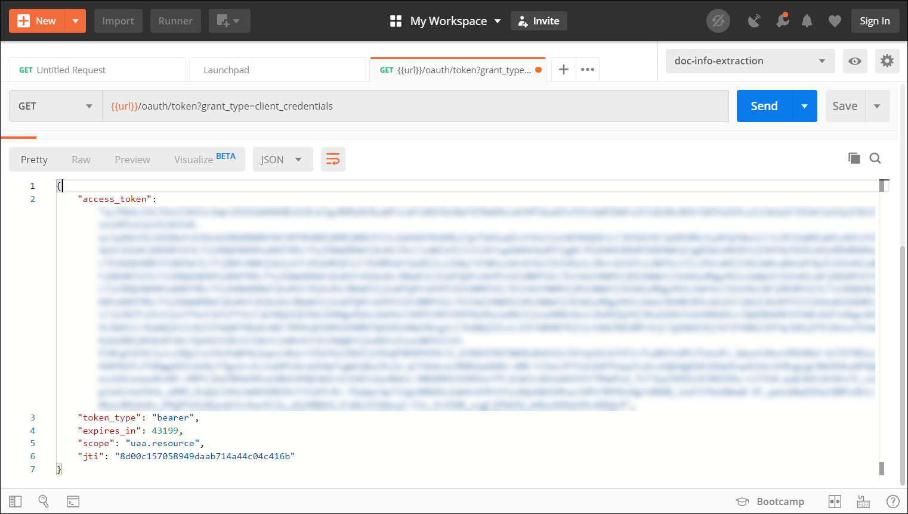

## Details
### You will learn
  - The basics about user account and authentication on the Cloud Foundry environment
  - The basics about Postman environment variables
  - How to call an API from Postman  

---

[ACCORDION-BEGIN [Step 1: ](Get OAuth access token details)]

To get your OAuth access token you will need some details provided by the service key you created in [Create Service Instance for Document Information Extraction](cp-aibus-dox-service-instance):

Here is a description of values returned in your service key you'll need in upcoming steps:

|Name                                                         | Description
|-------------------------------------------------------------|--------------------
| **`clientid`**                                              | OAuth client ID
| **`clientsecret`**                                          | OAuth client secret
| **`url`** (inside the **`uaa`** section of the service key) | Authentication (XSUAA) server URL

[DONE]
[ACCORDION-END]

[ACCORDION-BEGIN [Step 2: ](Create Postman environment)]

[Postman](https://learning.getpostman.com/) is a client for calling APIs. In order to ease the re-usability of your OAuth access token, you will leverage Postman's environment feature.

In Postman, you can create environments, which represent key-value pairs that can be reused in requests so that you don't have to remember them. For more information, see [Postman Environments](https://learning.getpostman.com/docs/postman/environments-and-globals/intro-to-environments-and-globals/).

1. After following the steps described in [Install Postman as a REST client](api-tools-postman-install), open Postman.

    By default, **No environment** will be set up.

    

2. Click the gear icon then select **Manage Environments**.

3. Click on **Add**.

    

4. Enter **`doc-info-extraction`**.

    

    Close the information message using the cross as highlighted on the previous screenshot.

5. Enter the values from your service key, as detailed in the 2 images below.

    

      

5. Click **Add**.

    Select the cross in the top right corner to leave the environment creation popup.

    

6. Select the **doc-info-extraction** environment from the list.

    

[DONE]
[ACCORDION-END]

[ACCORDION-BEGIN [Step 3: ](Prepare OAuth token request)]

1. Open a new tab in Postman.

2. Fill in the following information:

    Field Name               | Value
    :----------------------- | :--------------
    <nobr>HTTP Method</nobr> | GET
    <nobr>URL</nobr>         | `{{url}}/oauth/token?grant_type=client_credentials`

3. On the **Authorization** tab, select **`Basic Auth`**, then enter:

    - **`{{clientid}}`** as username
    - **`{{clientsecret}}`** as password.

    > **`{{url}}`**,  **`{{clientid}}`** and **`{{clientsecret}}`**  will be automagically replaced by your environment variable.


[VALIDATE_1]
[ACCORDION-END]

[ACCORDION-BEGIN [Step 4: ](Send OAuth token request)]

Click **Send**.



You should receive the following response:



```
{
    "access_token": "<< your access token >>",
    "token_type": "bearer",
    "expires_in": 43199,
    "scope": "uaa.resource",
    "jti": "8d00c157058949daab714a44c04c416b"
}
```

You have successfully generated your OAuth access token for the service and you are now all set to [Use Swagger UI to Call Document Information Extraction APIs](cp-aibus-dox-swagger-ui).

[DONE]
[ACCORDION-END]
