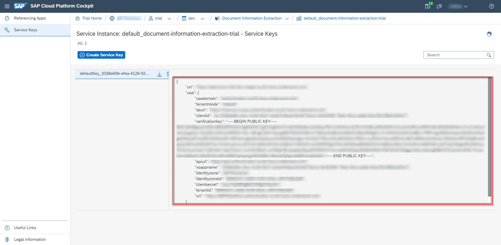

## Details
### You will learn
  - How to access your trial account
  - What are interactive guided boosters
  - How to use the **Set up account for Document Information Extraction** booster to assign entitlements, update your subaccount, create a service instance and the associated service keys for Document Information Extraction.
 
---

[ACCORDION-BEGIN [Step 1: ](Enter your trial account)]

1. In your web browser, open the [SAP Cloud Platform trial cockpit](https://cockpit.hanatrial.ondemand.com/).

2. Navigate to the trial global account by clicking **Enter Your Trial Account**.

    !

    >If this is your first time accessing your trial account, you'll have to configure your account by choosing a region. Your user profile will be set up for you automatically.

    >Wait till your account is set up and ready to go. Your global account, your subaccount, your organization, and your space are launched. This may take a couple of minutes.

    >Choose **Continue**.

    >!

[DONE]
[ACCORDION-END]

[ACCORDION-BEGIN [Step 2: ](Get service keys)]

SAP Cloud Platform creates interactive guided boosters to automate trial cockpit steps, so users can save time when trying out the services.

Now, you will use the **Set up account for Document Information Extraction** booster to automatically assign entitlements, update your subaccount, create a service instance and the associated service keys for Document Information Extraction.

1. On the navigation side bar, click **Boosters**.

    !

2. Search for **Set up account for Document Information Extraction** and click the tile to access the booster.

    !

3. Click **Start**.

    !

4. Click **Navigate to Service Key**.

    !

>If you have more than one subaccount, the booster will choose automatically the correct subaccount and space, but this will require that you click **Next** twice and **Finish** once before being able to see the **Success** pop-up box and click **Navigate to Service Key**.

You have successfully used the booster **Set up account for Document Information Extraction** to create service keys for Document Information Extraction. Make a local copy of the service keys. You will need the service key values to create your `access_token` in the next tutorial: [Get OAuth Access Token for Document Information Extraction Using Any Web Browser](cp-aibus-dox-web-oauth-token).

!

>If you face any issue with the booster **Set up account for Document Information Extraction**, you can alternatively follow the steps in [Create Service Instance for Document Information Extraction](cp-aibus-dox-service-instance) to create service keys for Document Information Extraction manually.

[VALIDATE_1]
[ACCORDION-END]
