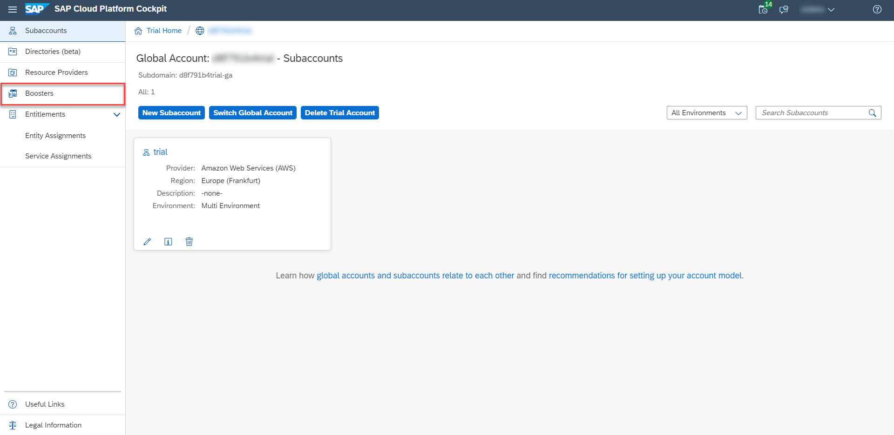
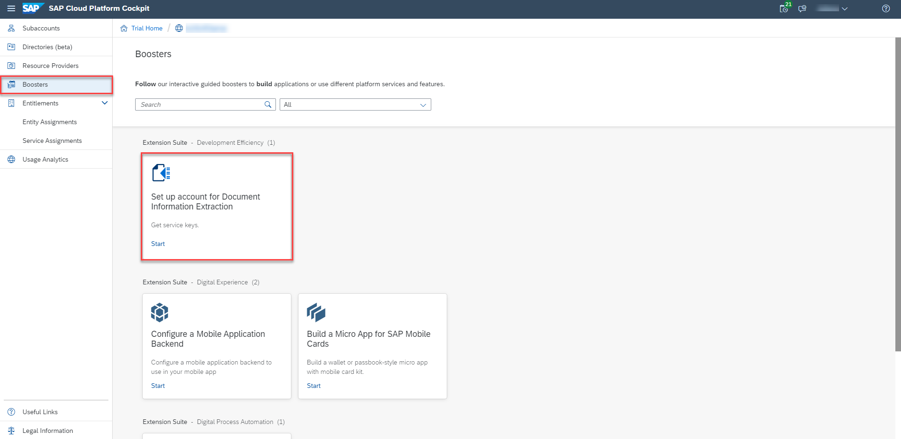
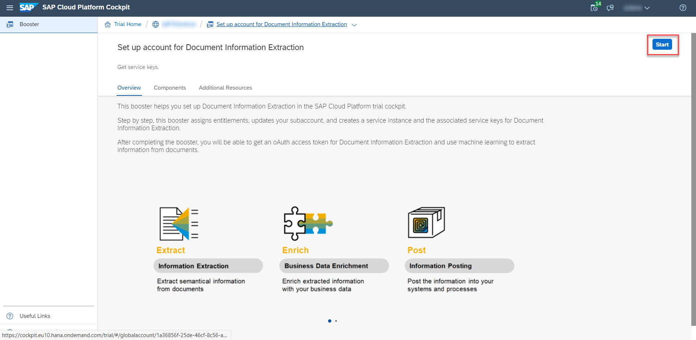
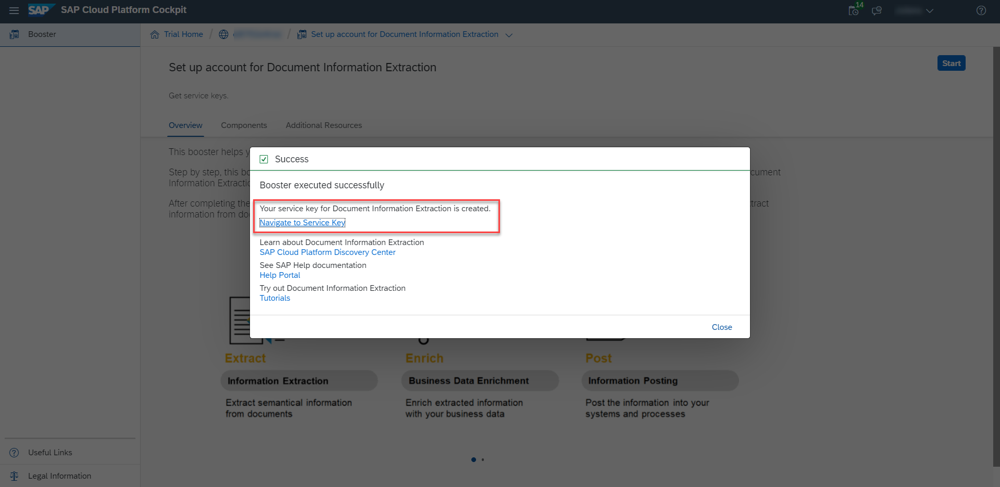
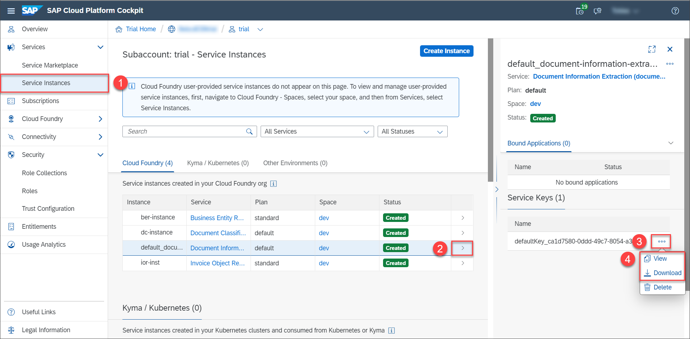

## Prerequisites
- You have created a trial account on SAP Cloud Platform: [Get a Free Trial Account on SAP Cloud Platform](hcp-create-trial-account)
- You have a subaccount and dev space with **Europe (Frankfurt)** or **US East (VA)** as region: [Manage Entitlements on SAP Cloud Platform Trial](cp-trial-entitlements). See also [Create a Subaccount](https://help.sap.com/viewer/65de2977205c403bbc107264b8eccf4b/Cloud/en-US/261ba9ca868f469baf64c22257324a75.html).

## Details
### You will learn
  - How to access your trial account
  - What are interactive guided boosters
  - How to use the **Set up account for Document Information Extraction** booster to assign entitlements, update your subaccount, create a service instance and the associated service key for Document Information Extraction. With this booster you can also subscribe to and access the Document Information Extraction UI.
---

[ACCORDION-BEGIN [Step 1: ](Enter your trial account)]

1. In your web browser, open the [SAP Cloud Platform trial cockpit](https://cockpit.hanatrial.ondemand.com/).

2. Navigate to the trial global account by clicking **Enter Your Trial Account**.

    !

    >If this is your first time accessing your trial account, you'll have to configure your account by choosing a region. **Please select Europe (Frankfurt) or US East (VA)**. Your user profile will be set up for you automatically.

    >Wait till your account is set up and ready to go. Your global account, your subaccount, your organization, and your space are launched. This may take a couple of minutes.

    >Choose **Continue**.

    >!

    >For more details on how to configure entitlements, quotas, subaccounts and service plans on SAP Cloud Platform Trial, see [Manage Entitlements on SAP Cloud Platform Trial](cp-trial-entitlements).

[DONE]
[ACCORDION-END]

[ACCORDION-BEGIN [Step 2: ](Get service key)]

SAP Cloud Platform creates interactive guided boosters to automate trial cockpit steps, so users can save time when trying out the services.

Now, you will use the **Set up account for Document Information Extraction** booster to automatically assign entitlements, update your subaccount, create a service instance and the associated service key for Document Information Extraction.

1. On the navigation side bar, click **Boosters**.

    !

2. Search for **Set up account for Document Information Extraction** and click the tile to access the booster.

    !

3. Click **Start**.

    !

    >If you have more than one subaccount, a dialog shows in which you have to select the subaccount that should be used. Click **Finish** to proceed.

4. Click **Download Service Key** if you are following the tutorial mission [Use Machine Learning to Process Business Documents](mission.cp-aibus-extract-document-service).

    !

    You have successfully used the booster **Set up account for Document Information Extraction** to create a service key for Document Information Extraction. You will need the service key values to create your `access_token` in the tutorial: [Get OAuth Access Token for Document Information Extraction Using Any Web Browser](cp-aibus-dox-web-oauth-token).

    If you need to access the service key later again, enter the subaccount in which the instance was created. Then click **Service Instances** on the navigation bar, select your instance and here you can either download or view your service key directly.

    

    >If you face any issue with the booster **Set up account for Document Information Extraction**, you can alternatively follow the steps in [Create Service Instance for Document Information Extraction](cp-aibus-dox-service-instance) to create a service key for Document Information Extraction manually.

[VALIDATE_1]
[ACCORDION-END]

[ACCORDION-BEGIN [Step 3: ](Go to Application)]

Click **Go to Application** to access the Document Information Extraction Trial UI. Save the link to open the application in the future if you are following the tutorial group [Get Started with the Document Information Extraction User Interface Application](group.cp-aibus-extract-ui-app).

!

>If you face any issue with the booster **Set up account for Document Information Extraction**, you can alternatively follow the steps in [Subscribe to Document Information Extraction Trial UI](cp-aibus-dox-ui-sub) to subscribe to the user interface application manually.

Congratulations, you have completed this tutorial.

[DONE]
[ACCORDION-END]
