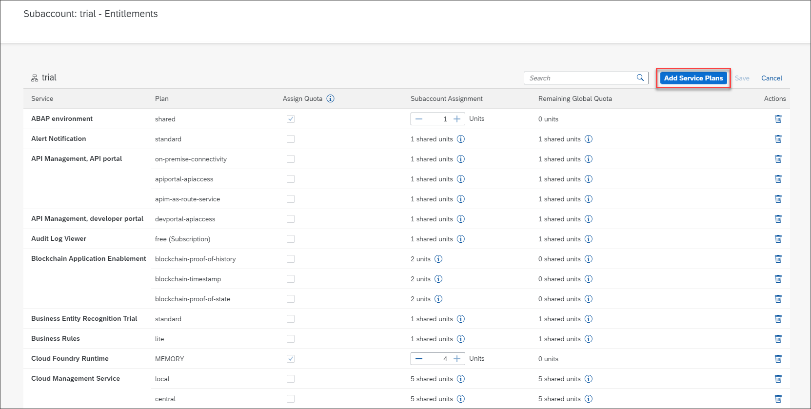
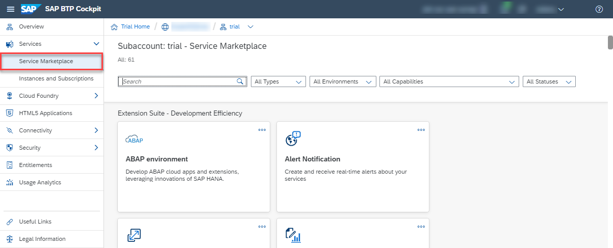
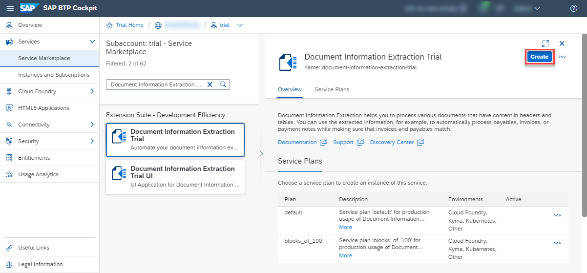
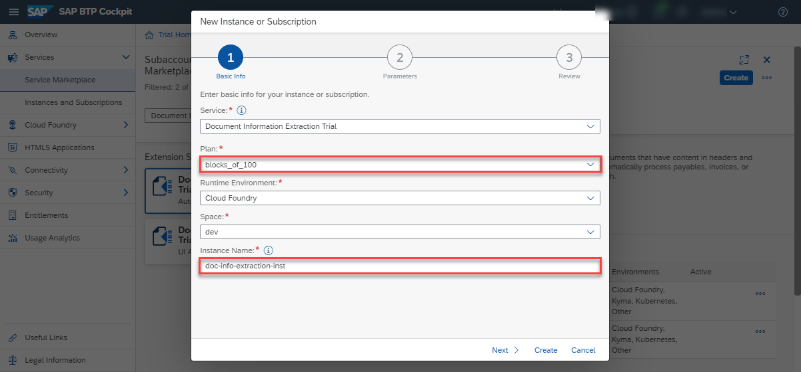
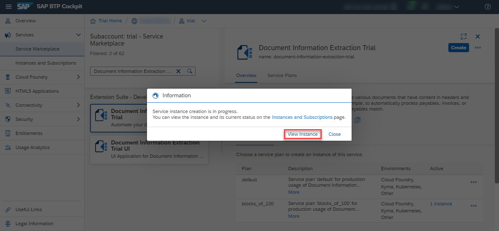
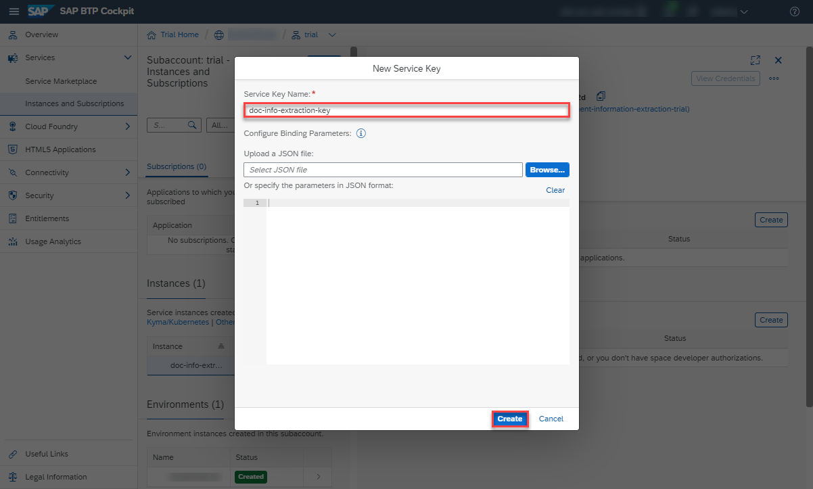
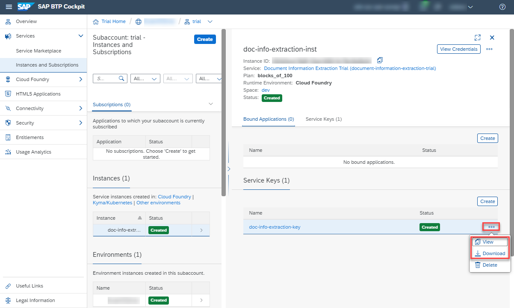

# Use Trial to Create a Service Instance for Document Information Extraction
<!-- description --> Create a service instance and the associated service key for Document Information Extraction, one of the SAP AI Business Services, using SAP Business Technology Platform (SAP BTP) Trial.

## Prerequisites
- You have created a trial account on SAP BTP: [Get a Free Account on SAP BTP Trial](hcp-create-trial-account)
- You have a subaccount and dev space with **US East (VA)** as region: [Manage Entitlements on SAP BTP Trial](cp-trial-entitlements). See also [Create a Subaccount](https://help.sap.com/viewer/65de2977205c403bbc107264b8eccf4b/Cloud/en-US/261ba9ca868f469baf64c22257324a75.html).

## You will learn
  - How to check your Document Information Extraction entitlements
  - How to create a service instance of Document Information Extraction
  - How to create a service key for your service instance
---

### Go To Your Trial Account

1. In your web browser, open the [SAP BTP Trial cockpit](https://cockpit.hanatrial.ondemand.com/).

2. Navigate to the trial global account by clicking **Go To Your Trial Account**.

    <!-- border -->

    >If this is your first time accessing your trial account, you'll have to configure your account by choosing a region. **Please select US East (VA)**. Your user profile will be set up for you automatically.

    >Wait till your account is set up and ready to go. Your global account, your subaccount, your organization, and your space are launched. This may take a couple of minutes.

    >Choose **Continue**.

    ><!-- border -->

3. From your global account page, choose the `trial` tile to access your subaccount.

    <!-- border -->

### Check entitlements

To try out Document Information Extraction, you need to make sure that your subaccount is properly configured.

1. On the navigation side bar, click **Entitlements** to see a list of all eligible services. You are entitled to use every service in this list according to the assigned service plan.

2. Search for **Document Information Extraction Trial**. ***If you find the service in the list, you are entitled to use it. Now you can set this step to **Done** and proceed with Step 3.***

    <!-- border -->

***ONLY if you DO NOT find the service in your list, proceed as follows:***

  1. Click **Configure Entitlements**.

    

  2. Click **Add Service Plans**.

    

  3. Select **Document Information Extraction Trial**, and choose the **`blocks_of_100`** service plan. Click **Add 1 Service Plan**.

    <!-- border -->

  4. **Save** your **Entitlements** changes.

    <!-- border -->    

You're now entitled to use Document Information Extraction and create instances of the service.

>For more details on how to configure entitlements, quotas, subaccounts and service plans on SAP BTP Trial, see [Manage Entitlements on SAP BTP Trial](cp-trial-entitlements).

### Access service via Service Marketplace

The **Service Marketplace** is where you find all the services available on SAP BTP.

1. To access it, click **Service Marketplace** on the navigation side bar.

    <!-- border -->

2. Next, search for **Document Information Extraction Trial** and click the tile to access the service.

    <!-- border -->

### Create service instance

You will now create an instance of your service.

Click **Create Instance** to start the creation dialog.

<!-- border -->

In the dialog, choose the **`blocks_of_100`** service plan. Enter a name for your new instance, for example, `doc-info-extraction-inst` and click **Create**.

<!-- border -->

In the following dialog, click on **View Instance** to be navigated to the list of your service instances.

<!-- border -->

You've successfully created a service instance for Document Information Extraction.

### Create service key

You are now able to create a service key for your new service instance. Service keys are used to generate credentials to enable apps to access and communicate with the service instance.

  1. Click the dots to open the menu and select **Create Service Key**.

      <!-- border -->

  2. In the dialog, enter a name for your service key, for example, `doc-info-extraction-key`. Click **Create** to create the service key.

      <!-- border -->

You've successfully created a service key for your service instance. You can now view the service key in the browser or download it.

<!-- border -->

You will need the service key values to create your `access_token` in the next tutorial: [Get OAuth Access Token for Document Information Extraction Using Any Web Browser](cp-aibus-dox-web-oauth-token).