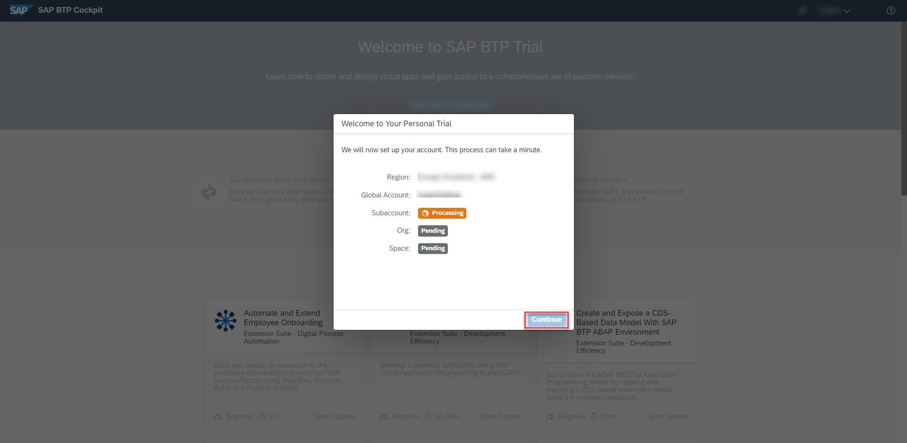
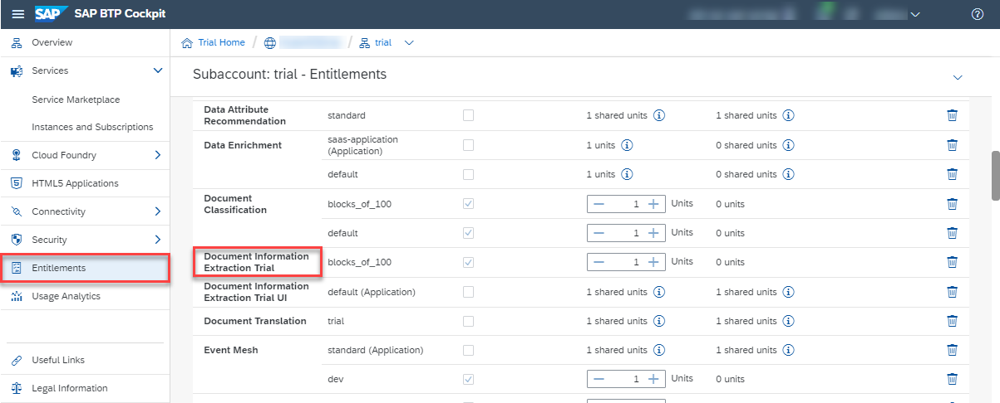
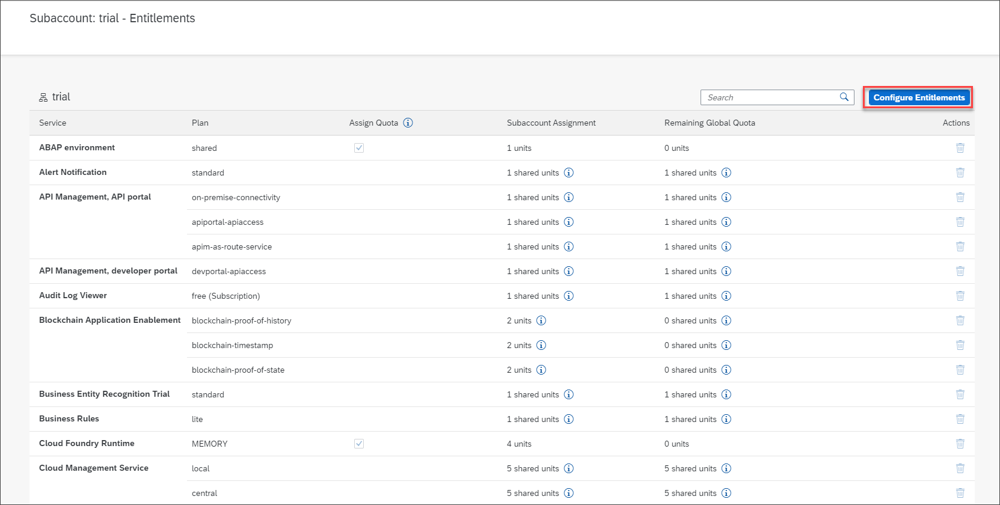
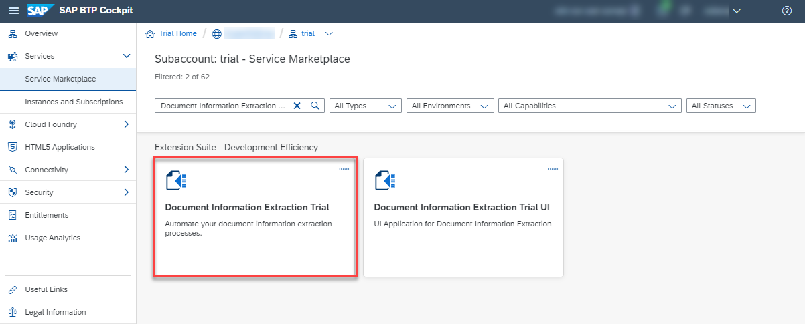

## Details
### You will learn
  - How to check your Document Information Extraction entitlements
  - How to create a service instance of Document Information Extraction
  - How to create service keys for your service instance

---

[ACCORDION-BEGIN [Step 1: ](Enter your trial account)]

1. In your web browser, open the [SAP Cloud Platform trial cockpit](https://cockpit.hanatrial.ondemand.com/).

2. Navigate to the trial global account by clicking **Enter Your Trial Account**.

    

    >Document Information Extraction is only available in the Europe (Frankfurt) region. Follow the steps described in [Get a Free Trial Account on SAP Cloud Platform](hcp-create-trial-account) and choose the Europe (Frankfurt) region. If this is not possible, create a new subaccount in the Europe (Frankfurt) region. You should then be able to find **Document Information Extraction Trial** in your new subaccount **Entitlements**.

    >If this is your first time accessing your trial account, you'll have to configure your account by choosing a region. Your user profile will be set up for you automatically.

    >Wait till your account is set up and ready to go. Your global account, your subaccount, your organization, and your space are launched. This may take a couple of minutes.

    >Choose **Continue**.

    >

3. From your global account page, choose the `trial` tile to access your subaccount.

    

[DONE]
[ACCORDION-END]

[ACCORDION-BEGIN [Step 2: ](Check entitlements)]

To try out Document Information Extraction, you need to make sure that your subaccount is properly configured.

1. On the navigation side bar, click **Entitlements** to see a list of all eligible services. You are entitled to use every service in this list according to the assigned service plan.

2. Search for **Document Information Extraction Trial**. If you find the service in the list, you are entitled to use it. Now you can set this step to **Done** and go to step 3.

    

If you do not find the service in your list, proceed as follows:

  1. Click **Configure Entitlements**.

    

  2. Click **Add Service Plans**.

    

  3. Select **Document Information Extraction Trial**, and choose the **default** service plan. Click **Add 1 Service Plan**.

    

  4. **Save** your **Entitlements** changes.

        

You are now entitled to use Document Information Extraction and create instances of the service.

>For more details on how to configure entitlements, quotas, subaccounts and service plans on SAP Cloud Platform Trial, see [Manage Entitlements on SAP Cloud Platform Trial](cp-trial-entitlements).

[DONE]
[ACCORDION-END]

[ACCORDION-BEGIN [Step 3: ](Access your space)]

You will find all applications and services in spaces. By default, trial accounts only have the **dev** space available.

Click **Spaces** on the navigation side bar and select the **dev** space to open it.

[DONE]
[ACCORDION-END]

[ACCORDION-BEGIN [Step 4: ](Access service via Service Marketplace)]

The **Service Marketplace** is where you find all the services available on SAP Cloud Platform.

1. To access it, click **Service Marketplace** on the navigation side bar.

    

2. Next, search for **Document Information Extraction** and click the tile to access the service.

    

[DONE]
[ACCORDION-END]

[ACCORDION-BEGIN [Step 5: ](Create service instance)]

You will now create an instance of your service.

1. Click **Instances** on the navigation side bar.

2. Click **New Instance** to start the creation dialog.

    

    - In the dialog, leave the default value for the service plan and click **Next**.

      

      - Leave the parameters empty and click **Next**.

      - Do not assign any application and click **Next**.

      - Finally, enter a name for your new instance as `doc-info-extraction-inst`.

      - Click **Finish** to create the instance.

        

You have successfully created a service instance for Document Information Extraction.

[DONE]
[ACCORDION-END]

[ACCORDION-BEGIN [Step 6: ](Create service keys)]

You are now able to create service keys for your new service instance. Service keys are used to generate credentials to enable apps to access and communicate with the service instance.

1. To create service keys, first access your service instance by clicking its name.

    

2. Now select **Service Keys** on the navigation side bar.

3. Click **Create Service Key** to start the creation dialog.

    

    - In the dialog, enter `doc-info-extraction-keys` as the name for your service keys. Leave the **Configuration Parameters (JSON)** box empty.

    - Click **Save** to create the service keys.

        

You have successfully created service keys for your service instance. Make a local copy of the service keys. You will need the service keys values to create your `access_token` in the next tutorial: [Get OAuth Access Token for Document Information Extraction Using Any Web Browser](cp-aibus-dox-web-oauth-token).

[VALIDATE_1]
[ACCORDION-END]

[ACCORDION-BEGIN [Step 7: ](List your service instances)]

To list and access your service instances, there is no need to access the service via the Service Marketplace every time. In your space, you can see a list of all your service instances.

1. Go to your **dev** space using the breadcrumbs at the top of the page.

    As you navigate through SAP Cloud Platform trial and dig into more detail the breadcrumbs at the top of the page show you the hierarchy of your navigation. You can use them to go back to previous steps.

    

2. Back in your space, click **Service Instances** on the navigation side bar.

    

The list shows all your service instances across all services, including the service instance you have just created. Here, you find information on the service plan, referencing applications, created service keys and the current status of your instances. You can also manage your service instances, access or delete them, for example.

[DONE]
[ACCORDION-END]
