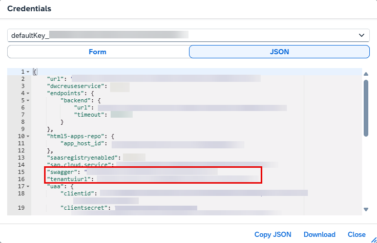
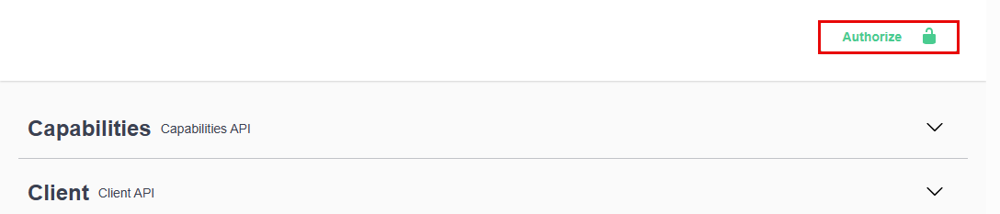
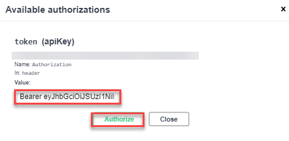
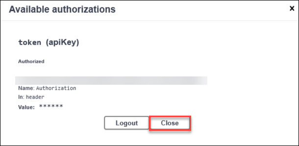
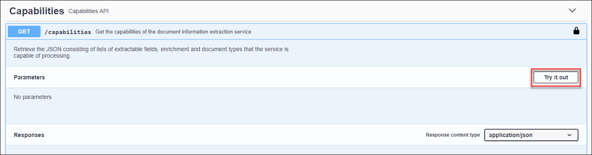
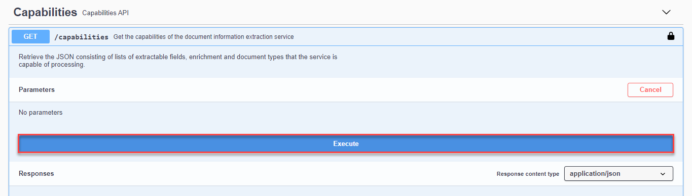
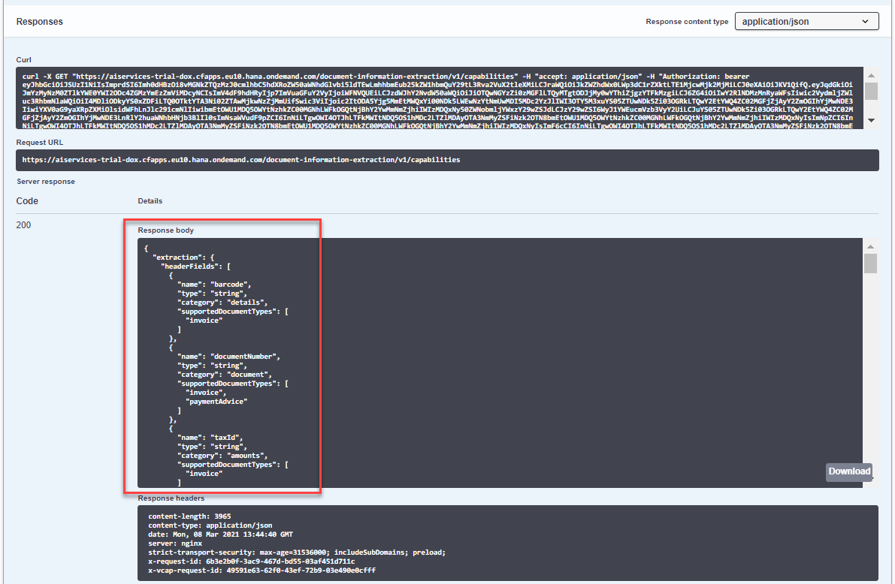
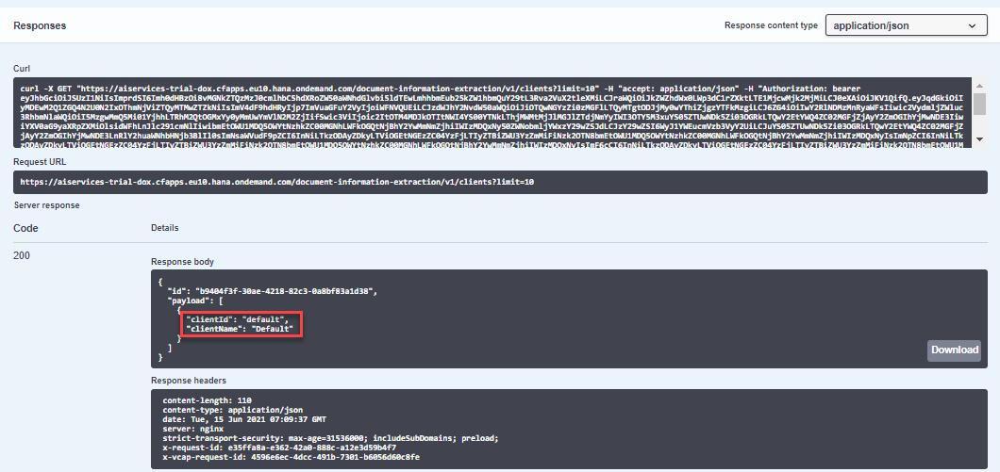
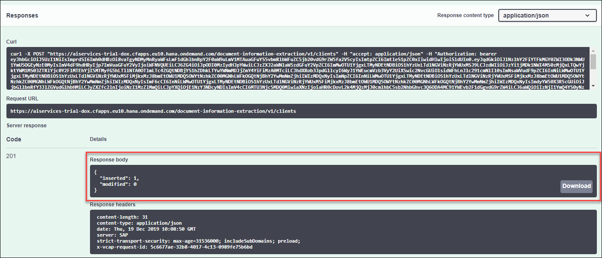

# Use Machine Learning to Extract Information from Documents with Swagger UI
<!-- description --> Get machine learning model predictions for the documents you upload to Document Information Extraction.

## You will learn
  - How to call and test Document Information Extraction
  - How to access and use Swagger UI (User Interface)
  - How to extract information from files with Document Information Extraction

## Intro
The core functionality of Document Information Extraction is to automatically extract structured information from documents using machine learning. When you finish this tutorial, you will get field value predictions for the documents you upload to Document Information Extraction.

---

### Authorize Swagger UI


You will use Swagger UI, via any web browser, to call the Document Information Extraction APIs. Swagger UI allows developers to effortlessly interact and try out every single operation an API exposes for easy consumption. For more information, see [Swagger UI](https://swagger.io/tools/swagger-ui/).   

In the service key you created for Document Information Extraction in the previous tutorial: [Use Trial to Set Up Account for Document Information Extraction and Get Service Key](cp-aibus-dox-booster-key) or [Use Free Tier to Set Up Account for Document Information Extraction and Get Service Key](cp-aibus-dox-booster-free-key), you should find (outside the `uaa` section of the service key) an entry called `url` and another entry called `swagger` (as highlighted in the image below).

1. To access the Document Information Extraction Swagger UI, add the `swagger` value (`/document-information-extraction/v1`) to the `url` value, paste it in any web browser and press **Enter**.

    <!-- border -->

2. To be able to use the Swagger UI endpoints you need to authorize yourself. In the top right corner, click **Authorize**.

    <!-- border -->

3. Get the `access_token` value created in the previous tutorial: [Get OAuth Access Token for Document Information Extraction Using Any Web Browser](cp-aibus-dox-web-oauth-token), then add **Bearer** in front of it, and enter in the **Value** field.

    ```
    Bearer <access_token>
    ```

    <!-- border -->

4. Click **Authorize**, and then click **Close**.

    <!-- border -->


### See list of document fields you can extract


Use the **GET /capabilities** endpoint to see the list of document fields and enrichment data for each document type you can process with Document Information Extraction.

Click the endpoint name to expand it, click **Try it out**, and then **Execute**.

<!-- border -->

<!-- border -->

You should receive a response like the following:

<!-- border -->

>If you get an error response code 401 (Unauthorized), your token is probably incorrect. Check if you have added the word **`Bearer`** before the token and if the token value is complete and has been properly copied from the **`access_token`** value you received in the previous tutorial: [Get OAuth Access Token for Document Information Extraction via Web Browser](cp-aibus-dox-web-oauth-token).


### Get client


When you create a service instance for Document Information Extraction, a `default` client is automatically created. A client is used in most of the endpoints to distinguish and separate data.

Free tier and trial users can only create one client. To see your list of clients:

1. Expand the **GET /clients** endpoint.

2. Click **Try it out**.

3. Enter a maximum number of clients to be listed in the **limit** field.

4. Click **Execute**.

<!-- border -->

You should receive a response like the following:

<!-- border -->


### Delete client


Use the **DELETE /clients** endpoint to delete the `default` client.

1. Expand the **DELETE /clients** endpoint.

2. Click **Try it out**.

3. Enter in the **payload** field the client id (`default`) you want to delete.

4. Click **Execute**.

<!-- border -->

You should receive a response like the following:

<!-- border -->


### Create client


Use the **POST /clients** endpoint to create your own client. The **`clientId`** value created here will be used in other service endpoints.

1. Expand the **POST /clients** endpoint.

2. Click **Try it out**.

3. Enter your **`clientId`** and **`clientName`** values in the **payload** field in the format you see in **Examples for payload parameter** (`c_00` and `client 00`, for example).

4. Click **Execute**.

<!-- border -->

You should receive a response like the following:

<!-- border -->

You can repeat step 3 to see the **`clientId`** and **`clientName`** of the client you have just created.


>**CAUTION:**

>When using the free tier option for Document Information Extraction or a trial account, be aware of the technical limits listed in [Free Tier Option and Trial Account Technical Constraints](https://help.sap.com/docs/document-information-extraction/document-information-extraction/free-tier-option-and-trial-account-technical-constraints).


### Upload document


>Document Information Extraction uses a globally pre-trained machine learning model that currently obtains better accuracy results with invoices and payment advices in the languages listed in [Supported Languages and Countries](https://help.sap.com/viewer/5fa7265b9ff64d73bac7cec61ee55ae6/SHIP/en-US/5bf847f7d1a848dcb3513eff9ec70412.html). The team is working to support additional document types and languages in the near future.

Use the **POST /document/jobs** endpoint to upload to the service any document file in PDF or single-page PNG and JPEG format that has content in headers and tables, such as an invoice.

>As an alternative to uploading your own document to the service, you can use any of the following sample invoice files (right click on the link, then click ***Save link as*** to download the files locally):

>- [Sample Invoice 1](https://raw.githubusercontent.com/SAPDocuments/Tutorials/master/tutorials/cp-aibus-dox-swagger-ui/sample-invoice-1.pdf)

>- [Sample Invoice 2](https://raw.githubusercontent.com/SAPDocuments/Tutorials/master/tutorials/cp-aibus-dox-swagger-ui/sample-invoice-2.pdf)

>- [Sample Invoice 3](https://raw.githubusercontent.com/SAPDocuments/Tutorials/master/tutorials/cp-aibus-dox-swagger-ui/sample-invoice-3.pdf)


Do the following:

1. Expand the **POST /document/jobs** endpoint.

2. Click **Try it out**.

3. Upload a document file.

4. In **options**, enter the list of fields to be extracted from the uploaded file (`documentNumber`, `taxId`, `purchaseOrderNumber`, `shippingAmount`, `netAmount`, `senderAddress`, `senderName`, `grossAmount`, for example), the client you created in step 5 (`c_00`, for example), and the document type (`invoice`, for example). In this case, you can use the following:

    ```JSON
    {
       "extraction":{
          "headerFields":[
             "documentNumber",
             "taxId",
             "purchaseOrderNumber",
             "shippingAmount",
             "netAmount",
             "senderAddress",
             "senderName",
             "grossAmount",
             "currencyCode",
             "receiverContact",
             "documentDate",
             "taxAmount",
             "taxRate",
             "receiverName",
             "receiverAddress"
          ],
          "lineItemFields":[
             "description",
             "netAmount",
             "quantity",
             "unitPrice",
             "materialNumber"
          ]
       },
       "clientId":"c_00",
       "documentType":"invoice",
       "receivedDate":"2020-02-17",
       "enrichment":{
          "sender":{
             "top":5,
             "type":"businessEntity",
             "subtype":"supplier"
          },
          "employee":{
             "type":"employee"
          }
       }
    }
    ```

5. Click **Execute**.

<!-- border -->

After you have clicked **Execute**, you should receive a response like the following:

<!-- border -->

Copy the **`id`** from the **Response body** to see the result of the extraction in the next step.


### See extracted fields


You can now use the **GET /document/jobs/{`id`}** endpoint to receive the prediction.

1. Expand the **GET /document/jobs/{`id`}** endpoint.

2. Click **Try it out**.

3. Set **`extractedValues`** to `true` to get the extracted values.

4. Enter the **`id`** received in the **POST /document/jobs** endpoint as the **`id`**.

5. Click **Execute**.

<!-- border -->

You should receive a response like the following:

<!-- border -->

In the response, you will find some general information about the document you uploaded. In `headerFields`, such as `documentDate` and `taxAmount`, and in `lineItems`, such as `description` and `quantity`, you will find the prediction for the extracted fields.

The prediction is made with a probability indicated by the **confidence** field which represents how certain the model is about its prediction. A confidence of 1 means that the model is 100% sure about its prediction.

If the status of the document (indicated by the **status** field) is **PENDING** instead of **DONE**, then it means that the service is still extracting some fields and the returned JSON file does not yet contain all the requested fields.

You have now successfully used our machine learning model to get field value predictions for the document you uploaded to the Document Information Extraction service.

You can repeat step 4 and delete the client you created in step 5.

Congratulations, you have completed this tutorial.

