# Use Trial to Extract Information from Standard Documents with Generative AI and Document Information Extraction
<!-- description --> Learn how to use Document Information Extraction with generative AI to automate the extraction of information from standard documents using large language models (LLMs) and the service's machine learning models.

## Prerequisites
- You've created a trial account on SAP BTP: [Get a Free Account on SAP BTP Trial](hcp-create-trial-account)
- You've access to the Document Information Extraction UI, as described in the tutorial [Use Trial to Set Up Account for Document Information Extraction and Go to Application](cp-aibus-dox-booster-app)

## You will learn
  - How to create and activate your own schema for standard documents
  - How to define the fields that you want to extract from a standard document 
  - How to upload a standard document to the Document Information Extraction UI
  - How to get extraction results using the schema you’ve created, LLMs, and the service's machine learning models.

## Intro
In the tutorial [Use Trial to Extract Information from Custom Documents with Generative AI and Document Information Extraction](cp-aibus-dox-ui-gen-ai), you created a schema and defined the fields that you wanted to extract from custom document types using LLMs. In addition, you used the schema to extract field values from the documents that you uploaded to the service.

It's also possible to use LLMs to extract information from standard document types (invoice, payment advice, and purchase order). In this tutorial, we're going to create a schema for a standard document type (invoice) and use both generative AI and the service's machine learning models to get the extraction results.

---

### Create schema

Before you upload our sample invoice file to the service, you’ll create a corresponding schema. 

1. Open the Document Information Extraction UI, as described in the tutorial [Use Trial to Set Up Account for Document Information Extraction and Go to Application](cp-aibus-dox-booster-app).

2. In the left navigation pane, click **Schema Configuration**.

    <!-- border -->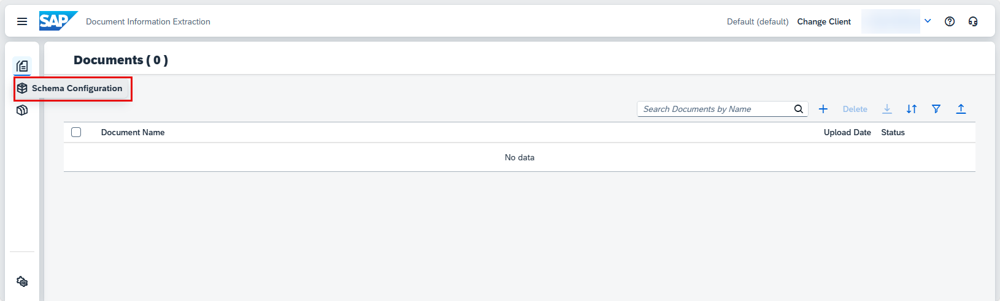

3. To create your own schema, click **Create**.

    <!-- border -->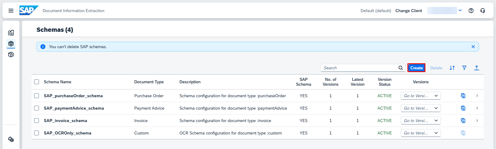

4. In the dialog that opens, enter a name for your own schema – for example, `invoice_schema`. Note that the name can't include blanks. Next, select `Invoice` as your **Document Type**. 

5. Click **Create** to create the schema.

    <!-- border -->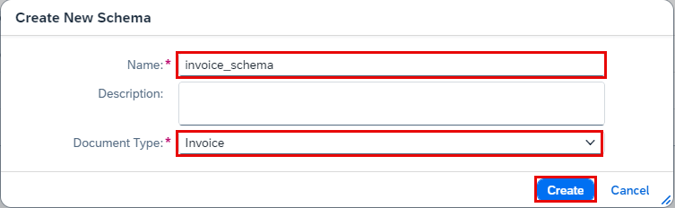    

6. Your schema now appears in the list. Access the schema by clicking on it.

    <!-- border -->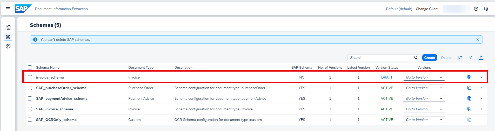

>You can also adapt copies of the appropriate preconfigured SAP schemas to extract information from standard document types. However, we won't cover that approach in this tutorial.

### Add data fields

To add your first header field, click **Add**.

<!-- border -->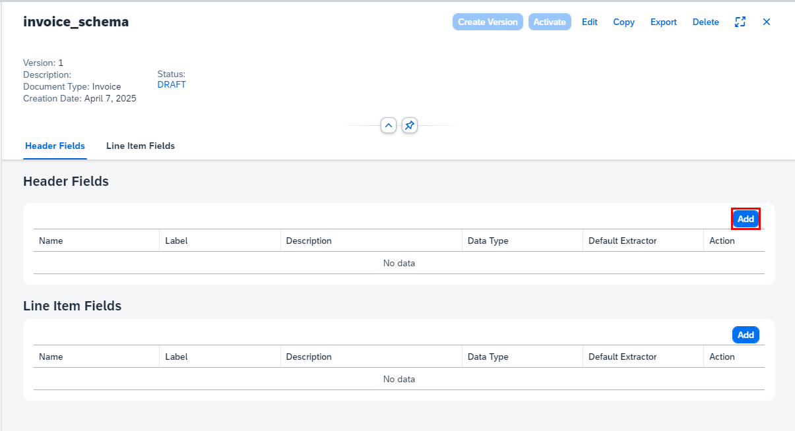

You must enter a field name and data type for each new field. The available data types are `string`, `number`, `date`, `discount`, `currency`, `country/region`, and `list of values`. 

Default extractors are only available for standard documents. See the list of all default extractors in [Extracted Header Fields](https://help.sap.com/docs/document-information-extraction/document-information-extraction/extracted-header-fields) and [Extracted Line Items](https://help.sap.com/docs/document-information-extraction/document-information-extraction/extracted-line-items).

You can also optionally add a field label (user-friendly name) and a description.

>A description is an optional entry that you add to provide an explanation or additional context for a field. Descriptions are particularly useful with fields that use generative AI to extract information. Document Information Extraction uses your descriptions as prompts for the LLM. So, when wording a description, it's helpful to imagine that you’re explaining what you want to extract to a person with no prior knowledge.
>
>In this tutorial, we'll use descriptions when creating each of the fields for which extraction is handled using generative AI.

As your first header field, add the total amount of the invoice.

1. Enter the name for your field – for example, `total_amount`. There's no need to enter a description here.

2. Select `number` as the **Data Type**.

3. Use `auto` as the **Setup Type** and `grossAmount` as the **Default Extractor**.

    >Note that your schema supports various combinations of setup types and extraction methods. When you use the setup type `auto` with a default extractor, the service's pre-trained ML models are used to extract the information from the document. When you use the setup type `auto` without a default extractor, generative AI (LLMs) is used instead. The setup type `manual` supports extraction using a template. For more information, see [Setup Types](https://help.sap.com/docs/document-information-extraction/document-information-extraction/setup-types). For further details of this approach, see the tutorial mission [Shape Machine Learning to Process Custom Business Documents](https://developers.sap.com/mission.btp-aibus-shape-ml-custom.html). 

4. Click **Save**.
   
<!-- border -->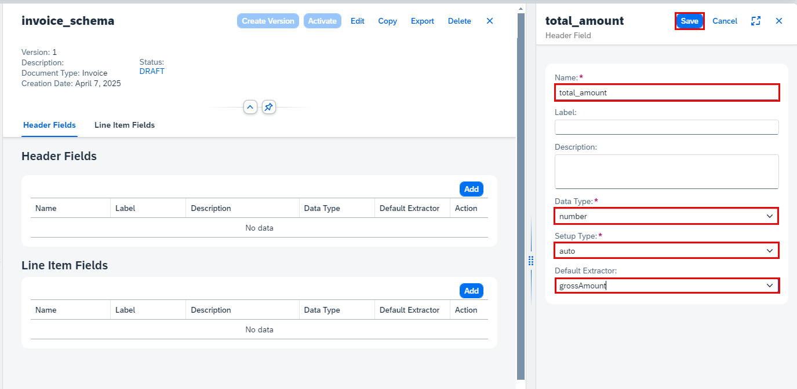

The field now appears in your list of header fields, where you can see all the information that you've just entered. You can edit or delete the field by clicking the respective icons on the right.

<!-- border -->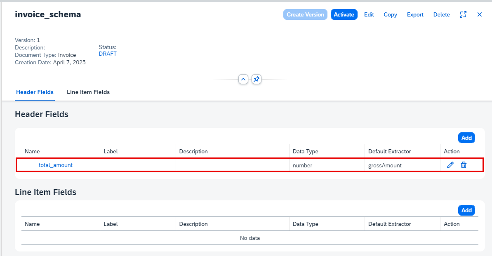

Click **Add** again to open the `Header Field` dialog.

1. Enter the name for your second header field – for example, `snNumber`.

2. Enter the description `source number`

3. Select `string` as the **Data Type**.

4. Use `auto` as the **Setup Type** and leave **Default Extractor** empty.
   
5. Click **Save**.

<!-- border -->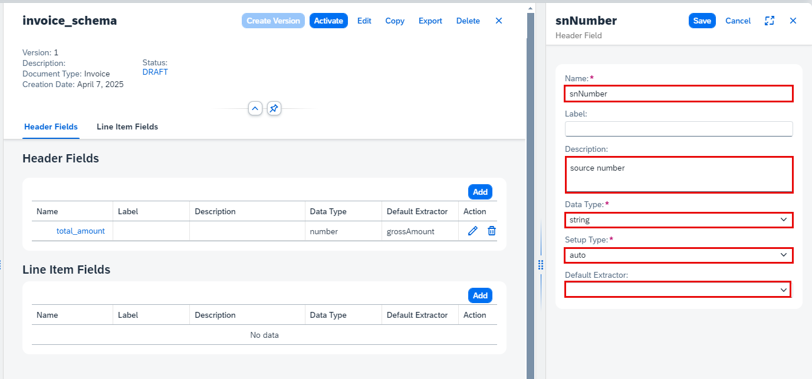

Now, go ahead and add the remaining header fields and line item fields shown in the following tables and images. Pay attention to the different data types and whether you should add a description or a default extractor.

Header fields:

| Name                  | Description                                | Data Type   | Setup Type  | Default Extractor        |
| :-------------------- | :----------------------------------------- | :---------- | :---------- | :----------------------- |
| `total_amount`        |                                            | number      | auto        | `grossAmount`            |
| `snNumber`            | `source number`                            | string      | auto        | empty                    |
| `contact`             | `contact information (email address)`      | string      | auto        | empty                    |
| `taxName`             |                                            | string      | auto        | `taxName`                |
| `taxAmount`           |                                            | number      | auto        | `taxAmount`              |
| `customerPO`          | `number of customer purchase order (P.O.)` | string      | auto        | empty                    |
| `currencyCode`        |                                            | string      | auto        | `currencyCode`           |
| `purchaseOrderNumber` |                                            | string      | auto        | `purchaseOrderNumber`    |

<!-- border -->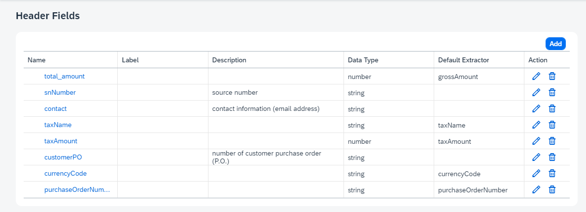

Line item fields:

| Name         | Description   | Data Type | Setup Type | Default Extractor |
| :----------- | :----------   | :-------- | :--------- | :---------------- |
| `description`|               | string    | auto       | `description`     |
| `quantity`   |               | number    | auto       | `quantity`        |
| `unitPrice`  |               | number    | auto       | `unitPrice`       |
| `partNumber` | `part number` | string    | auto       |                   |

<!-- border -->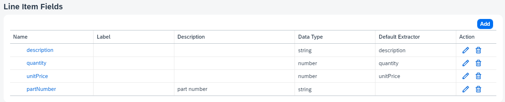

>Note that the Document Information Extraction UI also includes a feature that allows you to group schema fields by category. To use this feature, you must first activate it under **UI Settings**. For simplicity's sake, we haven't included the feature in this tutorial. If you'd like to find out more about it, see [Schema Field Categories](https://help.sap.com/docs/document-information-extraction/document-information-extraction/schema-field-category). 

### Activate schema

Once you've added the fields, you need to activate the schema so that you can use it to extract information from documents. Right now, the schema has the status `DRAFT`, indicating that it can't be used yet.

To activate the schema, click **Activate**.

<!-- border -->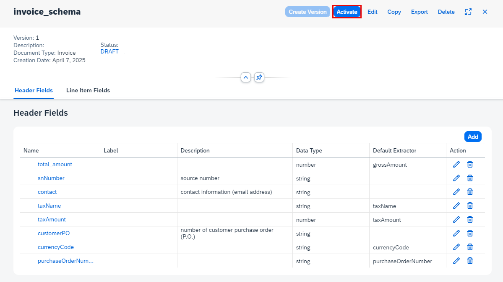

Now, the status of your schema changes to `ACTIVE`. To make changes to your schema, you must first **Deactivate** it.

<!-- border -->

Congratulations, you've now created and activated your own schema for invoice documents.

### Get extraction results

1. Access **Document** from the navigation on the left of the screen, then click **+** to upload the invoice document.

    <!-- border -->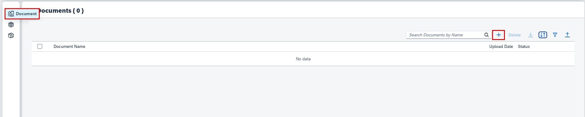

2. On the *Select Document* screen, choose `Invoice` for the **Document Type**.
   
3. Select the **Schema** you created (`invoice_schema`).
   
4. Right-click on the link, then click ***Save link as*** to download the [sample invoice](https://github.com/SAPDocuments/Tutorials/raw/master/tutorials/cp-aibus-dox-ui-gen-ai-std/sample-invoice.pdf) document locally.
   
5. Drag and drop the file directly or click **+** to upload the sample document.

    <!-- border -->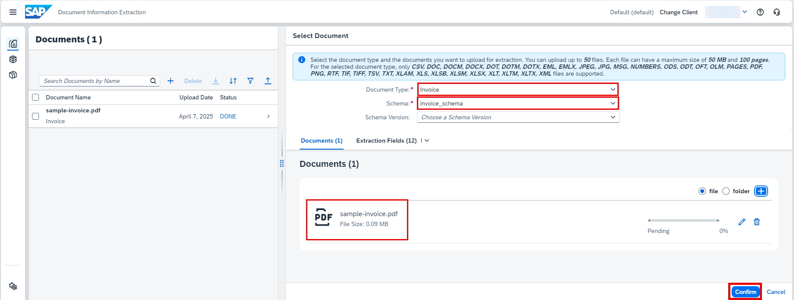

6. Click **Confirm**.
  
    The document status changes from `PENDING` to `DONE`.

    <!-- border -->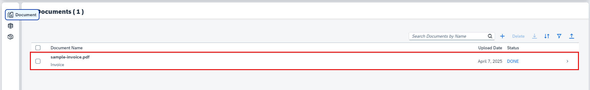

7. Access the document by clicking on it. You now see the page preview of the document file you uploaded, and the information extracted from the invoice header fields and line items using LLMs, the service's pre-trained ML models, and the schema that you created.

    <!-- border -->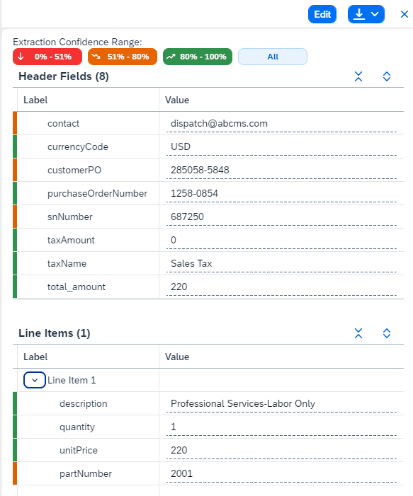

>Note that the first time you extract fields using generative AI, the results are in the orange confidence range. 

 Congratulations, you've completed this tutorial.
 
 You've now successfully extracted information from an invoice document using the schema configuration feature from Document Information Extraction, LLMs, and the service's pre-trained ML models.
 
 Feel free to repeat the steps using your own standard documents.