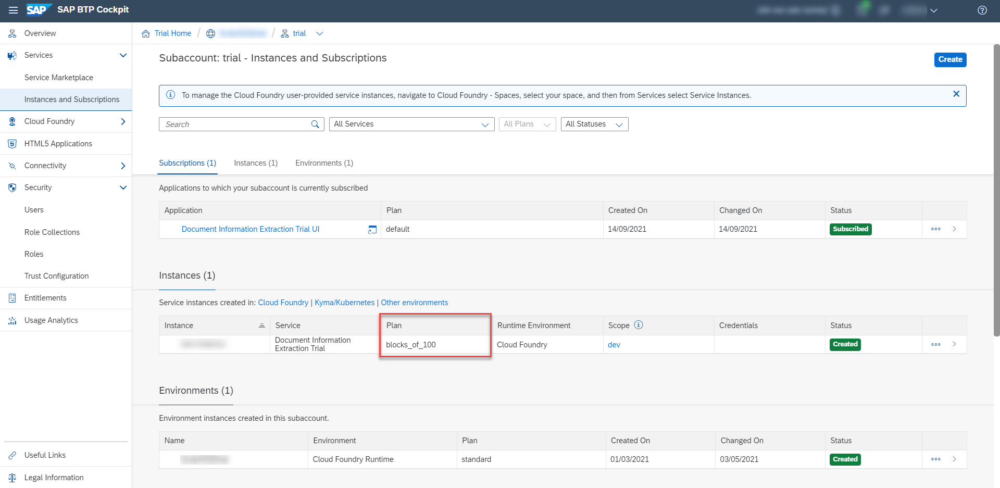
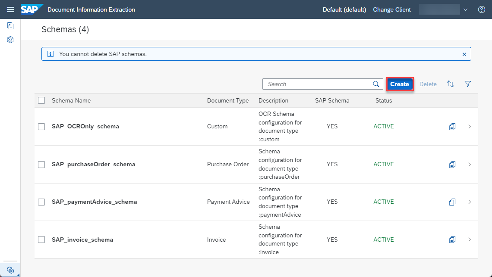
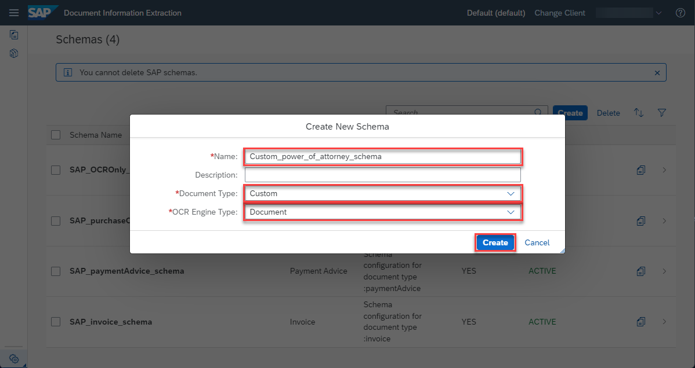
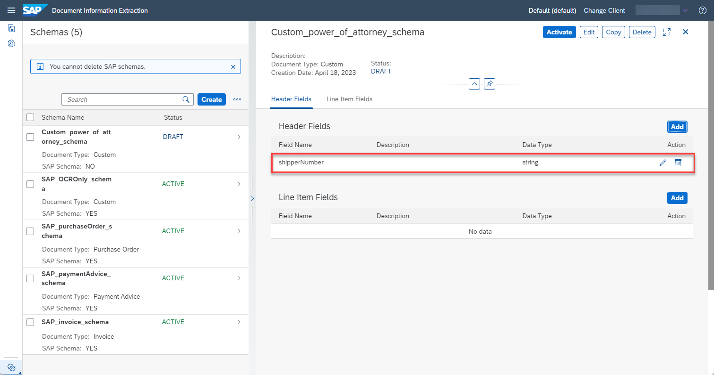
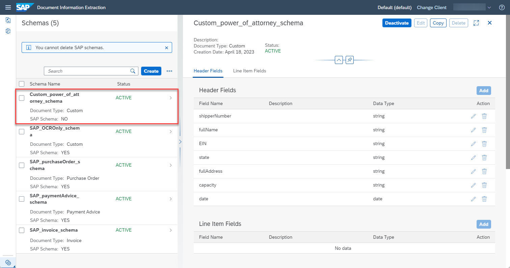

# Create Custom Schema for Custom Documents
<!-- description --> Create a custom schema for custom documents (that are not supported out of the box) to extract information from similar documents using the Document Information Extraction service.

## You will learn
  - How to create a custom schema for custom documents
  - How to add standard and custom data fields for the header information of custom documents

## Intro
The core functionality of Document Information Extraction is to automatically extract structured information from documents using machine learning. The service supports extraction from the following standard document types out of the box: invoices, payment advices and purchase orders.

You can also use the [Schema Configuration](https://help.sap.com/viewer/5fa7265b9ff64d73bac7cec61ee55ae6/SHIP/en-US/3c7862e30fc2488ea95f58f1d77e424e.html) and [Template](https://help.sap.com/viewer/5fa7265b9ff64d73bac7cec61ee55ae6/SHIP/en-US/1eeb08998f49409681c06a01febc3172.html) features to extract information from custom documents that are different from the standard document types. You can customize the information extracted from custom document types by creating a custom schema and adding the specific information that you have in your documents.

In this tutorial, we'll use power of attorney documents as an example of a custom document type that is not supported by Document Information Extraction out of the box. A power of attorney document is a legal instrument authorizing one to act as the attorney or agent for another person in specified or all legal or financial matters.

If you are new to the Document Information Extraction UI, try out first the tutorial: [Use Machine Learning to Extract Information from Documents with Document Information Extraction UI](cp-aibus-dox-ui).

---

### Access schema configuration

1. Open the Document Information Extraction UI, as described in the tutorial: [Use Trial to Set Up Account for Document Information Extraction and Go to Application](cp-aibus-dox-booster-app) or [Use Free Tier to Set Up Account for Document Information Extraction and Go to Application](cp-aibus-dox-free-booster-app).

    >If you **HAVE NOT** just used the **Set up account for Document Information Extraction** booster to create a service instance for Document Information Extraction, and subscribe to the Document Information Extraction UI, observe the following:

    >- To access the [Schema Configuration](https://help.sap.com/viewer/5fa7265b9ff64d73bac7cec61ee55ae6/SHIP/en-US/3c7862e30fc2488ea95f58f1d77e424e.html) and [Template](https://help.sap.com/viewer/5fa7265b9ff64d73bac7cec61ee55ae6/SHIP/en-US/1eeb08998f49409681c06a01febc3172.html) features, ensure that you use the `blocks_of_100` plan to create the service instance for Document Information Extraction Trial.

    ><!-- border -->

    >- And make sure you're assigned to the role collection: `Document_Information_Extraction_UI_Admin_User_trial`, or the combination of the role collections: `Document_Information_Extraction_UI_End_User_trial` and `Document_Information_Extraction_UI_Templates_Admin_trial`. For more details on how to assign role collections, see step 2 in the tutorial: [Subscribe to Document Information Extraction Trial UI](cp-aibus-dox-ui-sub).

    ><!-- border -->

    >- After assigning new role collections, **Log Off** from the UI application to see all features you're now entitled to try out.

    ><!-- border -->

2. To create a custom schema, click the wheels icon and choose **Schema Configuration**.

    <!-- border -->

Here, you find the pre-defined SAP schemas, one for each of the standard document types that are supported by Document Information Extraction out of the box. You can't delete or edit SAP schemas, but you can see and **Copy** the information they extract from documents.

<!-- border -->

>**CAUTION:**

>Be aware of the following Document Information Extraction Trial UI trial account limitations:​

>- Maximum 40 uploaded document pages per week​ (the documents can have more than 1 page)​
>- Maximum 10 schemas per trial account
>- Maximum 3 templates per trial account (with a maximum of 5 sample documents each)

### Create schema

To create your own schema, click **Create** and a dialog opens.

<!-- border -->

In the dialog, enter a name for your custom schema, `Custom_power_of_attorney_schema`, for instance. Note that the name cannot include blanks. Further, select `Custom` as your `Document Type`.

Click **Create** to create the schema.

<!-- border -->

Now, your schema shows up in the list. Access the schema by clicking on the row.

<!-- border -->

### Add header fields

To define your first header field, click **Add**.

<!-- border -->

For each custom field, you have to enter name and data type. The potential data types are `string`, `number`, `date`, `discount` and `currency`. Default extractors are not available for custom documents. Adding a description is optional.

As your first header field, add the shipper number of your power of attorney document.

1. Enter an appropriate name for your field, `shipperNumber`, for example.

2. Select `string` for the `Data Type`. Note that a shipper number is a `string`, even though it consists of numbers, as it is an arbitrary combination of numbers without meaning. In contrast, price is an example for the data type `number`.

3. Click **Add** to create the header field.

    <!-- border -->

The field now displays in your list of header fields where you find all the information again that you have just entered. You can edit or delete the field by clicking the respective icons on the right.

<!-- border -->

Click **Add** again to open the `Add Data Field` dialog.

1. Enter a name for your second header field, `fullName`, for example.

2. Select `string` for the `Data Type`.

3. Click **Add** to create the field.

    <!-- border -->

Go ahead and create the list of header fields as shown in the table and image below. Pay attention to the different data types. Feel free to extend or reduce the list of header fields.

|  Field Name           | Data Type   
|  :------------------- | :----------
|  `shipperNumber`      | string       
|  `fullName`           | string      
|  `EIN`                | string                  
|  `state`              | string       
|  `fullAddress`        | string       
|  `capacity`           | string       
|  `date`               | date                    

<!-- border -->

### Activate schema

Once you have added all fields, the schema needs to be activated so that it can be used to extract information from documents. Right now, the schema has the status `PASSIVE`, indicating that it cannot be used yet.

To activate the schema, click **Activate**.

<!-- border -->

Now, the status of your schema changes to `ACTIVE`. To make changes to your schema, you have to **Deactivate** it first.

<!-- border -->

Congratulations, you have created and activated your first custom schema for power of attorney documents.

In the next tutorial: [Create Custom Template for Custom Documents](cp-aibus-dox-ui-template-custom), you'll create a template that uses your schema and add sample documents to show the Document Information Extraction service where each field is located in the document.

