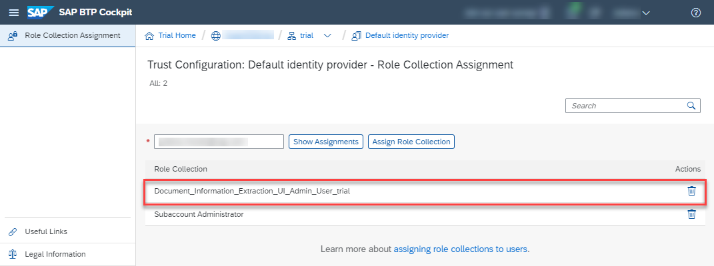
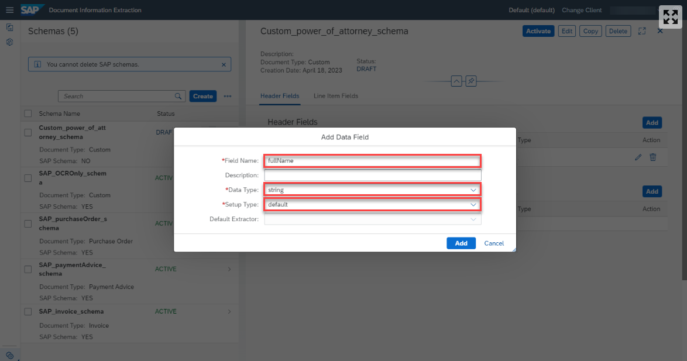
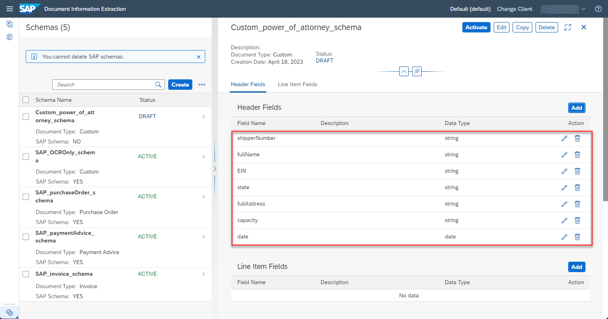
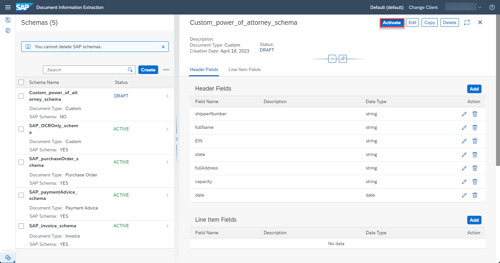

# Create Schema for Custom Documents
<!-- description --> Create a schema for custom documents (which are not supported out of the box) to extract information from similar documents using SAP Document AI.

## You will learn
  - How to create a schema for custom documents
  - How to add standard and custom data fields for the header information of custom documents

## Intro
The core functionality of SAP Document AI is to automatically extract structured information from documents using machine learning. SAP Document AI supports extraction from the following standard document types out of the box: invoices, payment advices, and purchase orders.

You can also use the [Schema Configuration](https://help.sap.com/viewer/5fa7265b9ff64d73bac7cec61ee55ae6/SHIP/en-US/3c7862e30fc2488ea95f58f1d77e424e.html) and [Template](https://help.sap.com/viewer/5fa7265b9ff64d73bac7cec61ee55ae6/SHIP/en-US/1eeb08998f49409681c06a01febc3172.html) features to extract information from custom documents that are different from the standard document types. You can customize the information extracted from custom document types by creating a schema and adding the specific information that you have in your documents.

In this tutorial, we'll use power of attorney documents as an example of a custom document type that is not supported by SAP Document AI out of the box. A power of attorney document is a legal instrument authorizing one to act as the attorney or agent for another person in specified or all legal or financial matters.

If you are new to the SAP Document AI basic UI, first try out the tutorial: [Use Machine Learning to Extract Information from Documents with SAP Document AI Basic UI](cp-aibus-dox-ui).

---

### Access schema configuration

1. Open the SAP Document AI basic UI, as described in the tutorial: [Use Trial to Set Up Account for SAP Document AI and Go to Application](cp-aibus-dox-booster-app) or [Use Free Tier to Set Up Account for SAP Document AI and Go to Application](cp-aibus-dox-free-booster-app).

    >If you **HAVE NOT** just used the **Set up account for SAP Document AI** booster to create a service instance for SAP Document AI and subscribe to the SAP Document AI basic UI, observe the following:

    >- To access the [Schema Configuration](https://help.sap.com/viewer/5fa7265b9ff64d73bac7cec61ee55ae6/SHIP/en-US/3c7862e30fc2488ea95f58f1d77e424e.html) and [Template](https://help.sap.com/viewer/5fa7265b9ff64d73bac7cec61ee55ae6/SHIP/en-US/1eeb08998f49409681c06a01febc3172.html) features, ensure that you use the `blocks_of_100` plan to create the service instance for SAP Document AI Trial.

    ><!-- border -->

    >- And make sure you're assigned to the role collection: `Document_Information_Extraction_UI_Templates_Admin_trial` (or `Document_Information_Extraction_UI_Templates_Admin` if you're using the free tier option). For more details about how to assign role collections, see step 2 in the tutorial: [Use Trial to Subscribe to the SAP Document AI Basic UI](cp-aibus-dox-ui-sub), or step 3 in the tutorial: [Use Free Tier to Subscribe to SAP Document AI Basic UI](cp-aibus-dox-free-ui-sub).

    ><!-- border -->

    >- After assigning new role collections, **Log Off** from the UI application to see all features you're now entitled to try out.

    ><!-- border -->

2. In the left navigation pane, click **Schema Configuration**.

    <!-- border -->

Here, you find the SAP schemas. The SAP Document AI basic UI provides preconfigured SAP schemas for the following standard document types:

* Purchase order
* Payment advice
* Invoice 

In addition, there’s an SAP schema for custom documents (`SAP_OCROnly_schema`). You can use SAP schemas unchanged to upload documents.

>**NOTE:** You can’t edit or delete original SAP schemas. Always create a copy and then edit the default fields, as required.

<!-- border -->

>**CAUTION:**

>When using the free tier option for SAP Document AI or a trial account, be aware of the technical limits listed in [Free Tier Option and Trial Account Technical Constraints](https://help.sap.com/docs/document-information-extraction/document-information-extraction/free-tier-option-and-trial-account-technical-constraints).

### Create schema

To create your own schema, click **Create**.

<!-- border -->

In the dialog that appears, enter a name for your schema, `power_of_attorney_schema`, for example. Note that the name cannot include blanks. Further, select `Custom` as your **Document Type** and `Document` for **OCR Engine Type**.

Click **Create** to create the schema.

<!-- border -->

Now, your schema shows up in the list. Access the schema by clicking on the row.

<!-- border -->

### Add header fields

To define your first header field, click **Add**.

<!-- border -->

For each field, you have to enter a name, a data type, and a setup type. Adding a description is optional. Default extractors aren't available for custom documents. The available data types are `string`, `number`, `date`, `discount`, `currency`, and `country/region`. 

The available setup types are `auto` and `manual`. The setup type `auto` supports extraction using the solution's machine learning models. You must specify a default extractor (standard fields supported by SAP Document AI) for this setup type. It can only be used in schemas created for standard document types. The setup type `manual` supports extraction using a template. It’s available in schemas created for standard or custom document types.

If you'd like to find out more about setup types and how they relate to document types, extraction methods, and default extractors, see [Setup Types](https://help.sap.com/docs/document-information-extraction/document-information-extraction/setup-types).

As your first header field, add the shipper number of your power of attorney document.

1. Enter an appropriate name for your field, `shipperNumber`, for example.

2. Select `string` for the `Data Type`. Note that a shipper number is a `string`, even though it consists of numbers, as it is an arbitrary combination of numbers without meaning. In contrast, price is an example of the data type `number`.

3. Select `manual` for the `Setup Type` and click **Save** to add the header field.

    <!-- border -->

The field now displays in your list of header fields, where you again find all the information that you've just entered. You can edit or delete the field by clicking the respective icons on the right.

<!-- border -->

Click **Add** again to open the `Header Field` dialog.

1. Enter a name for your second header field, `fullName`, for example.

2. Select `string` for the `Data Type`.

3. Select `manual` for the `Setup Type` and click **Save** to add the field.

    <!-- border -->

Go ahead and add the header fields shown in the table and image below. Pay attention to the different data types. Feel free to extend or reduce the list of header fields.

|  Field Name           | Data Type     | Setup Type   
|  :------------------- | :----------   | :----------    
|  `shipperNumber`      | string        | manual       
|  `fullName`           | string        | manual
|  `EIN`                | string        | manual           
|  `state`              | string        | manual       
|  `fullAddress`        | string        | manual       
|  `capacity`           | string        | manual       
|  `date`               | date          | manual                    

<!-- border -->

>**NOTE:** The SAP Document AI basic UI also includes a feature that allows you to group schema fields by category. To use this feature, you must first activate it under **UI Settings**. For simplicity's sake, we haven't included the feature in this tutorial. If you'd like to find out more about it, see [Schema Field Categories](https://help.sap.com/docs/document-information-extraction/document-information-extraction/schema-field-category). 

### Activate schema

Once you've added all fields, the schema needs to be activated so that it can be used to extract information from documents. Right now, the schema has the status `DRAFT`, indicating that it cannot be used yet.

To activate the schema, click **Activate**.

<!-- border -->

Now, the status of your schema changes to `ACTIVE`. To make changes to your schema, you have to **Deactivate** it first.

<!-- border -->

Congratulations, you've created and activated your own schema for power of attorney documents.

In the next tutorial: [Create Template for Custom Documents](cp-aibus-dox-ui-template-custom), you'll create a template that uses your schema, and associate documents with your template to show SAP Document AI where each field is located in the document.