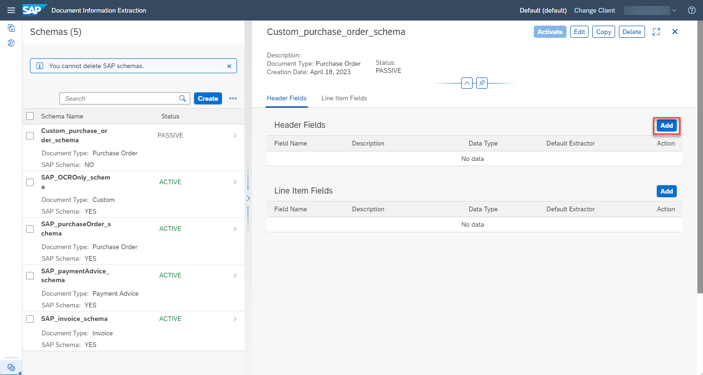
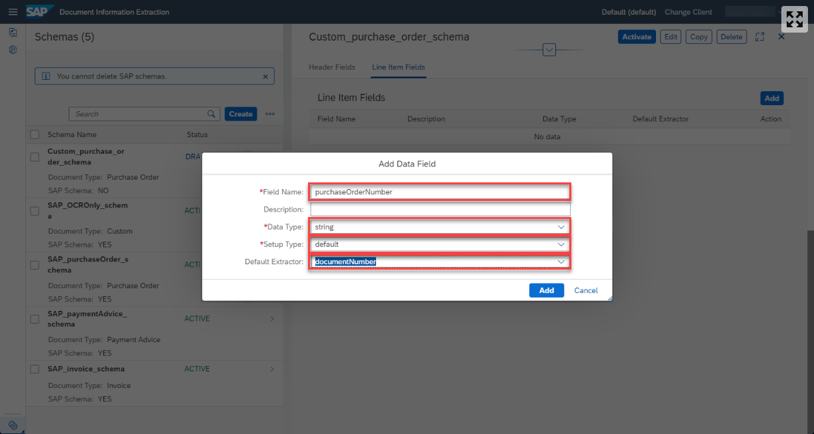
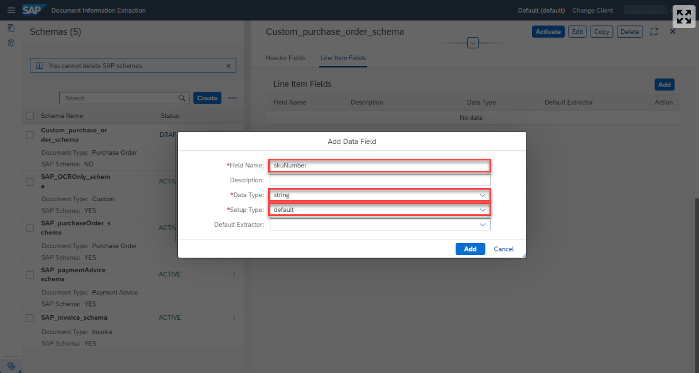
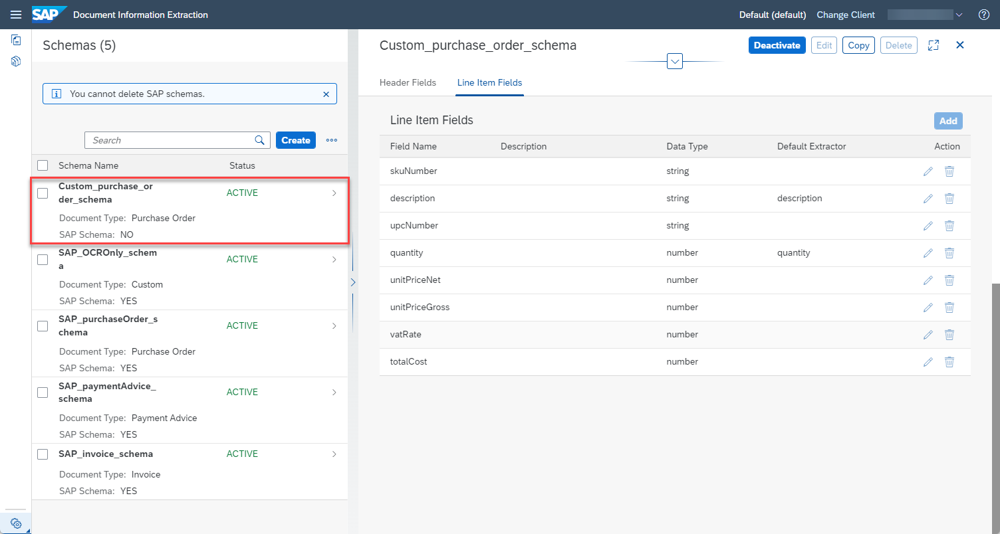

# Create Custom Schema for Purchase Order Documents
<!-- description --> Create a custom schema for your purchase order documents to extract information from similar documents using the Document Information Extraction service.

## You will learn
  - How to create a custom schema for purchase order documents
  - How to add standard and custom data fields for the header and line item information of purchase order documents

## Intro
The core functionality of Document Information Extraction is to automatically extract structured information from documents using machine learning. The service supports extraction from the following standard document types out of the box: invoices, payment advices and purchase orders. You can customize the information extracted from these document types by creating a custom schema and adding the specific information that you have in your documents. Additionally, you can add completely new document types.

If you are new to the Document Information Extraction UI, try out first the tutorial: [Use Machine Learning to Extract Information from Documents with Document Information Extraction UI](cp-aibus-dox-ui).

---

### Access schema configuration

1. Open the Document Information Extraction UI, as described in the tutorial: [Use Trial to Set Up Account for Document Information Extraction and Go to Application](cp-aibus-dox-booster-app) or [Use Free Tier to Set Up Account for Document Information Extraction and Go to Application](cp-aibus-dox-free-booster-app).

    >If you **HAVE NOT** just used the **Set up account for Document Information Extraction** booster to create a service instance for Document Information Extraction, and subscribe to the Document Information Extraction UI, observe the following:

    >- To access the [Schema Configuration](https://help.sap.com/viewer/5fa7265b9ff64d73bac7cec61ee55ae6/SHIP/en-US/3c7862e30fc2488ea95f58f1d77e424e.html) and [Template](https://help.sap.com/viewer/5fa7265b9ff64d73bac7cec61ee55ae6/SHIP/en-US/1eeb08998f49409681c06a01febc3172.html) features, ensure that you use the `blocks_of_100` plan to create the service instance for Document Information Extraction Trial.

    ><!-- border -->

    >- And make sure you're assigned to the role collection: `Document_Information_Extraction_UI_Admin_User_trial`, or the combination of the role collections: `Document_Information_Extraction_UI_End_User_trial` and `Document_Information_Extraction_UI_Templates_Admin_trial`. For more details on how to assign role collections, see step 2 in the tutorial: [Subscribe to Document Information Extraction Trial UI](cp-aibus-dox-ui-sub).

    ><!-- border -->

    >- After assigning new role collections, **Log Off** from the UI application to see all features you're now entitled to try out.

    ><!-- border -->

2. To create a custom schema, click the wheels icon and choose **Schema Configuration**.

    <!-- border -->

Here, you find the pre-defined SAP schemas, one for each of the standard document types that are supported by Document Information Extraction out of the box. You can't delete or edit SAP schemas, but you can see and **Copy** the information they extract from documents.

<!-- border -->

>**CAUTION:**

>Be aware of the following Document Information Extraction Trial UI trial account limitations:​

>- Maximum 40 uploaded document pages per week​ (the documents can have more than 1 page)​
>- Maximum 10 schemas per trial account
>- Maximum 3 templates per trial account (with a maximum of 5 sample documents each)

### Create schema

To create your own schema, click **Create** and a dialog opens.

<!-- border -->

In the dialog, enter a name for your custom schema, `Custom_purchase_order_schema`, for instance. Note that the name cannot include blanks. Further, select `Purchase Order` as your `Document Type`.

Click **Create** to create the schema.

<!-- border -->

Now, your schema shows up in the list. Access the schema by clicking on the row.

<!-- border -->

### Understand schemas

A schema defines a list of header fields and line item fields that represent the information you want to extract from a document.

Header fields represent information that are specific to your document and only occur one time. Those may include the document number, any sender information or the total amount of the order. In contrast, line item fields represent the products that you ordered where each line is one product, often with a certain quantity attached. Thus, the line item fields extract the information for each product in your order. Those may include the article number, the price and the quantity.

Document Information Extraction already contains an amount of fields it can extract. See [here](https://help.sap.com/viewer/5fa7265b9ff64d73bac7cec61ee55ae6/SHIP/en-US/b1c07d0c51b64580881d11b4acb6a6e6.html) which header fields are supported and [here](https://help.sap.com/viewer/5fa7265b9ff64d73bac7cec61ee55ae6/SHIP/en-US/ff3f5efe11c14744b2ce60b95d210486.html) which line item fields are supported. Additionally, you can define custom fields. In the next step, you'll learn about both.

The image below shows an example purchase order. All the fields that you define in your schema in this tutorial are highlighted. All information outside of the table that occur once are header fields. All information within the table occur per product and are line item fields. You can of course extend or reduce the information that you want to extract.

<!-- border -->

### Add header fields

To define your first header field, click **Add** to the right of the headline `Header Fields`.

<!-- border -->

For each field, you have to enter a name, a data type and optionally a default extractor and a description. The potential data types are `string`, `number`, `date`, `discount` and `currency`. To use one of the included standard fields of Document Information Extraction, select them for the default extractor.

As your first header field, add the number of your purchase order which identifies your document.

1. Enter an appropriate name for your field, `purchaseOrderNumber`, for example.

2. Select `string` for the `Data Type`. Note that a document number is a `string`, even though it consists of numbers, as it is an arbitrary combination of numbers without meaning. In contrast, price is an example for the data type `number`.

3. As all business documents have a unique identification, Document Information Extraction already includes a standard field. Select `documentNumber` for the `Default Extractor`.

4. Click **Add** to create the header field.

    <!-- border -->

The field now displays in your list of header fields where you find all the information again that you have just entered. You can edit or delete the field by clicking the respective icons on the right.

<!-- border -->

You have now created your first header field that uses a standard field provided by Document Information Extraction. Next, you'll create your first custom header field, namely the status of your purchase order. In the example above, you find it right below the document number.

Click **Add** again to open the dialog.

1. Enter an appropriate name for your field, `purchaseOrderStatus`, for example.

2. Select `string` for the `Data Type`.

3. As Document Information Extraction offers no equivalent field, leave the default extractor blank. Click **Add** to create the field.

    <!-- border -->

You have now created your first custom field. Go ahead and create the list of header fields as shown in the table and image below. Pay attention which fields have a default extractor and which do not. Feel free to extend or reduce the list of header fields.

|  Field Name           | Data Type   | Default Extractor
|  :------------------- | :---------- | :-----------------
|  `purchaseOrderNumber`| string      | `documentNumber`
|  `purchaseOrderStatus`| string      | none
|  `vendor`             | string      | `senderName`           
|  `vendorSite`         | string      | `senderAddress`
|  `shipTo`             | string      | `shipToAddress`
|  `orderType`          | string      | none
|  `terms`              | string      | `paymentTerms`              
|  `orderCurrency`      | string      | `currencyCode`
|  `entryDate`          | date        | `documentDate`
|  `shipDate`           | date        | `deliveryDate`
|  `cancelDate`         | date        | none
|  `totalCostNet`       | number      | `netAmount`              
|  `totalCostGross`     | number      | `grossAmount`
|  `totalVatAmount`     | number      | none

<!-- border -->

### Add line item fields

Next, you need to define the line item fields. As your first line item field, add the SKU (Stock Keeping Unit) that uniquely identifies an article.

Click **Add** to the right of the headline `Line Item Fields`.

<!-- border -->

In the dialog proceed as follows:

1. Enter an appropriate name for your field, `skuNumber`, for example.

2. Select `string` for the `Data Type`.

3. Leave the default extractor blank and click **Add** to create the field.

<!-- border -->

The field now displays in your list of line item fields where you find all the information again that you have just entered.

<!-- border -->

You have now created your first line item field. Go ahead and create the list of line item fields as shown in the table and image below. Pay attention which fields have a default extractor and which do not. Feel free to extend or reduce the list of line item fields.

|  Field Name           | Data Type   | Default Extractor
|  :------------------- | :---------- | :-----------------
|  `skuNumber`          | string      | none
|  `description`        | string      | `description`
|  `upcNumber`          | string      | none            
|  `quantity`           | number      | `quantity`
|  `unitPriceNet`       | number      | none  
|  `unitPriceGross`     | number      | none
|  `vatRate`            | number      | none              
|  `totalCost`          | number      | none

<!-- border -->

### Activate schema

Once you have added all header and line item fields, the schema needs to be activated so that it can be used to extract information from documents. Right now, the schema has the status `PASSIVE`, indicating that it cannot be used yet.

To activate the schema, click **Activate**.

<!-- border -->

Now, the status of your schema changes to `ACTIVE`. To make changes to your schema, you have to **Deactivate** it first.

<!-- border -->

Congratulations, you have created and activated your first Document Information Extraction custom schema.

In the next tutorial: [Create Custom Template for Purchase Order Documents](cp-aibus-dox-ui-template), you'll create a template that uses your schema and add sample documents to show the Document Information Extraction service where each field is located in the document.

