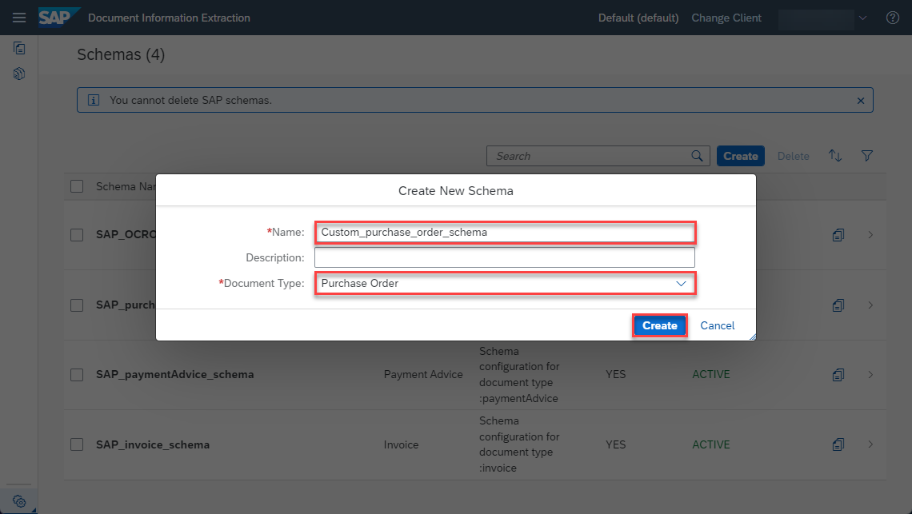
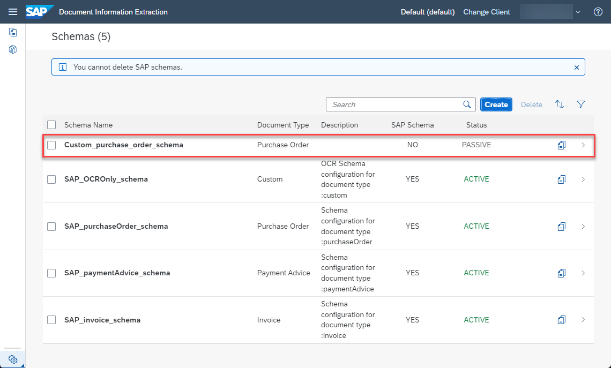
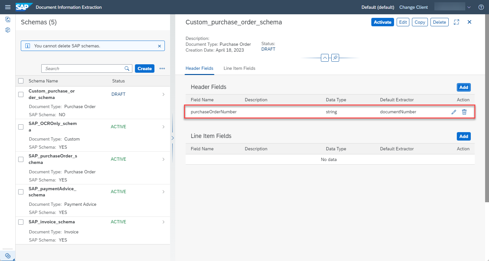
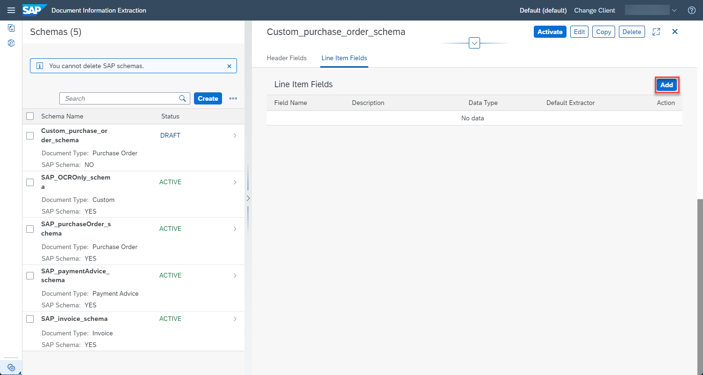
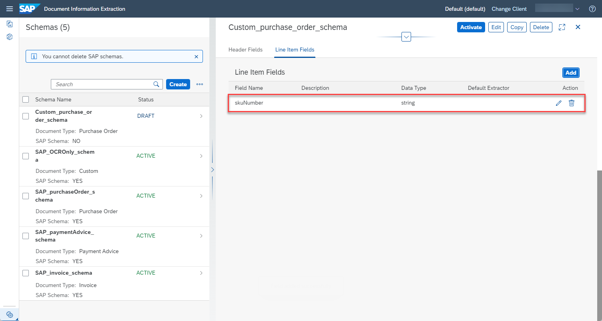
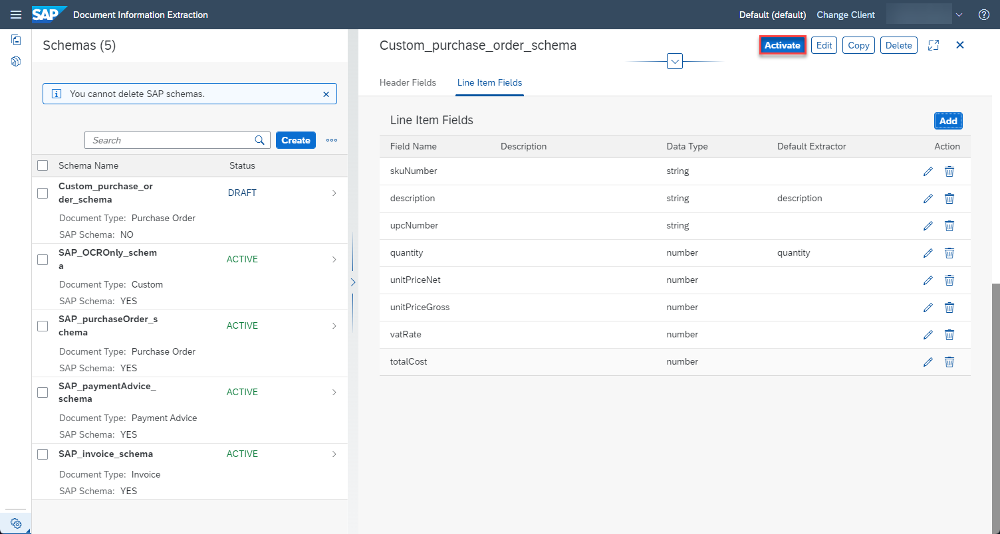

# Create Custom Schema for Purchase Order Documents
<!-- description --> Create a custom schema for your purchase order documents to extract information from similar documents using the Document Information Extraction service.

## You will learn
  - How to create a custom schema for purchase order documents
  - How to add standard and custom data fields for the header and line item information of purchase order documents

## Intro
The core functionality of Document Information Extraction is to automatically extract structured information from documents using machine learning. The service supports extraction from the following standard document types out of the box: invoices, payment advices, and purchase orders. You can customize the information extracted from these document types by creating a custom schema and adding the specific information that you have in your documents. Additionally, you can add completely new document types.

If you are new to the Document Information Extraction UI, first try out the tutorial: [Use Machine Learning to Extract Information from Documents with Document Information Extraction UI](cp-aibus-dox-ui).

---

### Access schema configuration

1. Open the Document Information Extraction UI, as described in the tutorial: [Use Trial to Set Up Account for Document Information Extraction and Go to Application](cp-aibus-dox-booster-app) or [Use Free Tier to Set Up Account for Document Information Extraction and Go to Application](cp-aibus-dox-free-booster-app).

    >If you **HAVE NOT** just used the **Set up account for Document Information Extraction** booster to create a service instance for Document Information Extraction and subscribe to the Document Information Extraction UI, observe the following:

    >- To access the [Schema Configuration](https://help.sap.com/viewer/5fa7265b9ff64d73bac7cec61ee55ae6/SHIP/en-US/3c7862e30fc2488ea95f58f1d77e424e.html) and [Template](https://help.sap.com/viewer/5fa7265b9ff64d73bac7cec61ee55ae6/SHIP/en-US/1eeb08998f49409681c06a01febc3172.html) features, ensure that you use the `blocks_of_100` plan to create the service instance for Document Information Extraction Trial.

    ><!-- border -->

     >- And make sure you're assigned to the role collection: `Document_Information_Extraction_UI_Templates_Admin_trial` (or `Document_Information_Extraction_UI_Templates_Admin` if you're using the free tier option). For more details on how to assign role collections, see step 2 in the tutorial: [Use Trial to Subscribe to Document Information Extraction Trial UI](cp-aibus-dox-ui-sub), or step 3 in the tutorial: [Use Free Tier to Subscribe to Document Information Extraction UI](cp-aibus-dox-free-ui-sub).

    ><!-- border -->

    >- After assigning new role collections, **Log Off** from the UI application to see all features you're now entitled to try out.

    ><!-- border -->

2. To create a custom schema, click the cogwheels icon and choose **Schema Configuration**.

    <!-- border -->

Here, you find the SAP schemas. The Document Information Extraction UI includes preconfigured SAP schemas for the following standard document types: purchase order, payment advice, and invoice. In addition, there’s an SAP schema for custom documents (`SAP_OCROnly_schema`). You can’t delete or change SAP schemas. You can use them as they are, or create copies and adapt the list of fields according to your needs.

<!-- border -->

>**CAUTION:**

>When using the free tier option for Document Information Extraction or a trial account, be aware of the technical limits listed in [Free Tier Option and Trial Account Technical Constraints](https://help.sap.com/docs/document-information-extraction/document-information-extraction/free-tier-option-and-trial-account-technical-constraints).

### Create schema

To create your own schema, click **Create** and a dialog opens.

<!-- border -->

In the dialog, enter a name for your custom schema, `Custom_purchase_order_schema`, for example. Note that the name cannot include blanks. Further, select `Purchase Order` as your **Document Type**.

Click **Create** to create the schema.

<!-- border -->

Now, your schema shows up in the list. Access the schema by clicking on the row.

<!-- border -->

### Understand schemas

A schema defines a list of header fields and line item fields that represent the information you want to extract from a document.

Header fields represent information that is specific to your document and only occurs one time. This may include the document number, any sender information, or the total amount of the order. In contrast, line item fields represent the products that you ordered, where each line is one product, often with a certain quantity attached. Thus, the line item fields extract the information for each product in your order. Those may include the article number, the price and the quantity.

Document Information Extraction already includes a number of fields that it can extract. See [here](https://help.sap.com/viewer/5fa7265b9ff64d73bac7cec61ee55ae6/SHIP/en-US/b1c07d0c51b64580881d11b4acb6a6e6.html) which header fields are supported and [here](https://help.sap.com/viewer/5fa7265b9ff64d73bac7cec61ee55ae6/SHIP/en-US/ff3f5efe11c14744b2ce60b95d210486.html) which line item fields are supported. Additionally, you can define custom fields. In the next step, you'll learn about both.

The image below shows an example purchase order. All the fields that you define in your schema in this tutorial are highlighted. The header fields represent all information outside of the table that occurs once. The line item fields represent all information within the table, which occurs per product. You can, of course, extend or reduce the information that you want to extract.

<!-- border -->

### Add header fields

To define your first header field, click **Add** to the right of the headline `Header Fields`.

<!-- border -->

For each field, you have to enter a name, a data type, a setup type, and optionally a default extractor and a description. The available data types are `string`, `number`, `date`, `discount`, `currency`, and `country/region`. 

The available setup types are `auto` and `manual`. The setup type `auto` supports extraction using the service’s machine learning models. You must specify a default extractor (standard fields supported by Document Information Extraction) for this setup type. It can only be used in schemas created for standard document types. The setup type `manual` supports extraction using a template. It’s available in schemas created for standard or custom document types.

As your first header field, add the number of your purchase order which identifies your document.

1. Enter an appropriate name for your field, `purchaseOrderNumber`, for example.

2. Select `string` for the `Data Type`. Note that a document number is a `string`, even though it consists of numbers, as it is an arbitrary combination of numbers without meaning. In contrast, price is an example of the data type `number`.

3. As all business documents have a unique identification, Document Information Extraction already includes a standard field. Select `auto` for the `Setup Type` and then select `documentNumber` for the `Default Extractor`.

4. Click **Add** to create the header field.

    <!-- border -->

The field now displays in your list of header fields, where you again find all the information that you have just entered. You can edit or delete the field by clicking the respective icons on the right.

<!-- border -->

You have now created your first header field that uses a standard field provided by Document Information Extraction. Next, you'll create your first custom header field, namely the status of your purchase order. In the example above, you find it right below the document number.

Click **Add** again to open the dialog.

1. Enter an appropriate name for your field, `purchaseOrderStatus`, for example.

2. Select `string` for the `Data Type`.

3. As Document Information Extraction offers no equivalent field, select `manual` for the `Setup Type` but leave the default extractor blank. Click **Add** to create the field.

    <!-- border -->

You have now created your first custom field. Go ahead and create the list of header fields as shown in the table and image below. Pay attention to which fields have a default extractor and which do not. Feel free to extend or reduce the list of header fields.

|  Field Name           | Data Type   | Setup Type  | Default Extractor
|  :------------------- | :---------- | :---------- | :-----------------
|  `purchaseOrderNumber`| string      | auto        | `documentNumber`
|  `purchaseOrderStatus`| string      | manual      | none
|  `vendor`             | string      | auto        | `senderName`           
|  `vendorSite`         | string      | auto        | `senderAddress`
|  `shipTo`             | string      | auto        | `shipToAddress`
|  `orderType`          | string      | manual      | none
|  `terms`              | string      | auto        | `paymentTerms`              
|  `orderCurrency`      | string      | auto        | `currencyCode`
|  `entryDate`          | date        | auto        | `documentDate`
|  `shipDate`           | date        | auto        | `deliveryDate`
|  `cancelDate`         | date        | manual      | none
|  `totalCostNet`       | number      | auto        | `netAmount`              
|  `totalCostGross`     | number      | auto        | `grossAmount`
|  `totalVatAmount`     | number      | manual      | none

<!-- border -->

### Add line item fields

Next, you need to define the line item fields. As your first line item field, add the SKU (Stock Keeping Unit) that uniquely identifies an article.

Click **Add** to the right of the headline `Line Item Fields`.

<!-- border -->

In the dialog proceed as follows:

1. Enter an appropriate name for your field, `skuNumber`, for example.

2. Select `string` for the `Data Type`.

3. Select `manual` for the `Setup Type`, leave the default extractor blank, and click **Add** to create the field.

<!-- border -->

The field now displays in your list of line item fields where you find all the information again that you have just entered.

<!-- border -->

You have now created your first line item field. Go ahead and create the list of line item fields as shown in the table and image below. Pay attention to which fields have a default extractor and which do not. Feel free to extend or reduce the list of line item fields.

|  Field Name           | Data Type   | Setup Type  | Default Extractor
|  :------------------- | :---------- | :---------- | :-----------------
|  `skuNumber`          | string      | manual      | none
|  `description`        | string      | auto        | `description`
|  `upcNumber`          | string      | manual      | none            
|  `quantity`           | number      | auto        | `quantity`
|  `unitPriceNet`       | number      | manual      | none  
|  `unitPriceGross`     | number      | manual      | none
|  `vatRate`            | number      | manual      | none              
|  `totalCost`          | number      | manual      | none

<!-- border -->

### Activate schema

Once you have added all header and line item fields, the schema needs to be activated so that it can be used to extract information from documents. Right now, the schema has the status `DRAFT`, indicating that it cannot be used yet.

To activate the schema, click **Activate**.

<!-- border -->

Now, the status of your schema changes to `ACTIVE`. To make changes to your schema, you have to **Deactivate** it first.

<!-- border -->

Congratulations, you have created and activated your custom schema for purchase order documents.

In the next tutorial: [Create Custom Template for Purchase Order Documents](cp-aibus-dox-ui-template), you'll create a template that uses your schema, and associate documents with your template to show the Document Information Extraction service where each field is located in the document.