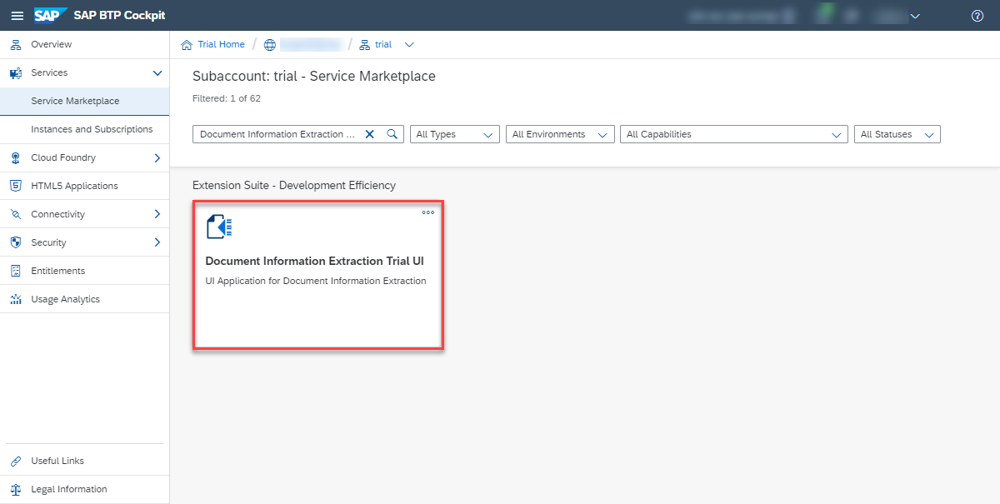
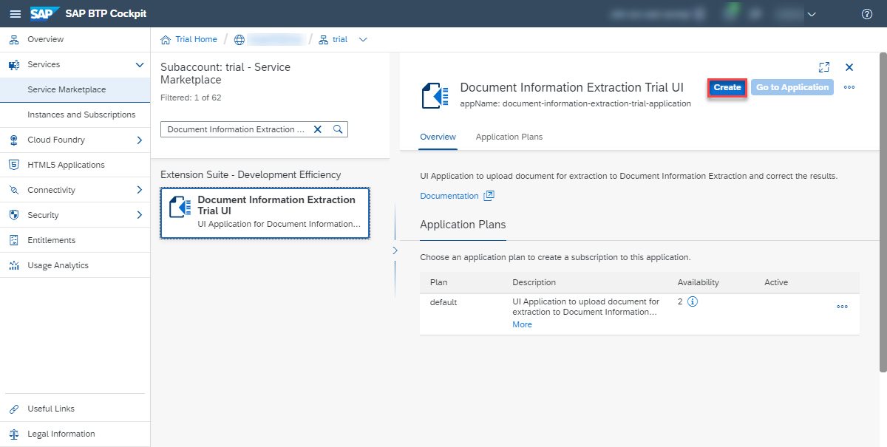

## Prerequisites
- You have created a service instance for Document Information Extraction: [Create Service Instance for Document Information Extraction](cp-aibus-dox-service-instance).

## Details
### You will learn
  - How to subscribe, assign role collection and access Document Information Extraction Trial UI

---

[ACCORDION-BEGIN [Step 1: ](Get subscribed)]

After completing the prerequisite tutorial [Create Service Instance for Document Information Extraction](cp-aibus-dox-service-instance), to create a service instance for Document Information Extraction, you can start with the steps to subscribe to the Document Information Extraction Trial UI.

1. From your global account page, choose the `trial` tile to access your subaccount.

    !

2. On the navigation side bar, click **Subscriptions**.

    !

3. Search for **Document Information Extraction Trial UI** and click the tile to open the **Subscription: Document Information Extraction Trial UI - Overview** page.

    !

4. Click **Subscribe**.

    !

You are now subscribed to Document Information Extraction Trial UI.

!

[DONE]
[ACCORDION-END]

[ACCORDION-BEGIN [Step 2: ](Assign role collection)]

1. Go back to your global account page and choose the `trial` tile to access your subaccount.

    !

2. On the navigation side bar, click **Security**.

    !

3. Click **Trust Configuration**.

    !

4. Click **sap.default**.

    !

5. Enter your email address and click **Show Assignments**.

    !

6. Click **Assign Role Collection**, choose **`Document_Information_Extraction_UI_End_User_trial`** and click **Assign Role Collection**.

    !

You have now assigned the Document Information Extraction Trial UI role collection.

!

[VALIDATE_1]
[ACCORDION-END]

[ACCORDION-BEGIN [Step 3: ](Go to application)]

Go back to the **Subscription: Document Information Extraction Trial UI - Overview** page and click **Go to Application**.

!

The Document Information Extraction Trial UI is displayed:

!

You have successfully subscribed to the Document Information Extraction Trial UI. Find out how to use the application in the next tutorial: [Use the Document Information Extraction Trial UI](cp-aibus-dox-ui).

[DONE]
[ACCORDION-END]
