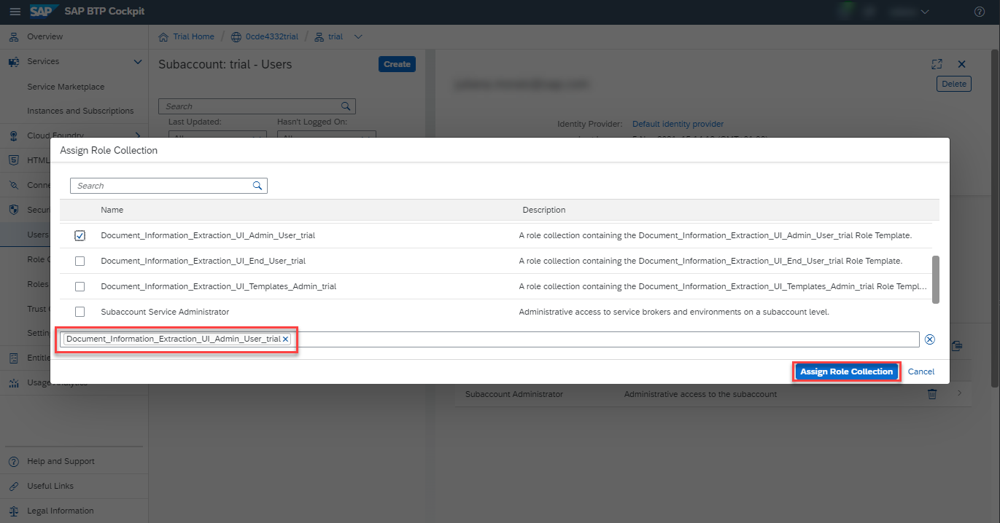

# Use Trial to Subscribe to Document Information Extraction Trial UI
<!-- description --> Get access to the Document Information Extraction user interface application, using SAP Business Technology Platform (SAP BTP) Trial.

## Prerequisites
- You have created a service instance for Document Information Extraction: [Use Trial to Create a Service Instance for Document Information Extraction](cp-aibus-dox-service-instance).

## You will learn
  - How to add the entitlements for the Document Information Extraction Trial application
  - How to subscribe, assign role collection and access the Document Information Extraction Trial application

---

### Check entitlements

After completing the prerequisite tutorial [Use Trial to Create a Service Instance for Document Information Extraction](cp-aibus-dox-service-instance), to create a service instance for Document Information Extraction, you can start with the steps to subscribe to the Document Information Extraction Trial application.

1. From your global account page, choose the `trial` tile to access your subaccount.

    <!-- border -->

2. On the navigation side bar, click **Entitlements** to see a list of all eligible services and applications. You are entitled to use every service in this list according to the assigned plan.
   
3. Search for **Document Information Extraction Trial**. ***If you find `document-information-extraction-trial-application` in the list, you are entitled to use the Document Information Extraction Trial application. Now you can set this step to **Done** and proceed with Step 2.***

    <!-- border -->

***ONLY if you DO NOT find `document-information-extraction-trial-application` in your list, proceed as follows:***

  1. Click **Configure Entitlements**.

    

  2. Click **Add Service Plans**.

    

  3. Select **Document Information Extraction Trial**, and choose the **`default (Application)`** plan. Click **Add 1 Service Plan**.

    <!-- border -->

  4. **Save** your **Entitlements** changes.

    <!-- border -->    

You're now entitled to subscribe to the Document Information Extraction Trial application.

>For more details on how to configure entitlements, quotas, subaccounts and plans on SAP BTP Trial, see [Manage Entitlements on SAP BTP Trial](cp-trial-entitlements).

### Get subscribed

The **Service Marketplace** is where you find all the services and applications available on SAP BTP.

1. To access it, click **Service Marketplace** on the navigation side bar.

    <!-- border -->

2. Search for **Document Information Extraction Trial** and click the tile.

    <!-- border -->

3. Click **Create**.

    <!-- border -->

4. In the dialog, choose the `default Subscription` plan and click **Create**.

  <!-- border -->

The subscription will now be created. Click on **View Subscription** to go to the list of your existing subscriptions.

<!-- border -->

### Assign role collection

1. Under **Security**, click **Users** and then the **Actions** arrow.

    <!-- border -->    

2. Click **Assign Role Collection**.

    <!-- border -->

3. Choose **`Document_Information_Extraction_UI_Templates_Admin_trial`** to access all the features available in the UI application and click **Assign Role Collection**.

    <!-- border -->

You're now assigned to the **`Document_Information_Extraction_UI_Templates_Admin_trial`** role collection.

<!-- border -->

### Go to application

Go back to **Instances and Subscriptions**, click the dots to open the menu and select **Go to Application** to open the app.

<!-- border -->

The Document Information Extraction Trial application is displayed:

<!-- border -->

You have successfully subscribed to the Document Information Extraction Trial UI. Find out how to use the application in the next tutorial: [Use Machine Learning to Extract Information from Documents with Document Information Extraction Trial UI](cp-aibus-dox-ui).