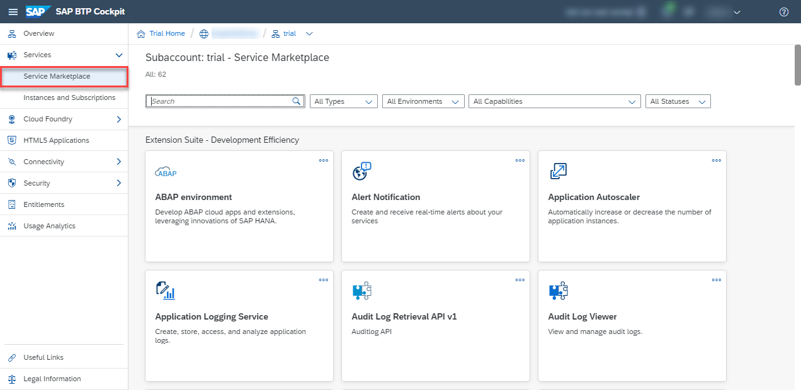
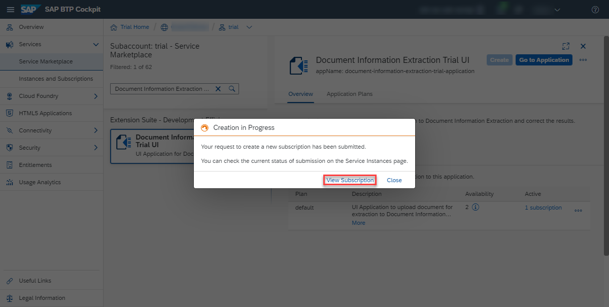
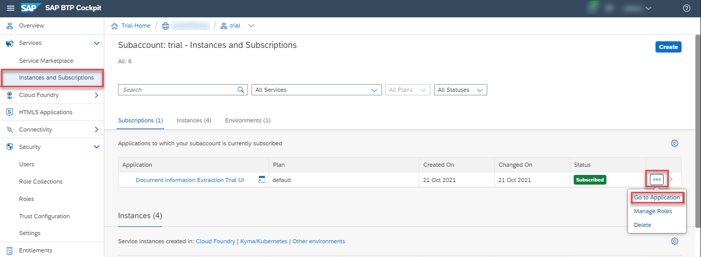

# Use Trial to Subscribe to Document Information Extraction Trial UI
<!-- description --> Get access to the Document Information Extraction user interface application, using SAP Business Technology Platform (SAP BTP) Trial.

## Prerequisites
- You have created a service instance for Document Information Extraction: [Create Service Instance for Document Information Extraction](cp-aibus-dox-service-instance).

## You will learn
  - How to subscribe, assign role collection and access Document Information Extraction Trial UI

---

### Get subscribed

After completing the prerequisite tutorial [Create Service Instance for Document Information Extraction](cp-aibus-dox-service-instance), to create a service instance for Document Information Extraction, you can start with the steps to subscribe to the Document Information Extraction Trial UI.

1. From your global account page, choose the `trial` tile to access your subaccount.

    <!-- border -->

2. On the navigation side bar, click **Service Marketplace**.

    <!-- border -->

3. Search for **Document Information Extraction Trial UI** and click the tile.

    <!-- border -->

4. Click **Create**.

    <!-- border -->

5. In the dialog, click **Create** once again.

  <!-- border -->

The subscription will now be created. Click on **View Subscription** to go to the list of your existing subscriptions.

<!-- border -->

### Assign role collection

1. Under **Security**, click **Users** and then the **Actions** arrow.

    <!-- border -->    

2. Click **Assign Role Collection**.

    <!-- border -->

3. Choose **`Document_Information_Extraction_UI_Admin_User_trial`** to access all the features available in the UI application and click **Assign Role Collection**.

    <!-- border -->

You're now assigned to the **`Document_Information_Extraction_UI_Admin_User_trial`** role collection.

<!-- border -->

### Go to application

Go back to **Instances and Subscriptions**, click the dots to open the menu and select **Go to Application** to open the app.

<!-- border -->

The Document Information Extraction Trial UI is displayed:

<!-- border -->

You have successfully subscribed to the Document Information Extraction Trial UI. Find out how to use the application in the next tutorial: [Use the Document Information Extraction Trial UI](cp-aibus-dox-ui).

