# Create Custom Template for Purchase Order Documents
<!-- description --> Create a custom template for purchase order documents to extract information from similar documents using the Document Information Extraction service.

## You will learn
  - How to create a template for purchase order documents using your schema
  - How to add sample documents to your template and how to annotate them
  - How to use your template when extracting information from documents

---

### Create template

In [Create Custom Schema for Purchase Order Documents](cp-aibus-dox-ui-schema), you defined a schema that includes a list of header and line item fields you want to extract from your purchase order documents. In this tutorial, you'll create a template that uses your schema and additional sample documents. You'll add annotations to the sample documents to teach the Document Information Extraction service where certain field values are located on the document to improve the accuracy of the extraction prediction for similar documents.

>This tutorial uses the following purchase order documents. Download them to follow along (right click on the link, then click ***Save link as*** to download the files locally):

> - [Sample Purchase Order 1](https://github.com/SAPDocuments/Tutorials-Contribution/raw/master/tutorials/cp-aibus-dox-ui-template/sample-purchase-order-1.pdf)
> - [Sample Purchase Order 2](https://github.com/SAPDocuments/Tutorials-Contribution/raw/master/tutorials/cp-aibus-dox-ui-template/sample-purchase-order-2.pdf)
> - [Sample Purchase Order 3](https://github.com/SAPDocuments/Tutorials-Contribution/raw/master/tutorials/cp-aibus-dox-ui-template/sample-purchase-order-3.pdf)

In Document Information Extraction UI, access **Template** on the left navigation pane and click **+** to create a new template.

<!-- border -->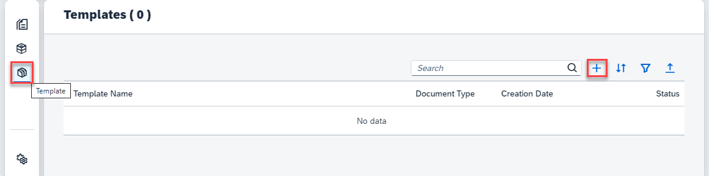

In the dialog, proceed as follows:

1. Enter a name for your template, `Custom_purchase_order_template`, for instance.

2. Choose `Purchase Order` as your `Document Type`.

3. Select the schema you created in [Create Custom Schema for Purchase Order Documents](cp-aibus-dox-ui-schema).

4. Choose one of the sample documents by clicking **Browse**. The following images use the [Sample Purchase Order 1](https://github.com/SAPDocuments/Tutorials-Contribution/raw/master/tutorials/cp-aibus-dox-ui-template/sample-purchase-order-1.pdf). Upload the same document in the file dialog to follow along.

5. Click **Create** to create your template.

    <!-- border -->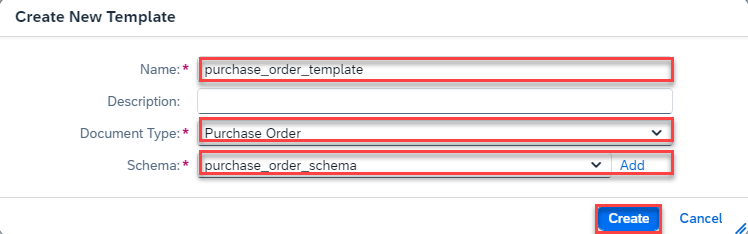

6. After your template is created, a confirmation dialog pops up. Click **OK** to acknowledge it. It will now navigate you to the detail page of your template.

<!-- border -->

Here, you find a list of your sample documents as well as a list of the included extraction fields that you have defined in your schema.

In the next step, you'll start annotating your sample document.

>**CAUTION:**

>Be aware of the following Document Information Extraction Trial UI trial account limitations:​

>- Maximum 40 uploaded document pages per week​ (the documents can have more than 1 page)​
>- Maximum 10 schemas per trial account
>- Maximum 3 templates per trial account (with a maximum of 5 sample documents each)

### Annotate header fields

Click on the row of your sample document to open it.

<!-- border -->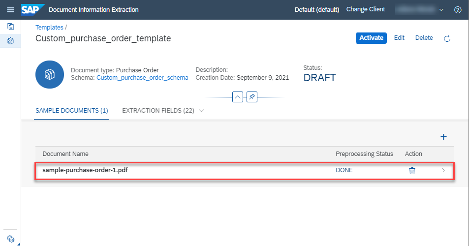

Next, click **Annotations** to open the annotations pane on the right side.

<!-- border -->

Two sections appear: the first section includes your header fields with no values yet, and the second section is a blank list to which you add your line items. To start annotating, click **Edit**.

<!-- border -->

If you now hover your mouse over the document, the mouse pointer changes to a crosshair cursor. This allows you to draw a box around the information on the document.

You may further notice that all the text on the document has a gray background now. This indicates that Document Information Extraction has recognized the text. Now you only have to connect the text with the field, without actually entering the text yourself. Start with the `purchaseOrderNumber`:

Find the number at the top of the document. Draw a box around it by holding down the left mouse button and moving the cursor diagonally to the opposite corner. Do not include the "No." in front! If you are on a smaller screen, zoom in and out by using the magnifying glass icons on the top.

Once you drew the bounding box, a dialog appears. Here, you find that the service recognized the actual number of your purchase order and pre-filled the field. Select `purchaseOrderNumber` as the field to which this value belongs. Then, click **Apply**.

<!-- border -->

Now, the field for the `purchaseOrderNumber` on the right is filled with the number of your purchase order. Additionally, the number on the document is surrounded by a blue box.

<!-- border -->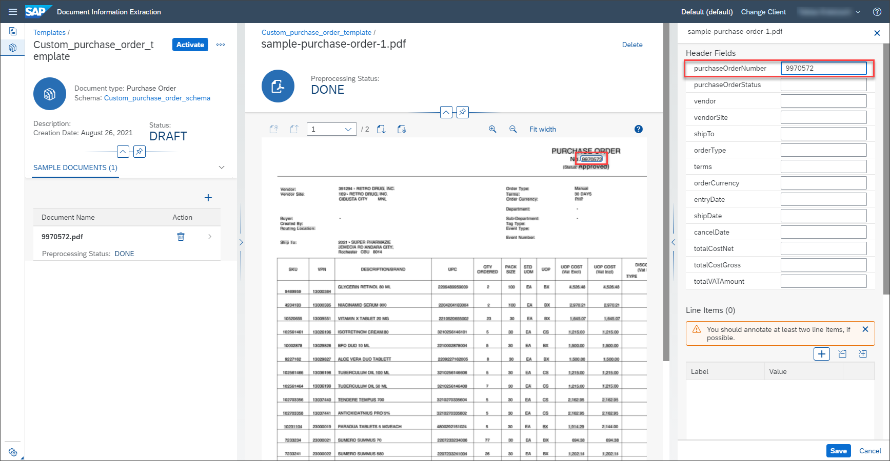

Continue until you fill out all header fields with a value and a corresponding box. Note that some values may be on the second page of the document. Navigate between the pages using the icons on the top left.

<!-- border -->

### Annotate line item fields

In contrast to header fields, line item fields occur multiple times on a document. To help Document Information Extraction extract those information, you need to annotate at least two lines.

Create the first line item by clicking **+**.

<!-- border -->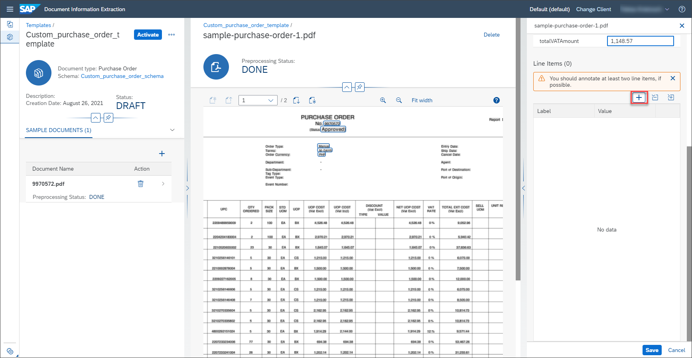

This adds a line item with all its corresponding fields in the list below. Now, annotate the SKU number in the first line of the table. In the dialog, select the corresponding field again, `skuNumber`. Additionally, you have to specify the row of the line item. Here, select `1`. Click **Apply** to create the annotation.

<!-- border -->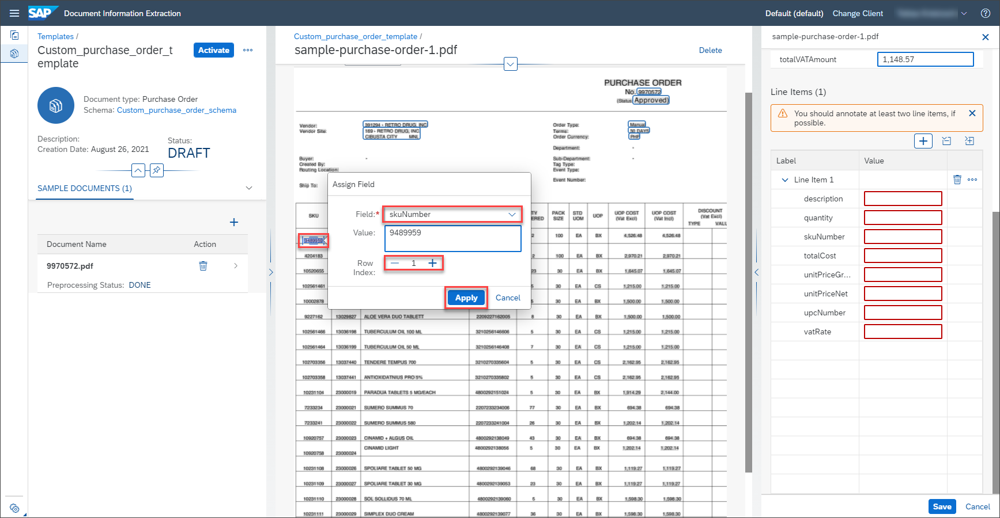

Proceed with the remaining fields of the first line item until all fields are filled. Now, click **+** again to add a second line item.

<!-- border -->

This adds another line item in the list below the first one. If you annotate the fields of the second line item, make sure to select `2` as the row.

<!-- border -->

Proceed with the remaining fields similar to the first line item. Once you are done, you successfully annotated the sample document. Click **Save** to ensure your hard work is not lost.

<!-- border -->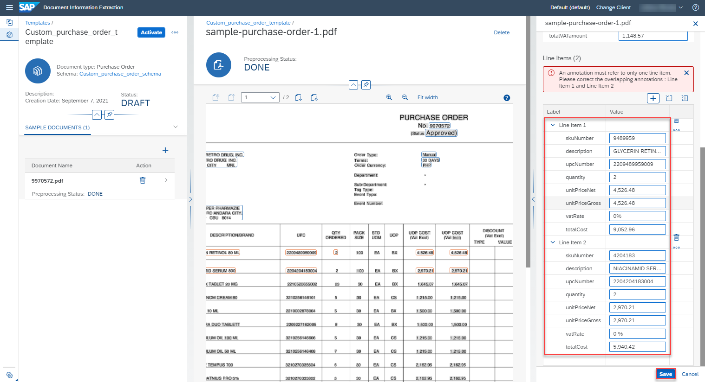

### Activate template

The last step that remains is to activate the template. Therefore, click **Activate**.

<!-- border -->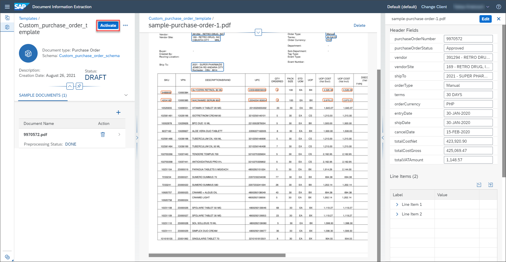

Now, the status of your template changes from `DRAFT` to `ACTIVE` which means you can use the template to extract information from documents. To make changes to your template (add more sample document files, for example), you have to **Deactivate** it first.

Congratulations, you have created and activated your first Document Information Extraction schema.

### Use template

1.  Access **Document** on the left navigation pane and click **+** to upload a new document.

    <!-- border -->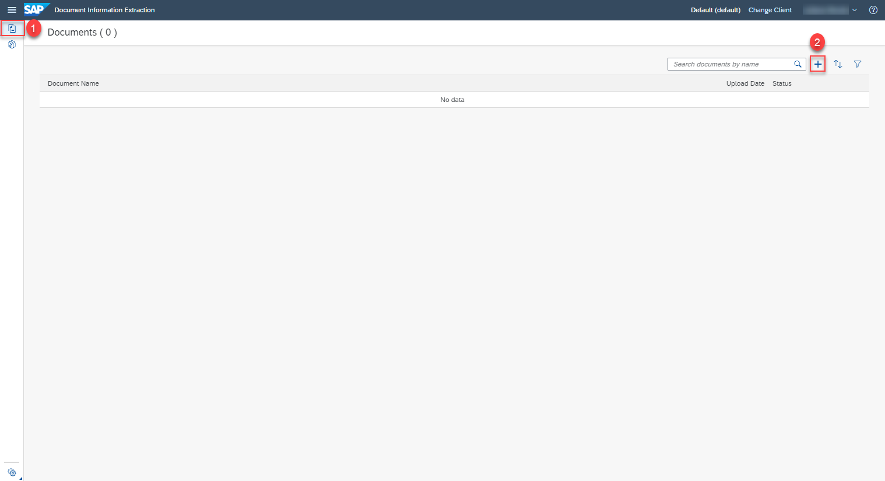

2. In the Select Document screen, choose `Purchase Order` for the **Document Type**.

3. Select the **Schema** and **Template** you created.

4. Drop files directly or click **+** to upload one or more document files. First, use the [Sample Purchase Order 2](https://github.com/SAPDocuments/Tutorials-Contribution/raw/master/tutorials/cp-aibus-dox-ui-template/sample-purchase-order-2.pdf).

5. Click **Step 2**.

    <!-- border -->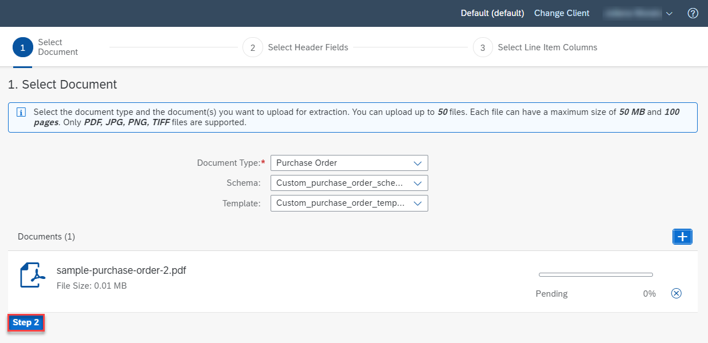

6. The selection of header fields and line item fields comes from the schema and cannot be edited. Click **Step 3** and then click **Review**.

7. Review your selection. Click **Edit** if you want to change anything. Click **Confirm**.

    <!-- border -->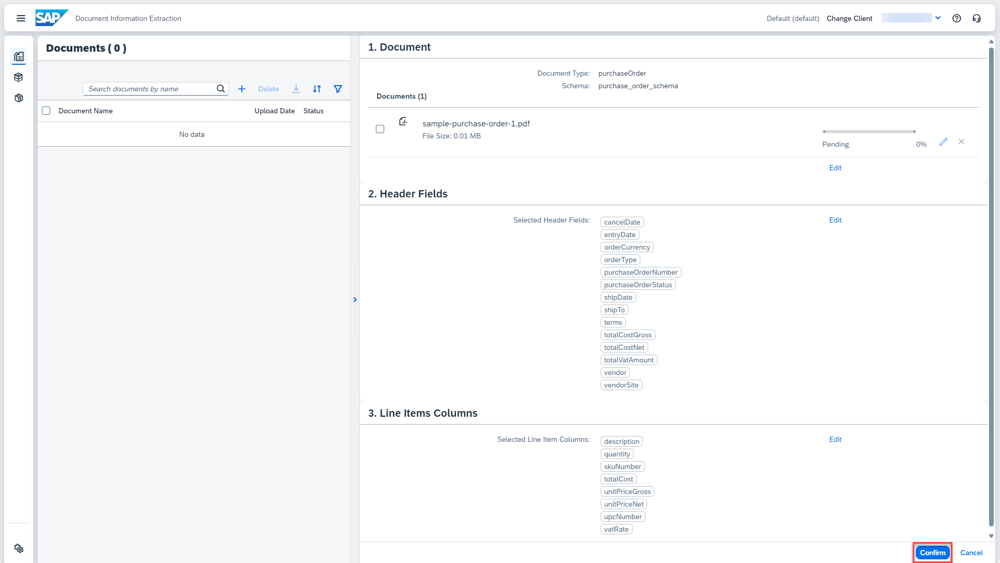

    The document status changes from `PENDING` to `READY`.

    <!-- border -->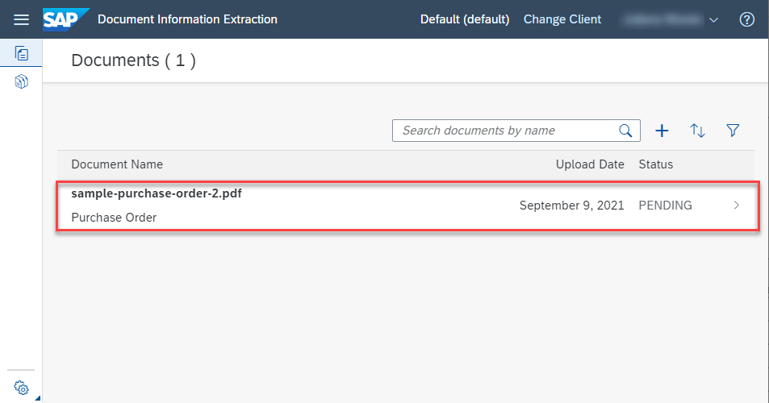

    <!-- border -->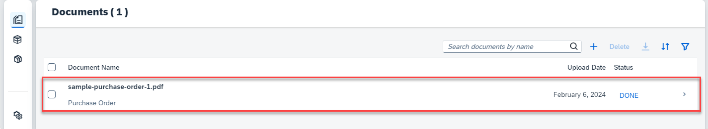

8. Click the document row and **Extraction Results** to see the information extracted from the document using the schema and template you created.

<!-- border -->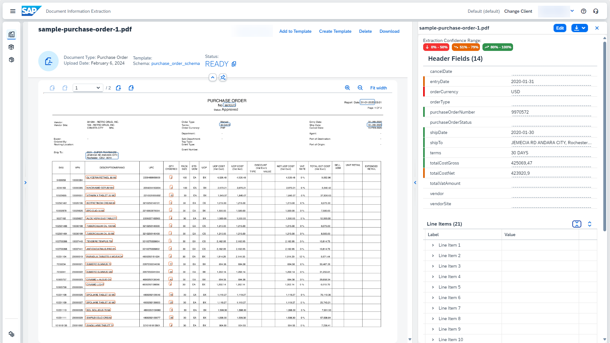

You can repeat this step using the [Sample Purchase Order 3](https://github.com/SAPDocuments/Tutorials-Contribution/raw/master/tutorials/cp-aibus-dox-ui-template/sample-purchase-order-3.pdf).

Congratulations, you have completed this tutorial.

