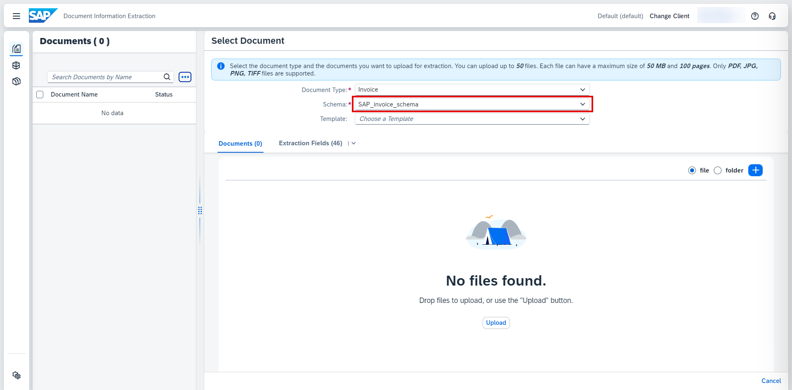
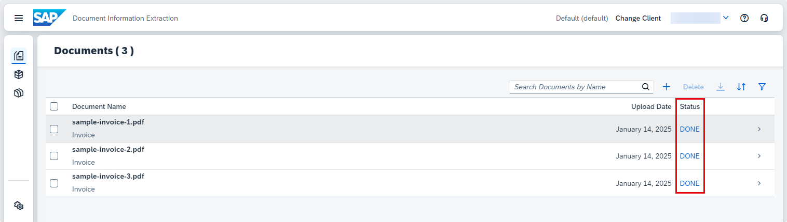
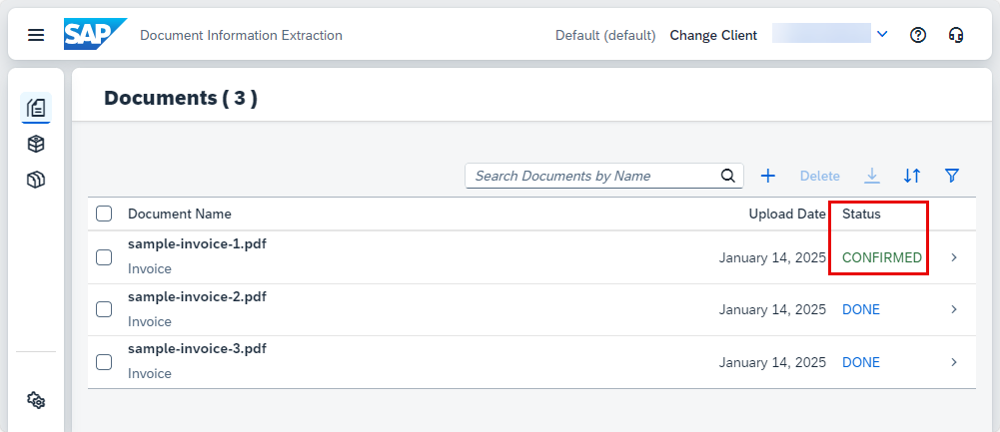
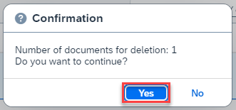

# Use Machine Learning to Extract Information from Documents with Document Information Extraction Trial UI
<!-- description --> Get machine learning model predictions for the documents you upload using the Document Information Extraction Trial UI.

## You will learn
  - How to use the Document Information Extraction Trial UI to upload new documents
  - What schemas and SAP schemas are and how to use them
  - How to see and edit the extraction results
  - How to delete documents

## Intro
The core functionality of Document Information Extraction is to automatically extract structured information from documents using machine learning. When you finish this tutorial, you will get field value predictions for the documents you upload to Document Information Extraction Trial UI.

---

### Upload documents

>Document Information Extraction uses a globally pre-trained machine learning model that currently obtains better accuracy results with business cards, invoices, payment advices, and purchase orders in the languages and for the countries and regions listed in [Supported Languages and Countries/Regions](https://help.sap.com/docs/document-information-extraction/document-information-extraction/supported-languages-and-countries-regions). If you're interested in processing other document types, try out the following tutorial missions:

>- [Use Generative AI to Process Business Documents] (https://developers.sap.com/mission.gen-ai-process-business-documents.html)
>- [Shape Machine Learning to Process Custom Business Documents] (https://developers.sap.com/mission.btp-aibus-shape-ml-custom.html)

>See also [Supported Document Types] (https://help.sap.com/docs/document-information-extraction/document-information-extraction/supported-document-types) and [Supported File Types] (https://help.sap.com/docs/document-information-extraction/document-information-extraction/supported-file-types-all).

Upload to the service any standard document type file (in PDF format or single-page JPEG, PNG, and TIFF format) that has content in headers and tables, such as an invoice.

>As an alternative to uploading your own documents to the service, you can use the following sample invoice files (right click on the link, then click ***Save link as*** to download the files locally):

>- [Sample Invoice 1](https://raw.githubusercontent.com/SAPDocuments/Tutorials/master/tutorials/cp-aibus-dox-swagger-ui/sample-invoice-1.pdf)

>- [Sample Invoice 2](https://raw.githubusercontent.com/SAPDocuments/Tutorials/master/tutorials/cp-aibus-dox-swagger-ui/sample-invoice-2.pdf)

>- [Sample Invoice 3](https://raw.githubusercontent.com/SAPDocuments/Tutorials/master/tutorials/cp-aibus-dox-swagger-ui/sample-invoice-3.pdf)

1. Open the Document Information Extraction Trial UI, as described in the tutorial: [Use Trial to Set Up Account for Document Information Extraction and Go to Application](cp-aibus-dox-booster-app).   

2. In the top right, click **+** (Upload Document).

    <!-- border -->

3. On the Select Document screen, choose the **Document Type**.

    <!-- border -->

4. Next, select the **Schema**. 

    <!-- border --> 

    >**NOTE:**

    >You must select a schema when you add documents. By default, Document Information Extraction proposes the appropriate preconfigured SAP schema for your document type. To see the header and line item fields that are available in an SAP schema, choose the desired **Schema** on the Select Document screen, and then choose **Extraction Fields** to display the schema details.

    >You can also create schemas of your own. To find out how to create schemas, see [Create Schema for Purchase Order Documents](cp-aibus-dox-schema) and [Create Schema for Custom Documents](cp-aibus-dox-schema-custom). 
    
    >For more information about schemas, see step 2 of this tutorial, **Understand schemas**.

5.  Drop files directly or click **+** (Upload) to upload one or more document files. Click **Confirm**.

    <!-- border -->

    You see the Document Name, Upload Date, and Status of the documents you have just uploaded.

    <!-- border -->

    The status changes from PENDING to DONE. This means the selected header fields and line items have been extracted, and the extraction results are ready to be validated and changed if necessary. If the status changes from PENDING to FAILED, this means it was not possible to get the extraction results, and you need to upload the documents again.

    <!-- border -->

>**CAUTION:**

>When using the free tier option for Document Information Extraction or a trial account, be aware of the technical limits listed in [Free Tier Option and Trial Account Technical Constraints](https://help.sap.com/docs/document-information-extraction/document-information-extraction/free-tier-option-and-trial-account-technical-constraints).

### Understand schemas

A schema contains a list of header fields and line item fields representing the target information that you want to extract from a particular type of document. You must select a schema when you add documents to the Document Information Extraction UI.

You can either create your own schema from scratch or use a preconfigured SAP schema. The Document Information Extraction UI provides SAP schemas for the following standard document types:

* Invoice
* Payment advice
* Purchase order

In addition, there’s an SAP schema for custom documents (`SAP_OCROnly_schema`). You can use these schemas unchanged to upload documents.

If you don’t want to configure your own schema, you can select the appropriate SAP schema unedited when you add a document on the Document Information Extraction UI. No configuration is needed when you use SAP schemas in this way. Alternatively, you can copy a suitable SAP schema and edit the default fields in line with your needs.

>**NOTE:** You can’t edit or delete original SAP schemas. Always create a copy and then edit the default fields, as required.

### See and edit extraction results

1. On the Documents screen, click the document row where you see Document Name, Upload Date, and Status.

    <!-- border -->

    You see the page preview of the document file you uploaded and the header fields and line items extraction results.

    <!-- border -->

    You also see the machine learning model **Extraction Confidence Range** classified by colors: red (confidence between 0% and 50%), orange (confidence between 51% and 79%), and green (confidence between 80% and 100%).

    To see the prediction confidence score for each header field and line item extraction result,  hover the mouse over a field name, for example **Invoice Number**.

    <!-- border -->

2. If corrections are needed, and the document status is DONE, you can **Edit** the Header Fields and Line Items extraction results.

    <!-- border -->

    Here, you see an example where the **Currency Code** header field extraction result is edited:

    <!-- border -->

    <!-- border -->

3. Click **+** to insert a new line item at the bottom.

    <!-- border -->

4. To edit fields, first select a value in the document page preview, and choose the appropriate name from the **Field** dropdown list on the **Assign Field** dialog. Then, add or change the extraction value, if necessary. Finally, click **Apply** to add the selected field to the Header Fields or Line Items extraction results.

    Here, you see an example where the value for the Buyer Contact field is selected in the document page preview and added to the Header Fields extraction results:

    <!-- border -->

    <!-- border -->

5. Save your changes.

    <!-- border -->

6. You can also **Edit** and **Confirm** the document.

    <!-- border -->

    The status changes from DONE to CONFIRMED. This means the extraction results have been confirmed and can no longer be changed.

    <!-- border -->

### Delete documents

1. On the Documents screen, select the document you want to delete. Click **Delete**.

    <!-- border --> 

2.  Click **Yes** to delete the document you selected.
    
    <!-- border -->

    The document is then removed from the Documents list.

    <!-- border -->

Congratulations, you've completed this tutorial.