## Details
### You will learn
  - How to use the Document Information Extraction Trial UI to upload new documents
  - How to see and edit the extraction results
  - How to delete documents

The core functionality of Document Information Extraction is to automatically extract structured information from documents using machine learning. When you finish this tutorial, you will get field value predictions for the documents you upload to Document Information Extraction Trial UI.

---

[ACCORDION-BEGIN [Step 1: ](Upload documents)]

>Document Information Extraction uses a globally pre-trained machine learning model that currently obtains better accuracy results with invoices and payment advices in the languages listed in [Supported Languages and Countries](https://help.sap.com/viewer/5fa7265b9ff64d73bac7cec61ee55ae6/SHIP/en-US/5bf847f7d1a848dcb3513eff9ec70412.html). The team is working to support additional document types and languages in the near future.

Upload to the service any document file in PDF or single-page PNG and JPEG format that has content in headers and tables, such as an invoice.

>As an alternative to uploading your own documents to the service, you can use the following sample invoice files (right click on the link, then click ***Save link as*** to download the files locally):

>- [Sample Invoice 1](https://raw.githubusercontent.com/SAPDocuments/Tutorials/master/tutorials/cp-aibus-dox-swagger-ui/data/sample-invoice-1.pdf)

>- [Sample Invoice 2](https://raw.githubusercontent.com/SAPDocuments/Tutorials/master/tutorials/cp-aibus-dox-swagger-ui/data/sample-invoice-2.pdf)

>- [Sample Invoice 3](https://raw.githubusercontent.com/SAPDocuments/Tutorials/master/tutorials/cp-aibus-dox-swagger-ui/data/sample-invoice-3.pdf)

1. Open the Document Information Extraction Trial UI, as described in the tutorial: [Set Up Account for Document Information Extraction and Go to Application](cp-aibus-dox-booster-app).

    !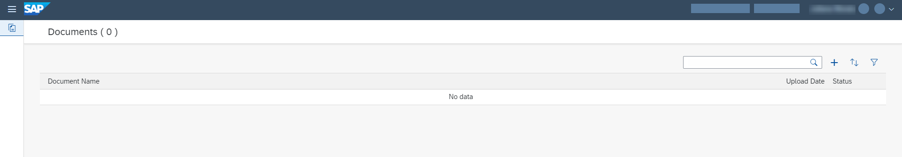

2. In the top right, click **+** (Upload a new document).

    !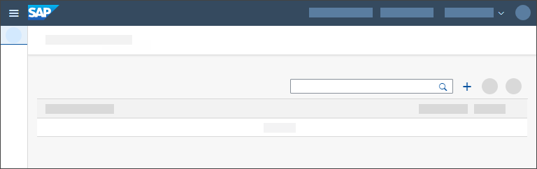

3. In the Select Document screen, drop files directly or click **+** to upload one or more document files.

    !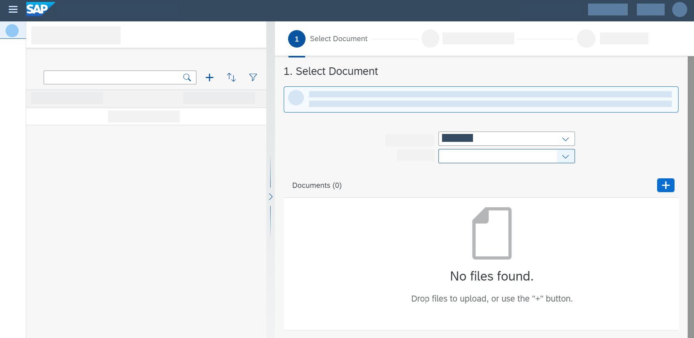

4. Select the **Document Type**. Click **Step 2**.

    !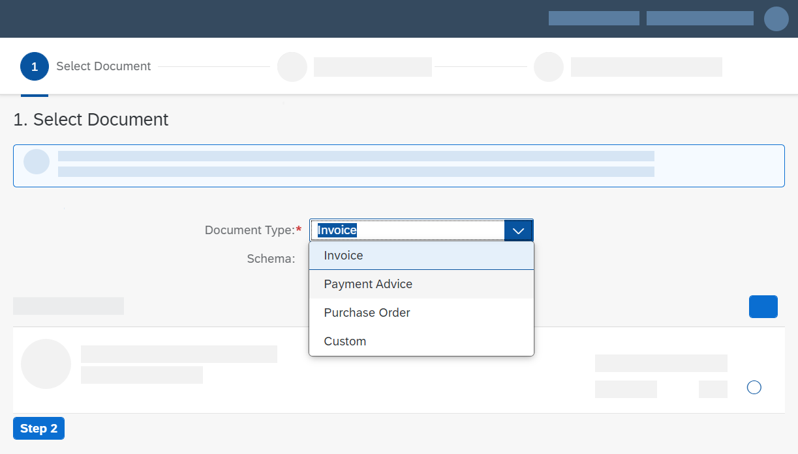

5. In **Step 2**, select the header fields you want to extract from the documents you uploaded in the previous step. Click **Step 3**.

    !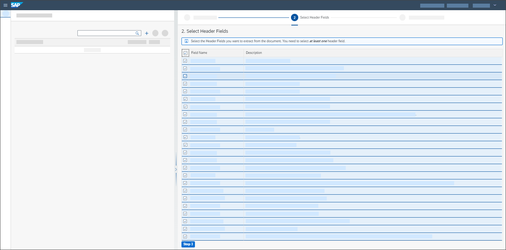

6. In **Step 3**, select the line items you want to extract from the documents you uploaded in the previous step. Click **Review**.

    !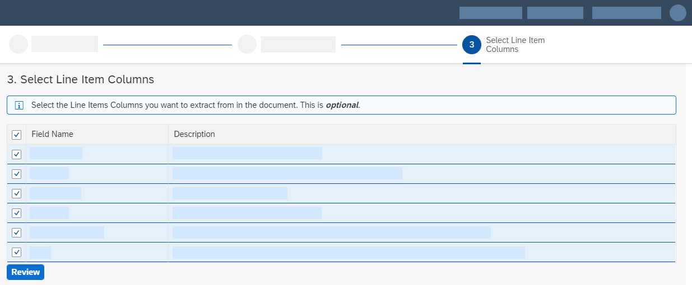

7. Review your selection. Click **Edit** if you want to change anything. Click **Confirm**.

    !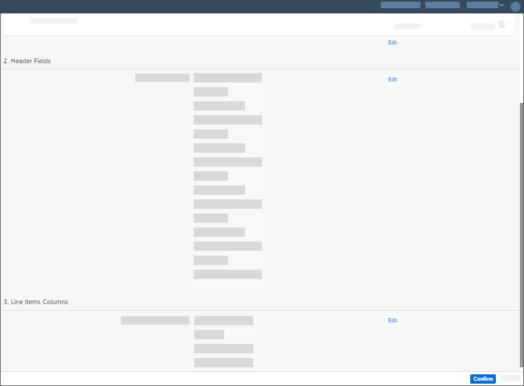

    You see the Document Name, Upload Date and Status of the documents you have just uploaded.

    !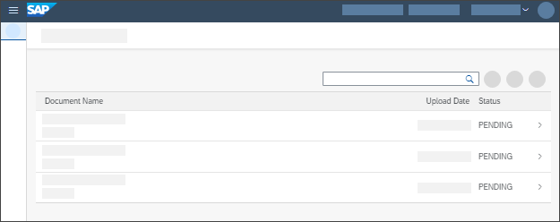

    Status changes from PENDING to READY. This means the selected header fields and line items have been extracted, and the extraction results are ready to be validated and changed if necessary. If status changes from PENDING to FAILED, this means it was not possible to get the extraction results, and you need to upload the document once again.

    !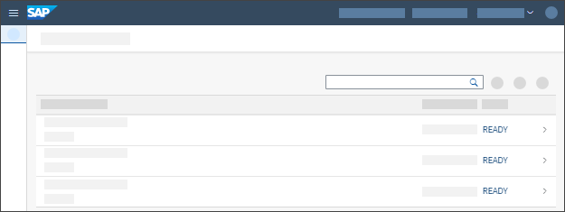

>**CAUTION:**

>Be aware of the following Document Information Extraction Trial UI trial account limitation:​

>- Maximum 40 uploaded document pages per week​ (the documents can have more than 1 page)​

[VALIDATE_1]
[ACCORDION-END]

[ACCORDION-BEGIN [Step 2: ](See and edit extraction results)]

1. In the Documents screen, click the document row where you see Document Name, Upload Date and Status.

    !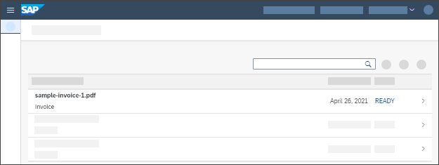

    You see the page preview of the document file you uploaded.

    !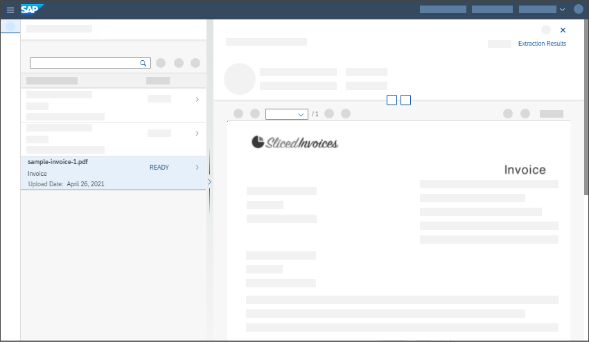

2. Click **Extraction Results** to see the Header Fields and Line Items extraction results.

    !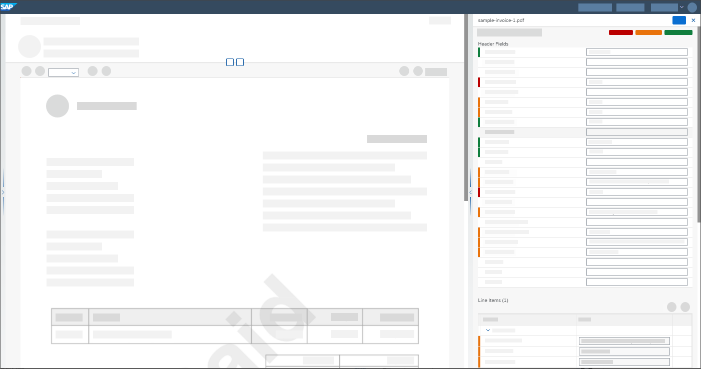

    See also the machine learning model **Extraction Confidence Range** classified by colors: red (confidence between 0% and 50%), yellow (confidence between 51% and 79%), and green (confidence between 80% and 100%).

    !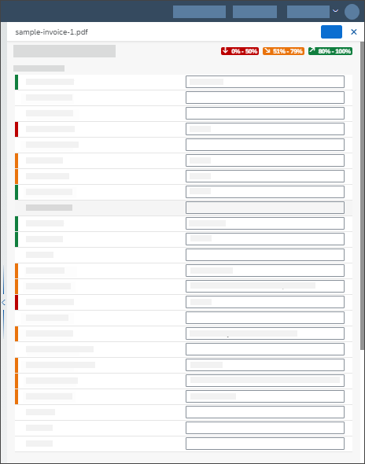

    See the prediction confidence score for each header field and line item extraction result by hovering the mouse over a field name, for example **Invoice Number**.

    !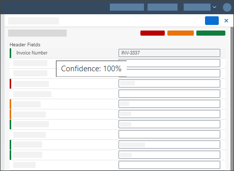

3. In case corrections are needed and the document status is READY, you can **Edit** the Header Fields and Line Items extraction results.

    !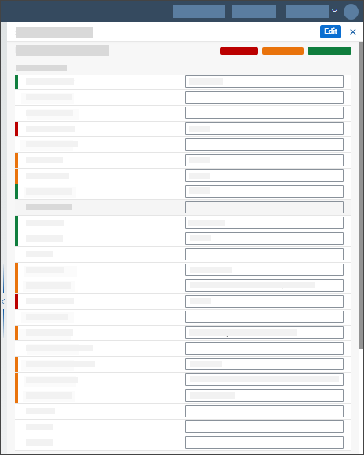

    See an example where the **Currency Code** header field extraction result is edited:

    !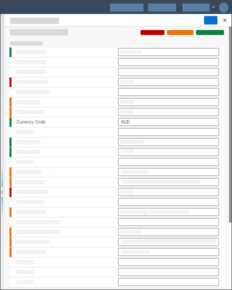

    !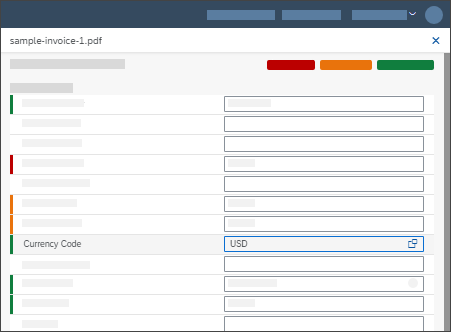

4. Click **+** to insert a new line item at the bottom.

    !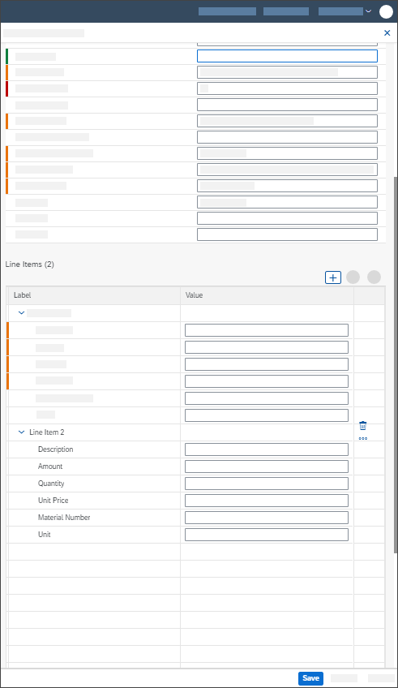

5. Select values in the document page preview, one each time, to **Assign Field** by choosing in the dropdown list the Field name. Add or change the extraction Value if necessary. Click **Apply** to add the selected field into the Header Fields or Line Items extraction results.

    See an example where the Buyer Contact value is selected in the document page preview and added to the Header Fields extraction results:

    !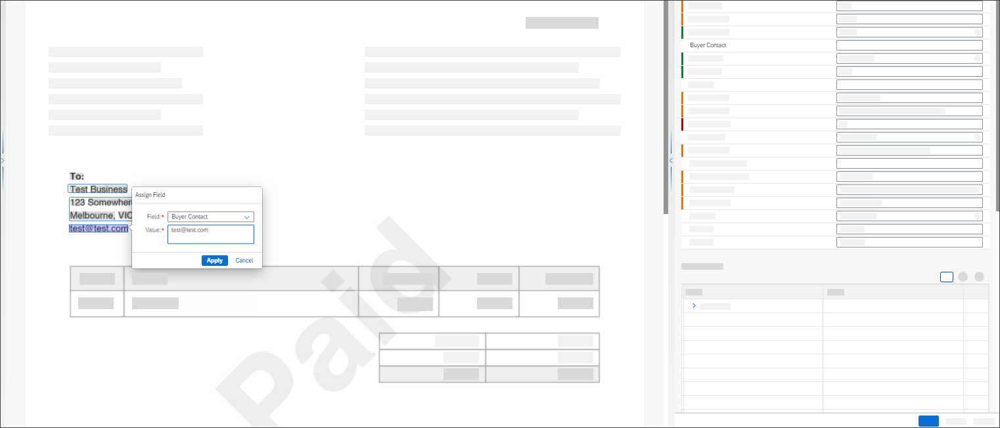

    !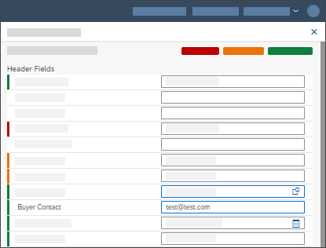

6. Save your changes.

    !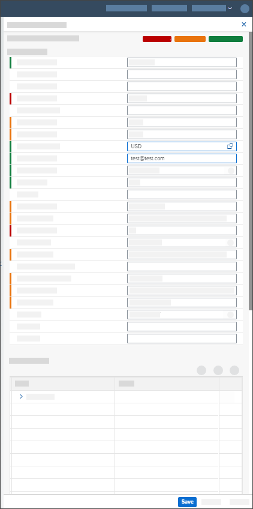

7. You can also **Edit** and **Confirm** the document.

    !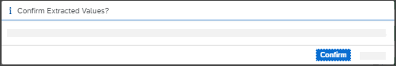

    Status changes from READY to CONFIRMED. This means the extraction results have been confirmed and can no longer be changed.

[DONE]
[ACCORDION-END]

[ACCORDION-BEGIN [Step 3: ](Delete documents)]

1. In the Documents screen, click the document row where you see Document Name, Upload Date and Status.

    !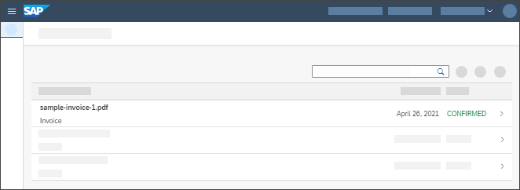

    You see the page preview of the document file you uploaded.

    !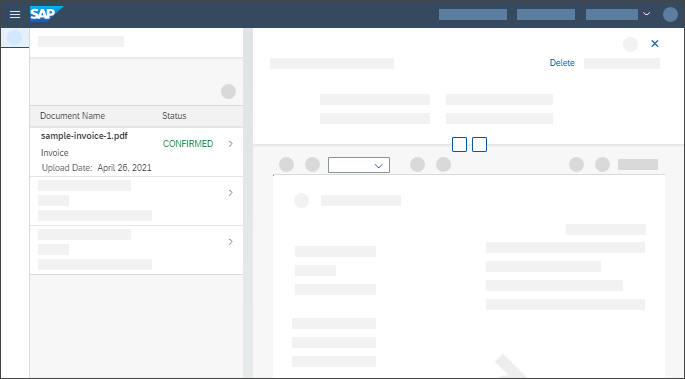

2. Click **Delete** and then click **OK** to delete the document you selected.

    The document is then removed from the Documents list.

    !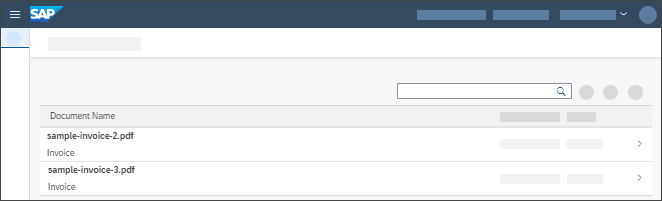

Congratulations, you have completed this tutorial.

[DONE]
[ACCORDION-END]
