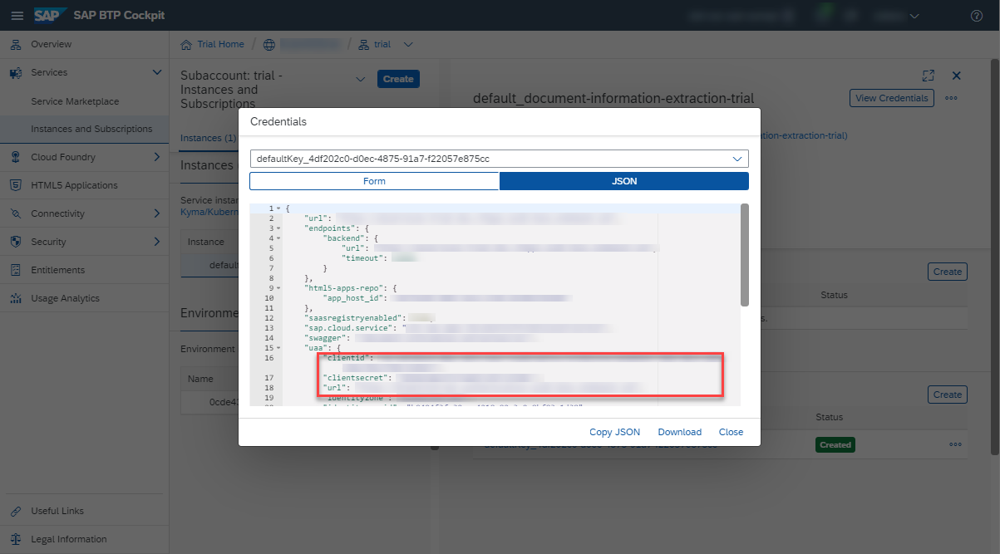

## Details
### You will learn
  - How to use your service key values to get an OAuth access token via any web browser

---

[ACCORDION-BEGIN [Step 1: ](Get OAuth access token details)]

To get your OAuth access token you will need the values listed below from the service key you created in the previous tutorial: [Create Service Instance for Document Information Extraction](cp-aibus-dox-service-instance).



[VALIDATE_1]
[ACCORDION-END]


[ACCORDION-BEGIN [Step 2: ](Get OAuth access token)]

1. Add **`/oauth/token/?grant_type=client_credentials&cache-control=no-cache&content-type=application/x-www-form-urlencoded`** to the `url` value (from inside the `uaa` section of the service key), paste it in any web browser and choose **Enter**.

2. Enter the **`clientid`** value from your service key as **Username**.

3. Enter the **`clientsecret`** value from your service key as **Password**.

4. Click **Sign in** or **OK** (depending on the web browser you work with).


You should receive the following response:

```
{
    "access_token": "<< your access token >>",
    "token_type": "bearer",
    "expires_in": 43199,
    "scope": "uaa.resource",
    "jti": "1acd879bb9474a04975e0e171df445a7"
}
```

You have successfully generated your OAuth access token for the service and you are now all set to [Use Machine Learning to Extract Information from Documents](cp-aibus-dox-swagger-ui).

[DONE]
[ACCORDION-END]
