## Details
### You will learn
  - How to call and test the Invoice Object Recommendation service
  - How to access and use Swagger UI (User Interface)
  - How to predict G/L accounts and other financial objects using the service

Invoice Object Recommendation recommends to you G/L (general ledger) accounts and other financial objects for incoming invoices without a reference to a purchase order. In this tutorial, you learn how to make this happen. The basic steps include uploading historical invoice data for training, training the machine learning model itself and, finally, asking the model to make G/L account predictions for new incoming invoices.

Invoice Object Recommendation is available on Trial. Find Trial limitations [here](https://help.sap.com/viewer/15074a8e9a1a4abf923460c93e89b409/SHIP/en-US/20ced07332344b36a262a356f746ffe6.html).

---

[ACCORDION-BEGIN [Step 1: ](Authorize Swagger UI)]

You will use Swagger UI, via any web browser, to call the Invoice Object Recommendation APIs. Swagger UI allows developers to effortlessly interact and try out every single operation an API exposes for easy consumption. For more information, see [Swagger UI](https://swagger.io/tools/swagger-ui/).   

In the service key you created for Invoice Object Recommendation in the previous tutorial: [Create Service Instance for Invoice Object Recommendation](cp-aibus-ior-service-instance), you should find (outside the `uaa` section of the service key) an entry called `url` (as highlighted in the image below).

1. To access the Invoice Object Recommendation Swagger UI, add **`/api/v1`** to the `url` value, paste it into any web browser and press **Enter**.

    !

2. To be able to use the Swagger UI endpoints, you need to authorize yourself. In the top right corner, click **Authorize**.

    !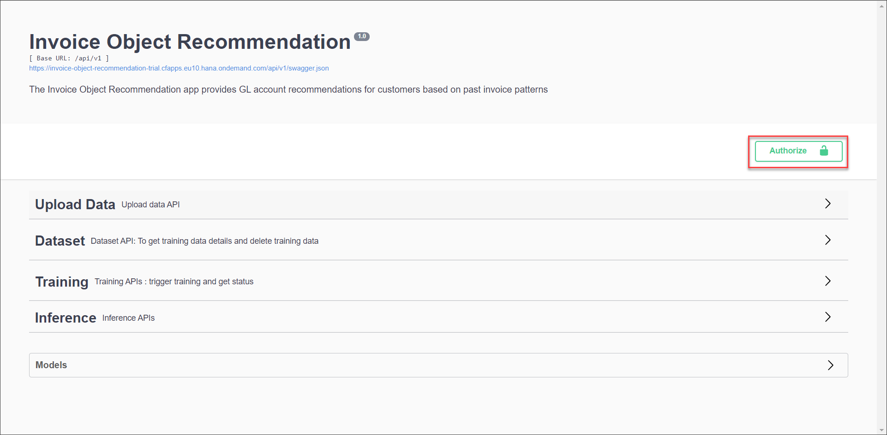

3. Get the `access_token` value created in the previous tutorial: [Get OAuth Access Token for Invoice Object Recommendation Using Any Web Browser](cp-aibus-ior-web-oauth-token), then add **bearer** in front of it, and enter in the **Value** field.

    ```
    bearer <access_token>
    ```

    !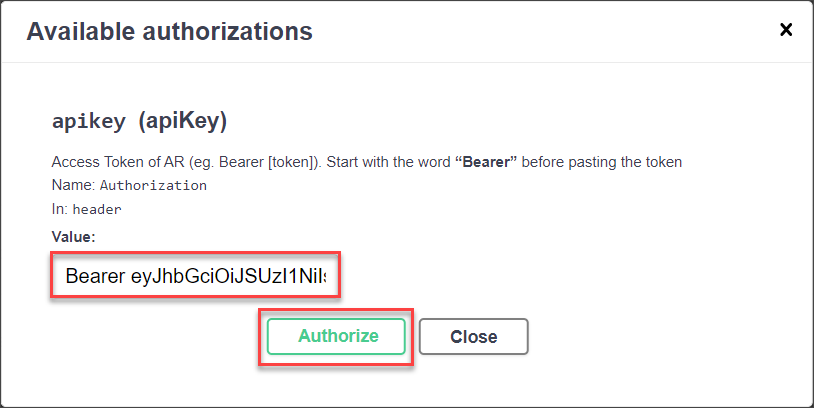

4. Click **Authorize** and then click **Close**.

    !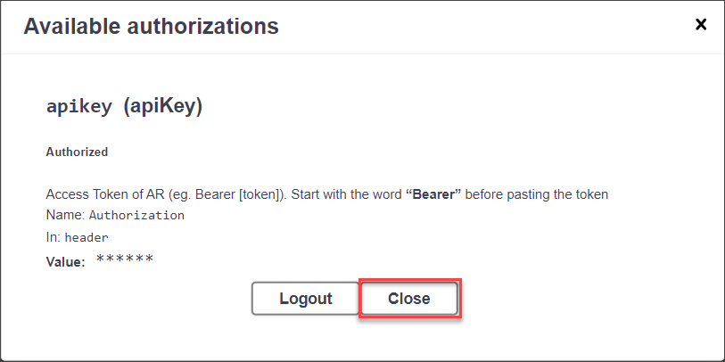

[VALIDATE_1]
[ACCORDION-END]


[ACCORDION-BEGIN [Step 2: ](Upload training data)]

To train a machine learning model, you first need to upload training data by using the endpoint **`POST /ivp/upload`**. The endpoint is located in the set `Upload Data` - click to expand it. The training data must be provided in a CSV file and has to contain certain fields. See more details on how to create a dataset to trigger training in [Best Practices](https://help.sap.com/viewer/15074a8e9a1a4abf923460c93e89b409/SHIP/en-US/d000184cb4b849c2b2d736a4fda92a11.html).

As an alternative to uploading your own file to the service, you can use this [sample training data](https://raw.githubusercontent.com/SAPDocuments/Tutorials/master/tutorials/cp-aibus-ior-swagger-ui/data/Training-Sample.csv). Right click on the link, then click ***Save link as*** to open the file dialog. In the dialog, replace the file ending `txt` with `csv` as indicated below. Then save the file.

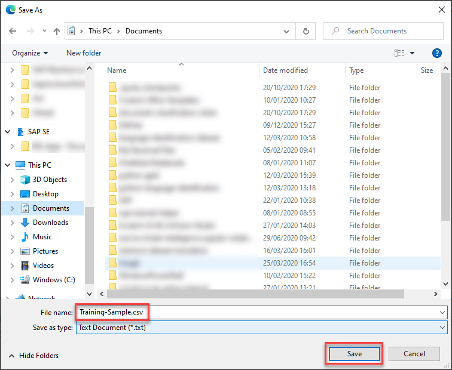

  1. Click the endpoint name to expand it.

  2. Click **Try it out**.

    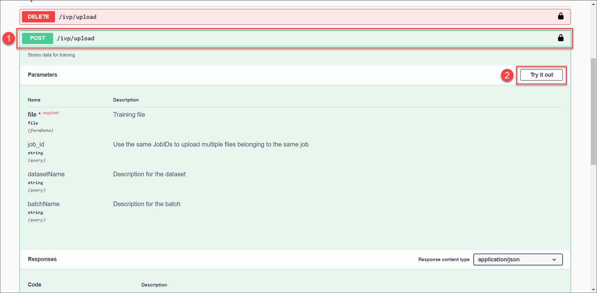

  3. For the parameter **file** you need to provide the file containing the training data. Every other value can be left blank.

  4. Click **Execute**.

    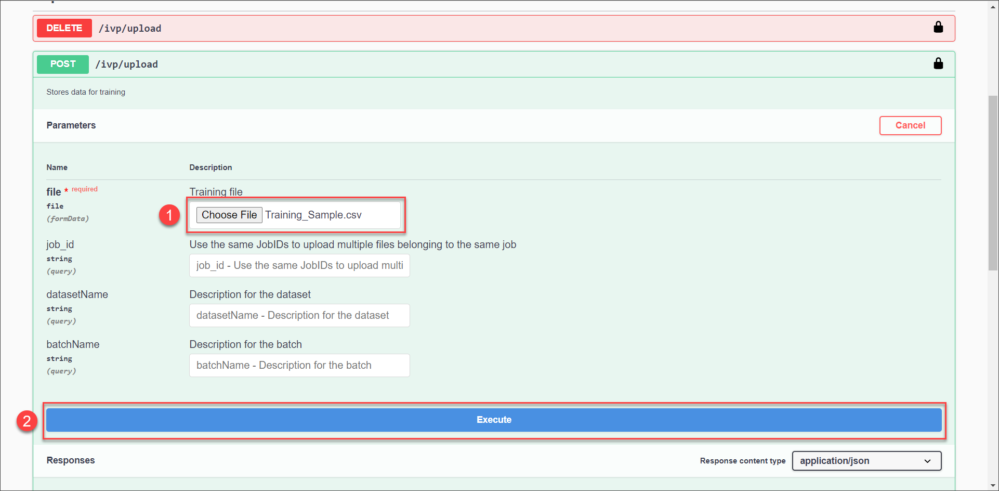

Once the upload succeeded, you will find a corresponding message in the response. Please note down the **`job_id`** that is included in the response. You will need it throughout this tutorial.

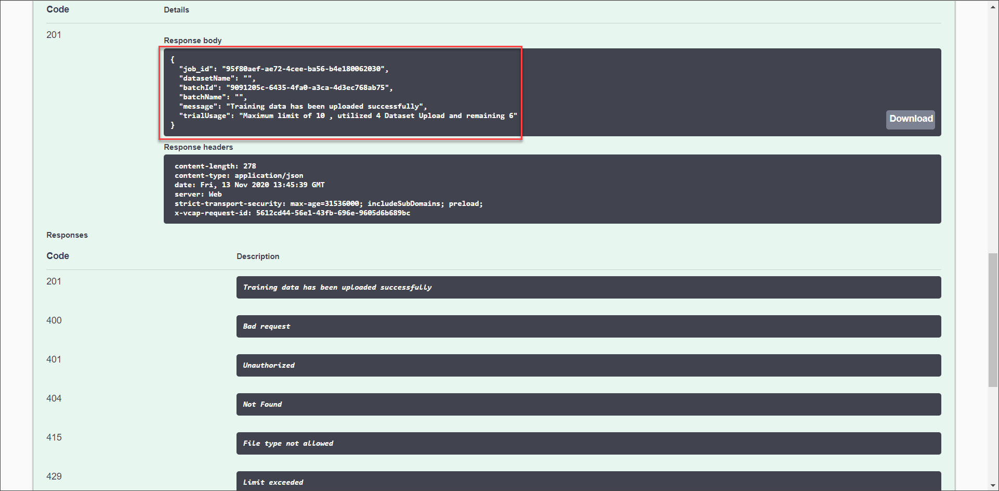

Please note that there is a file size limit. See [Trial Account Input Limits](https://help.sap.com/viewer/15074a8e9a1a4abf923460c93e89b409/SHIP/en-US/20ced07332344b36a262a356f746ffe6.html).
In case your training file is too large, please split it into several files and upload the files separately. Then, you have to provide the **`job_id`** that you have received after the first upload in every following upload so that the service knows that the files are connected.

Once you have uploaded the data, it is necessary to lock it so that no further data can be uploaded or existing data is deleted. Set the lock by using the endpoint **`PUT /ivp/upload`**.

  1. Click the endpoint name to expand it.

  2. Click **Try it out**.

    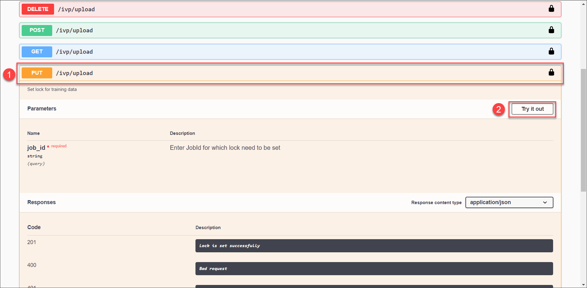

  3. For the parameter **`job_id`**, enter the value that you have saved previously.

  4. Click **Execute**.

    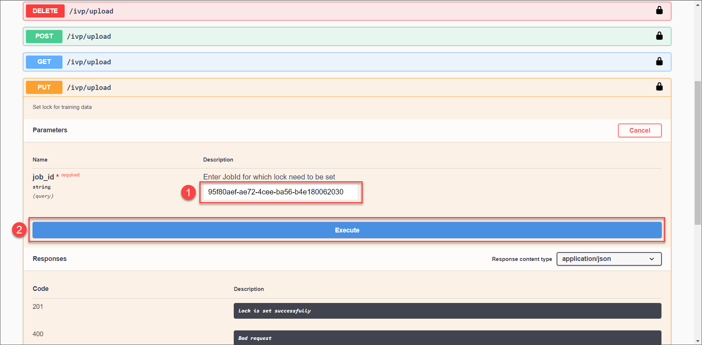

In the response, you receive the confirmation that the lock was set successfully.

[DONE]
[ACCORDION-END]


[ACCORDION-BEGIN [Step 3: ](Get list of datasets)]

In case you have lost your `job_id` or you are unsure whether you have already created a dataset, you can use the endpoint **`GET /ivp/datasets`** which is located in the set of endpoints called `Dataset`.

  1. Click the endpoint to expand it.

  2. Click **Try it out**.

  3. As there are no parameters, directly click **Execute**.

In the response, you find all datasets that you have created along with their respective `job_id`.

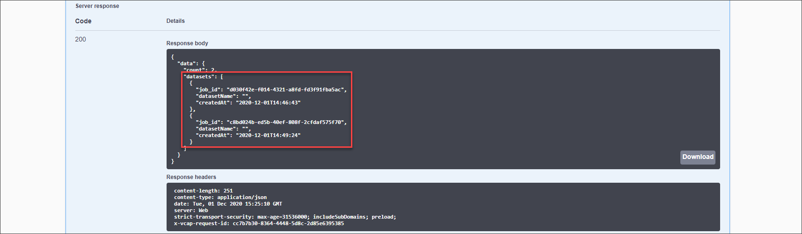

[DONE]
[ACCORDION-END]


[ACCORDION-BEGIN [Step 4: ](Train model)]

Now you can already train a machine learning model based on the training data that you have uploaded. The service can train the model on different financial objects, namely HKONT (G/L Account), KOSTL (Cost Center) and profitability analysis (CO-PA) dimension values for the G/L accounts predicted. For this tutorial, you train the model on G/L accounts. Please find more details [here](https://help.sap.com/viewer/15074a8e9a1a4abf923460c93e89b409/SHIP/en-US/4ee751783544464597afc2c699fb9d52.html).

For the training, you use the **`POST /ivp/training/{job_id}`** endpoint located in the set of training-related endpoints.

  1. Click the endpoint to expand it.

  2. Click **Try it out**.

    !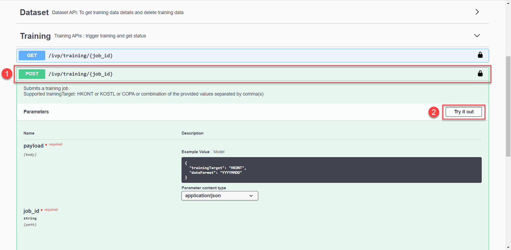

  3. For the parameter **payload**, make sure that for **`trainingTarget`** the value is set to `HKONT` which indicates that the model should be trained on G/L accounts. For the parameter **`job_id`**, provide the value from before.

  4. Click **Execute**.

    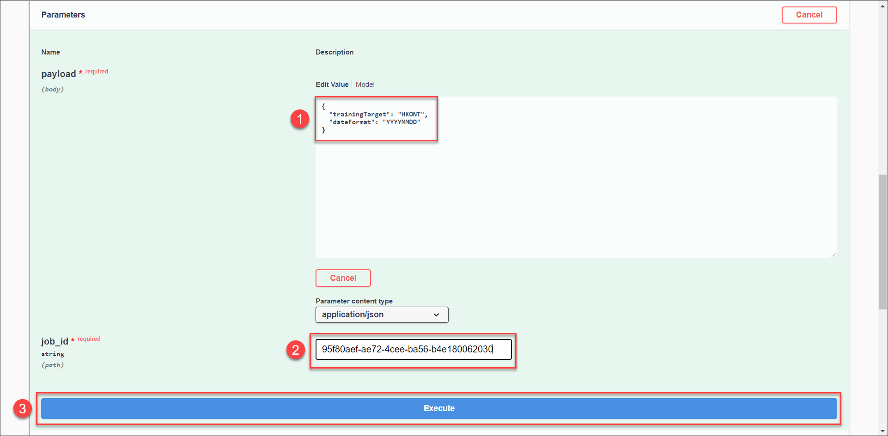

In the response, you initially receive the status of the training as **PENDING**, meaning that the process is in queue. To check the status of your training, you use the endpoint **`GET /ivp/training/{job_id}`**.

  1. Click the endpoint to expand it.

  2. Click **Try it out**.

    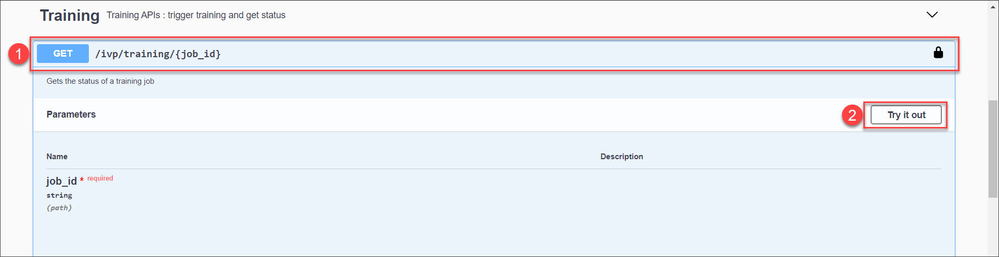

  3. For the parameter **`job_id`**, enter the value from before.

  4. Click **Execute**.

    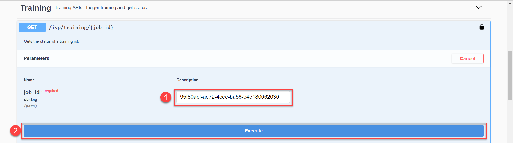

The response includes the current status of the training. If the status is **RUNNING**, the training is still in progress. If training already finished, the status changes to **SUCCEEDED**. You should receive a response like the following:

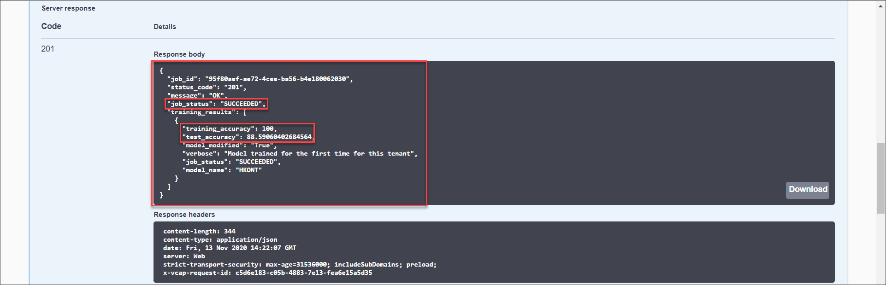

The response also includes accuracy which indicates how certain the model is about its prediction. A confidence of 1 means that the model is 100% sure about its prediction.

You have now successfully trained a machine learning model for the Invoice Object Recommendation service.

[DONE]
[ACCORDION-END]


[ACCORDION-BEGIN [Step 5: ](Get predictions)]

You can now send data, such as invoice data, to your machine learning model and it will return predictions for the fields it was trained on. In this case, the model returns G/L account predictions. You can use this [sample inference file](https://raw.githubusercontent.com/SAPDocuments/Tutorials/master/tutorials/cp-aibus-ior-swagger-ui/data/Inference-Sample.csv). Right click on the link, then click ***Save link as*** to download the file locally. Please replace the file ending `txt` with `csv` as well as the inference data needs to be in a CSV file as well.

To make an inference call, use the endpoint **`POST /ivp/inference`**.

  1. Click the endpoint to expand it.

  2. Click **Try it out**.

    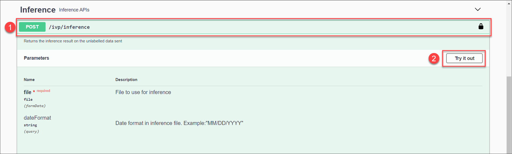

  3. For the parameter **file**, provide the sample inference file.

  4. Click **Execute**

    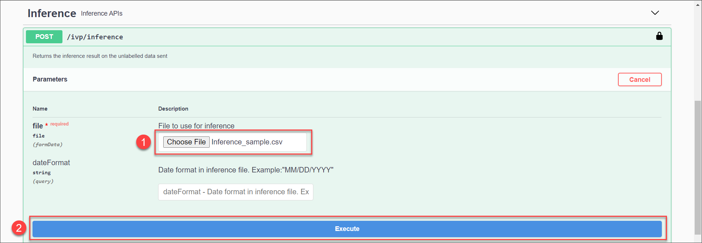

The inference result is provided as a file. Click **Download file** to download the CSV file containing the results.

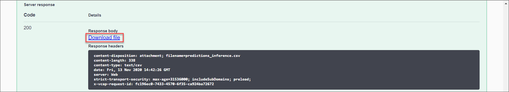

The file should look like the image below. The first line, the header line, indicates which fields are included. There are several fields called **`recommended_account`** followed by a field called **probability**. The former one indicates the predicted G/L account number whereas the latter one indicates the probability of the prediction. The probability represents how certain a model is about its prediction. The higher the probability the more confident the model is that the prediction is actually correct. Finally, there are multiple predictions within one line, meaning that the model provides you with alternative predictions as well. Within the line, the predictions are sorted by the highest probability.

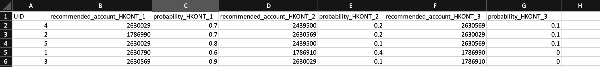

You have now successfully used the Invoice Object Recommendation service to get G/L account predictions.

[DONE]
[ACCORDION-END]
