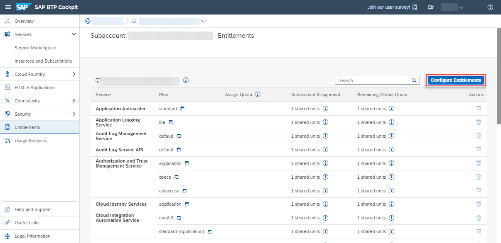
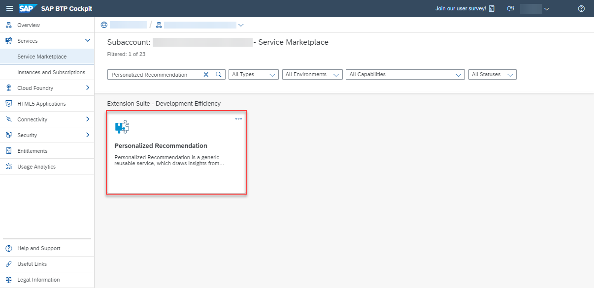

# Use Free Tier to Create a Service Instance for Personalized Recommendation
<!-- description --> Create a service instance and the associated service key for Personalized Recommendation using the free tier service plan.

## Prerequisites
- You have created an account on SAP BTP to try out free tier service plans: [Get an Account on SAP BTP to Try Out Free Tier Service Plans](btp-free-tier-account)
- You are entitled to use the Personalized Recommendation service: [Manage Entitlements Using the Cockpit](btp-cockpit-entitlements)

## You will learn
  - How to check your Personalized Recommendation entitlements
  - How to create a service instance of Personalized Recommendation
  - How to create a service key for your service instance

---

### Access the SAP BTP cockpit

1. Open the [SAP BTP cockpit](https://account.hana.ondemand.com/cockpit#/home/allaccounts).

2. Access your global account.

    <!-- border -->

3. Click the tile that represents the subaccount that you'll use throughout these tutorials.

<!-- border -->

### Check your entitlements

To use Personalized Recommendation, you need to make sure that your account is properly configured.

1. On the navigation side bar, click **Entitlements** to see a list of all eligible services. You are entitled to use every service in this list according to the assigned service plan.

2. Search for `Personalized Recommendation`. ***If you find the service in the list, you are entitled to use it. Now you can set this step to **Done** and proceed with Step 3.***

<!-- border -->

***ONLY if you DO NOT find the service in your list, proceed as follows:***

  1.  Click **Configure Entitlements**.

    <!-- border -->

  2.  Click **Add Service Plans**.

    <!-- border -->

  3.  In the dialog, select `Personalized Recommendation` and choose the `free` service plan. Click **Add 1 Service Plan**.

    >You can also perform this tutorial series using the `standard` service plan. For that, choose the `standard` plan in this step (instead of free). For more information on the service plans available for Personalized Recommendation and their usage details, see [Service Plans](https://help.sap.com/docs/Personalized_Recommendation/2c2078b9efa84566ac19d44df9625c65/b6042634958d4bb48288ced513944b29.html).

    <!-- border -->

  4.  Click **Save** to save your entitlement changes.

    <!-- border -->

You are now entitled to use Personalized Recommendation and create instances of the service.

### Access service via Service Marketplace

The Service Marketplace is where you find all the services available on SAP BTP.

1.  To access it, click **Service Marketplace** on the navigation side bar.

    <!-- border -->

2.  Next, search for **Personalized Recommendation** and click the tile to access the service.

    <!-- border -->

### Create service instance

Next, you will create an instance of the Personalized Recommendation service.

1. Click **Create** to start the service instance creation dialog.

    <!-- border -->

2. In the dialog, choose the `free` plan. Enter a name for your new instance, for example, `pr-instance` and click **Create**.

    >Choose `standard` in this step (instead of free) if you're using the `standard` plan to perform this tutorial series.

    <!-- border -->

3. In the following dialog, click on **View Instance** to navigate to the list of your service instances.

    <!-- border -->

You have successfully created a service instance for Personalized Recommendation.

### Create service key

You are now able to create a service key for your new service instance. Service keys are used to generate credentials to enable apps to access and communicate with the service instance.

1. Click the dots to open the menu and select **Create Service Key**.

    <!-- border -->

2. In the dialog, enter `pr-service-key` as the name of your service key. Click **Create** to create the service key.

    <!-- border -->

You have successfully created a service key for your service instance. You can now view the service key in the browser or download it.

<!-- border -->

You will need the service key values in the next tutorial: [Get OAuth Access Token for Personalized Recommendation via Web Browser](cp-aibus-pr-web-oauth-token).
